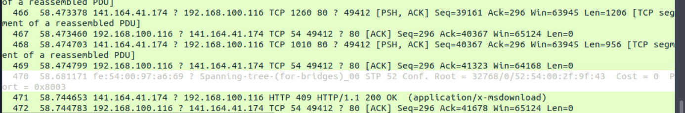

# Directory Traversal Detection Using TShark

# Objectives

- Investigated a real directory traversal phishing case inside TryHackMe’s fully isolated VM using only TShark and VirusTotal.
- Turned 472 packets into a complete kill-chain: spotted malicious DNS, counted HTTP requests, followed TCP streams, exported live malware, and pulled sandbox verdicts.
- Defanged every indicator and proved curiosity really does kill the cat—all safely in the sandbox.
- Virtual Machine: https://tryhackme.com/room/tsharkchallengestwo

# Tools Used

- **TShark** (-r, -z io,phs, -Y filters, -T fields, -z follow,tcp,ascii, --export-objects http)
- **VirusTotal** (domain → IP → file → Details/Behaviour tabs)
- **CyberChef** (defang everything)
- **sha256sum** (hashing the dropped exe)
- **bash pipelines** (sort | uniq -c | sort -r = instant IOC ranking)

# Investigation

# Task 1: Introduction

This room presented me with a challenge to investigate traffic data as part of a SOC team. I used **TShark** to analyse the captured traffic.

- I started the VM by pressing the green **Start Machine** button.
- The machine opened in split view (no SSH or RDP required).
- Important note: the exercise files contain **real malware traffic**, so I made sure not to interact with them outside the VM to avoid security risks.

---

# Task 2: Case: Directory Curiosity!

### Scenario

An alert was triggered:

> “A user came across a poor file index, and their curiosity led to problems.”
> 

I was assigned to investigate the provided capture file:

`~/Desktop/exercise-files/directory-curiosity.pcap`

My tools: **TShark** + **VirusTotal**

---

## Q1. According to VirusTotal, what is the name of the malicious/suspicious domain? (defanged format)

**Step 1: Read the capture file**

```bash
tshark -r directory-curiosity.pcap --color
```

- Found **472 packets**.
    
    
    
- Too many to analyse manually → I moved to protocol statistics.

---

**Step 2: Protocol Hierarchy**

```bash
tshark -r directory-curiosity.pcap -z io,phs -q
```


- Found multiple protocols: NBNS, SSDP, DNS, HTTP, TLS.
- DNS stood out → **14 DNS frames,** and since DNS is the subject of this question I look at these more thoroughly by using display filters.

---

**Step 3: List DNS queries**

```bash
tshark -r directory-curiosity.pcap -Y dns --color | nl
```


I see a bunch of query names here, which I can see in a list by running:

```bash
tshark -r directory-curiosity.pcap -T fields -e [dns.qry.name](http://dns.qry.name/) | awk NF | sort -r | uniq -c | sort -r
```


Domains queried:

- 8 × isatap
- 4 × [www.bing.com](http://www.bing.com/)
- 2 × r20swj13mr.microsoft.com
- 2 × ocsp.digicert.com
- 2 × **jx2-bavuong.com**
- 2 × iecvlist.microsoft.com
- 2 × api.bing.com

---

**Step 4: Check domains on VirusTotal**

- All legit except: **jx2-bavuong.com** → flagged as **malicious**.
    
    
    

**Answer:** `jx2-bavuong[.]com`

---

## Q2. What is the total number of HTTP requests sent to the malicious domain?

**Step 1: Identify IP of the malicious domain**

From DNS response:

```
jx2-bavuong.com → 141.164.41.174
```


---

**Step 2: Count HTTP requests to that IP**

- Option A – check IP destinations:
    
    ```bash
    tshark -r directory-curiosity.pcap -Y "http.request" -T fields -e ip.dst
    ```
    
    
    

- Option B – check full URIs:
    
    ```bash
    tshark -r directory-curiosity.pcap -Y "http.request" -T fields -e http.request.full_uri
    ```
    
    
    

- Option C – direct filter:
    
    ```bash
    tshark -r directory-curiosity.pcap -Y "http.request && ip.src == 141.164.41.174"
    ```
    
    
    
- In all cases → found **14 HTTP requests**.

---

## Q3. What is the IP address associated with the malicious domain? (defanged format)

From DNS response:

```
jx2-bavuong.com → 141.164.41.174
```

Answer: `141[.]164[.]41[.]174`

---

## Q4. What is the server info of the suspicious domain?

**Step 1: Extract server info from HTTP responses**

```bash
tshark -r directory-curiosity.pcap -Y "http.response && ip.src == 141.164.41.174" -T fields -e ip.dst -e http.host -e http.server
```


**Step 2: Review output**

- Server header revealed:`Apache/2.2.11 (Win32) DAV/2 mod_ssl/2.2.11 OpenSSL/0.9.8i PHP/5.2.9`

---

## Q5. Follow the “first TCP stream” in ASCII. What is the number of listed files?

**Step 1: Follow TCP stream**

```bash
tshark -r directory-curiosity.pcap -z follow,tcp,ascii,0 -q
```

**Step 2: Review conversation**


- Found **3 files listed**:
    - `123.php`
    - `vlauto.exe`
    - `vlauto.php`

---

## Q6. What is the filename of the first file? (defanged format)

From the stream output:

- First file = `123.php`

---

## Q7. Export all HTTP traffic objects. What is the name of the downloaded executable file? (defanged format)

**Step 1: Export objects with TShark**

We are interested in HTTP objects, so the command is:

```bash
tshark -r directory-curiosity.pcap --export-objects http,/home/ubuntu/Desktop/extracted-by-tshark -q
```

**Step 2: Check extracted files**


- Found `vlauto.exe`.

---

## Q8. What is the SHA256 value of the malicious file?

**Step 1: Generate SHA256 hash**

```bash
sha256sum vlauto.exe
```

**Step 2: Result**


```
b4851333efaf399889456f78eac0fd532e9d8791b23a86a19402c1164aed20de
```

---

## Q9. Search the SHA256 on VirusTotal. What is the “PEiD packer” value?

**Step 1: Checked VirusTotal file page** https://www.virustotal.com/gui/file/b4851333efaf399889456f78eac0fd532e9d8791b23a86a19402c1164aed20de

**Step 2: Review details tab**

- Found **PEiD packer** = `.NET executable`.
- 


---

## Q10. Search the SHA256 on VirusTotal. What does the “Lastline Sandbox” flag this as?

**Step 1: Open Behaviour tab in VirusTotal**


- Lastline Sandbox result = **MALWARE TROJAN**

---

# Lessons Learned

- Protocol hierarchy (-z io,phs) is my compass —14 DNS frames in 472 packets = start there.
- One weird domain (jx2-bavuong[.]com) in a sea of Bing = red flag every time.
- -export-objects http drops live malware to disk in seconds—way faster than Wireshark GUI.
- Follow TCP stream 0 in ASCII shows directory listings no filter ever will.
- VT Behaviour tab > everything else—Lastline calling it “MALWARE TROJAN” ends the debate.
- Safe VM + TShark = I just hunted real .NET malware without ever leaving the terminal

# Socials

**Repository:** https://github.com/RahulCyberX/Network-Security-and-Traffic-Analysis

**Medium Article:** https://medium.com/@rahulcyberx/tshark-challenge-ii-directory-tryhackme-walkthrough-2025-a288ae59b9a5?source=your_stories_outbox---writer_outbox_published-----------------------------------------

**TryHackMe Profile:** https://tryhackme.com/p/0xRahuL

**Github Profile:** https://github.com/RahulCyberX