# Disk Image Forensics with Autopsy and Timeline Carving

## Objectives

- Learn the complete workflow of **Autopsy**, from case creation to report generation.
- Add and analyze disk image data sources, configure ingest modules, and review extracted artefacts.
- Use **Keyword Search**, **Timeline**, and **Data Summary** views to uncover key system and user activity.
- Identify installed programs, web searches, password hints, network access, and file artefacts relevant to insider threat analysis.

## Tools Used

- VM: [https://tryhackme.com/room/btautopsye0](https://tryhackme.com/room/btautopsye0)
- **Autopsy (GUI):** Tree Viewer, Result Viewer, Contents Viewer, Keyword Search, Timeline, Reports.
- **Ingest Modules:** Interesting Files Identifier, Keyword Search, File Type categorization.
- **File/Image Formats:** `.aut`, `.img`, `.dd`, `.e01` (EnCase), `.vmdk`, `.vhd`.
- **Report Types:** HTML, CSV summaries for evidence documentation.

---

# Autopsy Digital Forensics Notes

In this exercise, I explored **Autopsy**, a powerful digital forensics GUI tool used to analyze disk images and recover evidence. Previously, I worked with Linux and Windows forensics manually, but this time I used Autopsy’s interface to automate much of the analysis process.

---

## Task 1: Introduction

Autopsy is an open-source and powerful digital forensics platform. Several features within Autopsy have been developed with funding from the Department of Homeland Security Technology. 

The official description: 

> "Autopsy is the premier open source forensics platform which is fast, easy-to-use, and capable of analysing all types of mobile devices and digital media. Its plug-in architecture enables extensibility from community-developed or custom-built modules. Autopsy evolves to meet the needs of hundreds of thousands of professionals in law enforcement, national security, litigation support, and corporate investigation.”
> 

## Learning Objectives

- Workflow of Autopsy Tool
- Data Sources in Autopsy
- Ingest Modules in Autopsy
- User Interface and Visualization Tools in Autopsy

---

## Task 2: Workflow Overview and Case Analysis

I connected to TryHackMe’s RDP machine and imported the provided sample case.

## Basic workflow

1. Create/open the case for the data source you will investigate
    
    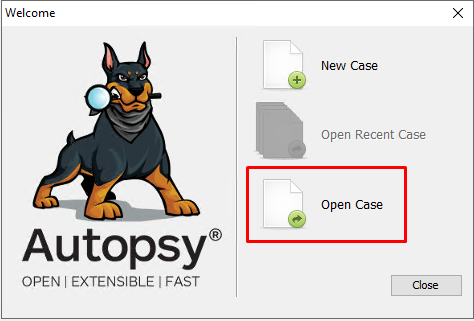
    
2. Select the data source you wish to analyze
    
    
    
3. Configure the ingest modules to extract specific artifacts from the data source
4. Review the artifacts extracted by the ingest modules
5. Create the report

- Autopsy files have a specific extension that identifies their project format.
    
    
    

**Answer:** `.aut`

---

## Task 3: Data Sources

Autopsy can analyze multiple disk image formats. Before diving into the data analysis step, let's briefly cover the different data sources Autopsy can analyze. 

Supported Disk Image Formats:

- **Raw Single** (For example: *.img, *.dd, *.raw, *.bin)
- **Raw Split** (For example: *.001, *.002, *.aa, *.ab, etc)
- **EnCase** (For example: *.e01, *.e02, etc)
- **Virtual Machines** (For example: *.vmdk, *.vhd)

If there are multiple image files (e.g., E01, E02, E03, etc.), Autopsy only needs you to point to the first image file; it will handle the rest.  

- The `.e01` image format is used by forensic tools for disk imaging.
- The tool that creates and reads `.e01` format is **EnCase**.
    
    **Answer:** `EnCase`
    

---

## Task 4: Ingest Modules

Essentially, Ingest Modules are Autopsy plug-ins. Each Ingest Module is designed to analyze and retrieve specific data from the drive. You can configure Autopsy to run specific modules during the source-adding stage or later by choosing the target data source available on the dashboard. By default, the Ingest Modules are configured to run on All Files, Directories, and Unallocated Space. You can change this setting during the module selecting step. You can track the process by clicking the bar in the lower right corner.

**While Adding Data Sources** 

One of the ways to configure the ingest modules is to enable/disable them while adding a data source in Autopsy. This is a straightforward process, as you get this option while adding a data source. 

---

**After Adding Data Sources**  

Another method of configuring the ingest modules is configuring them on a pre-loaded disk. This can be done by following the steps given below:      

- Open the "Run Ingest Modules" menu by right-clicking on the data source.
- Choose the modules to implement and click on the finish button.
- Track the progress of implementation.

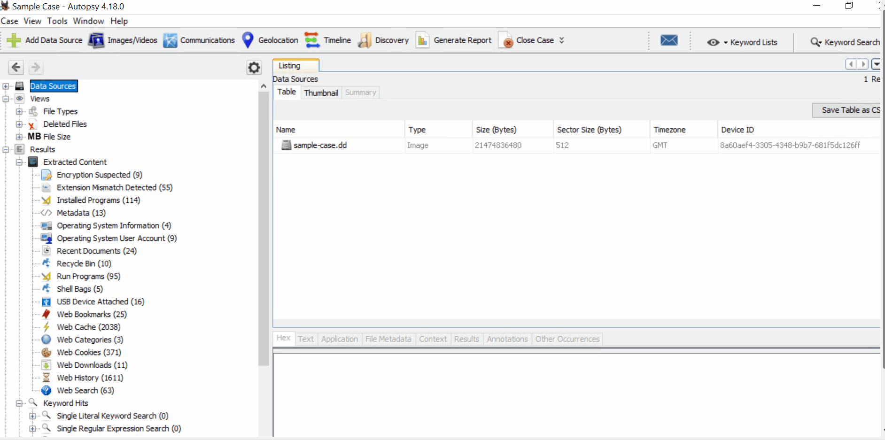

**Note:** Using ingest modules requires time to implement. Therefore, we will not cover ingest modules in this room.

The results of any Ingest Module you select to run against a data source will populate the Results node in the Tree view, which is the left pane of the Autopsy user interface. Below is an example of using the **Interesting Files Identifier** ingest module. Note that the results depend on the dataset. If you choose a module to retrieve specific data that is unavailable in the drive, there will be no results.

Drawing the attention back to the Configure Ingest Modules window, notice that some Ingest Modules have **per-run settings** and some do not. For example, the **Keyword Search** Ingest Module does not have per-run settings. 

In contrast, the **Interesting Files Finder** Ingest Module does. The yellow triangle represents the **per-run settings option**.  

As Ingest Modules run, alerts may appear in the **Ingest Inbox**. Below is an example of the Ingest Inbox after a few Ingest Modules have completed running. 

---

## Task 5: The User Interface I

**Tree Viewer**

- **Nodes**:
    - **Data Sources**: Organizes data like Windows File Explorer.
    - **Views**: Categorizes files by type, MIME type, size, etc.
    - **Results**: Displays Ingest Module results.
    - **Tags**: Shows tagged files/results.
    - **Reports**: Lists module- or analyst-generated reports.
    

**Result Viewer**

- **Function**: Displays details of items selected in Tree Viewer (e.g., volumes, files).
- **Note**: Don't confuse the **Results** node (from the Tree Viewer) with the **Result Viewer**.
- **Features**:
    - Extract files via right-click > "Extract File(s)."
    - Tabs: Table (detailed data), Thumbnail (best for images/videos), Summary.
    - Views node categorizes files by Extension, MIME Type, Deleted Files, File Size.
    - **Tip**: Check MIME Type for accurate file categorization, as extensions can be misleading.
    

When a volume, file, folder, etc., is selected from the Tree Viewer, additional information about the selected item is displayed in the Result Viewer. For example, the sample case's data source is selected, and additional information is now visible in the Results Viewer.

If a volume is selected, the Result Viewer's information will change to reflect the information in the local database for the selected volume. From within the Result Viewer, you can also extract any file if you right-click it and select the **Extract File(s)** option.

Notice that the Result Viewer pane has three tabs: **Table**, **Thumbnail**, and **Summary**. The above screenshots reflect the information displayed in the Table tab. The Thumbnail tab works best with image or video files. If the view of the above data is changed from Table to Thumbnail, not much information will be displayed. See below.

Volume nodes can be expanded, and an analyst can navigate the volume's contents like a typical Windows system.

In the **Views** tree node, files are categorized by File Types: **By Extension, By** **MIME Type**, **By** **Deleted Files**, and **By** **File Size**.

[https://www.notion.so](https://www.notion.so)

**Tip**: When it comes to **File Types**, pay attention to this section. An adversary can rename a file with a misleading file  extension, so the file will be 'miscategorized' **By** **Extension** but will be categorized appropriately **By** **MIME Type**. Expand **By Extension**, and more children nodes appear, categorizing files further (see below).

**Contents Viewer**

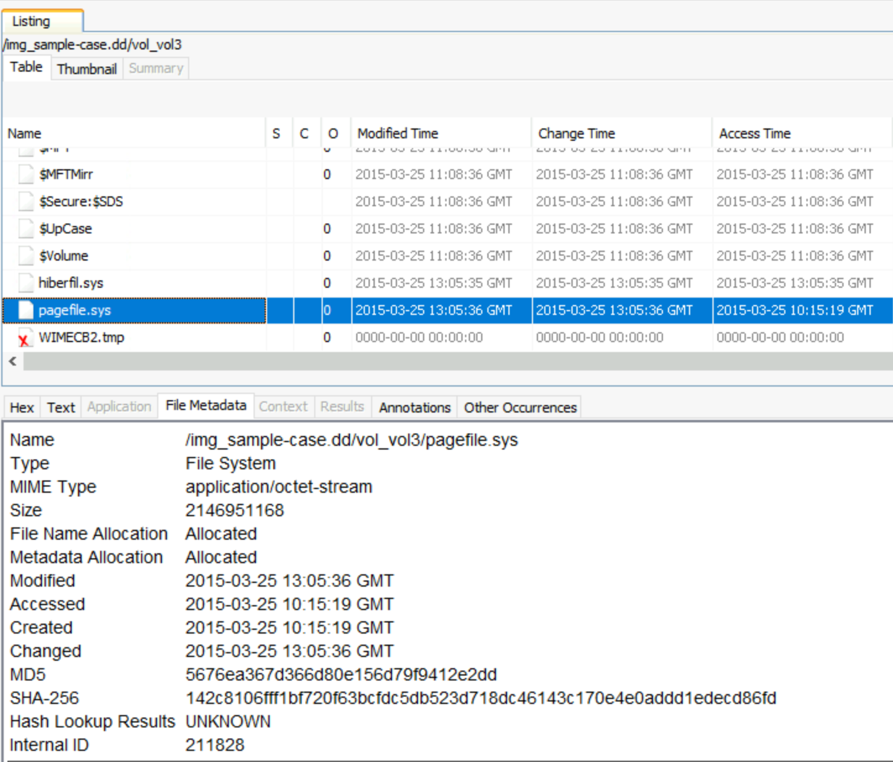

- **Function**: Shows additional details for files/folders selected in Result Viewer’s Table tab.
- **Columns**:
    - **S (Score)**: Red exclamation (notable) or yellow triangle (suspicious) for tagged items.
    - **C (Comment)**: Yellow page indicates a comment exists.
    - **O (Occurrence)**: Shows file/folder frequency across past cases (requires Central Repository).

**Keyword Search**

- **Function**: Allows ad-hoc keyword searches (e.g., "secret") via top-right Keyword Search or Keyword Lists.
- **Output**: Displays search results for the queried term.

**Status Area**

- **Function**: Located bottom-right, shows Ingest Module progress (bar and percentage).
- **Features**:
    - Click bar for detailed module info.
    - Click "X" to cancel Ingest Modules with confirmation prompt.
    

### 1. Number of available data sources

- Navigated to **Data Sources → sample-case.dd**.
- Expanded and counted the total number of volumes.
    
    
    

**Answer:** `4`

### 2. Number of detected “Removed” files

- Located under **Results → Extracted Content → Recycle Bin** (not under Data Sources directly).
    
    
    
- This section lists deleted or removed items.

**Answer:** `10`

### 3. Filename under “Interesting Files”

- Navigated to **Interesting Items → Interesting Files**.
    
    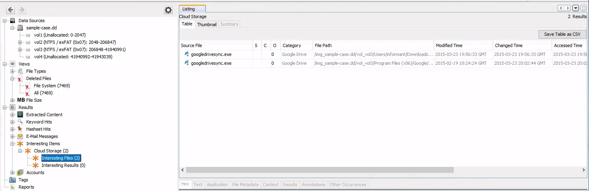
    
- Found two `.exe` files listed — the main one being `googledrivesync.exe`.

**Answer:** `googledrivesync.exe`

---

## Task 6: The User Interface II

Let's look at where we can easily find summarised information. Summarised information can help analysts decide where to focus by evaluating available artifacts. It is suggested that you view the summary of the data sources before starting an investigation. This will give you a general idea about the system and artifacts.

### **Data Sources Summary**

The **Data Sources Summary** provides summarised info in nine different categories. Note that this is an overview of the total findings. 

### **Generate Report**

You can create a report of your findings in multiple formats, enabling you to create data sheets for your investigation case. The report provides all the information listed under the **Result Viewer** pane. Reports can help you re-investigate the findings after finishing the live investigation. However, reports don't have additional search options, so you must manually find artifacts for the event of interest.

**Tip:** The Autopsy tool can be heavy for systems with low resources. Therefore, completing an investigation with Autopsy on low resources can be slow and painful. Browsing long results might end up with a system freeze. You can avoid that situation by using reports. You can use the tool to parse the data and generate the report, then continue to analyze through the generated report without a need for Autopsy. Note that it is always easier to conduct and manage an investigation with the GUI.

You can use the **Generate Report** option to create reports. The steps are shown below.

Autopsy will generate the report once you choose your report format and scope. You can click the **HTML Report** section to view the report on your browser. Reports contain all of the **Result Viewer** pane results on the left side.

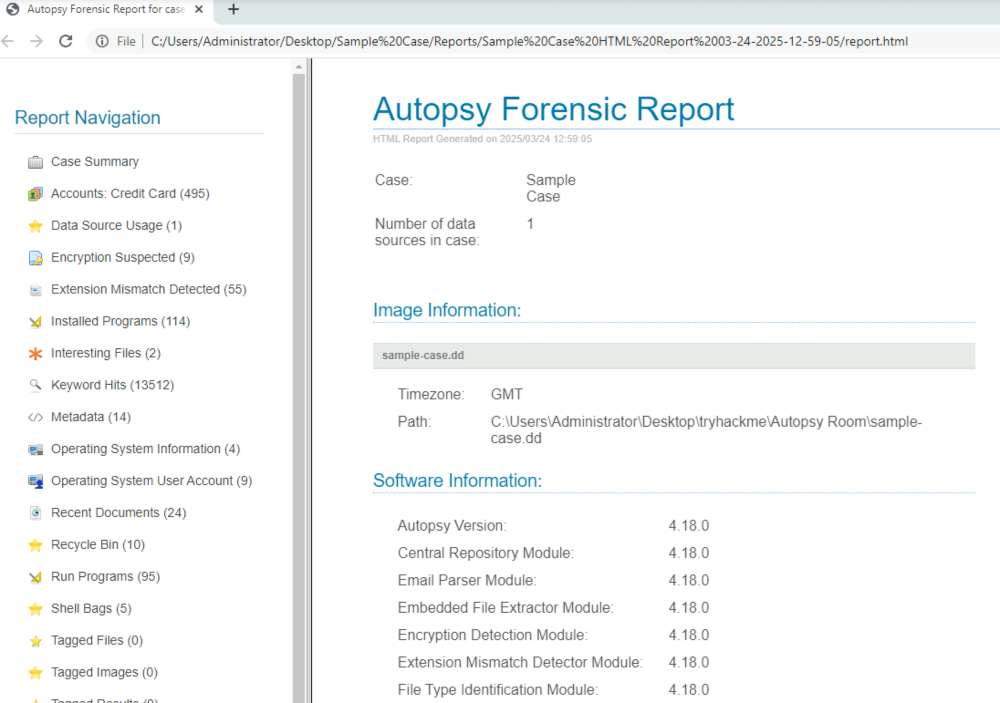

### 1. Full name of the operating system version

- Right-clicked `sample-case.dd` → **View Summary Information**.
    
    
    

**Answer:** `Windows 7 Ultimate Service Pack 1`

### 2. Percentage of documents on drive

- Found in the same summary information section.
    
    
    

**Answer:** `40.8%`

### 3. Job number of “Interesting Files Identifier”

- Generated an **HTML report** via `Generate Report → HTML`.
    
    
    
- Opened it from `Reports → Sample Case HTML Report → report`.
- Found the job number in the “Case Summary” section after scrolling down
    
    
    

**Answer:** `10`

---

## Task 7: Data Analysis

### Mini Scenario

An employee was suspected of leaking company data. A disk image was retrieved from the machine. You are assigned to perform the initial analysis. Further action will be determined based on the initial findings.

**Reminder:** Since the actual disk image is not in the attached VM, certain Autopsy sections will not display any actual data, only the metadata for that row within the local database. You can click **No** when notified about the **Missing Image**, as shown below. Additionally, you do not need to run any ingest modules in this exercise

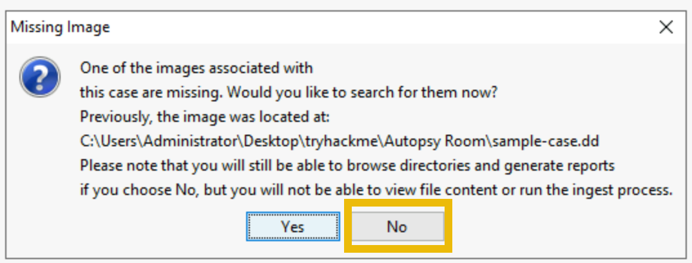

### 1. Installed Program with version `6.2.0.2962`

The first thing I did was searching for the version number by utilizing the “Keyword Search” on the top right.

- Used **Keyword Search** for `6.2.0.2962`.
- Located program name under ProductVersion info.

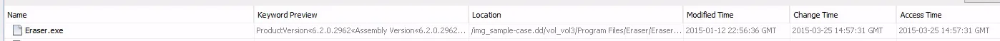

**Answer:** `Eraser`

### 2. Password Hint

- Searched “Password hint” in the Keyword Search section.
    
    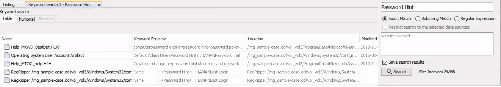
    

**Answer:** `IAMAN`

### 3. Network Access to SECRET files

- Found through keyword search “SECRET”.
- I ended up with some results with “Secured Network Drive” in their keyword.
    
    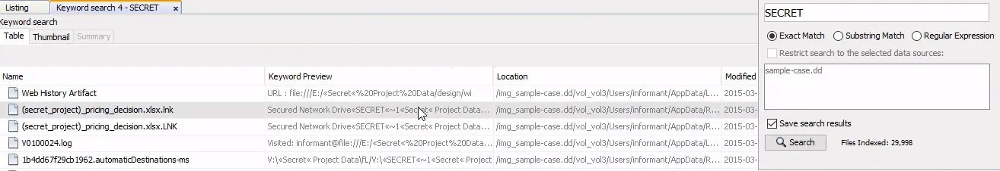
    
- Observed mapped path showing IP address `\\10.11.11.128\Secured_DRIVESecret...`
    
    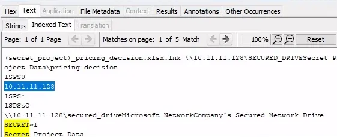
    

**Answer:** `10.11.11.128`

### 4. Web search term with most entries

- Opened **Web Search** results and checked which term appeared most frequently.
    
    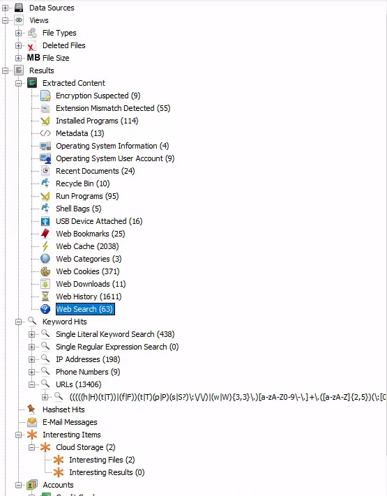
    

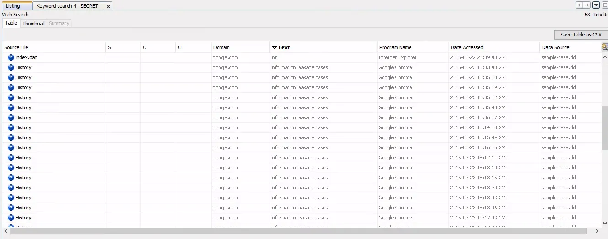

**Answer:** `information leakage cases`

### 5. Web search conducted on 3/25/2015 21:46:44

- Checked the **Date Accessed** column in Web Search.
    
    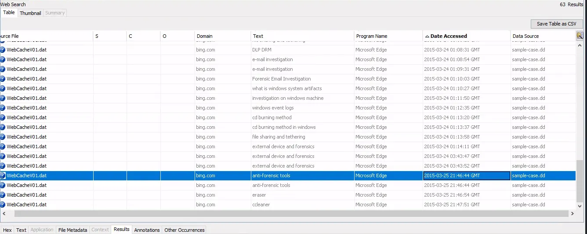
    

**Answer:** `anti-forensic tools`

### 6. MD5 hash of “Interesting File”

- Went to **Interesting Files** under **Interesting Items**.
    
    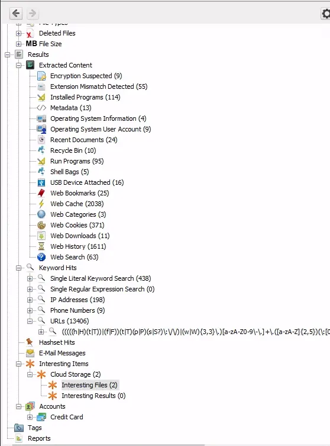
    
- Copied the hash from the file details.
    
    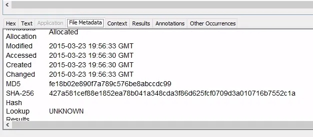
    

**Answer:** `fe18b02e890f7a789c576be8abccdc99`

### 7. Sticky Note message by ‘Informant’

- Navigated manually to:
    
    `Data Sources → sample-case.dd → vol3 → Users → informant → AppData → Roaming → Microsoft → Sticky Notes`
    
    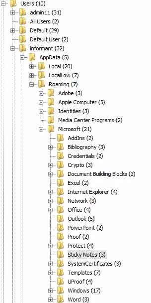
    
- Opened `StickyNotes.snt` file to find message.
    
    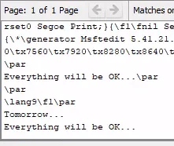
    

**Answer:** `Tomorrow… Everything will be OK…`

---

## Task 8: Visualization Tools

### 1. Number of results on 2015–01–12

- Used the **Timeline View**, switched to **Details Mode**.
    
    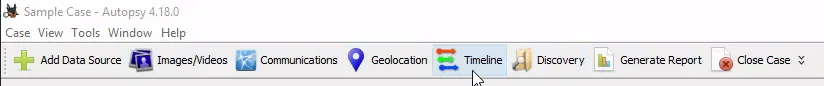
    
    
    
- I clicked on the clock icon to adjust the date I want. It may take a while to set it properly. It took me a few tries.
    
    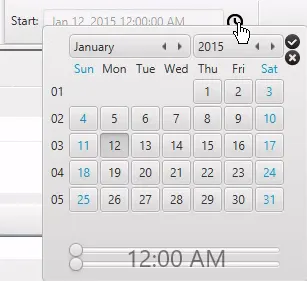
    
- After that, I hovered over the number 46 because it looks like there were 46 events that happened on January 12, 2015. I hovered over it until the information box came out to confirm the date.
    
    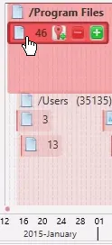
    

**Answer:** `46`

### 2. Date with majority of file events

- Changed view back to **Counts**, applied linear scaling, and filtered only File System events.
    
    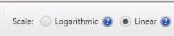
    
    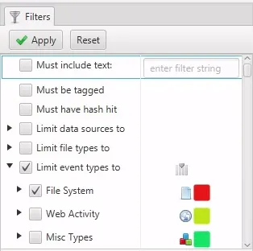
    
- In the middle, I changed to show the entire timeline.
    
    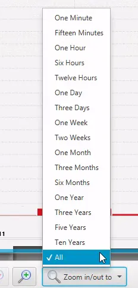
    
- Observed which bar was tallest and zoomed in.
    
    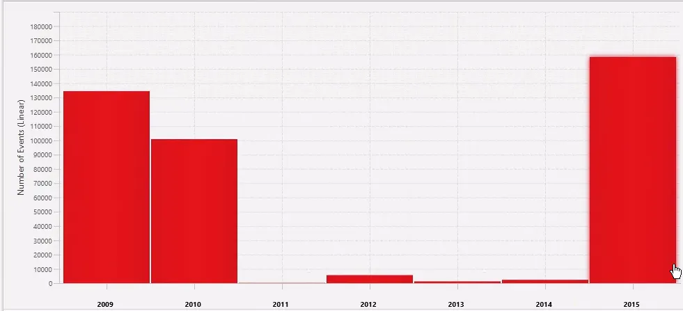
    
- Right click the bar graph and select “Zoom into Time Range.”
    
    
    
- Then I just did it again.
    
    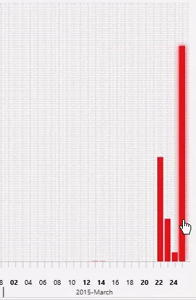
    

**Answer:** `March 25, 2015`

---

# Lessons Learned

- Autopsy case files use the `.aut` extension and support multiple disk image formats, including EnCase `.e01`.
- The **Data Sources Summary** gives quick system context (OS, document percentage, etc.) before deep analysis.
- Keyword Search is powerful for locating artefacts like version numbers, password hints, and IP traces.
- Timeline view efficiently visualizes user activity peaks and file changes over specific dates.
- Reports in HTML format preserve all findings for review on low-resource systems.

# Socials

**Repository:** https://github.com/RahulCyberX/Digital-Forensics-Incident-Response

**Medium Article:** https://medium.com/@rahulcyberx/autopsy-complete-tryhackme-walkthrough-62f60ec0efed?source=your_stories_outbox---writer_outbox_published-----------------------------------------

**TryHackMe Profile:** https://tryhackme.com/p/0xRahuL

**Github Profile:** https://github.com/RahulCyberX