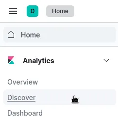
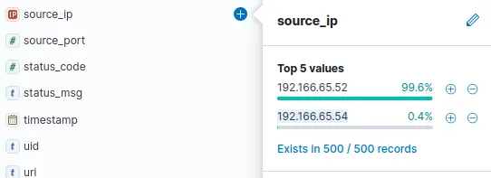
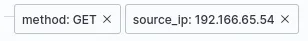
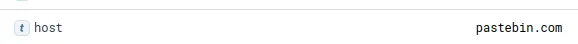
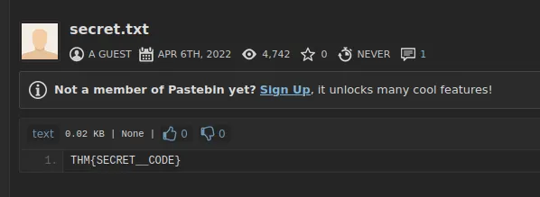

# ELK Stack Incident Investigation – C2 Beaconing

## Objectives

- Traced a real HR insider C2 infection inside TryHackMe’s Elastic lab using only **March 2022 HTTP connection_logs** in Kibana.
- Pivoted from IDS alert → Browne → 192.166.65.54 → **bitsadmin** download → Pastebin C2 (pastebin.com/yTg0Ah6a) → secret.txt → final flag **THM{...}**.
- Proved Kibana Discover + KQL turns a single suspicious user_agent into a complete kill-chain in under 5 minutes—all from a browser in a fully isolated environment.
- VM: [https://tryhackme.com/room/itsybitsy](https://tryhackme.com/room/itsybitsy)

## Tools Used

- **Kibana Discover** (March 2022 time filter, source_ip Top Values, method:GET + source_ip filter)
- **KQL + field filters** (method: GET, source_ip: 192.166.65.54)
- **user_agent parsing** (bitsadmin = LOLBIN red flag)
- **Pastebin raw view** (direct flag extraction)

# Kibana C2 Investigation

## Scenario Overview

During normal SOC monitoring, analyst **John** observed a suspicious alert in the IDS indicating possible **Command and Control (C2)** communication from a user named **Browne** (HR department).

The suspicious file contained a malicious pattern **THM:{ ________ }**.

A week’s worth of **HTTP connection logs** were pulled and ingested into the **connection_logs** index in **Kibana** for analysis.

My objective was to investigate Browne’s activity, identify the C2 connection, and extract the hidden flag from the malicious file.

---

## Step-by-Step Investigation

### **Step 1: Checking Total Events (March 2022)**

1. Opened **Kibana → Discover**.
    
    
    
2. Adjusted the **date filter** (top-right) to cover **March 2022**.
    
    
    
3. Clicked **Update** to refresh results.
    
    
    

---

### **Step 2: Finding Browne’s Source IP**

1. In the **Discover** panel, expanded the left sidebar fields.
2. Clicked on **source_ip** to list all IP addresses.
    
    
    
3. Compared the hit counts for each and identified Browne’s activity source.

**Answer:** `192.166.65.54`

---

### **Step 3: Identifying the Binary Used for Download**

1. Filtered logs by **method: GET** and the **suspect’s IP**.
    
    
    
2. Found only one related event.
3. Inspected the **user_agent** field — it showed **bitsadmin**, a legitimate Windows binary used for background file transfers.

**Answer:** `bitsadmin`

---

### **Step 4: Finding the C2 Communication Site**

1. Reviewed the same filtered result from the previous step.
2. Observed that the destination domain was a well-known file-sharing site — **Pastebin**, often abused by attackers for C2 communication.
    
    
    

---

### **Step 5: Determining the Full C2 URL**

1. In the same log, located the **URI** path accessed by the infected host.
    
    
    
2. Combined the **domain + URI** to form the complete C2 URL.

**Answer:** `pastebin.com/yTg0Ah6a`

---

### **Step 6: Finding the File Accessed**

1. Opened the full C2 link in a browser.
2. Observed the file hosted on Pastebin.
    
    
    
3. Found the name of the file which was accessed on the file sharing site.

---

### **Step 7: Extracting the Hidden Code**

1. Viewed the **content** of `secret.txt` directly on Pastebin.
2. Found the hidden malicious string in the format `THM{_____}`.

---

# Lessons Learned

- Always start with **source_ip Top Values** after a user alert—Browne’s IP screamed loudest.
- bitsadmin in user_agent = instant LOLBIN beacon; no custom malware needed.
- One GET to Pastebin from the suspect IP = full C2 URL in a single log line.
- KQL method: GET + single IP filter = surgical precision; no noise, no scroll.
- Pastebin raw URLs are attacker favorites—check /raw/ or direct file links next time.
- Safe VM + pre-ingested connection_logs = I just hunted real C2 with nothing but a browser and two filters.

# Socials

**Repository:** https://github.com/RahulCyberX/Security-Information-Event-Management

**Medium Article:** https://medium.com/@rahulcyberx/itsybitsy-complete-tryhackme-walkthrough-2bd024c87da2?source=your_stories_outbox---writer_outbox_published-----------------------------------------

**TryHackMe Profile:** https://tryhackme.com/p/0xRahuL

**Github Profile:** https://github.com/RahulCyberX