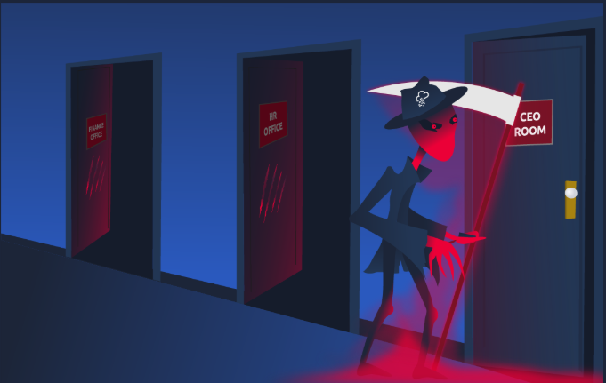
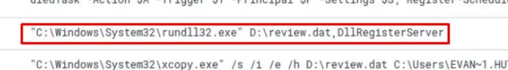

# ELK Stack Kill Chain Correlation - BoogeymanP3

## Objectives

- Reconstruct Boogeyman v3 kill chain: **phish → ISO mount (stage-1) → implant `review.dat` → `rundll32` exec (stage-2) → persistence (Scheduled Task) → C2 → UAC bypass → credential dump → lateral movement → DC hash theft (DCSync) → ransomware staging**.
- Identify definitive **PIDs, paths, commands, and IOCs** to support rapid containment across ELK.
- Highlight the **pivot from stealthy ISO delivery** to privilege abuse and domain impact.

## Tools Used

- **VM -** [https://tryhackme.com/room/boogeyman3](https://tryhackme.com/room/boogeyman3)
- **Kibana / ELK** — time-boxed (Aug 29–30, 2023) queries; added `process.command_line`, `process.pid`, `destination.ip/port` columns; filtered on file names, extensions, Event ID 1/3.
- **Windows telemetry (via ELK)** — process creation, network connections, task creation, PowerShell execution.
- **IOC extraction** — hosts, IP:port, URLs from command-lines and netflow.

---

# [Introduction]

## The Boogeyman Strikes Again

After the devastating previous attacks orchestrated by the **Boogeyman threat actor**, **Quick Logistics LLC** decided to strengthen its security posture by outsourcing its monitoring and incident response operations to a **Managed Security Service Provider (MSSP)**. However, despite these enhanced defences, the Boogeyman remained undetected in the shadows — waiting patiently for the right moment to return.



This new investigation focuses on analyzing the **latest tactics, techniques, and procedures (TTPs)** employed by the Boogeyman group in their renewed attempt to infiltrate and compromise Quick Logistics’ infrastructure.

## Investigation Setup

To begin this investigation, I deployed the **attached virtual machine** using the **Start Machine** option provided in the TryHackMe environment.

The investigation platform is built upon an **Elastic Stack (ELK)** setup, which serves as the primary source for centralized log collection, search, and correlation.

Once initialized, I accessed the **Kibana web console** using the temporary credentials given below to perform analysis.


**Note:** The Kibana instance may take 3-5 minutes to initialise.

---

# [The Chaos Inside] – Lurking in the Dark

Despite Quick Logistics LLC’s improved security defences, the **Boogeyman threat actor** once again managed to infiltrate the organization — this time with remarkable stealth. Without triggering any of the company’s detection systems, Boogeyman successfully **compromised an internal employee’s account**, gaining initial access and patiently remaining undetected while preparing for a larger attack.

Leveraging this foothold, the attackers shifted their focus toward a high-value target — the **CEO, Evan Hutchinson** — attempting to expand the scope and potential damage of their operation.

## Phishing Attempt on the CEO


The attack began when Evan received a **phishing email** that appeared to come from a trusted source. Although the message raised some suspicion, he ultimately **opened the attached document** out of caution mixed with curiosity.

The attachment appeared harmless at first — opening it produced no visible results. However, this inactivity was likely part of Boogeyman’s tactic to remain undetected while executing malicious code in the background.

After noticing the lack of visible content, Evan acted responsibly by **reporting the email to the security team**, triggering the organization’s incident response process.

## Initial Investigation

Upon receiving the report, the **security team conducted an immediate inspection** of the CEO’s workstation. During their investigation, they discovered the **email attachment stored in the Downloads folder**, confirming that it had been accessed locally.


Further examination revealed that the malicious attachment was delivered as an **ISO payload**, which, when mounted, contained a **suspicious file** within it — as shown in the provided reference image.


The security team also determined that the incident likely took place **between August 29 and August 30, 2023**, narrowing down the investigation timeline for subsequent analysis.

## Investigation

After I logged into Kibana, I had to make sure to set the timeline to match the time of the incident which is **between August 29 and August 30, 2023**.


### What is the PID of the process that executed the initial stage 1 payload?

- **Remainder:** The stage 1 payload is the actual attachment that the CEO has opened.
    
    
    
- I need to find out what is the process that executed this attachment. So i am gonna filter the events that contain files with **.html** extension and events related to this malicious attachment.
    
    ```
    ".html" OR "ProjectFinancialSummary_Q3.pdf”
    ```
    
    
    
    I got 5 hits.
    
- In this question we looking for processes, so in order to sort the columns I am gonna add the `process.command_line` and `process.pid` to the list of columns.
    
    
    
    
    

Answer: `6392`

### The stage 1 payload attempted to implant a file to another location. What is the full command-line value of this execution?

- Let’s check the surrounding events after the payload was executed.
    
    
    
    
    
- As you can see, right after the first payload was loaded, another command was executed inorder to implant a file to another location.
    
    
    

Answer: `"C:\Windows\System32\xcopy.exe" /s /i /e /h D:\review.dat C:\Users\EVAN~1.HUT\AppData\Local\Temp\review.dat`

### The implanted file was eventually used and executed by the stage 1 payload. What is the full command-line value of this execution?

- Let’s see what happened after the implant.
    
    
    
    The `rundll32.exe` was used to execute the implanted `review.dat` file.
    

Answer: `"C:\Windows\System32\rundll32.exe" D:\review.dat,DllRegisterServer`

### The stage 1 payload established a persistence mechanism. What is the name of the scheduled task created by the malicious script?


Answer: `Review`

### The execution of the implanted file inside the machine has initiated a potential C2 connection. What is the IP and port used by this connection? (format: IP:port)

- Implanted file = `review.dat`
- In order to look at network connection events, I need to find events with id/code = **3**.
    
    
    
    
    
    
    
- **21,362** is a lot of events, and the column doesn’t show us any useful info for this question. So let’s select these two columns as well (because we know that we are looking for an IP address and a port).
    
    
    
- Now in order to find the exact IP and port, in the search bar I will type
    
    ```
    **process.name** = rundll32.exe
    ```
    
    
    
    Why? Because we already found out that `rundll32.exe` was used to execute the implanted `review.dat` file:
    
    
    
- Result:
    
    
    

Answer: `165.232.170.151:80`

### The attacker has discovered that the current access is a local administrator. What is the name of the process used by the attacker to execute a UAC bypass?

- **UAC** = User Account Control (Mechanism to make sure only authorized users/ users with authorized privilege can install or execute binaries or programs)
- First I will filter events related to the malicious file (`review.dat`) that was executed.
    
    
    
- Scrolling down, I noticed the exact moment the attacker discovered what the current access is, by enumerating the groups the user is part of.
    
    
    
- Just below, I see a command being executed defining a `credential` object, which consist of a username and password.
    
    
    
- The parent process of this command is `review.dat`, which is the process responsible for executing the stage 2 payload.
    
    
    
- Which means, the process which was used by the attacker to execute this UAC bypass is the process just above it:
    
    
    

Answer: `fodhelper.exe`

### Having a high privilege machine access, the attacker attempted to dump the credentials inside the machine. What is the GitHub link used by the attacker to download a tool for credential dumping?

- In the search bar, I search for:
    
    ```
    *github*
    ```
    
    
    

Answer: `https://github.com/gentilkiwi/mimikatz/releases/download/2.2.0-20220919/mimikatz_trunk.zip`

### After successfully dumping the credentials inside the machine, the attacker used the credentials to gain access to another machine. What is the username and hash of the new credential pair?

(format: username:hash)

- Let’s search for the following keyword, as this is the name of tool which was just downloaded for dumping credentials:
    
    ```
    *mimi*
    ```
    
    
    
- Then look for an instance where the command that was used to dump credentials is visible:
    
    
    

Answer: `itadmin:F84769D250EB95EB2D7D8B4A1C5613F2`

### Using the new credentials, the attacker attempted to enumerate accessible file shares. What is the name of the file accessed by the attacker from a remote share?

- Lets look at the some events which took place after the credentials dumping.
    
    
    

Answer: `IT_Automation.ps1`

### After getting the contents of the remote file, the attacker used the new credentials to move laterally. What is the new set of credentials discovered by the attacker?

(format: username:password)

- Right after the previous entry, we can see the entry where the attacker used the new credentials.
    
    
    

Answer: `QUICKLOGISTICS\allan.smith:Tr!ckyP@ssw0rd987`

### What is the hostname of the attacker's target machine for its lateral movement attempt?

- Now that the attacker got access to a new set of credentials, they will use them to login to another machine. Let’s find the hostname of the target machine.
- The answer is in the same entry as the previous answer.
    
    
    

Answer: `WKSTN-1327`

### Using the malicious command executed by the attacker from the first machine to move laterally, what is the parent process name of the malicious command executed on the second compromised machine?

- This is the command which was executed by the attacker from the first machine to get him access to the second machine.
    
    
    
- The second machine is `WKSTN-1327` (from previous answer)
- Let’s filter events with ID of **1** and with the hostname of **WKSTN-1327**.
    
    
    
    
    
    And then sort the time by **Ascending** order of events.
    
- On the right is the **Parent Process Name** column, and this is the parent process which is the first executable which is responsible for the malicious command executed on the second machine.
    
    
    
    This below is the malicious process:
    
    
    
    And that malicious process got executed on the second machine by the attacker:
    
    
    

Answer: `wsmprovhost.exe`

### The attacker then dumped the hashes in this second machine. What is the username and hash of the newly dumped credentials?

(format: username:hash)

- Let’s just follow the order of events downwards and look for any dumped credentials like username and the hash.
    
    
    

Answer: `administrator:00f80f2538dcb54e7adc715c0e7091ec`

### After gaining access to the domain controller, the attacker attempted to dump the hashes via a DCSync attack. Aside from the administrator account, what account did the attacker dump?

- By observing the flow of attack performed, by the attacker. Just after passing the hash of user:**administrator**, the attacker performed a few more commands. One of which revealed the name of the **DC Machine**.
    
    
    
    DC Machine: `DC01`
    
- Now let’s apply filter for this new host.
    
    
    
- Now in the search bar lets search for the term “dcsync”, because when starting a DCSync attack the attacker has to use the keyword `dcsync` in their command.
    
    
    

Answer: `backupda`

### After dumping the hashes, the attacker attempted to download another remote file to execute ransomware. What is the link used by the attacker to download the ransomware binary?

- Remove the previous query from the search bar.
- This time search for `*.exe`, because according to the question the downloaded file is probably an executable.
    
    
    
- Make sure to adjust the time to cover the whole **24 hours** on date 29th & 30th:
    
    
    
- Then sort the **Time** in descending order and keep scrolling down carefully until you see any external URL used.
    
    
    

Answer: `http://ff.sillytechninja.io/ransomboogey.exe`

---

# Lessons Learned

- **Initial Access & Execution**
    - Stage-1 (PID **6392**) from ISO attempted **implant copy**:
        
        `"C:\Windows\System32\xcopy.exe" /s /i /e /h D:\review.dat C:\Users\EVAN~1.HUT\AppData\Local\Temp\review.dat`
        
    - Stage-2 launch via **LOLBin**:
        
        `"C:\Windows\System32\rundll32.exe" D:\review.dat,DllRegisterServer`
        
    - **Persistence**: Scheduled Task **“Review”** created to re-invoke payload.
- **C2 & Privilege Escalation**
    - C2 from `rundll32`→ **`165.232.170.151:80`**.
    - **UAC bypass** with **`fodhelper.exe`** once local admin detected.
- **Credential Access & Lateral Movement**
    - Downloaded **mimikatz** from GitHub; harvested creds **`itadmin:F84769D250EB95EB2D7D8B4A1C5613F2`**.
    - Read remote share file **`IT_Automation.ps1`** → discovered **`QUICKLOGISTICS\allan.smith:Tr!ckyP@ssw0rd987`**.
    - Lateral move to **`WKSTN-1327`**; malicious child executed under **`wsmprovhost.exe`**; new hash dumped **`administrator:00f80f2538dcb54e7adc715c0e7091ec`**.
    - **DCSync** on **DC01** targeted **`administrator`** and **`backupda`**.
- **Ransomware Staging**
    - Attempted payload fetch: **`http://ff.sillytechninja.io/ransomboogey.exe`**.
- **Detections & Mitigations**
    - Block/alert on: `165.232.170.151:80`, `ff.sillytechninja.io`, **mimikatz** fetch URL.
    - ASR/EDR rules: **block `rundll32`** with external DLL path; **ISO/IMG MOTW enforcement**; task-creation alerts for **“-W hidden/-NonI” PowerShell**.
    - Detect **fodhelper UAC bypass** patterns; monitor **`wsmprovhost.exe`** child anomalies and **DCSync** (4624/4672/4662 with Directory Replication).
    - Harden creds (LAPS/Privileged Access Workstations), restrict DC logon paths; segment egress and enforce **application allow-listing**.
    
    # Socials
    
    **Repository:** https://github.com/RahulCyberX/SOC-Analyst-Portfolio
    
    **Medium Article:** https://rahulcyberx.medium.com/threat-investigation-boogeyman-3-soc-level-1-capstone-challenge-thm-f4748aec2da0?source=friends_link&sk=4626497dd8541fd1d1f9dadb40a3aa2f
    
    **TryHackMe Profile:** https://tryhackme.com/p/0xRahuL
    
    **Github Profile:** https://github.com/RahulCyberX
