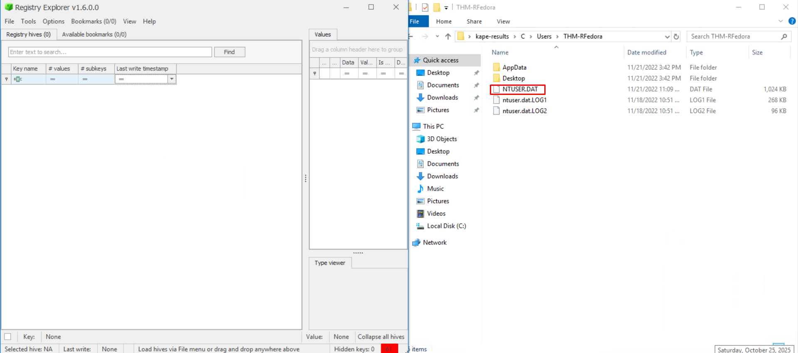

# Insider Threat Investigation – Unattended Windows Access

## Objectives

- Verify user activity between **12:05–12:45 PM, Nov 19, 2022** on a triaged Windows system.
- Identify searched items, opened files, downloads, and any **external exfiltration**.
- Work only from **KAPE results** at `...\Desktop\kape-results\C\` to avoid live tampering.

## Tools Used

- VM: [https://tryhackme.com/room/unattended](https://tryhackme.com/room/unattended)
- **Registry Explorer** (NTUSER.DAT → WordWheelQuery, RecentDocs)
- **Autopsy** (Logical Files → Recent Activity: Web Downloads, Web History)
- **JLECmd.exe** (Jump Lists – activity and interaction counts)
- **KAPE output set** as data source

---

# Task 1: Introduction

### **Welcome to the team, kid. I have something for you to get your feet wet.**

### **Our client has a newly hired employee who saw a suspicious-looking janitor exiting his office as he was about to return from lunch.**

I want you to investigate if there was user activity while the user was away **between 12:05 PM to 12:45 PM on the 19th of November 2022**. If there are, figure out what files were accessed and exfiltrated externally.

You'll be accessing a live system, but use the disk image already exported to the `C:\Users\THM-RFedora\Desktop\kape-results\C` directory for your investigation. The link to the tools that you'll need is in `C:\Users\THM-RFedora\Desktop\tools`

Finally, I want to remind you that you signed an NDA, so avoid viewing any files classified as top secret. I don't want us to get into trouble.

## Connecting to the machine

Start the virtual machine in split-screen view by clicking on the green "Start Machine" button on the upper right section of this task. If the VM is not visible, use the blue "Show Split View" button at the top-right of the page. Alternatively, you can connect to the VM using the credentials below via "Remote Desktop".


| **Username** | THM-RFedora |
| --- | --- |
| **Password** | Passw0rd! |
| **IP** | MACHINE_IP |

***Note:** Once the VM is fully running, please run Registry Explorer immediately, as this tool may take a few minutes to fully start up when executing the program for the first time.*

# Task 2: Windows Forensics review

This room is based on the [Windows Forensics 1](https://tryhackme.com/room/windowsforensics1) and [Windows Forensics 2](https://tryhackme.com/room/windowsforensics2) rooms. A cheat sheet is attached below, which you can also download below.

[WindowsForensicsCheatsheetTryHackMe-1670190536973.pdf](WindowsForensicsCheatsheetTryHackMe-1670190536973.pdf)

To better understand how to perform forensics quickly and efficiently, consider checking out the [KAPE room](https://tryhackme.com/room/kape).

# Task 3: Snooping around

Initial investigations reveal that someone accessed the user's computer during the previously specified timeframe.

Whoever this someone is, it is evident they already know what to search for. Hmm. Curious.

## TypedPaths — Investigation

**Goal:** Recover what was typed into Windows Explorer’s search bar from a captured `NTUSER.DAT`.

---

## Step 1 — Open Registry Explorer and load the hive

I launched the Registry Explorer application and loaded the NTUSER hive from the triage results.



**Path of hive:**

`C:\Users\THM-RFedora\Desktop\kape-results\C\Users\THM-RFedora\NTUSER.DAT`


Two dialog boxes popped up while the hive loaded. I followed the instructions in the task exactly:

- Click **No** on the first dialog box.
- Click **Yes** on the second dialog box.

This allowed the hive to finish loading in Registry Explorer.


---

## Step 2 — Navigate to the WordWheelQuery

The WordWheelQuery key in the Windows Registry stores a history of search terms entered by the user in the File Explorer search box (formerly Windows Explorer).

**Registry path I navigated to:**

`NTUSER.DAT\Software\Microsoft\Windows\CurrentVersion\Explorer\WordWheelQuery`


---

## Step 3 — Extract the stored values

Clicked on `WordWheelQuery` and located the value `MRULISTex`. 


This key contains subkeys like `MRUListEx` (Most Recently Used list) and numbered values (e.g., `0`, `1`, etc.) that hold binary or string data representing the search terms.

- `MRUListEx` contains the order of recent searches (e.g., `01-00-00-00...` indicates the sequence).
- Values like `0` and `1` hold the actual search terms in binary form.

But because the data is a binary form, I right-clicked the data of value name`0`  as it’s the most recent one, and clicked on **Data interpreter** (the eye icon) to decode and display the Unicode strings.


**Result:** This showed the decoded Unicode entries — these are the things typed into the Explorer search bar.


---

I did the same for data of value name `1` which is the next in order , got the search term:


## Answers

- **What file type was searched for using the search bar in Windows Explorer?**
    
    `.pdf`
    
- **What top-secret keyword was searched for using the search bar in Windows Explorer?**
    
    `continental`
    

---

# Task 4: Can’t simply open it

Not surprisingly, they quickly found what they are looking for in a matter of minutes.

Ha! They seem to have hit a snag! They needed something first before they could continue.

***Note:**  When using the Autopsy Tool, you can speed up the load times by only selecting "Recent Activity" when configuring the Ingest settings.*


---

## Step 1 — Identifying the Downloaded File

To begin, I opened **Autopsy** and set it up to analyze the system data.

1. Launched **Autopsy** and created a new case.
    
    
    
2. Loaded the directory:
    
    ```
    C:\Users\THM-RFedora\Desktop\kape-results\C\
    ```
    
    
    
3. When asked to add a source, I selected **“Logical Files”**.
    
    
    
    
    
4. Here deselect all options, and then select recent activity. Only need the most recent artifacts as this event just occurred.
    
    
    
5. Waited for the data to fully load, as it will take few minutes for autopsy to fully parse the contents. 

Once the case finished loading, I went to the following section:

> Data Artifacts → Web Downloads
> 

Here, I reviewed the list of downloaded items and located the **most recent suspicious downloaded file** that occurred within the timeframe given earlier.


### Finding:

- The latest downloaded file listed was:
    
    **`7z2201-x64.exe`**
    

---

## Step 2 — Checking the Download Timestamp

From the same artifact in Autopsy, I noted the **timestamp** associated with the downloaded file.


### Finding:

- **Download Time (UTC):** `2022-11-19 12:09:19 UTC`

This timestamp clearly shows when the file was fetched into the system’s **Downloads** folder.

---

## Step 3 — Finding When a PNG File Was Opened

Next, I moved to **Registry Explorer** to look for evidence of recently opened image files.

1. Ensured the **NTUSER.DAT** hive was still loaded.
2. Navigated to:
    
    ```
    NTUSER.DAT\Software\Microsoft\Windows\CurrentVersion\Explorer\RecentDocs
    ```
    
3. Opened the `.png` section under this key.
    
    
    
    
    
    
    
4. I noticed the **Last Write Time** value was also in plain view.
    
    
    

### Finding:

- **Opened File:** `continental.png`
- **Opened On:** `2022-11-19 12:10:21`

---

# Task 5: Sending it outside

Uh oh. They've hit the jackpot and are now preparing to exfiltrate data outside the network.

There is no way to do it via USB. So what's their other option?

---

## Step 1 — Understanding Jumplists

For this task I will use **JLECmd.exe,** which is a tool for examining **jumplists.**

> Windows creates Jumplists to track recently accessed files, folders, or applications. These are especially useful in forensic investigations to piece together user activity on a system.
> 

---

## Step 2 — Checking Available Options in JLECmd

To explore the tool, I opened **Command Prompt** as admin


Then I typed to 

```bash
JLECmd.exe -h
```

This displayed a list of all possible flags and options available for analyzing Jumplists.


---

## Step 3 — Running JLECmd to Analyze Jumplists

Next, I ran JLECmd on the **KAPE results directory** that contained the system’s user data:

```bash
JLECmd.exe -d C:\Users\THM-RFedora\Desktop\kape-results\C
```

This command processed **all Jumplist files** stored on the system and displayed each recorded activity.


---

## Step 4 — Finding the Desktop Activity

I scrolled through the output until I found the **"Desktop" section**.


Here, I noticed an entry related to a text file created on the Desktop.

- The **Interaction Count** is listed as `2`, which meant the file was opened **twice**.
- The **Last Modified timestamp** is also visible in this section.

### Answer:

| Question | Observation | Answer |
| --- | --- | --- |
| **How many times was the text file opened?** | Interaction count in Desktop jumplist | `2` |
| **When was it last modified?** | Timestamp in output | `11/19/2022 12:12` |

---

## Step 5 — Investigating Data Exfiltration via Pastebin

After confirming file access, I switched over to **Autopsy** to trace any data exfiltration.

1. Launched **Autopsy**.
2. Navigated to **Data Artifacts → Web History**.
3. Searched for any connection to **pastebin.com**.
    
    
    

Right away, I saw an entry in the list by cross referencing the date/timeframe to locate the **pastebin URL** which was used to exfiltrate the file contents.

### Answer:

- **Pastebin URL:** `https://pastebin.com/1FQASAav`

---

## Step 6 — Identifying What Data Was Uploaded

The **title field** in Autopsy’s Web History entry directly revealed what data string was uploaded to Pastebin.


Opening the URL in lowercase confirmed it matched the recorded title.

### Answer:

- **Copied String:** `ne7AIRhi3PdESy9RnOrN`

---

# Conclusion

At this point, we already have a good idea of what happened. The malicious threat actor was able to successfully find and exfiltrate data. While we could not determine who this person is, it is clear that they knew what they wanted and how to get it.

I wonder what's so important that they risked accessing the machine in-person... I guess we'll never know.

Anyways, you did good, kid. I guess it was too easy for you, huh?

---

# Lessons Learned

- WordWheelQuery + RecentDocs quickly reconstruct **intent** (what and where the user searched/opened).
- Jump Lists provide **interaction counts** and precise last-used timestamps to corroborate activity windows.
- Autopsy’s **Recent Activity** triage isolates downloads and web history fast—ideal for tight time windows.
- Web history artifacts can directly expose **exfil destinations** (e.g., Pastebin) and **posted content**.
- Keep a strict “no peek” policy for **classified** files; validate via metadata and artifacts in triage output only.

# Socials

**Repository:** https://github.com/RahulCyberX/Digital-Forensics-Incident-Response

**Medium Article:** https://medium.com/@rahulcyberx/unattended-complete-tryhackme-walkthrough-02a710218dfe?source=your_stories_outbox---writer_outbox_published-----------------------------------------

**TryHackMe Profile:** https://tryhackme.com/p/0xRahuL

**Github Profile:** https://github.com/RahulCyberX