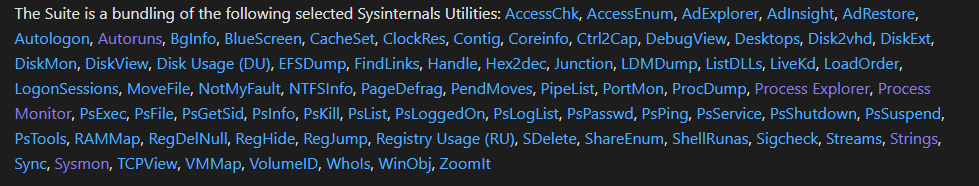

# Live Windows System Investigation with Sysinternals Suite

# Objectives

- Explored the full Sysinternals Suite inside TryHackMe’s Windows VM to level up from basic Task Manager to pro-level incident response.
- Installed the suite locally, mastered Sysinternals Live, hunted unsigned files, exposed hidden ADS streams, and verified remote IPs with WHOIS.
- Used Process Explorer to spot image hijacks, dumped processes, monitored every registry write with ProcMon, and extracted strings from real binaries.
- Proved I can now investigate a compromised Windows box like a real DFIR analyst—all in a safe, disposable lab.
- Virtual Machine: https://tryhackme.com/room/btsysinternalssg

# Tools Used

- **Sysinternals Suite** (Sigcheck, Streams, SDelete, TCPView, Autoruns, ProcDump, Process Explorer, ProcMon, PsExec, Sysmon, WinObj, BgInfo, RegJump, Strings)
- **Sysinternals Live** (\live.sysinternals.com\tools*)
- **PowerShell** (Download-SysInternalsTools, Get-Service webclient)
- **VirusTotal + Talos Reputation + WHOIS** (IP/domain verification)
- **notepad + streams.exe** (reading hidden ADS)

# Investigation

## Task 1: Introduction

I learned that Sysinternals is a suite of 70+ Windows-based tools created by Mark Russinovich and Bryce Cogswell in the late ’90s. Microsoft acquired it in **2006**, and these tools are now widely used for security investigations.

---

## Task 2: Install the Sysinternals Suite

I explored how to install the Sysinternals Suite: link https://docs.microsoft.com/en-us/sysinternals/downloads/sysinternals-suite

The suite has a select number of Sysinternal tools. 



- Either download the full suite or individual tools.
- Extract files → add folder PATH to environment variables → run tools from anywhere in CMD/PowerShell.
- Env. variables can be edited from System properties.
    - Can be launched via CMD by running `sysdm.cpl` > Go to advanced tab.
        
        
        
    - Select `Path` under `System Variables` and select Edit... then OK.
        
        
        
    - In the next screen select `New` and enter the folder path where the Sysinternals Suite was extracted to. Press OK to confirm the changes.
        
        
        
    
    - Open a new command prompt (elevated) to confirm that the Sysinternals Suite can be executed from any location.
        
        
        
        A local copy of the Sysinternals Suite is located in `C:\Tools\Sysint`. 
        
- Alternative: use PowerShell command:

```powershell
Download-SysInternalsTools C:\Tools\Sysint
```

---

## Task 3: Using Sysinternals Live

I learned Sysinternals Live allows running tools directly via the network path:

```bash
\\live.sysinternals.com\tools\procmon.exe
```

If it fails, I needed to:


1. Make sure **WebDAV Client** (`webclient`) is running: (Use Powershell)
    
    ```powershell
    get-service webclient
    start-service webclient #To verify it's running 
    ```
    
    
    
2. Enable **Network Discovery** from Control Panel. This setting can be enabled in the **Network and Sharing Center**.

That way, I could run tools without local installation.

There are 2 ways the tools can be run:

- Run the tool from the command line (as shown above from the Windows 10 machine)
- Create a network drive and run the tool from the mapped drive

**Method 1** - Run tool from command line


**Method 2** - Run tool from a mapped drive


**Note**: The asterisk will auto-assign a drive letter. The asterick can be replaced with an actual drive letter instead. 


---

## Task 4: File and Disk Utilities

I practiced with 3 tools:

1. **Sigcheck** is a command-line tool from Sysinternals for analyzing file details.
    - **Functions**:
        - Displays **file version number**, **timestamp**, and **digital signature details** (including certificate chains).
        - Checks file status on **VirusTotal** (scans against 40+ antivirus engines).
        - Option to **upload a file** for VirusTotal scanning.
    - **Use Case**: Helps verify file authenticity and detect potential malware by checking signatures and VirusTotal results.
        
        ```bash
        sigcheck -u -e C:\Windows\System32
        ```
        
        → Checks unsigned executables in this path.
        
        
        
        Parameter usage:
        
        - `u` "If VirusTotal check is enabled, show files that are unknown by VirusTotal or have non-zero detection, otherwise show
        only unsigned files."
        - `e` "Scan executable images only (regardless of their extension)"
        
        **Note**: If the results were different it would warrant an investigation into any listed executables.
        
2. **Streams** (to detect ADS)
    - **Definition**: **Alternate Data Streams (ADS)** is a feature of the NTFS file system that allows files to have multiple data streams beyond the main unnamed stream (`$DATA`).
    - **Access**: Use the syntax `file:stream` to read/write alternate streams.
    - **Visibility**: Not visible in Windows Explorer; requires third-party tools or **PowerShell** to view ADS.
    - **Uses**:
        
        
        
        - **Legitimate**: Marks files downloaded from the internet with identifiers (e.g., Zone.Identifier stream).
        - **Malicious**: Malware authors hide data in ADS to evade detection.
    - **Key Point**: ADS can store additional data in files, making it a potential hiding spot for malicious activity, but not all uses are harmful.
    - **Use case:**  A file downloaded from the Internet.
        
        
        
        Since the file has this identifier, additional security measures are added to its properties.
        
        
        
3. **SDelete** is a Sysinternals command-line tool for securely deleting files, directories, or cleansing free disk space.
    - **Functionality**:
        - Deletes one or more files/directories.
        - Wipes free space on a logical disk.
        - Implements **DOD 5220.22-M** (Department of Defense clearing and sanitizing protocol) for secure data erasure.
            
            
            
    - **Adversary Use**:
        - Used maliciously for **data destruction** (MITRE T1485) and **indicator removal** (MITRE T1070.004 - File Deletion).
        - MITRE ID: **S0195**.
    - **Resource**: Visit the **Sysinternals SDelete page** for detailed information here https://docs.microsoft.com/en-us/sysinternals/downloads/sdelete. Other tools fall under the **File and Disk Utilities** category. can be explored later from here https://docs.microsoft.com/en-us/sysinternals/downloads/file-and-disk-utilities

**Question: Using one of the tools, what is the text within the ADS?**

What I did:

- Open up a Command Prompt and run the following command:
    
    ```bash
    streams C:\Users\Administrator\Desktop\file.txt
    ```
    
    
    
    According to the hint I need to read the hidden file, in this case called `ads.txt`. 
    
- I used the notepad command to read it with the following syntax:
    
    ```bash
    notepad C:\Users\Administrator\Desktop\file.txt:ads.txt
    ```
    
    
    

---

## Task 5: Networking Utilities

**TCPView** provides a detailed list of all TCP and UDP endpoints on my Windows machine. It shows:

- Local and remote addresses.
- TCP connection states (e.g., LISTENING, ESTABLISHED).
- It can filter by protocol (TCP v4/v6, UDP v4/v6).
- It allows me to exclude “LISTEN” state to focus only on established outbound connections.

**Resource Monitor** (built into Windows) can do something similar:

- I opened it by typing `resmon` in the Run dialog (Win+R → `resmon`).
- From the *Performance* tab in Task Manager, I clicked “Open Resource Monitor.”
- In the *Network* tab, I expanded **TCP Connections** to view all active connections with remote addresses.

**Question:  Using WHOIS tools, what is the ISP/Organization for the remote address in the screenshots above?**

1. To identify ownership of a suspicious remote IP from the screenshot, I used a **WHOIS lookup**.
    - I opened: https://www.whois.com/whois/52.154.170.73
        
        
        
    - WHOIS told me that the IP belongs to **Microsoft Corporation**.

---

## Task 6: Process Utilities

### Tools I practiced with

1. **Autoruns**
    
    
    
    - Shows programs configured to start automatically at boot/login.
    - Useful for detecting persistence mechanisms (registry keys, startup folder entries, services, browser helpers, etc.).
2. **ProcDump**
    
    
    
    - CLI tool for creating process dumps when an app spikes CPU or crashes.
    - Dumps are later analyzed for troubleshooting or malware investigation.
    - Alternatively, can use **Process Explorer** to do the same.
    - Right-click on the process to create a **Minidump** or **Full Dump** of the process.
        
        
        
3. **Process Explorer (ProcExp)**
    
    
    
    - Advanced Task Manager replacement.
    - Shows detailed process trees, handles, DLLs, and lets me verify signatures.
    - Can also create minidumps/full dumps.
        
        **Example:** 
        
        - In the following images, let's look at svchost.exe PID 3636 more closely.
            
            
            
            
            
            This process is associated with the WebClient service that is needed to connect to [live.sysinternals.com](http://live.sysinternals.com/) (WebDAV).
            
            There should be web traffic listed in the TCP/IP tab.
            
            
            
        - Ideally, it would be wise to check if that IP is what we assume it is.  Various online tools can be utilized to verify the authenticity of an IP address. For this demonstration, I'll use **Talos Reputation Center** https://talosintelligence.com/reputation_center/lookup?search=52.154.170.73
            
            
            
            As mentioned in the **ProcExp** description, I can see open handles associated with the process within the bottom window.
            
            
            
            Listed as an open handle is the connection to the remote WebDAV folder.
            
            There is an option within ProcExp to **Verify Signatures**. Once enabled, it shows up as a column within the Process view.
            
            
            
4. **Process Monitor (ProcMon)**
    - Real-time logging of file, registry, and process/thread activity.
    - Generates huge logs, so filtering is essential to find useful events.
    - Example:
        - In the below snapshot, I set a filter to capture all the events related to PID 3888, notepad.exe. You can see some of the file operations that were captured and the file path or registry path/key the action occurred on, and the operation result.
            
            
            
        - ProcMon will capture thousands upon thousands of events occurring within the operating system.  The option to capture events can be toggled on and off.
            
            
            
        - In this ProcMon example, the session captured events only for a few seconds. Look at how many events were captured in that short space of time!
            
            
            
        - To use ProcMon effectively one **must** use the Filter and **must** configure it properly.
            
            
            
5. **PsExec**
    
    
    
    - Allows execution of processes on remote systems (without client pre-installation).
    - Legitimate for admins, but also abused by attackers for **lateral movement** (MITRE ATT&CK: T1021).

---

### Questions

### Q1: Run Autoruns → new entries in **Image Hijacks** tab

1. I opened Autoruns (`autoruns.exe`) and switched to the **Image Hijacks** tab.
2. In the original screenshot, there was only **iexplore.exe**.
    
    
    
3. Now, I saw an additional entry: **taskmgr.exe**.

---

### Q2: What entry was updated?

- The new entry I identified was: **taskmgr.exe**.

---

### Q3: What is the updated value?

- For **taskmgr.exe**, the associated image path showed:
    
    `C:\TOOLS\SYSINT\PROCEXP.exe`
    
- This means whenever Task Manager is launched, Process Explorer (`PROCEXP.exe`) runs instead.

---

## Task 7: Security Utilities (Sysmon)

- **Sysmon** (System Monitor) is a service + driver that logs security-relevant events:
    - Process creation.
    - Network connections.
    - File creation time changes.
- It persists across reboots and integrates with SIEM tools.
- I confirmed it is part of the Sysinternals Suite.

---

## Task 8: WinObj

### What I did

- I launched **WinObj** to explore the **NT Object Manager namespace**.
    
    
    
- This is the default view for WinObj
    
    
    
- I navigated through objects such as `\Sessions\0` (OS session) and `\Sessions\1` (User session).
    
    
    
- I saw objects for WindowStations, network drives, etc.
    
    
    

---

- Compared this information with Process Explorer. The below image is for `csrss.exe`, which was launched along with **winlogon.exe** by **smss.exe**.
    
    
    
    **Note**: This is a high-level exposure for this tool.
    

Other tools fall under the **System Information** category. Link to explore these tools later: https://docs.microsoft.com/en-us/sysinternals/downloads/system-information

## Task 9: Miscellaneous Tools

### Tools I tried

1. **BgInfo**
    
    
    
    - Displays system info (hostname, IP, OS version, service pack, etc.) directly on the desktop wallpaper.
    - Helpful for RDP sessions to quickly confirm server details.
2. **RegJump**
    - CLI tool to open Registry Editor at a specific path.
    - Saves time by jumping directly to the needed key.
    - **Use case:**
        - There are multiple ways to query the Windows Registry without using the Registry Editor, such as via the
            - command line (`reg query`)
            - and PowerShell (`Get-Item/Get-ItemProperty`).
        - Using Regjump will open the Registry Editor and automatically open the editor directly at the path, so one doesn't need to navigate it manually.
            
            
            
            
            
        
3. **Strings**
    - Extracts ASCII/Unicode strings from files (3+ chars).
    - Very useful for inspecting executables or malware binaries.
    - I practiced on **ZoomIt.exe**.
        
        
        

---

### Question: Run Strings on ZoomIt.exe → full `.pdb` path

**Steps I followed**

1. Opened a Command Prompt in the Sysinternals folder:
    
    ```bash
    cd C:\Tools\sysint
    ```
    
2. Ran the strings tool and filtered results for `.pdb`:
    
    ```bash
    strings ZoomIt.exe | findstr /i .pdb
    ```
    
    
    
3. The very first line in the output revealed the `.pdb` file path embedded in the binary.

---

# Lessons Learned

- Add Sysinternals to PATH once and rule Windows forever—no more hunting EXEs.
- Streams.exe finds hidden ADS in seconds; notepad file:ads.txt is the cheat code.
- Process Explorer + Verify Signatures column = instant “is this legit?” check.
- Autoruns Image Hijacks tab catches sneaky taskmgr.exe → procexp.exe swaps every time.
- Strings + findstr .pdb on any binary leaks full build paths—gold for attribution.
- Safe VM + pre-loaded Sysint folder = I just DFIR’d a real box without touching my own PC.

# Socials

**Repository:** https://github.com/RahulCyberX/Endpoint-Security-Monitoring

**Medium Article:** https://medium.com/@rahulcyberx/sysinternals-endpoint-security-monitoring-thm-2025-6c5430e15a10?source=your_stories_outbox---writer_outbox_published-----------------------------------------

**TryHackMe Profile:** https://tryhackme.com/p/0xRahuL

**Github Profile:** https://github.com/RahulCyberX