# Log Analysis and Visualization with ELK Stack

## Objectives

- Mastered full-cycle log investigation inside TryHackMe’s Elastic Stack lab using real January 2022 VPN logs from CyberT.
- Hunted post-termination access by ex-employee **Johny Brown** using Kibana Discover, KQL, visualizations, and dashboards—all from a browser with zero local tools.
- Built production-ready artifacts: custom tables, pie charts, time-series graphs, and a complete SOC dashboard showing failed logins, geographic spikes, and anomalous IPs.
- Proved Kibana turns raw JSON logs into instant threat intelligence in a safe, isolated environment.
- VM: https://tryhackme.com/room/investigatingwithelk101

## Tools Used

- **Kibana** (Discover → KQL search bar, Time Filter, Fields pane, Visualize → Pie/Table/Bar, Dashboard → Add from Library)
- **KQL queries** (Source_Country : "United States", UserName : "Johny Brown" and @timestamp > "2022-01-01", wildcards, AND/OR/NOT)
- **Timeline brushing** (click 11 Jan spike → instant IP isolation)
- **Saved objects** (searches, visualizations, full dashboard)

# Task 1: Introduction

In this task, I learned how to use the **Kibana interface** for searching, filtering, creating visualizations, and building dashboards while investigating VPN logs.

---

### **Learning Objectives**

- Perform searches and apply filters in Kibana.
- Save searches for future use.
- Create visualizations to understand log data better.
- Investigate VPN logs to identify anomalies.
- Build dashboards using saved searches and visualizations.

---

# Task 2: Incident Handling Scenario

### **Goal**

Understand the investigation scenario before analyzing logs.


---

### **Scenario Summary**

- Company: **CyberT (US-based)**
- Dataset: **VPN logs (January 2022)** stored in the **index vpn_connections**
- User “**Johny Brown**” was **terminated on 1st January 2022**
- Multiple **failed connection attempts** were observed and needed investigation

---

# Task 3: ElasticStack Overview

### **Goal**

Understand the **Elastic Stack (ELK Stack)** components and how they interact to collect, store, process, and visualize data.


---

### **Step 1: Learn Each Component**

| Component | Function |
| --- | --- |
| **Elasticsearch** | Core search and analytics engine; stores and queries data in JSON format via RESTful API. |
| **Logstash** | Processes and normalizes incoming data using **Input**, **Filter**, and **Output** pipelines. |
| **Beats** | Lightweight agents that ship data (e.g., **Winlogbeat** for Windows logs, **Packetbeat** for network traffic). |
| **Kibana** | Visualization and dashboard tool used for searching and analyzing data stored in Elasticsearch. |

---

### **Step 2: Understand Workflow**


1. **Beats** collect raw data from endpoints.
2. **Logstash** filters and processes it.
3. **Elasticsearch** indexes and stores the structured data.
4. **Kibana** visualizes and allows interaction through dashboards and queries.

---

# Task 4: Kibana Overview


### **Goal**

Familiarize myself with Kibana’s interface and its primary tabs used for log analysis.

---

### **Main Features Covered**

- **Discover Tab:** Search and filter logs.
- **Visualization Tab:** Create visual reports and charts.
- **Dashboard Tab:** Combine multiple visualizations and searches into one view.

---

### **Lab Connection Info**

- Connect via VPN or AttackBox.
- Use credentials:
    
    ```
    Username: Analyst
    Password: analyst123
    ```
    
- Waited 3–5 minutes for the machine to start and access via `MACHINE_IP` .

---

# Task 5: Discover Tab

### **Goal**

Use the **Discover tab** to filter, explore, and investigate VPN logs.


---

Some key information available in a dashboard interface are

1. **Logs (document):** Each log here is also known as a single
document containing information about the event. It shows the fields and values found in that document.
2. **Fields pane**: Left panel
of the interface shows the list of the fields parsed from the logs. We
can click on any field to add the field to the filter or remove it from
the search.
3. **Index Pattern:** Let the user select the index pattern from the available list.
4. **Search bar:** A place where the user adds search queries / applies filters to narrow down the results.
5. **Time Filter:** We can narrow down results based on the time duration. This tab has many options to select from to filter/limit the logs.
6. **Time Interval:** This chart shows the event counts over time.
7. **TOP Bar:** This bar contains various options to save the search, open the saved searches, share or save the search, etc.

### **Step 1: Understanding Key Features**

- **Logs/Documents:** Each event = one document.
- **Search Bar:** Enter queries or filters.
- **Time Filter:** Adjust time range to narrow results.
    
    
    
- **Timeline Chart:** Shows event spikes over time.
    
    
    
- **Fields Pane:** Filter or visualize based on fields like `Source_IP`, `UserName`, etc.
    
    
    
- **Create Table:** Customize and save selected columns for analysis.
    
    
    

---

### **Step 2: Tasks and Steps**

### 🔹 Filter Logs by Date

- Used the **Time Filter** (top-right) to select `31 Dec 2021 → 2 Feb 2022`.
- Pressed **Refresh** to apply the range.
    
    
    

---

### 🔹 Find IP with Max Connections

- In **Fields Pane**, selected `Source_IP`.
    
    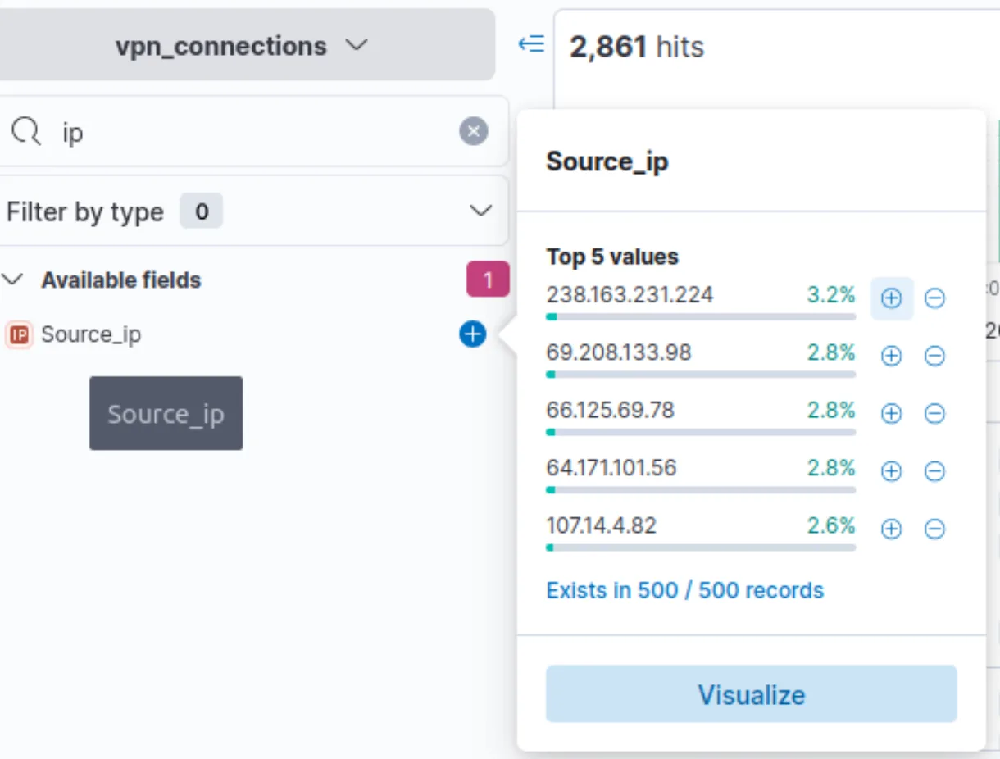
    
- Checked the **Top Values** list.

---

### 🔹 Find User with Max Traffic

- Selected `UserName` field.
- Viewed top listed usernames.
    
    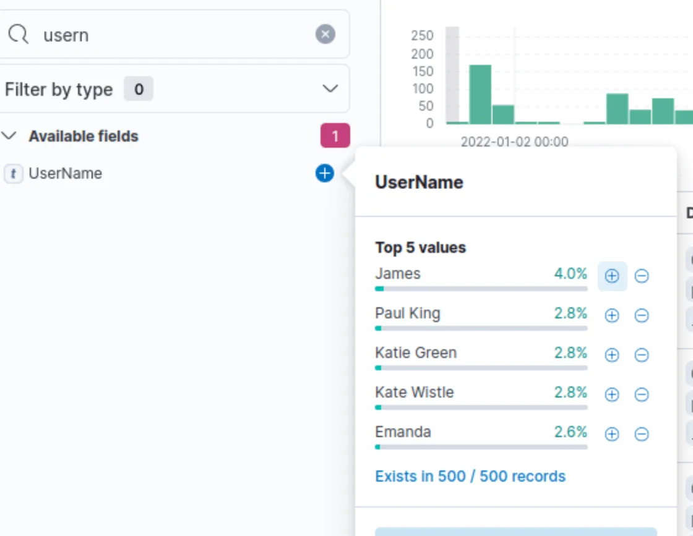
    

---

### 🔹 Create Custom Table

- Added fields: `IP`, `UserName`, `Source_Country`.
- Used **“Toggle column in table”** to include them.
    
    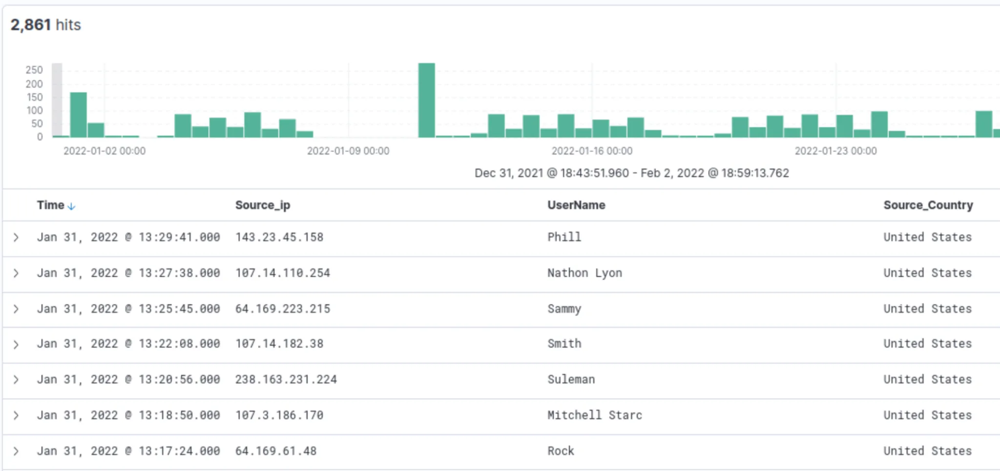
    

---

### 🔹 Filter by User “Emanda”

- In **UserName** field → clicked **+** beside *Emanda* to filter only her logs.
    
    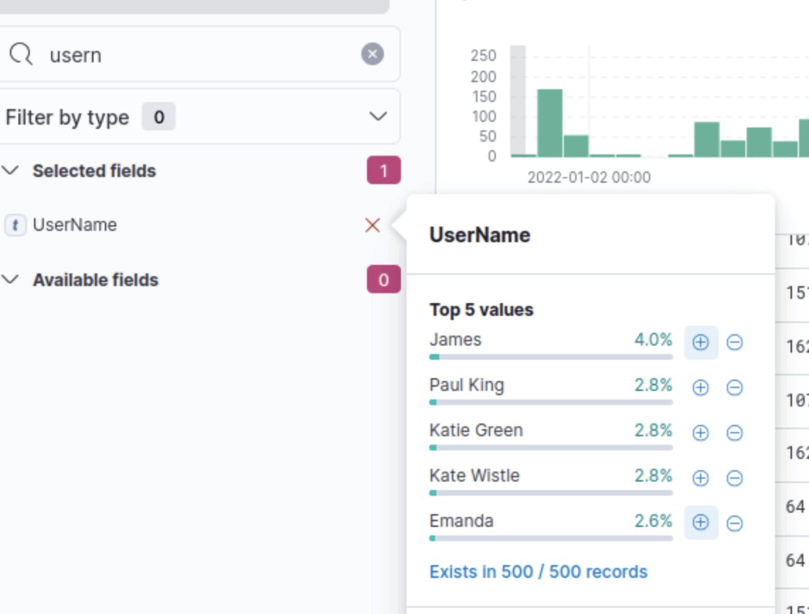
    
- Selected `Source_IP` → checked top value.
    
    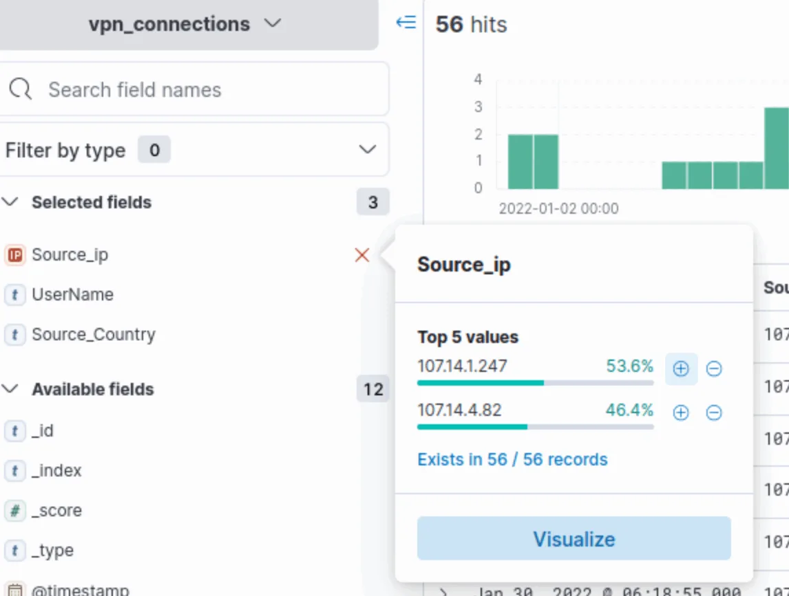
    

---

### 🔹 Find IP Causing Spike (11 Jan)

- Removed “Emanda” filter.
- On **Timeline Chart**, selected the bar for **11 Jan**.
    
    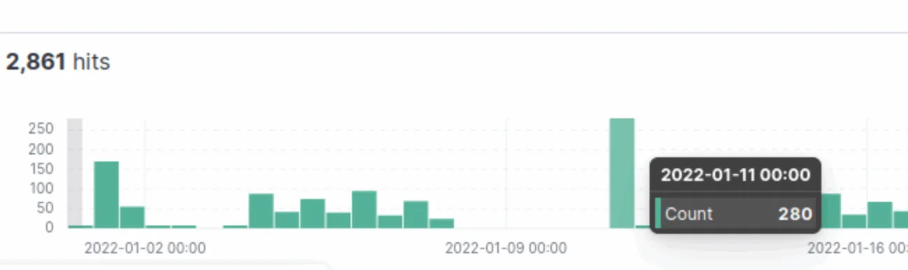
    
- Checked top Source IP values.
    
    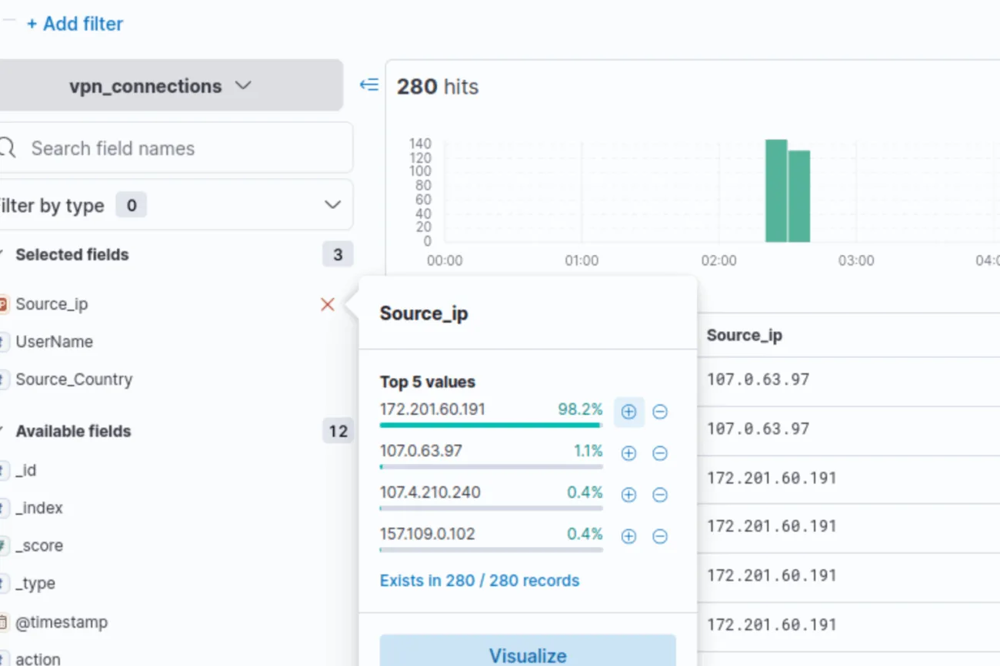
    

---

### 🔹 Exclude New York State

- Filtered by **Source_IP = 238.163.231.224**.
    
    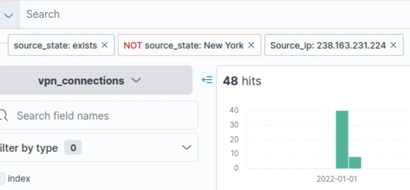
    
- Added a **negative filter (–)** on **Source_State = New York**.
- Checked total remaining documents.

---

# Task 6: KQL Overview

### **Goal**

In this task, I learned to use **Kibana Query Language (KQL)** to search and filter logs in Elasticsearch using both **free text** and **field-based** searches.


---

### **Step 1: Understanding KQL Basics**

### **Free Text Search**

- Typing any word (e.g., `security`) returns all logs containing that term.
- Searches match **whole words only** (e.g., `United` ≠ `United States`).
- Use **wildcards** like `United*` to include partial matches.
    
    
    

### **Logical Operators**

KQL supports:

- `OR` — combines multiple conditions
    
    → Example: `"United States" OR "England"`
    
- `AND` — matches logs containing both conditions
    
    → Example: `"United States" AND "Virginia"`
    
- `NOT` — excludes specified results
    
    → Example: `"United States" AND NOT ("Florida")`
    

### **Field-Based Search**

- Format: `FIELD : VALUE`
    
    → Example: `Source_ip : 238.163.231.224 AND UserName : Suleman`
    
- Kibana auto-suggests available fields while typing.

---

### **Step 2: Using KQL to Filter Data**

### **Filter logs from Source_Country = United States and show logs for User James or Albert**

- Query used:
    
    ```
    Source_Country : "United States" and (UserName : "James" or UserName : "Albert")
    ```
    

**Answer:** 161 records

---

### **Find VPN connections after termination of user “Johny Brown” (1 Jan 2022)**

- Query used:
    
    ```
    UserName: "Johny Brown" and @timestamp > "2022-01-01T00:00:00.000Z"
    ```
    

**Answer:** 1 record

---

# Task 7: Creating Visualizations

### **Goal**

Learn how to convert log data into clear visual insights using the **Visualization tab** in Kibana.

---

### **Step 1: Creating Visualizations**

- From **Discover tab**, select any field → click **“Visualize”**.
- Choose chart type (e.g., table, pie chart, bar chart).

Example:

- To visualize top 5 source countries:
    - Use **Source_Country** field.
    - Choose a **Pie Chart** to display country-wise log distribution.

---

### **Step 2: Correlation Views**


- Drag multiple fields (e.g., `Source_Country` vs `Source_IP`) into the center panel to compare relationships between them.

---

### **Step 3: Saving and Sharing**


1. Click **Save** (top-right).
2. Add a descriptive **title** and **description**.
3. Choose to add to an existing or new **dashboard**.
4. Click **Save and add to library**.

---

### **Step 4: Analyzing Data**

### **User with most failed login attempts**

- Visualized `UserName` vs `action` in a table view.
    
    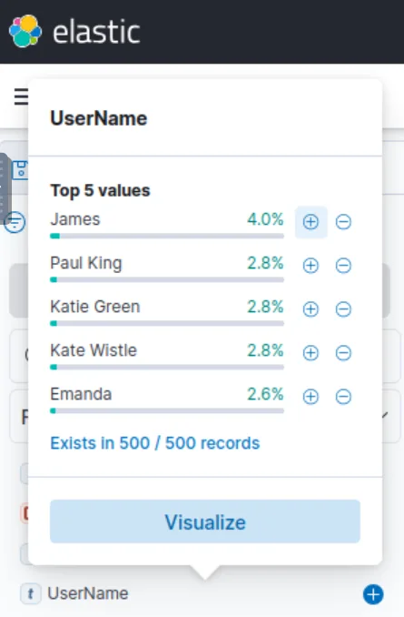
    
- Sorted results on `failed` actions.
    
    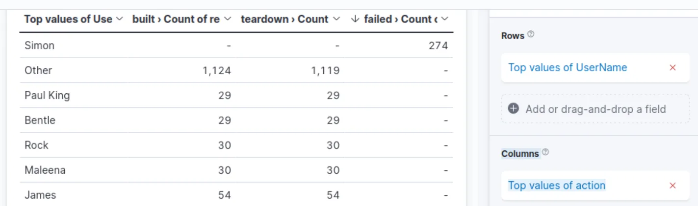
    

---

### **Total wrong VPN connection attempts in January**

- Added `action` on the x-axis, grouped by `@timestamp`, and used `count()` on y-axis.
    
    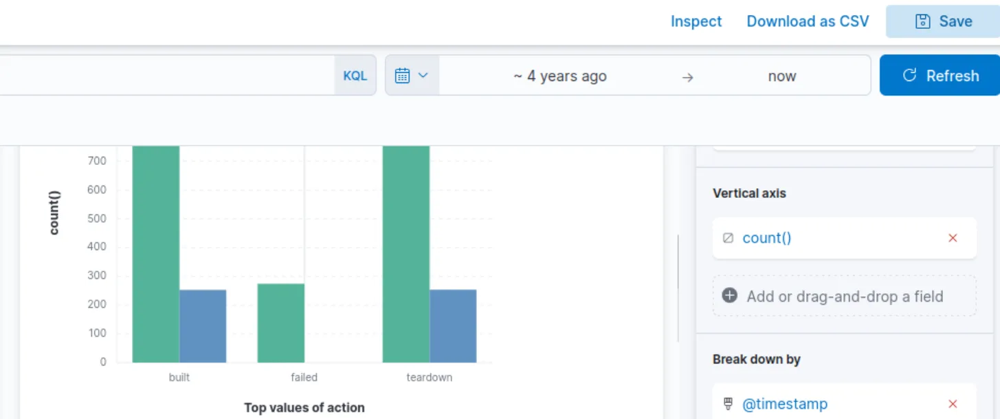
    
- Identified total failed attempts in January.
    
    **Answer:** 274
    

---

# Task 8: Creating Dashboards

### **Goal**

Combine all saved visualizations into a single interactive **Kibana dashboard**.

---

### **Steps to Create a Dashboard**

1. Open the **Dashboard tab**.
2. Click **“Create dashboard”**.
    
    
    
3. Use **“Add from Library”** to import saved visualizations.
4. Arrange and resize as desired for clarity.
5. Click **Save** to finalize layout and preserve structure.

---

# Lessons Learned

- Time Filter + Index Pattern = your first move—always lock the date range before touching KQL.
- Fields pane Top Values = fastest way to spot the loudest IP (238.163.231.224) or user without writing a query.
- KQL beats Lucene for humans: UserName : "Johny Brown" and @timestamp > "2022-01-01" found the single post-termination hit in one line.
- Brush the timeline spike → auto-filter = magic for finding 11 Jan brute-force in 3 seconds.
- Negative filters (NOT Source_State : "New York") clean noisy data instantly.
- Safe VM + pre-loaded vpn_connections index = I just ran a full SOC investigation using only a browser and KQL.

# Socials

**Repository:** https://github.com/RahulCyberX/Security-Information-Event-Management

**Medium Article:** https://medium.com/@rahulcyberx/investigating-with-elk-101-complete-tryhackme-walkthrough-250cce44a0ef?source=your_stories_outbox---writer_outbox_published-----------------------------------------

**TryHackMe Profile:** https://tryhackme.com/p/0xRahuL

**Github Profile:** https://github.com/RahulCyberX