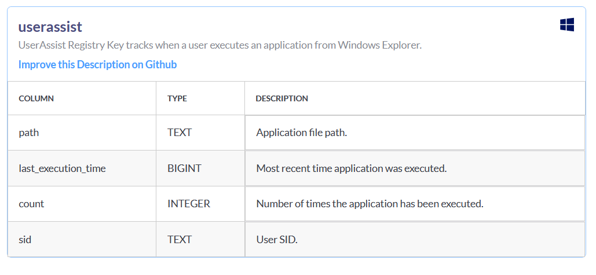

# OsQuery SQL-Based Endpoint Interrogation

## **Objectives**

* Utilize **Osquery’s SQL-based interface** inside TryHackMe’s Windows VM to perform live endpoint forensics without agents or reboots.
* Query Windows artifacts to uncover user activity, installed software, service states, and persistence mechanisms using structured SQL syntax.
* Detect disk-wiping utilities from **userassist**, enumerate installed **VPN applications**, count **active services**, and locate **auto-start batch scripts** for persistence analysis.
* Demonstrate how Osquery transforms live systems into **queryable forensic databases** suitable for rapid DFIR triage.

---

## **Tools Used**
* VM: https://tryhackme.com/room/osqueryf8
* **Osquery Shell** — executed live SQL queries and schema exploration.
* **Osquery Built-in Tables:**

  * `userassist` → GUI-launched applications and timestamps.
  * `programs` → installed software inventory.
  * `services` → running and stopped Windows services.
  * `autoexec` → startup and autorun executables.
* **SQL Operators:** `LIKE`, `COUNT(*)`, `SELECT * FROM`, filters for `.bat`, `%VPN%`, etc.
* **Osquery Schema Docs** → verified table purpose and column structures.

---


# Investigation

## Step 1: Identify Which Table Stores Process Execution Evidence in Windows

To start, I needed to find which table stores evidence of process execution in Windows OS.

I used the `.tables` command to view all available tables:

```bash
.tables
```

However, to be sure, I checked the official Osquery documentation for Windows:

👉 [https://osquery.io/schema/5.5.1](https://osquery.io/schema/5.5.1)

After some exploration and testing, I found that the correct table is **userassist**.

**About userassist table:**



- It tracks when a user executes an application from Windows Explorer.
- It logs execution path, timestamp, execution count, and user SID.

**Schema columns:**

- `path` → Application file path
- `last_execution_time` → Timestamp of last execution
- `count` → Number of times executed
- `sid` → Security Identifier (User SID)

---

## Step 2: Find the Program Executed to Remove Disk Traces

I used the **userassist** table found in the previous step.

To view all entries and check for any suspicious programs, I ran:

```sql
SELECT * FROM userassist;
```

After carefully examining the results, I noticed one entry for **DiskWipe.exe** — a program known to remove or wipe disk traces.


---

## Step 3: Identify VPN Installed on the Host

Next, I had to identify which VPN software is installed.

For this, I used the **programs** table, which lists all installed programs.

I filtered for names containing “VPN” using the `LIKE` operator:

```sql
SELECT * FROM programs WHERE name LIKE '%VPN%';
```

From the results, I found an entry for **ProtonVPN**.


---

## Step 4: Count Running Services

To determine how many services were currently running on the host, I queried the **services** table.

I used the `COUNT(*)` function to count the number of entries:

```sql
SELECT COUNT(*) FROM services;

```

The total count returned was **215**.


---

## Step 5: Identify Batch File That Runs Automatically

The next step was to find which batch file (`.bat`) runs automatically when the machine starts.

The **autoexec** table stores executables configured to auto-run.

I searched for entries ending with `.bat` using:

```sql
SELECT * FROM autoexec WHERE name LIKE '%.bat';
```

This revealed one batch file named **batstartup.bat**.


---

## Step 6: Find the Full Path of the Batch File

Finally, I needed to find the full path of that same `.bat` file from the **autoexec** table.

I found the complete path by checking the path column of the previous query:

**Answer:**

`C:\Users\James\AppData\Roaming\Microsoft\Windows\Start Menu\Programs\Startup\batstartup.bat`

---


## **Findings**

* **Disk-Wiping Utility:**

  * `userassist` revealed execution of **DiskWipe.exe**, indicating evidence tampering attempts.

* **VPN Software:**

  * `programs` table showed **ProtonVPN** installed, likely used for anonymized outbound connections.

* **System Services:**

  * `COUNT(*) FROM services` returned **215 active services**, confirming normal host activity baseline.

* **Persistence Mechanism:**

  * `autoexec` query located an autorun batch file:

    * **Filename:** `batstartup.bat`
    * **Full Path:** `C:\Users\James\AppData\Roaming\Microsoft\Windows\Start Menu\Programs\Startup\batstartup.bat`

---

## **Lessons Learned**

* Osquery converts endpoint telemetry into a **forensic SQL database** — powerful for IR without external tools.
* `userassist` exposes GUI-executed binaries attackers rely on to evade command-line monitoring.
* The `programs` table instantly reveals stealth software like VPNs or exfil tools.
* Service enumeration with `COUNT(*)` is a quick integrity and persistence check.
* `autoexec` uncovers startup abuse, making it ideal for persistence detection.
* A safe TryHackMe VM + Osquery shell = full DFIR investigation powered purely by SQL.


# Socials

**Repository:** https://github.com/RahulCyberX/Endpoint-Security-Monitoring

**Medium Article:** https://medium.com/@rahulcyberx/osquery-the-basics-endpoint-security-monitoring-thm-2025-5ff1f6da76b7?source=your_stories_outbox---writer_outbox_published-----------------------------------------

**TryHackMe Profile:** https://tryhackme.com/p/0xRahuL

**Github Profile:** https://github.com/RahulCyberX
