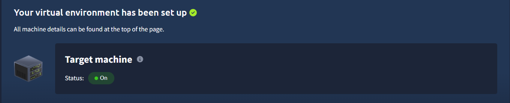
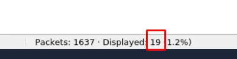

# Phishing Prevention Using MITRE ATT&CK Framework

## Objectives

- Analyze SMTP traffic to understand **email flow**, **response codes**, and **server communication**.
- Inspect **IMF (Internet Message Format)** structure in Wireshark to identify **senders**, **recipients**, and **attachments**.
- Detect **malicious attachments and encoding methods** in SMTP packets.
- Understand **technical and human-layer defenses** organizations use to prevent phishing.

---

## Tools Used

- VM: [https://tryhackme.com/room/phishingemails4gkxh](https://tryhackme.com/room/phishingemails4gkxh)
- **Wireshark** — for SMTP/IMF traffic capture and inspection.
- **PCAP (traffic.pcap)** — provided evidence file containing email communication.
- **Follow TCP Stream** — to view full raw email headers and body.
- **SMTP & IMF Filters** (`smtp`, `imf`, `smtp.response.code`) — to isolate relevant traffic.
- **CyberChef** — for defanging URLs and decoding base64 when needed.

---

# [Investigation]

# A. Analyzing SMTP Responses

In this task, I’m analyzing a **PCAP file** (`traffic.pcap`) containing **SMTP (Simple Mail Transfer Protocol)** traffic using **Wireshark**.

Goal: understand how email communication happens over SMTP and extract key information from the packet capture.

I should already know basic **SMTP filters** and **status codes**.

After deploying the attached VM, I’ll open the file **`traffic.pcap`** from the Desktop and start examining it.

---

Short, direct, and to the point — exactly how it should’ve been.

## Steps to Begin

### 1. **Deploy the Machine**



### 2. **Open the PCAP File**

- On the desktop, locate the file named `traffic.pcap`.
- Open it using **Wireshark** (right-click → *Open with Wireshark*).
    
    
    

## SMTP Traffic Analysis Using Wireshark

### 3. **Apply SMTP Display Filter**

To view only SMTP-related traffic:

```
smtp
```

> This filters out all other protocols, showing only email-related communication.
> 

### 4. **Understand SMTP Communication Flow**

SMTP usually occurs between:

- **Client (Mail User Agent)** → sends email
- **Mail Server (Mail Transfer Agent)** → receives, relays, or delivers email

Wireshark will show conversations on port **25 (SMTP)**, **465 (SMTPS)**, or **587 (Submission)**.

### 5. **Common SMTP Commands to Identify**

Look for these in the “Info” column or the packet details:

- `EHLO` / `HELO` → identifies client to server
- `MAIL FROM:` → sender’s email address
- `RCPT TO:` → recipient’s email address
- `DATA` → beginning of message body
- `QUIT` → end of session

### 6. **Check Status Codes in Server Replies**

SMTP responses are numeric status codes:

- **250** → OK, command accepted
- **354** → Start mail input (after `DATA`)
- **221** → Goodbye (connection closing)
- **550** → Message rejected (invalid recipient)

## Answer the questions below

### Which Wireshark filter can you use to narrow down your results based on SMTP response codes?


Answer: `smtp.response.code`

### How many packets in the capture contain the SMTP response code `220 Service ready`?

- Used the following filter:
    
    ```
    smtp.response.code==220
    ```
    
    
    

Answer: `19`

### One SMTP response indicates that an email was blocked by `spamhaus.org`. What response code did the server return?

- First remove the smtp filter.
- Press **Ctrl+F** and search for the string `spamhaus.org`:
    
    
    

Answer: `553`

### Based on the packet from the previous question, what is the full `Response code:` message?


Answer: `Requested action not taken: mailbox name not allowed (553)`

### Search for response code `552`. How many messages were blocked for presenting potential security issues?

```
smtp.response.code==551
```


Answer: `6`

---

# B. Inspecting Emails and Attachments

In this task, I’m continuing the analysis of the same **SMTP traffic capture** (`traffic.pcap`) used earlier.

Now, I’ll focus on the **Internet Message Format (IMF)** to understand the **inner structure and metadata** of email messages - such as sender, recipient, content type, and attachments.

## What is IMF?

**Internet Message Format (IMF)** defines how an email is structured.

It specifies how **headers and body** are formatted, helping analysts inspect the message in detail.

### Common IMF Header Fields:

| **Field** | **Purpose** |
| --- | --- |
| `From:` | Shows the sender’s email address |
| `To:` | Shows the recipient’s email address |
| `Subject:` | Displays the subject of the email |
| `Date:` | Indicates when the email was sent |
| `Content-Type:` | Describes the type of message body (plain text, HTML, multipart, etc.) |
| `MIME-Version:` | Specifies the MIME version used |
| `Message-ID:` | A unique ID assigned to the email by the sending system |

## Steps for IMF Analysis in Wireshark

### 1. **Open the PCAP File**

Continue from previous analysis).

### 2. **Apply Display Filter**

To focus on email content and structure:

```
smtp
```

> This shows packets where actual email message data (headers + body) is transmitted.
> 

### 3. **Follow TCP Stream**

Right-click any SMTP `DATA` packet →

**Follow → TCP Stream**

This opens the **full raw email**, including all **IMF headers** and message content.

### 4. **Analyze IMF Headers**

Look for the following:

- **From / To:** verify sender and recipient
- **Subject:** identifies the message topic (useful in phishing detection)
- **Date:** timestamp of the email
- **Content-Type:** determines if it’s text, HTML, or multipart (attachments)
- **MIME Boundary:** separates different content parts (e.g., body and attachments)

### 5. **Identify Attachments**

If you see:

```
Content-Disposition: attachment; filename="file.pdf"
```

or Base64 encoded content under a MIME section, it indicates an **attached file**.

You can later export or decode it to inspect what the attachment contains.

## Answer the questions below

### How many SMTP packets are available for analysis?

- What I wrote as filter
    
    ```
    smtp
    ```
    
    
    

Answer: `512`

### What is the name of the attachment in packet `270`?

- Locate packet 270:
    
    
    
- Right click on it → Follow → TCP Stream
    
    
    
    This opens the full raw email.
    
- Now **Ctrl+F** and search for keyword ‘attachment’ or ‘Content-Disposition’:
    
    
    

Answer: `document.zip`

### According to the message in packet `270`, which Host IP address is not responding, making the message undeliverable?

- Locate the packet 270
- Press **Ctrl+G** and type 270 and hit enter to directly go to that packet.
- After locating, expand the SMTP sub-tree.
    
    
    
- Scroll down the message to find the host IP which is not responding.
    
    
    

Answer: `212.253.25.152`

### By filtering for `imf`, which email client was used to send the message containing the attachment `attachment.scr`?

- Apply filter
    
    ```
    imf
    ```
    
    The `imf` (Internet Message Format) filter shows email **message contents,** the headers and body of emails transferred via SMTP, POP, or IMAP.
    
    
    
- Now open the **Internet Message Format** (IMF) of each packet.
    
    
    
- Inside the **IMF**, further expand **MIME Multipart Media Encapsulation** subtree for each packet.
    
    
    
- Then expand both of these until you find the attachment `attachment.scr`.
    
    
    
    
    
- Once the packet having this attachment is located, scroll up until you find the **X-Mailer** field. It is the email client which was used to send this message.
    
    
    

Answer: `Microsoft Outlook Express 6.00.2600.0000`

### Which type of encoding is used for this potentially malicious attachment?

It can be found in the **Content-Transfer-Encoding** field, right under that “application/octet-stream” section.


Answer: `base64`

---

# How Organizations Stop Phishing

Now that I’ve explored how emails are authenticated through **SPF**, **DKIM**, and **DMARC**, and practiced analyzing **SMTP traffic** and **IMF message details**, the next step is understanding **modern technical and human-layer defenses** that protect organizations from phishing threats.

## Technical Defenses

Modern email systems use multiple technical mechanisms to **detect, block, or isolate** phishing attempts before they reach the end user.

### 1. **Email Filtering**

- Filters incoming messages based on:
    - **IP and domain reputation**
    - **Keyword analysis**
    - **Attachment scanning**
- Suspicious messages can be **blocked** or **quarantined** before delivery.

### 2. **Secure Email Gateways (SEGs)**

- Act as a **protective layer** between the internet and the mail server.
- Detect:
    - **Spoofing or impersonation**
    - **Malicious attachments or links**
    - **Unusual sending behavior**
- Common examples: **Proofpoint**, **Mimecast**, **Microsoft Defender for Office 365**.

### 3. **Link Rewriting**

- Replaces unknown or suspicious URLs in emails with **safe redirect links**.
- When clicked, the system **scans and verifies** the destination site first.
- Protects users from **malicious redirects** or **drive-by downloads**.

### 4. **Sandboxing**

- Suspicious attachments or URLs are opened in a **virtual environment (sandbox)**.
- Observes for:
    - **Malware downloads**
    - **Suspicious scripts**
    - **Persistence mechanisms**
- Ensures malicious content never interacts with real systems.

## User-Facing Tools & Awareness

Even with strong defenses, some phishing messages still bypass filters.

That’s why **user awareness and visual cues** are critical in preventing successful phishing attacks.

### 1. **Trust & Warning Indicators**

- Visual banners and alerts such as:
    - “⚠️ External Sender”
    - “Suspicious Link Detected”
    - “Verified Organization”
- Help users **instantly recognize potential risks** before interacting.

### 2. **Phishing Reporting**

- Provides an **easy “Report Phish” button** within email clients.
- Allows users to report suspicious messages to the security team quickly.
- Enables faster **incident response and pattern recognition**.

### 3. **User Awareness Training**

- Regular sessions to teach:
    - How to recognize phishing emails and fake login pages.
    - Common **social engineering** tricks.
    - Safe handling of links, attachments, and credentials.

### 4. **Phishing Simulation Exercises**

- Controlled phishing campaigns sent to employees.
- Tracks:
    - Who clicked on links
    - Who reported the phish
- Reinforces lessons and **builds long-term vigilance**.

## Summary


| **Category** | **Defense Type** | **Purpose / Function** |
| --- | --- | --- |
| Technical | Email Filtering | Blocks suspicious emails using reputation checks |
| Technical | Secure Email Gateway (SEG) | Detects spoofing, impersonation, and advanced phishing |
| Technical | Link Rewriting | Scans URLs before allowing access |
| Technical | Sandboxing | Tests attachments and links in isolated environments |
| User | Trust Indicators | Visual cues for safe or risky messages |
| User | Phishing Reporting | Lets users report suspicious emails easily |
| User | Awareness Training | Educates users on identifying phishing |
| User | Simulation Exercises | Reinforces learning via real-life tests |

## Answer the questions below

A security team wants to implement a control to detect hidden malware inside email attachments.
They need a way to analyze suspicious files without risking infection on real systems.
Which protective technique would allow them to observe a file's behavior safely?


Answer: `Sandboxing`

---

# Lessons Learned

- SMTP analysis reveals **server replies**, **blocked messages**, and **mail flow health**.
- IMF headers provide critical insights: **sender authenticity**, **content type**, **attachments**, and **potential malware indicators**.
- Phishing indicators include **mismatched “From” domains**, **ZIP or SCR attachments**, and **base64-encoded payloads**.
- **Wireshark filters** like `smtp.response.code==220` or `smtp.response.code==553` help isolate server behavior.
- **Sandboxing** is essential for safely analyzing suspicious attachments.
- Strong phishing defense requires both **technical controls** (filtering, SEGs, sandboxing) and **human vigilance** (training, reporting).
- Combined, these measures form a **layered defense** that prevents, detects, and mitigates phishing-based threats effectively.

# Socials

**Repository:** https://github.com/RahulCyberX/Phishing-Analysis

**Medium Article:** https://medium.com/@rahulcyberx/phishing-prevention-tryhackme-112bcf5fa53d?source=your_stories_outbox---writer_outbox_published-----------------------------------------

**TryHackMe Profile:** https://tryhackme.com/p/0xRahuL

**Github Profile:** https://github.com/RahulCyberX