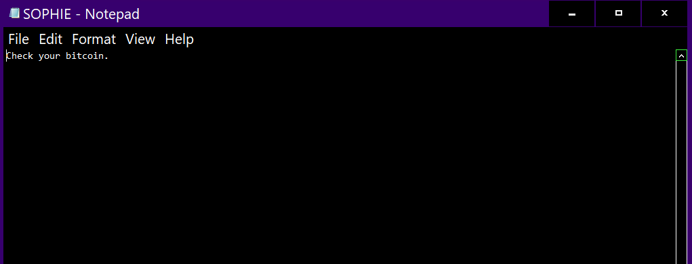
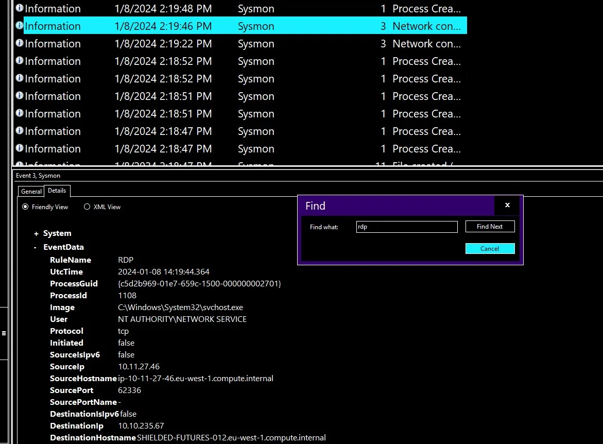

# Ransomware Encryption Detection Using Sysmon Events

## **Objectives**

* Investigate a live ransomware infection inside a Windows RDP VM to trace file encryption, ransom note creation, and attacker-initiated decryption.
* Correlate Sysmon Event IDs (1, 3, 11) to reconstruct the full kill chain — from phishing download to attacker rollback.
* Identify the fake antivirus installer, encryption marker extension, and outbound connections used by the malware.
* Track the attacker’s RDP login, decryptor execution, and apology message proving human error.
* Validate that the system was safely restored using built-in tools without further compromise.

---

## **Tools Used**
* - VM: https://tryhackme.com/room/retracted
* **Windows Event Viewer** (Sysmon Operational → Event ID 1 process creation, 3 network, 11 file creation)
* **Sysmon Logs** (pre-installed with hashes, process tree, and timestamps)
* **Browser History** (Ctrl+J to trace malicious download source)
* **Notepad** (ransom and apology note analysis)
* **RDP Session** (victim credentials for interactive triage)

---


# Investigation

# Task 1: Introduction to Retracted

## A Mother’s Plea (Simulated scenario)

When I began this investigation, I was contacted by Sophie’s mother. She told me that Sophie had downloaded what she thought was an antivirus installer. After running it, all her files became inaccessible, and her wallpaper displayed a ransom message demanding payment in Bitcoin.

Surprisingly, the computer later seemed to return to normal — except for a note asking her to check her Bitcoin wallet. My goal here was to verify if her system was really safe or if remnants of the ransomware were still present.

---

## Connecting to the Machine

To start my analysis, I launched the provided virtual machine.

- Clicked **Start Machine** → waited until it loaded completely.
- This type I connected via **Remote Desktop (RDP)** using:
    
    ```
    Username: sophie
    Password: fluffy19601234!
    IP: MACHINE_IP
    ```
    

Once logged in, I began my forensic investigation.

---

# Task 2: The Message

When I logged into Sophie’s account, I immediately noticed a suspicious text file on the Desktop addressed to her.

This is common behavior for ransomware — they usually drop ransom notes on easily visible locations like the Desktop or Documents folder.



---

## Step 1: Locate the Message File

I looked at the Desktop and found a file named **SOPHIE.txt**.


So, the **full file path** is:

```
C:\Users\Sophie\Desktop\SOPHIE.txt
```

---

## Step 2: Identify the Program Used to Create the File

I needed to determine which program created this ransom note.

### Tools and Concept:

- **Sysmon (System Monitor)** logs every process creation (Event ID 1).
- **Event Viewer** on Windows stores these logs in
    
    ```
    Application and Services Log/Microsoft/Windows/Sysmon/Operational
    ```
    
    
    

### Investigation:

I first tried Event ID 11 (file creation), but no relevant result appeared.

So, I filtered **Event ID 1** and searched for “SOPHIE.txt”.

Found the event 


The event showed the **CommandLine** used:


```
"C:\Windows\system32\NOTEPAD.EXE" C:\Users\Sophie\Desktop\SOPHIE.txt
```

This confirmed that **Notepad.exe** created the ransom note.

---

## Step 3: Note the Time of File Creation

Checking the event details, the **UTC timestamp** of this process was:

`2024-01-08 14:25:30.749`

---

# Task 3: Something Wrong

Sophie mentioned that the issue began right after she ran a downloaded “antivirus installer.” She believed it was from Google, which made it sound trustworthy — but clearly, it wasn’t.

My next step was to identify the malicious executable she ran and what exactly it did to her system.

---

## Step 1: Identify the Installer Filename

Since Sysmon logs every new process (Event ID 1), I searched for processes executed before the ransom note was created.


A few events earlier, I found one labeled **Decryptor.exe**, which sounded related to ransomware recovery. But Sophie wouldn’t have that — this meant the real malicious installer ran even earlier.

### Concept:

Attackers often disguise ransomware as legitimate software like antivirus installers.

To confirm, I checked the **browser history (Ctrl+H)** and **downloads (Ctrl+J)** in the default browser.


There, I found an entry:

```
antivirus.exe
```

This matched Sophie’s description perfectly.

---

## Step 2: Check the Download Location

By clicking **“Show in Folder”**, I located where the file was saved:


```
C:\Users\Sophie\download
```

---

## Step 3: Identify the File Extension Used After Encryption

When ransomware runs, it usually encrypts files and renames them with a new extension.

To confirm, I searched Sysmon logs for activity related to `antivirus.exe` after clearing filters.


I found a file creation event (Event ID 11) roughly ten minutes before the ransom note was made.

The event showed an Excel file with the new extension `.dmp`.


Even though `.dmp` is normally used for memory dump files, here it was used as the **encryption marker extension** by the malware.

---

## Step 4: Identify the IP Address Contacted

Malware often communicates with a remote **Command and Control (C2)** server.

By looking at Sysmon’s **network connection events** (Event ID 3) for `antivirus.exe`, I found an outbound TCP connection:


This confirmed that the installer reached out to an external IP — likely the attacker’s C2 server.

**Answer:** `10.10.8.111`

---

# Task 4: Back to Normal

### **Investigation Goal**

I needed to determine how the threat actor logged into the system and what caused everything to appear “normal” again after the supposed infection.

---

### **Step 1: Identify the RDP Login Event**

I searched through the event logs for **RDP (Remote Desktop Protocol)** connections to check for any suspicious login activity.

- **Action:** I filtered the logs using the keyword `RDP`.
- **Observation:** Found an RDP event showing a successful connection.
    
    
    
- **Result:** The connection originated from **source IP `10.11.27.46`**.

---

### **Step 2: Find When the File Was Executed**

Since the incident mentioned an “installer” or a “decryptor,” I searched for the execution of the **decryptor.exe** file.

- **Action:** Searched the logs for the keyword `decryptor.exe`.
- **Observation:** Found an event entry showing when it was executed.
    
    
    
- **Result:** The file ran on **`2024-01-08 14:24:19.573 UTC`**.

---

### **Concept Summary**

- **RDP Event:** Shows when a remote user connects to a system.
- **Source IP:** Helps trace the origin of a remote session.
- **File Execution Timestamp:** Indicates when a suspicious file or malware was run.

---

# Task 5: Doesn’t Make Sense

### **Goal**

Arrange the sequence of events that happened during the infection and clean-up.

| Event Description | Correct Order |
| --- | --- |
| Sophie downloaded and ran the malware. | **1** |
| The malware encrypted the files and showed a ransom note. | **2** |
| Sophie saw the note and called for help. | **3** |
| The intruder logged in via RDP and looked around. | **4** |
| The intruder realized his mistake and decrypted all files. | **5** |
| He left a message before disconnecting. | **6** |
| We arrived to investigate. | **7** |

### **Final Analysis**

The attacker accidentally infected a **charity organization**. Realizing the mistake, he:

- Logged in remotely.
- Decrypted all the files.
- Left a message.
- Donated Bitcoin to the charity.

---


## **Findings**

* The ransom note **SOPHIE.txt** was created by **Notepad.exe** at `2024-01-08 14:25:30 UTC`.
* The malicious executable downloaded as **antivirus.exe** from a fake Google link.
* Ransomware encrypted files using a fake dump extension **.dmp** as the encryption marker.
* Sysmon Event ID 3 showed outbound traffic to attacker IP **10.10.8.111**.
* The attacker reconnected via **RDP from 10.11.27.46**, executed **decryptor.exe**, and restored the victim’s data.
* Final desktop note confirmed decryption and a **Bitcoin donation** as apology.

---

## **Lessons Learned**

* Event ID 1 and CommandLine filtering instantly reveal the ransom note’s creator.
* Fake antivirus downloads are a prime phishing delivery vector — browser logs are proof.
* Unusual extensions like `.dmp` can act as stealthy encryption markers.
* Sysmon’s network events (ID 3) expose C2 communication even after cleanup.
* RDP reconnections from unknown IPs often indicate attacker remediation or persistence attempts.
* A clean, isolated RDP VM is the safest environment for observing and validating ransomware behavior.


# Socials

**Repository:** https://github.com/RahulCyberX/Endpoint-Security-Monitoring

**Medium Article:** https://medium.com/@rahulcyberx/retracted-endpoint-security-monitoring-thm-2025-605b79a8cf6c?source=your_stories_outbox---writer_outbox_published-----------------------------------------

**TryHackMe Profile:** https://tryhackme.com/p/0xRahuL

**Github Profile:** https://github.com/RahulCyberX
