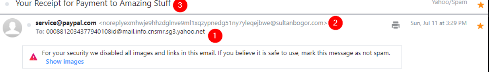

# Real-World Phishing Attachment and URL Analysis

## Objectives

- Examine **real-world phishing emails** to identify common deception techniques.
- Recognize indicators like **spoofed addresses**, **URL obfuscation**, **malicious attachments**, and **social engineering triggers**.
- Understand how attackers use **urgency**, **fake branding**, and **tracking mechanisms** to lure victims.
- Learn how to **safely analyze** email headers, hyperlinks, and attachments for signs of compromise.

---

## Tools Used

- VM: [https://tryhackme.com/room/phishingemails2rytmuv](https://tryhackme.com/room/phishingemails2rytmuv)
- **Email clients (Thunderbird, Outlook)** — to open `.eml` samples and inspect headers/body.
- **View Source / Raw Header** options — for full technical metadata (SPF/DKIM/Return-Path).
- **CyberChef** — for decoding Base64 text and deobfuscating embedded HTML or encoded URLs.
- **VirusTotal / Any.Run** — to sandbox malicious attachments or verify domains and hashes.
- **URL Expander tools** — to reveal shortened links (Bit.ly, TinyURL) and confirm redirect targets.
- **WHOIS / ARIN** — to trace IP ownership and domain registration details.

---

# [Investigation]

# Task 2: Cancel your PayPal order

**Techniques shown in this email sample**

- Spoofed email address
- URL shortening service
- HTML used to impersonate a legitimate brand (PayPal)

**Quick observations**

- Recipient address is unusual and **does not match** the Yahoo account — obvious red flag.
- `service@paypal.com` (displayed sender) **does not match** actual sender `gibberish@sultanbogor.com` — spoofing.
- Subject suggests a purchase/transaction to create **urgency** and prompt interaction.

**Email body**

- Designed to look like an official PayPal message (HTML impersonation).
- No attachments.
- Single interactive element: **“Cancel the order”** button/link.
    
    
    

**Hyperlink analysis**

- The link uses a **URL shortener** — dangerous without expanding first.
- When expanded via an online tool, the shortened link **redirects to google.com**.
    
    
    

**Note**

- Tools and methods to expand shortened URLs will be covered later (Phishing Emails 3).

## Answer the questions below

### What phrase does the gibberish sender email start with?

Answer: `noreply`

---

# Task 3: Track your package

**Techniques shown in this email sample**

- Spoofed email address
- Pixel tracking
- Link manipulation

**Quick observations**

- Email appears to come from a **fake mail distribution center**.
- **Subject line** includes a tracking number to look convincing.
- Link in the **email body matches** the fake tracking theme.

**Important note**

- Yahoo **blocked images** from auto-loading — a security measure to prevent pixel tracking.
- Hovering over the link doesn’t reveal its destination since **Yahoo disabled clickable links** for safety.

**Email hyperlink analysis**

- The source code shows an image named **Tracking.png**, which is actually a **tracking pixel**.
- Tracking pixels secretly **send data back to the spammer’s server** (e.g., confirming if the user opened the email).

**Conclusion**

- Yahoo blocked the images because **tracking pixels are commonly used by spammers**.
- The hyperlink points to a **shady, suspicious domain**, likely related to **malware distribution**.

## Answer the questions below

### What is the root domain for each URL? Defang the URL.

Answer: `devret[.]xyz`

---

# Task 4: Select your email provider to view document

**Techniques shown in sample**

- Urgency
- HTML impersonation of legitimate brands (OneDrive / Adobe / SharePoint)
- Link manipulation / redirects
- Credential harvesting (phishing form that captures credentials)
- Poor grammar / typos

**Quick observations**

- Sent date: **Thursday, July 15, 2021**.
- Uses **urgency**: download link expires same day to pressure action.
- Victim clicks a “download fax” button → **redirected to a fake OneDrive page** (URL is **not** Microsoft-related).
- Page contains two buttons; either leads to another site crafted to **resemble Adobe**.
    
    
    
- Victim prompted to **sign in with an email provider**; victim chose **Outlook**.
    
    
    
    Tab title “Share Point Online”, which is a Microsoft product is shown to add legitimacy.
    
- Entered credentials are **captured by the attacker** (fake authentication—error shown regardless of credentials).
    
    
    
- Multiple **grammatical errors** present (indicator of phishing).
- Sample source: **Any.Run** (analysis available at the link below).
    
    Analysis: https://app.any.run/tasks/12dcbc54-be0f-4250-b6c1-94d548816e5c/#
    

## Answer the questions below

### This email sample used the names of a few major companies, their products, and logos such as OneDrive and Adobe. What other company name was used in this phishing email?

Answer: `citrix`

---

# Task 5: Please update your payment details

---

**This email sample will highlight the following techniques:**

- Spoofed email address
- Urgency
- HTML to impersonate a legitimate brand
- Poor grammar and/or typos
- Attachments

**Here are some quick observations about this email sample:**

- The email is made to appear from **Netflix Billing**, but the sender address is [**z99@musacombi.online**](mailto:z99@musacombi.online) (spoofed/mismatched sender).
- The message includes **urgency**: the account was **suspended**, prompting immediate action.
- The email body reinforces the **sense of urgency**.
    
    
    
- The body contains multiple **misspellings of “Netflix”** (typos); resembles typosquatting-like errors but no actual typosquatting here.
    
    
    
- The main instruction: the victim must **open the attached PDF** to update their Netflix account.
    
    
    
- The email lists a **phone number for “Netflix”** that is unusual for a US-based recipient.
    
    
    
- The attachment contains an **embedded link titled “Update Payment Account”**.
- Further attachment analysis will be covered in upcoming room.

## Answer the questions below

### What should users do if they receive a suspicious email or text message claiming to be from Netflix?

Article Link: https://www.consumeraffairs.com/news/police-warn-of-new-netflix-email-phishing-scam-121718.html

Answer: `forward the message to phishing@netflix.com`

---

# Task 6: Your recent purchase

This email sample will highlight the following techniques:

- Spoofed email address
- Recipient is BCCed
- Urgency
- Poor grammar and/or typos
- Attachments

**Here are some quick observations about this email sample:**

- The email is made to appear from **Apple Support**, but the sender's address is [**gibberish@sumpremed.com**](mailto:gibberish@sumpremed.com) (spoofed).
- The email was **BCCed** (not sent directly to the victim’s inbox); the recipient address looks like another **spoofed Apple-style** email.
- The message conveys **urgency** — action is required from the victim.
    
    
    
- Noticeable **typos** in sender/recipient addresses: **donoreply** and **payament**.
- The email has **no body** — it’s blank and **only contains an attachment**.
    
    
    
- Attachment type: **.DOT** (Microsoft Word template file).
- The attachment contains a **large image** made to resemble an **App Store receipt**.
    
    
    
- The embedded link in the attachment includes **Apple-related keywords** such as **apps** and **ios**.
    
    
    

## Answer the questions below

### What does BCC mean?

Answer: `Blind Carbon Copy`

### What technique was used to persuade the victim to not ignore the email and act swiftly?

Answer: `urgency`

---

# Task 7: DHL Express Courier Shipping notice

**This email sample will highlight the following techniques:**

- Spoofed email address
- HTML to impersonate a legitimate brand
- Attachments

**Here are some quick observations about this email sample:**

- The sender's email **doesn't match** the company being impersonated (**DHL**).
- The **subject line** implies there is a package DHL will ship for you.
- The **HTML** in the email body was designed to **look like it was sent from DHL**.
    
    
    
- The source code shows the "view the email as a web page" link **doesn't contain an actual destination URL**.
    
    
    
    
    
- The only interactive element is the **email attachment** (an **Excel** document).
    
    
    
- The attachment content is shown.
    
    
    
- The attachment **runs a payload that throws an error**.
    
    
    

## Answer the questions below

### What is the name of the executable that the Excel attachment attempts to run?

Answer: `regasms.exe`

---

# Conclusion

In this room, I analyzed various **phishing email samples**, each demonstrating different or overlapping techniques.

Some emails reused common tactics like **spoofed addresses, urgency, and fake branding**, while others introduced **new tricks** such as **pixel tracking** or **BCC recipients**.

The key takeaway:

- **Detecting phishing emails requires strong awareness and consistent training.**

**Additional Resources to Learn More:**

- https://www.knowbe4.com/phishing
- https://www.itgovernance.co.uk/blog/5-ways-to-detect-a-phishing-email
- https://cheapsslsecurity.com/blog/10-phishing-email-examples-you-need-to-see/
- https://phishingquiz.withgoogle.com/

---

# Lessons Learned

- **Spoofing and impersonation** remain the most common phishing tactics — attackers mimic brands like PayPal, Apple, Netflix, and DHL.
- **URL shorteners** hide real destinations; expanding them safely often exposes malicious redirect chains.
- **HTML-based emails** use fake layouts, logos, and login prompts to harvest credentials.
- **Pixel tracking** confirms active victims by recording email opens.
- **Urgency and fear tactics** (“Account Suspended”, “Payment Failed”) pressure victims into acting quickly.
- **Attachments** disguised as invoices or documents often carry **macros or hidden executables** (`.dot`, `.xls`, `.pdf`).
- **BCC and mismatched sender fields** are red flags in mass phishing campaigns.
- Analysts must **cross-verify sender authenticity**, **decode encoded strings**, and **defang links** before further examination.
- Continuous **user awareness training** is crucial—technical defenses alone cannot prevent human error.

# Socials

**Repository:** https://github.com/RahulCyberX/Phishing-Analysis

**Medium Article:** https://medium.com/@rahulcyberx/phishing-emails-in-action-tryhackme-c87e623f574e?source=your_stories_outbox---writer_outbox_published-----------------------------------------

**TryHackMe Profile:** https://tryhackme.com/p/0xRahuL

**Github Profile:** https://github.com/RahulCyberX