# Redline Memory Forensics, Timeline Analysis & IOC-Based Hunting

## Objectives

- Perform rapid endpoint triage with Redline’s **Standard Collector** and review imported artefacts (System Info, Processes, Services, Tasks, Event Logs, Downloads, Timeline).
- Identify persistence and attacker traces (scheduled tasks, event logs, file downloads), extract indicators, and validate findings.
- Build and apply **IOC Search** using IOC Editor (strings, size, hashes) to pinpoint malicious files and reduce noise.
- Confirm malware identities and artefact context (subsystem, device path, owners, hashes) from Redline hits.

## Tools Used

- VM: [https://tryhackme.com/room/btredlinejoxr3d](https://tryhackme.com/room/btredlinejoxr3d)
- **FireEye Redline**: Standard/Comprehensive/IOC Search collectors; Analysis Data views (System Information, Processes, Tasks, Services, Event Logs, File Download History, Timeline).
- **IOC Editor**: Create `.ioc` from strings, file size, hashes; generate and review IOC Reports in Redline.
- **Timeline utilities**: TimeWrinkles, TimeCrunches for scoped event review.
- **External validation**: Hash lookups (e.g., VirusTotal) to confirm filename/family.
- **Key artefacts examined**: Scheduled Tasks, Event Logs (System), File Download History, filesystem paths under user profiles and temp folders.

---

# Investigation

## Task 1: Introduction

### Redline for Memory Analysis

**Overview**

- **Purpose**: FireEye’s Redline is a tool for quick triage of potentially compromised Windows, Linux, or macOS endpoints, providing a high-level (30,000-foot/10 km) view of system activity.
- **Use Case**: Ideal when time is critical, offering faster analysis compared to detailed tools like Volatility.

**Capabilities**

- Collects registry data (Windows only).
- Gathers running processes.
- Captures memory images (pre-Windows 10).
- Retrieves browser history.
- Identifies suspicious strings.
- Additional features for comprehensive analysis.

**Interface**

- Features an intuitive GUI for easy navigation and detection of malicious activities.

**Installation**

- Run the MSI file and follow the straightforward installation process.

**Q1. Who created Redline?**

This was mentioned directly in the reading.

**Answer:** `FireEye`

---

## Task 2: Data Collection

**Data Collection Options**


- **Standard Collector**: Collects minimal data for quick analysis, completing in minutes. Preferred method for this task.
- **Comprehensive Collector**: Gathers extensive data for in-depth analysis, taking an hour or more.
- **IOC Search Collector** (Windows only): Collects data matching predefined Indicators of Compromise (IOCs) created in IOC Editor, useful for threat intelligence, incident response, or malware analysis.

**Using Standard Collector**

1. **Launch Redline**: Access via taskbar icon.
    
    
    
2. **Select Standard Collector**: Choose Windows as the target platform.
    
    
    
3. **Edit Script Configuration**: Adjust settings across five tabs:
    - **Memory**: Collect process listings, driver enumeration (Windows only). Uncheck Hook Detection and Acquire Memory Image.
        
        
        
    - **Disk**: Gather data on disk partitions, volumes, and file enumeration.
        
        
        
    - **System**: Collect machine/OS info, system restore points (pre-Windows 10), registry hives, user accounts (Windows/OS X), groups (OS X), prefetch cache (Windows).
        
        
        
    - **Network**: Capture network info and browser history (Windows, OS X, Linux) for investigating downloads and connections.
        
        [https://www.notion.so](https://www.notion.so)
        
    - **Other**: Collect data on services, tasks, and hashes.
        
        
        
4. **Save Collector**: Click "Browse" under "Save Your Collector To," select an empty folder (e.g., Analysis), and confirm with OK.
    
    
    
    
    
5. **Run Script**: Locate `RunRedlineAudit.bat` in the folder, run as Administrator. A command prompt will open, closing automatically after 15-20 minutes when collection completes.
    
    
    
    
    
6. **Import Data**: A new `AnalysisSession1.mans` file appears in the Sessions folder. Double-click to import into Redline for analysis.
    
    
    

**Note**: Ensure the save folder is empty to avoid conflicts. Adjust tab settings as shown in task content.

---

### 🔹 Questions

**Q1. What data collection method takes the least amount of time?**

→ Mentioned in the documentation.

**Answer:** `Standard Collector`

---

**Q2. You want to run granular data collection against specific indicators (domains, hashes, IPs, filenames). What method should you use?**

→ Found in the reading.

**Answer:** `IOC Search Collector`

---

**Q3. What script initiates the data collection process? (include extension)**

→ Located the file in the Redline directory → right-click → Properties → “Type of File.”

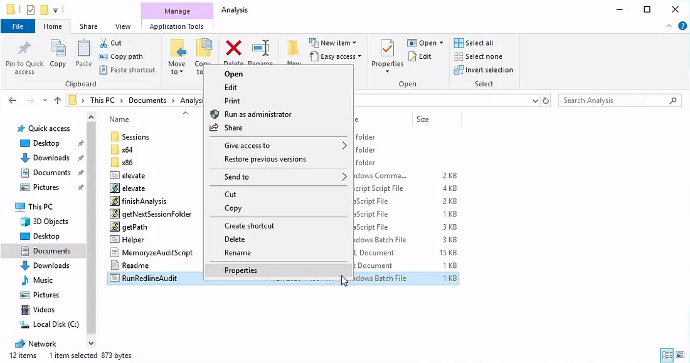

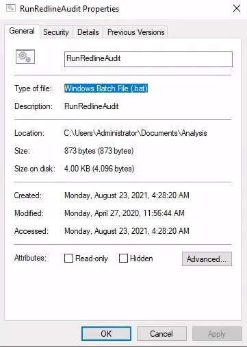

**Answer:** `RunRedlineAudit.bat`

---

**Q4. Under which option can you collect data on Disks and Volumes?**

→ While editing the script, the **Disk tab** clearly showed this section.


**Answer:** `Disk Enumeration`

---

**Q5. What is the default filename you receive as result of your Redline scan?**


**Answer:** `AnalysisSession1.mans`

---

## Task 3: The Redline Interface

**Importing Analysis Data**

File location: 

```
C:\Users\Administrator\Documents\Analysis\Sessions\AnalysisSession1
```

- Double-click the `AnalysisSession1.mans` file to import data into Redline (takes up to 10 minutes).
    
    
    
- The interface displays with **Analysis Data** on the left panel for investigation.
    
    
    

**Key Analysis Sections**

- **System Information**: Details on machine, BIOS (Windows only), OS, and user info.
- **Processes**: Includes attributes like Process Name, PID, Path, Arguments, Parent Process, Username. Subsections:
    - **Handles**: Tracks process connections to OS objects (e.g., files, registry keys).
    - **Memory Sections**: Highlights unsigned DLLs for closer inspection (legitimate DLLs are typically signed).
    - **Strings**: Displays captured string data.
    - **Ports**: Critical for detecting malware C2 connections. Check for suspicious outbound/inbound connections, especially from system processes like `explorer.exe` or `notepad.exe`, which shouldn’t initiate network activity.
- **Other Sections**:
    - **File System**: Not included in this session.
    - **Registry**: Analyze registry data.
    - **Windows Services**: Review running services.
    - **Tasks**: Check for scheduled tasks (common for threat actor persistence).
    - **Event Logs**: Investigate PowerShell events, logon/logoff, user creation, etc.
    - **ARP and Route Entries**: Not included in this session.
    - **Browser URL History**: Not included in this session.
    - **File Download History**: Track downloaded files.

**Timeline Analysis**


- **Function**: Tracks file actions (created, changed, modified, accessed) to understand compromise timeline and attacker escalation steps.
- **TimeWrinkles™**: Filters timeline to events around a specific time of compromise.
    
    
    
    
    
- **TimeCrunches™**: Hides repetitive events within a specified minute to reduce irrelevant data.
    
    
    
    
    

**Reference**

- Redline User Guide: [https://fireeye.market/assets/apps/211364/documents/877936_en.pdf](https://fireeye.market/assets/apps/211364/documents/877936_en.pdf)

**Q1. Where can you view information about the Logged-in User?**

→ On the left panel: **System Information** → look at **User Information** on the right, near the bottom.


**Answer:** `System Information`

---

## Task 4: Standard Collector Analysis


After loading my analysis data, I began investigating key evidence from the compromised workstation.

File location: 

```
C:\Users\Administrator\Documents\Analysis\Sessions\AnalysisSession1
```

---

**Q1. Provide the Operating System detected for the workstation.**

→ Found in **System Information**.

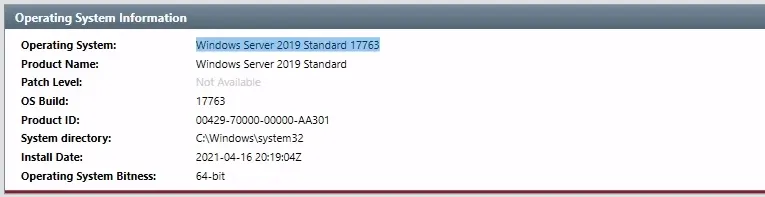

**Answer:** `Windows Server 2019 Standard 17763`

---

**Q2. What is the suspicious scheduled task that got created on the victim’s computer?**

→ Went to the **Tasks** section on left → Filtered for **SCHED_S_TASK_READY** in “Status” column for finding out active scheduled tasks:


→ Scrolled down until I noticed a strange entry that stood out.

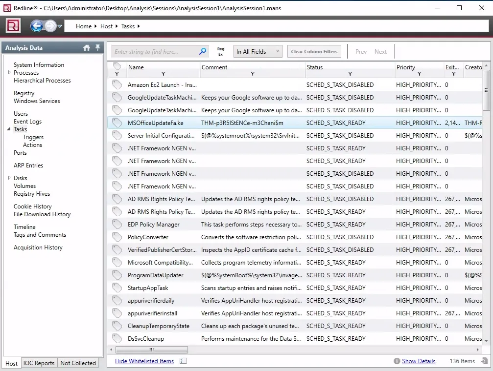

**Answer:** `MSOfficeUpdateFa.ke`

---

**Q3. Find the message that the intruder left for you in the task.**

→ Looked inside the same task under the “Comment” section.


**Answer:** `THM-p3R5IStENCe-m3Chani$m`

---

**Q4. There’s a System Event with Source Name “THM-Redline-User” and Type “ERROR”. Find its Event ID.**

→ Opened **Event Logs** → searched for `"THM-Redline-User"` in the search bar.

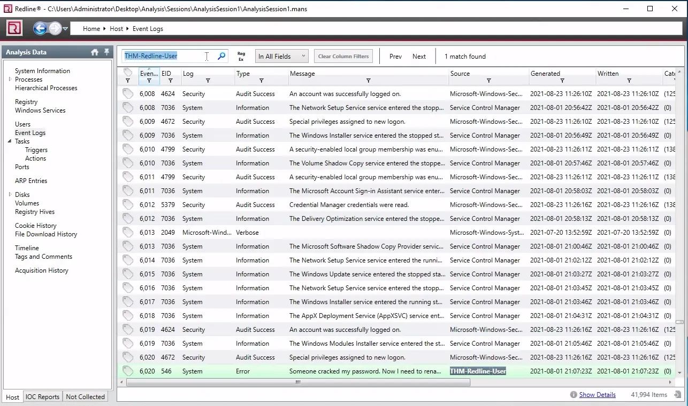

**Answer:** `546`

---

**Q5. Provide the message for the Event ID.**

→ Double-clicked the log to view its details.

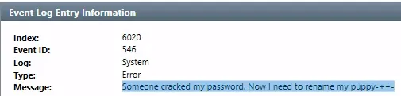

**Answer:** `Someone cracked my password. Now I need to rename my puppy-++-`

---

**Q6. The intruder downloaded a file containing the flag. Provide the full URL.**

→ Went to **File Download History** → found a suspicious filename `flag.txt`.

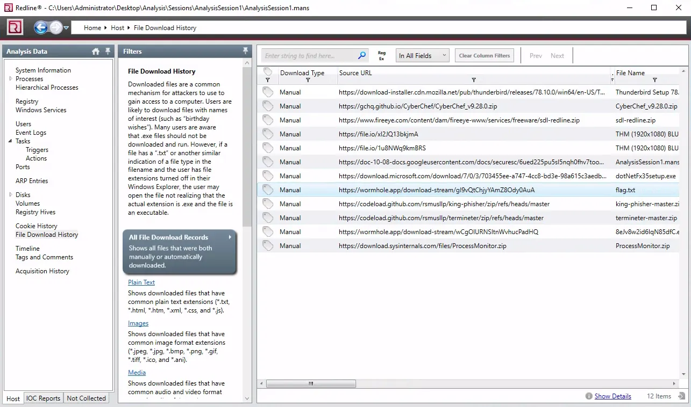

**Answer:** `https://wormhole.app/download-stream/gI9vQtChjyYAmZ8Ody0Au`

---

**Q7. Provide the full path to where the file was downloaded (include filename).**

→ Double-clicked the entry to open details → copied the complete path.

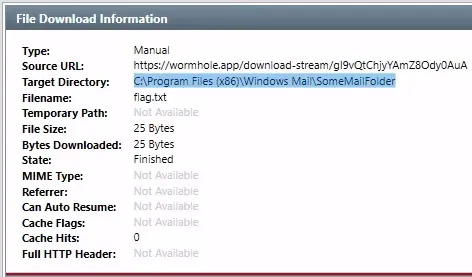

**Answer:** `C:\Program Files (x86)\Windows Mail\SomeMailFolder\flag.txt`

---

**Q8. Provide the message the intruder left for you in the file.**

→ Navigated to the same path via File Explorer → opened `flag.txt`.

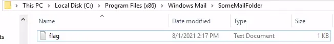

**Answer:** `THM{600D-C@7cH-My-FR1EnD}`

---

# Task 5 – IOC Search Collector

**Indicators of Compromise (IOCs)**

- **Definition**: Artifacts indicating potential system/network compromise, e.g., MD5/SHA1/SHA256 hashes, IP addresses, C2 domains, file sizes, filenames, file paths, registry keys.
- **Tool**: FireEye’s **IOC Editor** creates IOC files. Supports Windows 7 (use OpenIOC Editor for Windows 10). Guide: [IOC Editor User Guide](https://fireeye.market/assets/apps/S7cWpi9W//9cb9857f/ug-ioc-editor.pdf).

**Using IOC Editor**

- **Setup**: Launch IOC Editor (taskbar icon, ~60s to start). Create an empty IOC Directory.
    
    
    
- **Creating IOC File** (Example: Keylogger.ioc):
    
    
    
    - **Editable Fields**: Name (e.g., Keylogger), Author (e.g., RussianPanda), Description.
        
        
        
    - **Non-Editable Fields**: GUID, Created, Modified (auto-populated).
    - **Adding IOCs**: Under "Add" section, include:
        - File Strings: `psylog.exe`, `RIDEV_INPUTSINK`
        - File MD5: `791ca706b285b9ae3192a33128e4ecbb`
        - File Size: `35400`
    - **Process**: Select item, enter value in Content field, add comments if needed, and save.
        
        
        
        
        
        
        
        Right-click items for additional options.
        
        
        

**IOC Search Collector in Redline**


- **Purpose**: Collects data matching IOCs from an .ioc file, ignoring non-matching data. Additional data collection is optional.
- **Steps**:
    1. Relaunch Redline, close IOC Editor.
    2. Click "Browse" to select the .ioc file (auto-detected in Indicators section).
        
        
        
    3. Review **Supported** (recognized by Redline) and **Unsupported** (no hits) search terms.
    4. Click "Next," then "Edit your script" to configure data collection (e.g., Keylogger IOC settings).
        
        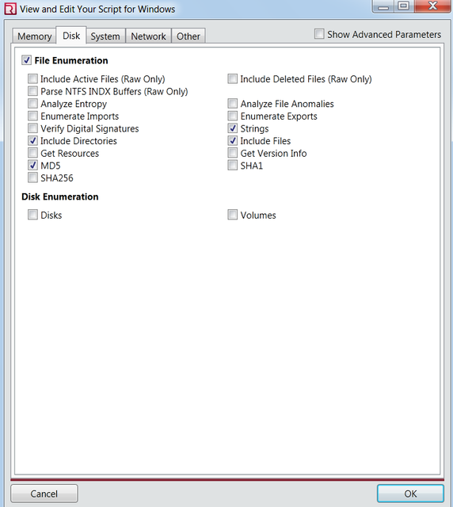
        
        **Note** : When you configure your own IOC Search, you will choose different settings for your script compared to the settings above. 
        
    5. Save to an empty folder via "Browse" under "Save Your Collector To" (creates `RunRedlineAudit.bat`).
    6. Run the .bat file as Administrator; analysis takes 15-20 minutes.
        
        
        
    7. Open the resulting `AnalysisSession1.mans` file in Redline by double-clicking.

- **IOC Report**:
    - If not auto-generated, create manually via "Create a New IOC Report" and import the .ioc file.
        
        
        
    - From the screenshot, I can see that there was one hit on "chrome.dll", this is a false positive. Let's review  the details below.  Review "Hits" in the report. Expand entries to view details.
    - **Example**: A hit on `chrome.dll` (matching `RIDEV_INPUTSINK`) was a false positive. Accurate IOCs reduce false positives.
        
        
        
        The DLL file matched with the string "RIDEV_INPUTSINK" that we had in our .ioc file. It's important to gather granulated and accurate artifacts to add to your IOC file to avoid false positives. 
        
    - Files with multiple hits are likely the target (see screenshot below).
        
        
        

**Tips**:

- Use precise IOCs to avoid false positives.
- Refer to screenshots for guidance and perform similar actions in the next task.

---

### Key Findings:

- **Actual filename:** `psylog.exe`
- **Masquerading filename:** `THM1768.exe`
- **Owner of file:** `WIN-2DET5DP0NPT\charles`
- **File size:** `35400 bytes`
- **IOC file path (with filename):**
    
    `C:\Users\charles\Desktop\Keylogger-IOCSearch\IOCs\keylogger.ioc`
    

---

# Task 6 – IOC Search Collector Analysis


**Scenario:** You are assigned to do a threat hunting task at Osinski Inc. They believe there has been an intrusion, and the malicious actor was using the tool to perform the lateral movement attack, possibly a "pass-the-hash" attack.

**Task:** Can you find the file planted on the victim's computer using IOC Editor and Redline IOC Search Collector?

So far, you only know the following artifacts for the file:

File Strings:

```
- 20210513173819Z0w0=
- <?<L<T<g=
```

File Size (Bytes):

```
834936
```

**Note:** Use the existing Redline Session found in: 

```
C:\Users\Administrator\Documents\Analysis\Sessions\AnalysisSession1
```

---

### Steps I Followed:

1. I **loaded the existing analysis** (it took about 15–20 minutes to open).
    
    
    
2. While the analysis was loading, I created a new IOC according to the new parameters. The instructions were covered in the reading in the previous Task 5.
    
    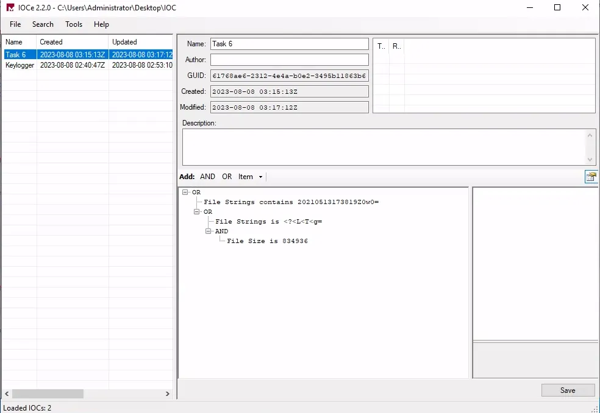
    
3. When the analysis is loaded, and I am done creating the new IOC file, I will go back to the analysis. 
    
    At the bottom left, click on IOC Reports and then “Create a New IOC Report”.
    
    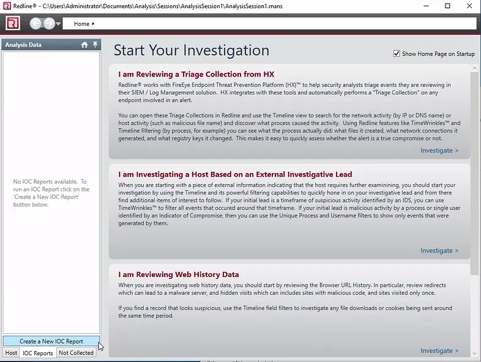
    
4. Loaded the IOC folder that has the IOC file inside.
    
    
    
5. I ensured the IOC file had a ✅ checkmark and generated the report.
    
    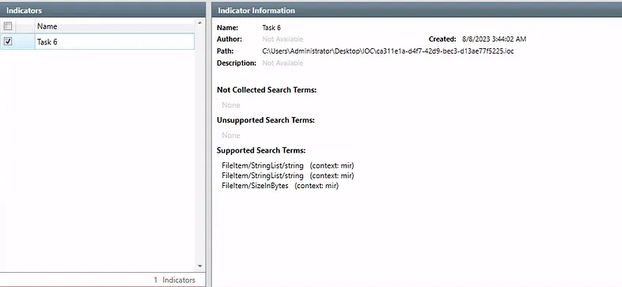
    
6. After the analysis completed, I clicked **View Hits** to check the results.
    
    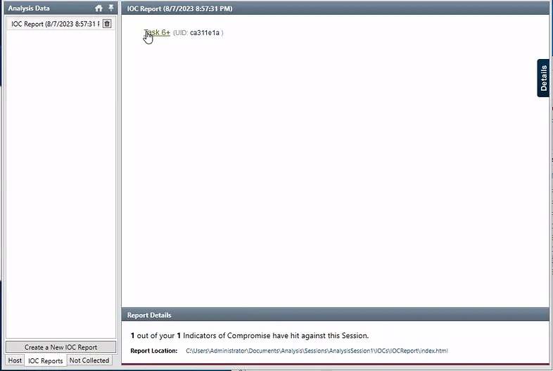
    
    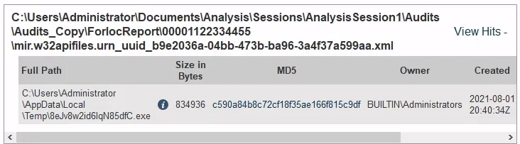
    
7. I explored this **Details tab** for subsystem, device path, hash, and original filename.

---

### Key Findings:

- **File path (with filename):**
    
    `C:\Users\Administrator\AppData\Local\Temp\8eJv8w2id6IqN85dfC.exe`
    
- **File path (without filename):**
    
    `C:\Users\Administrator\AppData\Local\Temp`
    
- **File owner:** `BUILTIN\Administrators`
- **Subsystem:** For this one, clicked on Details tab on the right.
    
    
    
    If nothing loads, click the information icon next to the hit.
    
    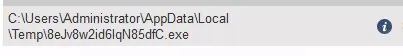
    
    I was presented with more details, one of them told me about the Subsystem.
    
    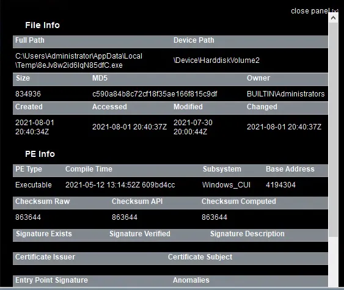
    
    Answer: `Windows_CUI`
    
- **Device path:** In the same details tab I find this: `\Device\HarddiskVolume2`
- **SHA-256 hash:** There wasn't any SHA256 that was given, so I used the MD5 hash and searched it up on [VirusTotal](https://www.virustotal.com/gui/home/upload). Went to the Details tab and found the hashes.
    
    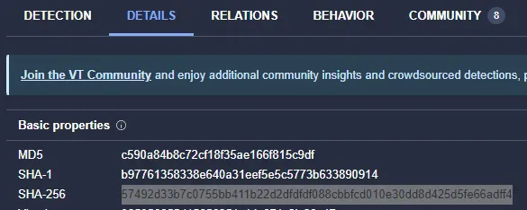
    
    `57492d33b7c0755bb411b22d2dfdfdf088cbbfcd010e30dd8d425d5fe66adff4`
    
- **Real filename (after hash lookup):**
    
    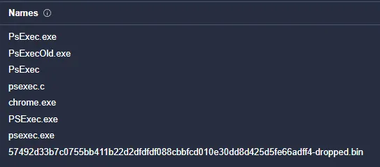
    
    Answer: `psexec.exe`
    

---

# Task 7 – Endpoint Investigation


**Scenario:** A Senior Accountant, Charles, is complaining that he cannot access the spreadsheets and other files he has been working on. He also mentioned that his wallpaper got changed with the saying that his files got encrypted. This is not good news!

**Task :**

- Navigate to the folder on your **Desktop** titled **Endpoint Investigation**.
- Double-click on the *AnalysisSession1.mans*  file. The data will be imported automatically into Redline.
- Analyze the file to answer the questions below.

**Note:** Give it up to 10 minutes for all the data import.

---

### 1. Can you identify the product name of the machine?

1. I **loaded the Endpoint Investigation analysis file** from the Desktop.
2. Under **System Information**, I found the Windows product details.
    
    
    
    **Product Name:** `Windows 7 Home Basic`
    

### 2. Can you find the name of the note left on the Desktop for the "Charles"?

1. I went to **File System** at the left hand side, from there I expanded the menu until I got to his **desktop**. 
    
    
    
2. I then found a weird .txt file name. Double clicked it to get more details.
    
    
    
    
    
    **Ransom note filename:** `_R_E_A_D___T_H_I_S___AJYG1O_.txt`
    

### 3. Find the Windows Defender service; what is the name of its service DLL?

1. I then checked **Windows Services** tab and searched for “Windows Defender” and got one result.
    
    
    
2. Double clicked to find an answer.
    
    
    
    **Windows Defender service DLL:** `MpSvc.dll`
    

### 4. The user manually downloaded a zip file from the web. Can you find the filename?

1. I checked the **File Downloaded History** tab on the left side and used the search function. Unfortunately, it didn’t give me anything. So, I then just organized the list by “Download Type” column and I found the Manual download entry.
    
    
    
    
    
    **Manually downloaded zip:** `eb5489216d4361f9e3650e6a6332f7ee21b0bc9f3f3a4018c69733949be1d481.zip`
    

### 5. Provide the filename of the malicious executable that got dropped on the user's Desktop.

1. I went back to check the desktop and I did find an .exe file.
    
    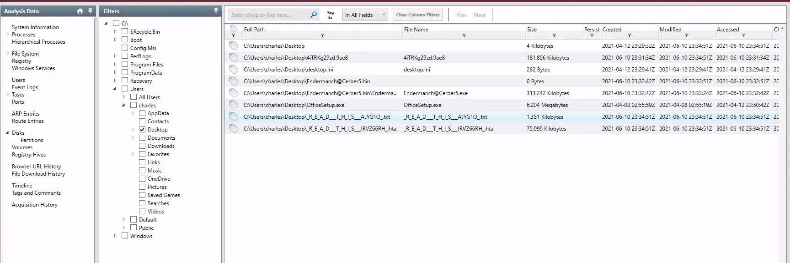
    
    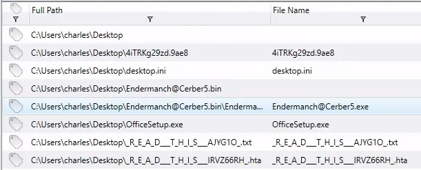
    
    **Dropped malicious executable:** `Endermanch@Cerber5.exe`
    

### 6. Provide the MD5 hash for the dropped malicious executable.

1. I went back to File Download History to grab the URL and I posted it in VirusTotal but I found nothing.  I grabbed the .zip file name and searched it on VirusTotal, but again nothing.
    
    So, I clicked on the “Timeline” tab, and searched the name of the .exe which was `Endermanch@Cerber5.exe`. 
    
    
    
    I saw that it had MD5 in some of the results, which seemed promising. So I double clicked on it to open the detailed view and copied the MD5 hash. 
    
    
    
    **MD5 hash:** `fe1bc60a95b2c2d77cd5d232296a7fa4`
    

### 7. What is the name of the ransomware?

1. I uploaded file hash to **VirusTotal** to confirm malware identity.
    
    I went to Details tab and then look at the names. I saw Cerber pop up often and the google search confirmed that it’s a ransomware.
    
    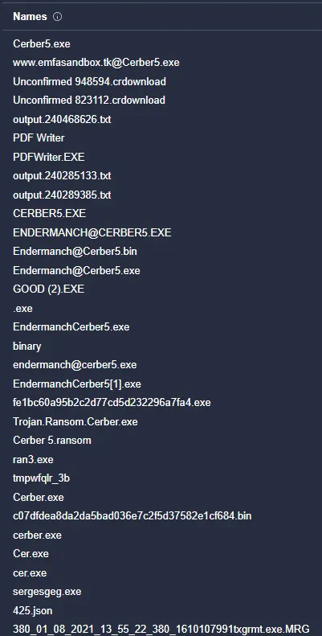
    
    **Ransomware name:** `Cerber`
    

---

- Redline User Guide: [https://fireeye.market/assets/apps/211364/documents/877936_en.pdf](https://fireeye.market/assets/apps/211364/documents/877936_en.pdf)
- IOC Editor User Guide: [https://fireeye.market/assets/apps/S7cWpi9W//9cb9857f/ug-ioc-editor.pdf](https://fireeye.market/assets/apps/S7cWpi9W//9cb9857f/ug-ioc-editor.pdf)

---

# Lessons Learned

- **Use Standard Collector for speed** and quick wins; it generates `AnalysisSession1.mans` for immediate review.
- **Focus on high-signal views** first: Tasks (persistence like `MSOfficeUpdateFa.ke`), Event Logs (custom sources/ERRORs), and File Download History (URLs, save paths).
- **IOC search shines with precise indicators** (strings + exact size) to surface disguised tools (e.g., `psexec.exe`) and cut false positives.
- **Timeline + TimeWrinkles/TimeCrunches** quickly isolates change bursts around compromise, aiding sequence reconstruction.
- **Substantiating with hashes and context** (owner, subsystem, device path) turns a hit into defensible evidence and enables intel enrichment.
- **Cross-check malware via reputation** (hash → family like Cerber) to confirm naming and guide response.

# Socials

**Repository:** https://github.com/RahulCyberX/Digital-Forensics-Incident-Response

**Medium Article:** https://medium.com/@rahulcyberx/redline-complete-tryhackme-walkthrough-1041405f3a3f?source=your_stories_outbox---writer_outbox_published-----------------------------------------

**TryHackMe Profile:** https://tryhackme.com/p/0xRahuL

**Github Profile:** https://github.com/RahulCyberX