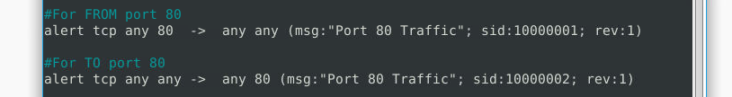
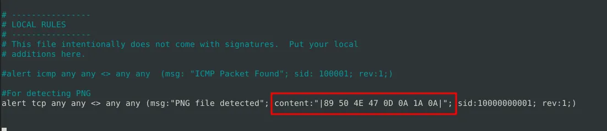

# Snort: Analyze live capture network traffic

## Objectives

- Practice creating **custom Snort IDS rules** and replaying **.pcap** traffic.
- Detect and validate traffic for **HTTP (80/tcp)**, **FTP (21/tcp)**, and **file signatures** (PNG/GIF), plus **torrent metafiles**.
- Enrich alerts by extracting **session/host details** (IPs, ports, TTL, SEQ/ACK) and **application artifacts** (service banners, file headers, encodings).
- Build specialty rules for **failed/successful FTP auth**, **GIF/PNG magic**, **torrent indicators**, **IPC$ keyword**, **payload sizes**, and **base64 beaconing**.

## Tools Used

- **Snort** (custom rules, offline pcap analysis: `r`, logging: `l`, full alerts: `A full`)
- **nano** (rule editing), **strings/grep/less** (log triage), **CyberChef / base64decode** (decoding)
- Terminal basics (`rm` for log resets, filters on `snort.log.*`)

Virtual Machine Provided in: https://tryhackme.com/room/snortchallenges2

# Investigation

This project is all about practicing Snort by writing custom IDS rules and analyzing `.pcap` traffic captures. 

## Writing IDS Rules (HTTP)

I open the folder which has a captured traffic, and then i make a rules file called local.rules which i can use as config when reading the example traffic capture. 

I open the local.rules file using `nano local.rules` and write this code so that I can detect all TCP packets from or to port 80:



But we can do this in a single line so let’s do this instead:


After that I run this command to run snort for analyzing this captured traffic packet and use my filter


- `c local.rules` → use my rules file
- `A full` → print full alert output
- `l .` → log to current directory
- `r mx-3.pcap` → read packets from the capture file

Once the analysis is done I can clearly see the number of packets it detected:


So, the total number of detected packet is = 60. 

To analyze a specific packet X, where X = 63 (for example), we need to filter the traffic of packet 63 only in our log that we got after analyszing this traffic packet.


After the analysis we can easily see these details as well:


- Source address: `145.254.160.237`, source port `3371`
- Destination address: `216.239.59.99`, source port `80`
- TTL of packet 63: `128`
- SEQ number: `0x36C21E28`
- ACK number: `0x2E6B5384`

## Writing IDS Rules (FTP)

For this i am gonna analyze a different traffic packet and detect “all TCP port 21” traffic. 


And now I am gonna run snort for analyze this pcap.


Let’s read it’s log file to find out the FTP service name, by using the `strings` command, which can be combined with `grep` too. 


Service name = Microsoft FTP Service.

Now i am gonna do some interesting detentions using the status codes. 

### Rule to detect Failed FTP logins:

First i am gonna remove previous logs using `sudo rm -f snort.log.*` and then use the nano text editor to add the following rule:


Failed Login attempts = **41**

### Rule to detect Successful FTP logins:


Successful Logins = 1

### Rule to detect FTP login attempts with Valid username but no/bad password:

```jsx
alert tcp any 21 -> any any (msg:"FTP login no pass";content:"331";sid:1000007;rev:1;)
```

### Rule to detect FTP login attempts with “Administrator” username but no/bad password:

```jsx
alert tcp any 21 -> any any (msg:"FTP admin no pass";content:"331";content:"Administrator";sid:1000008;rev:1;)
```

Status code: 

- `530` (Not logged in)
- `230` ****(User logged in, proceed)
- `331`  (Username okay, need password)

## Writing IDS Rules (PNG/GIF)

Here I detect image files using **magic numbers** (file signatures).

PNG files start with hex: `89 50 4E 47 0D 0A 1A 0A`

GIF magic hex: 

- `47 49 46 38 39 61` (`GIF89a`) or
- `47 49 46 38 37 61` (`GIF87a`).



Then run:

```jsx
sudo snort -r ftp-png-gif.pcap -c local.rules -l .
```


There is one PNG file, lets find our the software name embedded in it:

```jsx
sudo strings snort.log.1757949848 | less
```


Now I am gonna write rule to detect the GIF file in the given pcap and identify the image format it’s embedded in by investigating the logs. 

GIF magic hex: `47 49 46 38 39 61` (`GIF89a`) or `47 49 46 38 37 61` (`GIF87a`). 

It’s possible to just match prefix `|47 49 46 38|` to match either, then during investigation I can confirm the format easily. 


Let’s run snort:

```jsx
 sudo snort -r ftp-png-gif.pcap -c local.rules -l . 
```


As I can see, there’s 4 instances of a GIF image. To find their format I am gonna investigate the log file and use a `grep` command as well to search for the keyword “GIF” to see 


This confirms the format of GIF are: **GIF89a.**

## Writing IDS Rules (Torrent Metafile)

I can write a simple run to detect any torrent meta file by adding `.torrent` in the content section of the tcp alert rule. 

1. **Rule**:
    
    ```
    alert tcp any any <> any any (msg:".torrent file detected"; content:"torrent"; sid:1000000000009; rev:1;)
    ```
    
2. Run:

```jsx
sudo snort -r torrent.pcap -c local.rules -l .
sudo strings snort.log.<timestamp> | less
```

In the log file, we can easily find more info regarding the torrent, such as **torrent app name, MIME type, and hostname.**

## Miscellaneous Rules

[Source](https://www.jalblas.com/blog/thm-snort-challenge-the-basics-walkthrough/#task-7-using-external-rules-ms-17-010) for the screenshots below, as I forgot to take my own screenshots when I was doing it. 

1. A new rule to detect payloads containing the "\IPC$" keyword:

```jsx
alert tcp any any <> any any (msg:"Keyword found"; content:"\\IPC$"; sid:1000000000010; rev:1;)
```

(special char `\` must be escaped or hex)

OR

```jsx
alert tcp any any -> any any (msg: "Exploit Detected!"; content: "IPC$"; sid:1000001; rev: 1;)
```

1. To see how many rules were triggered:

Just below the alarm info I can see that there’s an another section called *Limits*. Under this section there are the number of events. This is equal to the number of triggered rules.


By scrolling further below I can find the info on the filtered events, such as **sids**


1. New rule to detect packet payloads between A and B bytes, for example between **770 and 855** bytes:

There are even examples, so the rule value would be dsize:770<>855;.

All together this will look like:

```jsx
alert tcp any any -> any any (msg:"Size between 770 and 855 bytes detected"; dsize:770<>855; sid:1000001; rev:1;)
```

1. A way to find name of the used encoding algorithm:

`snort -r snort.log.<timestamp> -dev`


1. A way to find the encoded command:

The base64 encoded command is found right after Base64/, still in the same packet:


To decode this encoded message, for conveince I just copied the string and pasted it in [https://www.base64decode.org/](https://www.base64decode.org/), the output:


### Lessons Learned

- **HTTP rule (port 80, both directions):**
    
    `alert tcp any any <> any 80 (msg:"HTTP any-80"; sid:1000001; rev:1;)`
    
    → Replayed `mx-3.pcap` produced **60 hits**; drilling logs surfaced per-packet **src/dst, ports, TTL, SEQ/ACK**.
    
- **FTP detection & auth outcomes (21/tcp):**
    - Service banner extraction via `strings` confirmed **Microsoft FTP Service**.
    - **Failures (530):** `alert tcp any any -> any 21 (msg:"FTP login failed"; content:"530"; sid:1000002; rev:1;)` → **41** events.
    - **Success (230):** `alert tcp any any -> any 21 (msg:"FTP login success"; content:"230"; sid:1000003; rev:1;)` → **1** event.
    - **User OK, need pass (331):** general and **Administrator**specific variants using dual `content`.
- **File-type fingerprinting with magic bytes:**
    - **PNG:** `|89 50 4E 47 0D 0A 1A 0A|` → one hit; `strings` exposed embedded **software tag**.
    - **GIF (either 87a/89a):** prefix `|47 49 46 38|` → **4** hits; logs showed **GIF89a**.
    - Pattern: constrain with **flow/file_data** (if using newer Snort) to reduce false positives.
- **Torrent metafile indicator:**
    
    `alert tcp any any <> any any (msg:".torrent file detected"; content:"torrent"; sid:1000009; rev:1;)`
    
    → Logs yielded **app name, MIME, host** for enrichment.
    
- **SMB/Exploit crumb:**
    
    `alert tcp any any <> any any (msg:"IPC$ seen"; content:"\\IPC$"; sid:1000010; rev:1;)`
    
    (Escape backslashes or use hex.) Useful for spotting **SMB admin share** touches.
    
- **Payload size heuristic:**
    
    `dsize:770<>855;` helped flag suspicious **beacon-sized** blobs:
    
    `alert tcp any any -> any any (msg:"770–855B payload"; dsize:770<>855; sid:1000011; rev:1;)`
    
- **Finding encodings & commands in payloads:**
    - `snort -r snort.log.<ts> -dev` surfaces **encoders** (e.g., `Base64/` markers).
    - Extract the blob after `Base64/` and decode (CyberChef / CLI) to recover the **command line**.
- **Workflow tips:**
    - **Reset logs** between runs (`rm -f snort.log.*`) to avoid stale counts.
    - Use **bi-directional operator** `<>` for symmetric protocols (HTTP detections in reply payloads too).
    - Prefer **unique SIDs**, increment **rev** when updating rules.
    - Narrow matches with **offset/depth** or **pcre** to cut noise; pair with **flow:to_server,established** when applicable.
- **Outcome:** Built a small, reusable **Snort playbook** covering service identification, auth state detection, file-type carving by signature, simple data-exfil/encoding clues, and SMB admin-share touches—plus a methodical log-triage routine to validate alerts against packet-level evidence.

## Socials

**Repository:** https://github.com/RahulCyberX/Network-Security-and-Traffic-Analysis

**Medium Article:** https://medium.com/@rahulcyberx/snort-challenge-the-basics-tryhackme-writeup-2025-64200ec0120e?source=your_stories_outbox---writer_outbox_published-----------------------------------------

**TryHackMe Profile:** https://tryhackme.com/p/0xRahuL

**Github Profile:** https://github.com/RahulCyberX
