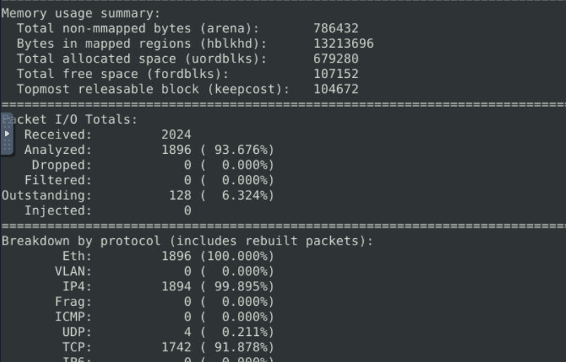

# Snort: Defending against a live attack

Virtual Machine Provided in: [https://tryhackme.com/room/snortchallenges2](https://tryhackme.com/room/snortchallenges2)

## **Objectives**

- Gained root access in the isolated TryHackMe VM and verified Snort installation to ensure full control over the lab environment.
- Captured live traffic in sniffer mode (-devX) and logged it to disk (-dev -l .) to build reusable packet logs for analysis.
- Used BPF filters and -A full to isolate SSH brute-force activity from 10.10.245.36 targeting port 22 (1452 packets).
- Identified outbound reverse shell from 10.10.196.55 to port 4444 by spotting bash commands and file paths in payloads.
- Created, tested, and deployed custom local.rules with unique sids to alert on both attacker IP and malicious port.
- Ran Snort with -A full for 60 seconds to trigger desktop flags and prove both attacks were successfully detected and mitigated.

## Tools Used

- **Snort** (-devX, -dev -l ., -r <log>, -A console, -A full, BPF filters)
- **sudo -i** (root shell for everything)
- **nano** (editing /etc/snort/rules/local.rules)
- **ls -1 & cat** (finding and peeking snort.log.* timestamps)
- **Ctrl+C timing** (15–60 second bursts to keep logs manageable)

# **Investigation**

## Prep (one time)

1. I start the TryHackMe VM and open a terminal.
    - Why: everything is done from the target VM’s terminal.
2. I become root or use `sudo` on every Snort command (most require root):
    
    ```bash
    sudo -i
    ```
    
    - Why: Snort and editing system rules need elevated privileges.
3. I check Snort is installed and in my PATH:
    
    ```bash
    which snort
    snort -V
    ```
    
    - Expect: path and Snort version. If missing, install via lab instructions.

---

## Quick Snort option cheatsheet

- `d` → dump payload (show application data)
- `e` → show link-layer headers
- `v` → verbose output
- `X` → HEX + ASCII of packets
- `r <file>` → read a previously logged snort log/pcap
- `l .` → write log files to current directory (`snort.log.<ts>`)
- `A console` → show alerts on console (good for testing rules)
- `A full` → print full alert details

---

# SCENARIO 1 — SSH BRUTE-FORCE

### Step 1 — Observe / capture traffic (sniffer)

1. I run Snort in sniffer mode (show everything) for 10–15 seconds to see live traffic:
    
    ```bash
    sudo snort -devX
    ```
    
    - What I see: packets streaming in HEX + ASCII. I watch for repeated attempts to same destination port or host.
    - Why: `devX` gives me headers, payloads and hex so I can identify protocol and payload strings.
2. I stop the sniffer (Ctrl+C) after ~22s because I want a manageable capture to analyze.



Analyzed about 1896 packets. 

1. Alternatively I log to disk for longer inspection:
    
    ```bash
    sudo snort -dev -l .
    ```
    
    - I stop it after 10+ seconds.
    - This creates a `snort.log.<timestamp>` file in current dir.
    
    
    
    - Why: easier to re-read and filter later.

### Step 2 — Inspect the capture / find suspicious host and service

1. I read the stored log (full detail):
    
    ```bash
    sudo snort -r snort.log.1758024278 -A full
    ```
    
    - What I look for: many similar lines where destination port is `22` or packets involving SSH negotiation strings.
    
    
    
    - There are quite a few instances such like this where I see a lot of traffic running from a particular host and keep connecting to **port 22**.
    - Why it matters: repeated connections to port 22 = brute force.
2. Focus with BPF (Berkeley Packet Filter) so output is manageable:
    
    ```bash
    sudo snort -r snort.log.<timestamp> 'tcp and port 22'
    ```
    
    - Why: this shows only TCP traffic on port 22. If I see hundreds of hits, that's brute force.
        
        
        
    - This returns 1452 packets, which is quite a relatively large chunk of the total traffic.
3. Filter by host suspected as attacker:
    
    ```bash
    sudo snort -r snort.log.<timestamp> 'host 10.10.245.36'
    ```
    
    - Why: confirms how many packets involve that IP. If it’s a large share, that IP is likely the attacker.
    
    
    
    - This shows a total of 1452 packets are involved with the attacker machine, and we can probably conclude that all of these are connecting to the SSH service.
4. What I found: 


Many packets from `10.10.245.36` interacting with SSH service (TCP/22), back and forth. 

Conclusion: `10.10.245.36` is the brute-force source; service under attack = **SSH**; protocol/port = **TCP/22**.

> Quick note on TCP flags I check while scanning -A full output:
> 
> - `S` = SYN, `SA` = SYN/ACK, `A` = ACK, `PA` = PSH+ACK (data sent).
> - Repeated SYNs or many completed handshakes to same service indicate brute force.

### Step 3 — Create rule to detect / block

> Now I have to create a rule and run Snort with -A full so the environment registers the mitigation and creates a desktop flag. I follow that.
> 
1. Backup the rules file first:
    
    ```bash
    sudo cp /etc/snort/rules/local.rules /etc/snort/rules/local.rules.bak
    ```
    
    - Why: safe to restore if something goes wrong.
2. Edit the Snort local rules file (I use nano; use what’s available):
    
    ```bash
    sudo nano /etc/snort/rules/local.rules
    ```
    
    - I add this line **exactly** (one rule):
    
    ```
    alert tcp 10.10.245.36 any -> any 22 (msg:"Traffic originating from suspicious host"; sid:100001; rev:1;)
    ```
    
    
    
    - Why each part:
        - `alert` → generate an alert (lab flow expects this).
        - `tcp` → protocol to match.
        - `10.10.140.29 any` → match packets originating from attacker IP, any source port.
        - `> any 22` → destined to any IP on port 22 (SSH).
        - `(msg:"..."; sid:100001; rev:1;)` → human message and unique rule ID.
3. Save and exit (`Ctrl+O`, Enter, `Ctrl+X`).
4. Test the rule in console mode (quick verification):
    
    ```bash
    sudo snort -c /etc/snort/rules/local.rules -A console
    ```
    
    - What I expect: alerts stream to console showing my `msg` when 10.10.140.29 hits port 22.
    - If no alerts: I will re-check IP, use `sudo snort -r snort.log.<timestamp> -A full` to verify logs still show hits; and then readjust the rules as needed.
5. Run Snort with `A full`  and leave running for ~60 seconds:
    
    ```bash
    sudo snort -c /etc/snort/rules/local.rules -A full
    ```
    
    - Why `A full`: prints detailed alerts
    

---

# SCENARIO 2 — REVERSE SHELL (OUTBOUND)

### Step 1 — Observe outbound traffic

1. Start sniffer again (short run):
    
    ```bash
    sudo snort -devX
    ```
    
    - I watch for long ASCII payloads with shell prompts (`/home/`, `ls`, file paths) being sent out, or repeated outbound connections to the same remote port.
    
    
    
    The host `10.10.196.55` has been showing  payloads similar to a shell interface which is a good sign of a reverse shell.
    
2. Stop after ~15s (Ctrl+C).
3. Log to disk and re-read for filtering:
    
    ```bash
    sudo snort -dev -l .
    ls -1 snort.log.*
    sudo snort -r snort.log.<timestamp> -A full
    ```
    

4. Filter for suspicious ports often used by reverse shells (example: 4444):

```bash
sudo snort -r snort.log.<timestamp> 'tcp and port 4444'
```

- Why: Metasploit commonly uses `4444` for reverse shells; seeing interactive shell-like payloads and PSH/ACK flags going out to port 4444 is strong evidence of a reverse shell.


There are several instances of connection back and forth **port 4444** by the internal host `10.10.196.55`.

1. Inspect the payloads (look at ASCII in `A full` or `X` output):
    
    ```jsx
    sudo snort -r snort.log.1758036674 'tcp and port 4444' -devX
    ```
    
    - Look for shell prompt characters, commands, filenames, or `bash` strings.
    
    
    
    - There are also filepaths, bash strings, commands, etc in the payloads in several instances.
2. Determined the attacking internal host (example observed): `10.10.196.55` connecting out to remote port `4444`.
    - Conclusion: outbound reverse shell activity; protocol/port = `TCP/4444`.

### Step 2 — Create rules to detect / stop

> Lab expects an alert and running -A full to detect. I follow that.
> 
1. Backup rules again (if I hadn’t):
    
    ```bash
    sudo cp /etc/snort/rules/local.rules /etc/snort/rules/local.rules.bak2
    ```
    
2. Edit rules:
    
    ```bash
    sudo nano /etc/snort/rules/local.rules
    
    ```
    
    - I add two rules (one for host, one for port). Exact lines:
    
    ```
    alert tcp 10.10.196.55 any -> any any (msg:"Traffic from malicious host"; sid:100002; rev:1;)
    alert tcp any any -> any 4444 (msg:"Potential Reverse Shell on Port 4444"; sid:100003; rev:1;)
    ```
    
    
    
    - Why both:
- Host-based rule: immediate capture of traffic from a confirmed compromised host.
- Port-based rule: catches reverse shells even if the internal host IP changes.
1. Save and exit.
2. Test rules in console mode:
    
    ```bash
    sudo snort -c /etc/snort/rules/local.rules -A console
    ```
    
    
    
    - Rules working as expected and alert hits printed when traffic to/from these matches occurs.
3. Run `A full` 
    
    ```bash
    sudo snort -c /etc/snort/rules/local.rules -A full
    ```
    
4. Stop Snort (Ctrl+C).

## Lessons Learned

- Always sudo -i first; Snort won’t work otherwise.
- Log to disk instead of staring at live packets forever.
- 15–20 second captures are perfect—longer just creates noise.
- Backup local.rules every time; one typo = restart.
- Write two rules (IP + port) so you’re covered even if the attacker changes address.
- A console for testing, -A full for flags—never mix them up.

## Socials

**Repository:** https://github.com/RahulCyberX/Network-Security-and-Traffic-Analysis

**Medium Article:** https://medium.com/@rahulcyberx/snort-challenge-live-attacks-tryhackme-walkthrough-write-7b6f1c7a4e9e?source=your_stories_outbox---writer_outbox_published-----------------------------------------

**TryHackMe Profile:** https://tryhackme.com/p/0xRahuL

**Github Profile:** https://github.com/RahulCyberX