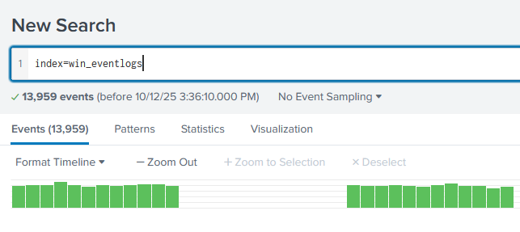
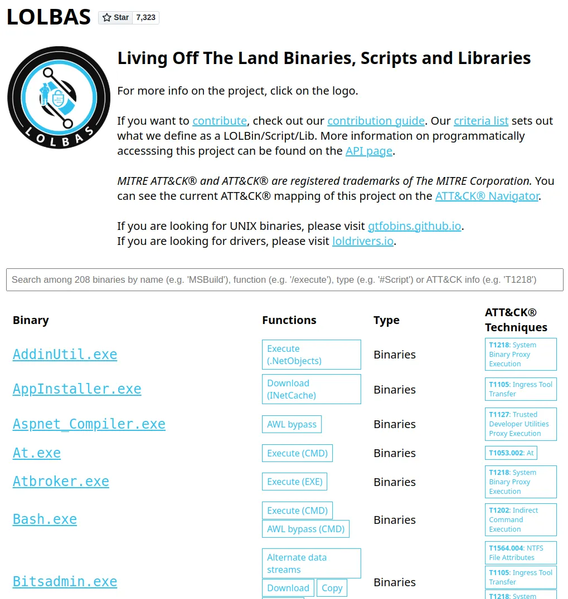
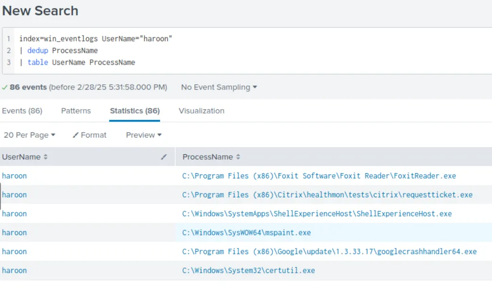
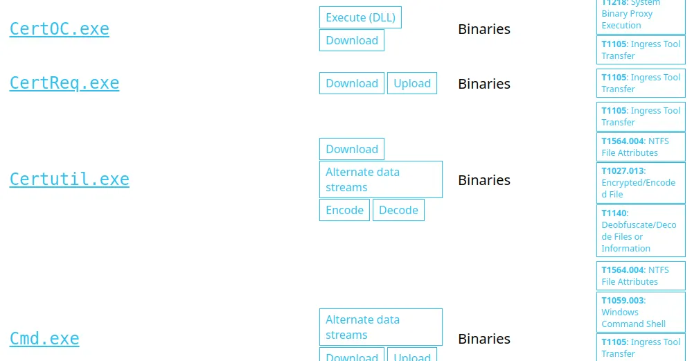
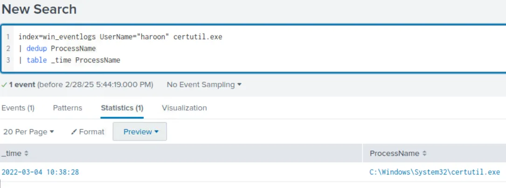
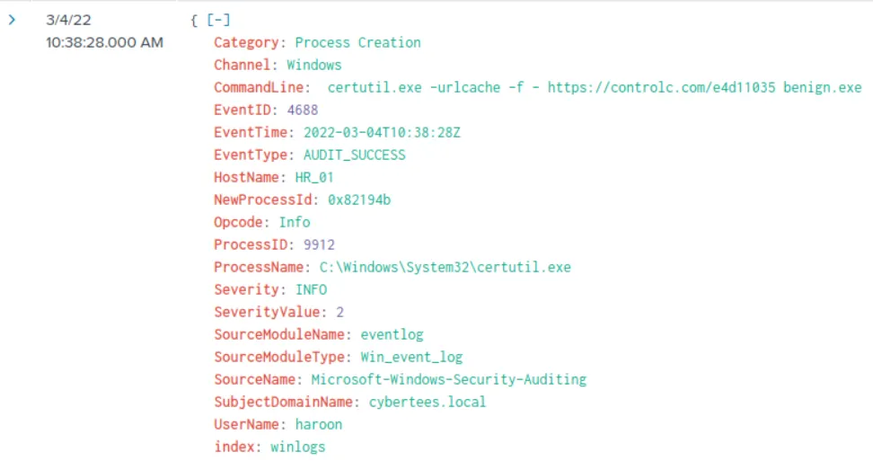
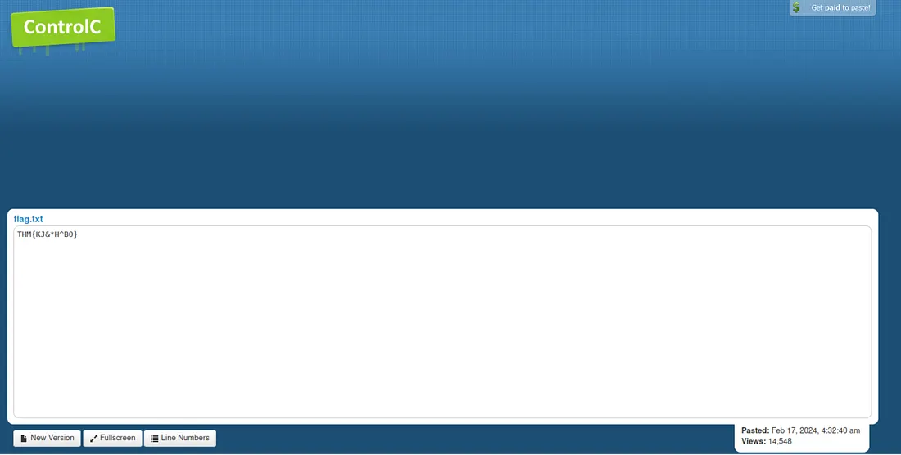

# Splunk Host Compromise Investigation and Timeline Pivot

## Objectives

- Investigate 13,959 ingested Windows security events in `index=win_eventlogs` (March 2022) to detect unauthorized persistence and payload delivery inside the HR department.
- Hunt for typo-squatted accounts, scheduled-task abuse, and living-off-the-land binaries used to fetch external payloads.
- Extract forensic artifacts including the exact LOLBIN command line, third-party delivery site, saved filename, and embedded flag.
- Build an actionable incident timeline with IOCs ready for containment, blocking, and threat-hunting rule creation—all using only Splunk SPL and native Windows logging in a fully isolated lab.

## Tools Used

- VM: [https://tryhackme.com/room/benign](https://tryhackme.com/room/benign)
- **Splunk Search & Reporting** (`index=win_eventlogs`, `stats count by UserName`, `dedup`, `table _time CommandLine ProcessName`)
- **Windows Security Event IDs** (4688 → process creation, Sysmon EventID=1 → detailed command lines)
- **LOLBAS Project** ([https://lolbas-project.github.io/](https://lolbas-project.github.io/))
- **CyberChef** (Base64/URL decoding when needed)
- **Browser** (direct access to [controlc.com](http://controlc.com/) paste for flag recovery)

# Investigation

**Goal:** Investigate a suspected compromise on an HR host using Splunk. I’ll hunt for anomalous activity, identify persistence/download techniques, and extract forensic artifacts (binary executed, download source, saved filename, and the embedded flag).

---

## Scenario Overview & Preparation

An IDS flagged unusual process executions on a host in the HR department. Attackers often use legitimate system utilities (LOLBINs) to download or execute payloads to evade detection. My objective is to use Splunk queries over `index=win_eventlogs` for March 2022 to discover which HR host was abused and how.

**Environment:**

I deployed the lab VM and opened Splunk Search & Reporting. All relevant logs are in `index=win_eventlogs`. I set Splunk to verbose / ALL time where needed and restricted time windows to March 2022 when required.



---

## Step 1 — Confirm March 2022 log volume

Verify sufficient telemetry exists for the investigation timeframe.

I set the **Date Range** to the month of March and view the results.


**Observation / Result:**


Total logs ingested for March 2022: **13,959**.

**Answer:** `13959`

---

## Step 2 — Find the imposter account

Attackers create accounts similar to real users (typo-squatting) to persist without raising immediate suspicion. Listing unique usernames helps spot small variations.

Example Query:

```
index=win_eventlogs | stats count by UserName | sort - count
```


or

To create a table of UserName field with **dedup** function to remove any duplicate values.

```
index=win_eventlogs 
| dedup UserName 
| table UserName
```

**Observation:**


I enumerated usernames and noticed an imposter account that mimics an HR user (`Amelia`) by substituting a character.

**Answer (imposter username):** `Amel1a`

---

## Step 3 — Determine which HR user ran scheduled tasks

Scheduled tasks are a common persistence mechanism (T1053). Identifying users invoking `schtasks.exe` isolates candidates for compromise.

`schtasks.exe`is a legitimate Windows system file that manages scheduled tasks on a computer. It allows users to create, modify, delete, and query scheduled tasks through a command-line interface.


**Observation:**

Four users executed scheduled tasks; among them `Chris.fort` belongs to HR.

**Answer (HR user running scheduled tasks):** `Chris.fort`

---

## Step 4 — Identify which HR user used a LOLBIN to download a payload

Living-Off-The-Land Binaries (LOLBINs) like `certutil.exe` are legitimate Windows tools frequently abused to fetch and decode payloads. I checked HR users’ process histories against known LOLBINs.

For this, I clicked the link below to check out the URL provided in the Hint to find the binaries used to download the payload.

http://lolbas-project.github.io/



Now I need to manually check the processes run by each user from the HR Department against these binaries listed in the URL.



Eventually, I see the user named **haroon** run the **`certutil.exe`** process that is present in the list.



**Observation:**

The HR user `haroon` executed `certutil.exe`, matching a known LOLBIN used to download files.

**Answer (user):** `haroon`

**Answer (LOLBIN used):** `certutil.exe`

---

## Step 5 — Find when the LOLBIN was executed

Timestamping execution is important for timeline and IOC correlation.

**Query I ran:**

```
index=win_eventlogs UserName="haroon" certutil.exe
| dedup ProcessName 
| table _time ProcessName
```

**Observation / Result:**



The execution date recorded: **2022-03-04**.

**Answer (date executed):** `2022-03-04`

---

## Step 6 — Determine which third-party site was used to download the payload

Identifying remote hosts or file-sharing services reveals the attacker’s delivery channel and potential C2 or exfiltration endpoints.

Checking the event log for **`certutil.exe`** process, I found the command used to execute this process.




**Observation:**

The `CommandLine` for `certutil.exe` included a URL pointing to a third-party paste/file-hosting site: `controlc.com`.

**Answer (third-party site):** `controlc.com`

---

## Step 7 — Identify the filename saved on the host

Knowing the filename allows artifact collection and static/dynamic analysis.

**What I inspected:**

From the `certutil` command-line event I checked the `-out` / file path argument captured by Windows logging.


The downloaded/saved filename on the host was **`benign.exe`**.

**Answer:** `benign.exe`

---

## Step 8 — Extract the embedded flag from the file or posted content

The file contained a recognizable pattern `THM{...}`; retrieving it validates the payload contents and completes the forensic objective.

**Method:**



I visited the posted URL from the certutil command. The site content revealed the flag.

**Answer (embedded pattern):** `THM{KJ&*H^B0}`

---

## Step 9 — Provide the exact URL contacted by the infected host

The full URL is an actionable IOC to block, investigate further, or request takedown.

The infected host connected to:

**`https://controlc.com/e4d11035`**

---

### Lessons Learned

- `stats count by UserName | sort - count` → instantly surfaces typo-squatted accounts like `Amel1a` hiding among thousands of events.
- Cross-reference HR usernames against LOLBAS list → `certutil.exe` executed by `haroon` jumps out in seconds.
- `CommandLine` field in EventID=4688 → full `certutil -decode` payload delivery chain in one click.
- Paste sites like [controlc.com](http://controlc.com/) are the new Pastebin — always follow the URL when certutil appears.
- `out benign.exe` proves attackers still love ironic naming conventions.
- Flag pattern `THM{...}` in raw paste content → instant mission success without downloading the binary.
- Safe VM + pre-ingested win_eventlogs → full HR compromise investigation using nothing but Splunk and a browser.

# Socials

**Repository:** https://github.com/RahulCyberX/Security-Information-Event-Management

**Medium Article:** https://medium.com/@rahulcyberx/benign-complete-tryhackme-walkthrough-bad98341c44d?source=your_stories_outbox---writer_outbox_published-----------------------------------------

**TryHackMe Profile:** https://tryhackme.com/p/0xRahuL

**Github Profile:** https://github.com/RahulCyberX