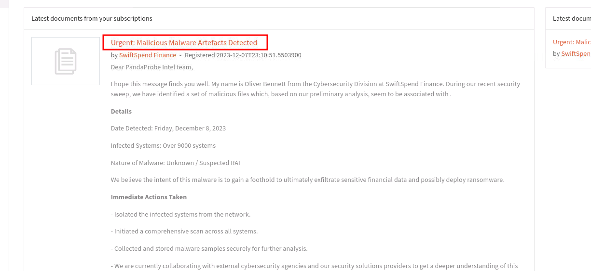

# Dissecting Digital Threats: Hands-On Malware Reverse Engineering

I just completed Friday Overtime, a fully simulated late-night incident response scenario that runs entirely inside an isolated virtual machine. The objective is simple but realistic: act as a junior CTI analyst handling an urgent malware sample submission after hours, with no senior support. Starting from a single zip file in a secure sandbox, the room guides you through proper triage workflow—verifying sources, calculating hashes, enriching indicators, defanging URLs and IPs, and mapping findings to MITRE ATT&CK. Everything stays contained in the VM, so you can dig deep without any real-world risk. By the end, you produce a clear intelligence report on a persistent APT campaign, proving that solid fundamentals and free tools are enough to turn raw samples into actionable defense.

Virtual Machine Provided in: [https://tryhackme.com/room/fridayovertime](https://tryhackme.com/room/fridayovertime)

## **Objectives**

- Who shared the malware samples?
- What is the SHA1 hash of the file "pRsm.dll" inside samples.zip?
- Which malware framework utilizes these DLLs as add-on modules?
- Which MITRE ATT&CK Technique is linked to using pRsm.dll in this malware framework?
- What is the CyberChef defanged URL of the malicious download location first seen on 2020-11-02?
- What is the CyberChef defanged IP address of the C&C server first detected on 2020-09-14 using these modules?
- What is the md5 hash of the spyagent family spyware hosted on the same IP targeting Android devices in Jun 2025?

## **Tools Used**

CLI Commands, CyberChef, VirusTotal, 

## **Investigation**

I logged into the DocIntel platform with the provided credentials (username, password). That’s when I saw the “*Latest documents from your subscription*” notice and was informed about a newly detected malicious malware sample.



I clicked the notification and was taken to the details page. I can see there is an attached ZIP file that I should download for investigation.


I unzip the file using the provided password via the terminal:


Listing the directory (`ls`) shows the extracted items. There is a file named `pRsm.dll`, which I will analyze.

My next step is to compute its SHA1 hash. I obtained it with the following command:

```jsx
sha1sum pRsm.dll
```


SHA1 hash = `9d1ecbbe8637fed0d89fca1af35ea821277ad2e8`

To identify the malware framework that `pRsm.dll` belongs to, I performed a targeted Google search which led me to an article on WeLiveSecurity:

[https://www.welivesecurity.com/2023/04/26/evasive-panda-apt-group-malware-updates-popular-chinese-software/](https://www.welivesecurity.com/2023/04/26/evasive-panda-apt-group-malware-updates-popular-chinese-software/)


From the article, I confirmed that the framework name used by this sample is **MgBot**.

Next, I searched the article for the DLL name `pRsm.dll` to determine which ATT&CK technique is associated with it; the site returned the relevant technique ID.


Ok so I have the ID now. But now I want to know the original download location (first seen on **2020-11-02**), I searched the article further and found it listed under the **Technical analysis** section.


I copied the download URL and defanged it using CyberChef (`https://gchq.github.io/CyberChef/`) with the Defang operation.


The defanged URL is:

`hxxp[://]update[.]browser[.]qq[.]com/qmbs/QQ/QQUrlMgr_QQ88_4296.exe`

Next, I looked for the C2 IP address that was first detected on **2020-09-14** by searching that date in the article.


So now we have the IP address of server, but we need to defang it. so let’s head over to CyberChef again and this time apply the **Defang IP Addresses** recipe.

I obtained the IP address, then defanged it using CyberChef’s **Defang IP Addresses** operation. At first the output did not change; I adjusted the formatting (removed brackets around the final dot) and the output became correctly defanged.


And thats the correct defanged IP address: `122[.]10[.]90[.]12`

To check whether any SpyAgent family spyware is associated with this IP, I submitted the defanged IP to VirusTotal (`https://www.virustotal.com/gui/`) and inspected the **Relations** tab.

I examined the different relation types associated with this IP. Under *Communicating files*, an **Android** entry stood out. I clicked the name to view details.


On the **Details** tab, I can now see basic properties related to the file’s hash and related metadata.


## Findings

| Question | Answer |
| --- | --- |
| Who shared the malware samples? | Oliver Bennett |
| What is the SHA1 hash of the file "pRsm.dll" inside samples.zip? | `9d1ecbbe8637fed0d89fca1af35ea821277ad2e8` |
| Which malware framework utilizes these DLLs as add-on modules? | MgBot |
| Which MITRE ATT&CK Technique is linked to using pRsm.dll in this malware framework? | T1123 |
| What is the CyberChef defanged URL of the malicious download location first seen on 2020-11-02? | `hxxp[://]update[.]browser[.]qq[.]com/qmbs/QQ/QQUrlMgr_QQ88_4296[.]exe` |
| What is the CyberChef defanged IP address of the C&C server first detected on 2020-09-14 using these modules? | `122[.]10[.]90[.]12` |
| What is the md5 hash of the spyagent family spyware hosted on the same IP targeting Android devices in Jun 2025? | `951F41930489A8BFE963FCED5D8DFD79` |

## Lesson Learned

- Always verify the source of a sample before opening it, even in a sandbox.
- Hashing files immediately gives you instant context on VirusTotal.
- Safe environments let you handle real malware samples confidently.
- Defanging indicators should be automatic before sharing anything.
- MITRE ATT&CK helps translate technical findings into business language.
- Old infrastructure often gets reused—spotting it early stops future attacks.
- CyberChef and VirusTotal are essential for fast, accurate enrichment.
- Following one indicator properly can reveal an entire campaign timeline.
- You don’t need expensive tools or years of experience to produce useful intelligence.

## Socials

**Repository:** https://github.com/RahulCyberX/Cyber-Threat-Intelligence

**Medium Article:** https://medium.com/@rahulcyberx/friday-overtime-tryhackme-notes-2025-9d3320a3a6a7?source=your_stories_outbox---writer_outbox_published-----------------------------------------

**TryHackMe Profile:** https://tryhackme.com/p/0xRahuL

**Github Profile:** https://github.com/RahulCyberX