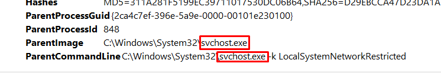
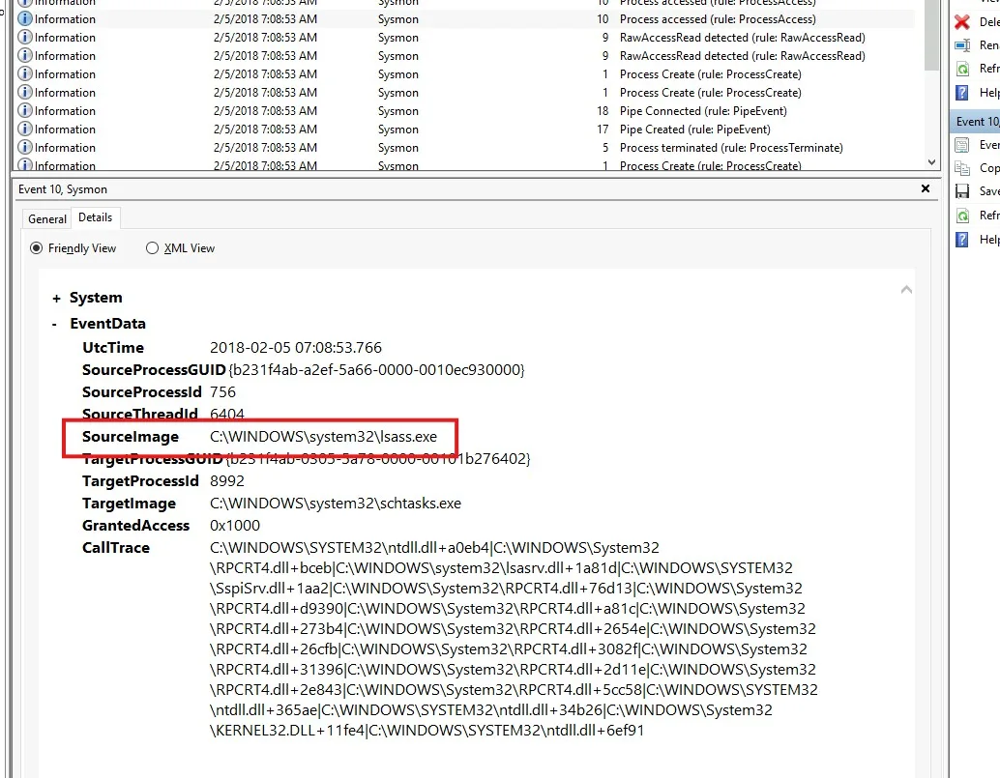

# Sysmon Configuration and Endpoint Threat Detection


## **Objectives**

* Perform full-scale endpoint forensics using **Sysmon** event logs to detect and correlate adversary behavior across multiple techniques.
* Investigate **USB-based infections**, **HTA masquerading attacks**, **registry and scheduled task persistence**, and **Empire C2 communication** using event IDs such as 1, 3, 9, 12, and 13.
* Identify malicious process hierarchies, raw disk reads, registry payloads, alternate data streams, and suspicious network connections from `.evtx` logs.
* Build a repeatable Sysmon workflow to extract IOCs (IPs, commands, payloads, registry keys) directly from logs without third-party tools.
* Develop the ability to reconstruct adversary **kill-chains** purely from endpoint telemetry inside a safe TryHackMe VM.

---

## **Tools Used**
 VM: https://tryhackme.com/room/sysmon
* **Sysmon Event Logs (.evtx)** — core telemetry for process, network, and registry activities.
* **Event Viewer** — filtered logs by event ID (1, 3, 9, 12, 13) and sorted by timestamps for timeline analysis.
* **Right-click Details inspection** — verified parent–child relationships, image paths, and registry key values.
* **PowerShell** (optional) — for extracting strings and viewing log metadata.
* **CyberChef / Notepad** — decoding Base64 and reviewing hidden Alternate Data Streams.

---

# Investigation

# Task 10: Practical Investigations

In this task, I practiced multiple incident investigations using Sysmon logs. Each investigation simulated a real-world adversary technique such as USB infections, masquerading payloads, persistence, and C2 communications. I documented my findings step by step, explaining what I looked for, why I did it, and the results I obtained.

---

## Investigation 1 – Malicious USB

### Objective

Investigate a suspicious USB device that dropped a malicious file onto the host. Logs were provided in:

`C:\Users\THM-Analyst\Desktop\Scenarios\Investigations\Investigation-1.evtx`

### My Steps and Reasoning

1. I first checked **process creation logs (Event ID 1)**.
    - Clicked on the earliest log with event ID 1, and checked out its details.
    
    
    
    - I noticed **WUDFHost.exe** being created by **svchost.exe**, which is normal for USB devices.
    - This confirmed a USB device was indeed connected.
2. Then I moved to **network events (Event ID 3)**.
    - Saw DHCP traffic (ports 67/68) — this was part of the USB trying to request an IP.
    - Why?
        - **Source Port:** 68 (Clients)
        - **Destination Port:** 67 (Servers)
        
        In this I see a DHCP traffic, more specifically a DHCP Discovery:
        
        - UDP **port 68** is used by DHCP clients.
        - UDP **port 67** is used by DHCP servers.
        - A system will broadcast a **DHCP Discover** packet from port `68` to port `67` on `255.255.255.255` when requesting an IP address.
            
            
            
3. Next, I analyzed **RawAccessRead (Event ID 9)**.
    - A RawAccessRead event usually indicates that a process is directly reading from a disk at a low level, bypassing normal file system APIs. It is not clear if this is a system drive being accessed, or the USB key.
    - A direct disk access attempt showed the device being called:
        
        
        
4. Finally, I looked at **registry modifications (Event IDs 12 & 13)**.
    
    
    
    
    
    - The registry keys showed the USB enumeration under **SanDisk U3 Cruzer Micro**, confirming persistence traces.

### Findings

- **Full registry key of USB calling svchost.exe:**
    
    `HKLM\System\CurrentControlSet\Enum\WpdBusEnumRoot\UMB\2&37c186b&0&STORAGE#VOLUME#_??_USBSTOR#DISK&VEN_SANDISK&PROD_U3_CRUZER_MICRO&REV_8.01#4054910EF19005B3&0#\FriendlyName`
    
- **Device accessed via RawAccessRead:**
    
    `\Device\HarddiskVolume3`
    
- **First EXE executed by process:**
    
    `rundll32.exe`
    

---

## Investigation 2 – Malicious HTA Masquerading as HTML

### Objective

Analyze a suspicious file that disguised itself as HTML but executed malicious code. Logs were in:

`Investigation-2.evtx`

### My Steps and Reasoning

1. I started with **process creation (Event ID 1)**.
    
    
    
    - Saw `mshta.exe` being executed, a legitimate Microsoft tool used to execute HTML Application (HTA) files.
    - `mshta.exe` is often abused by attackers to execute malicious scripts.
    - The command used:
        
        ```
        "C:\Windows\System32\mshta.exe"
        "C:\Users\IEUser\AppData\Local\Microsoft\Windows\Temporary Internet Files\Content.IE5\S97WTYG7\update.hta"
        ```
        
2. I checked the **parent process**.
    - Parent was `iexplore.exe` running:
        
        
        
        ```
        C:\Users\IEUser\Downloads\update.html
        ```
        
    - This shows the payload was masked as an HTML file.
3. I confirmed the **signed binary executing the payload** was `mshta.exe`.
4. Moving to **network connections (Event ID 3)**:
    
    
    
    - Found communication to attacker IP `10.0.2.18` on port `4443`.

### Findings

- **Payload full path:**
    
    `C:\Users\IEUser\AppData\Local\Microsoft\Windows\Temporary Internet Files\Content.IE5\S97WTYG7\update.hta`
    
- **Masked file path:**
    
    `C:\Users\IEUser\Downloads\update.html`
    
- **Signed binary executing payload:**
    
    `C:\Windows\System32\mshta.exe`
    
- **Adversary IP:**
    
    `10.0.2.18`
    
- **Back connect port:**
    
    `4443`
    

---

## Investigation 3.1 – Persistence via Registry

### Objective

Identify persistence set up via registry and C2 communication. Logs were in:

`Investigation-3.1.evtx`

### My Steps and Reasoning

1. Checked **network events**.
    
    
    
    - Found connection from `172.16.199.179` to `172.30.1.253` on port 80.
    - Hostname of endpoint: `DESKTOP-O153T4R`
    - Destination hostname: `empirec2`
2. Analyzed **registry modification events**.
    - The next 5 events concern the registry so I look at these. They are the events with event ID 12 & 13.
    
    
    
    - Third event is of my interest:
        
        
        
    - In this event I found suspicious hidden PowerShell payload stored in:
        
        ```
        HKLM\SOFTWARE\Microsoft\Network\debug
        ```
        
3. Checked the **PowerShell execution command in the 5th event**
    
    
    

### Findings

- **Adversary IP:** 172.30.1.253
- **Hostname of endpoint:** DESKTOP-O153T4R
- **Hostname of C2 server:** empirec2
- **Registry payload location:** HKLM\SOFTWARE\Microsoft\Network\debug
- **PowerShell launch code:**
    
    ```
    "C:\Windows\System32\WindowsPowerShell\v1.0\powershell.exe" -c "$x=$((gp HKLM:Software\Microsoft\Network debug).debug);start -Win Hidden -A \"-enc $x\" powershell";exit;
    ```
    

---

## Investigation 3.2 – Persistence via Scheduled Task + ADS

### Objective

Investigate scheduled task persistence with payload hidden in Alternate Data Streams (ADS). Logs were in:

`Investigation-3.2.evtx`

### My Steps and Reasoning

1. First network connection (ID 3) showed adversary IP: `172.168.103.188`.
    
    
    
2. Found a suspicious looking event (ID 1):
    
    [https://www.notion.so](https://www.notion.so)
    
3. Observed suspicious scheduled task creation:
    
    ```
    schtasks.exe /Create /F /SC DAILY /ST 09:00 /TN Updater
    /TR "C:\Windows\System32\WindowsPowerShell\v1.0\powershell.exe -NonI -W hidden -c
    IEX ([Text.Encoding]::UNICODE.GetString([Convert]::FromBase64String($(cmd /c 'more < c:\users\q\AppData:blah.txt'))))"
    ```
    
4. Payload location was hidden in **ADS**:
    
    ```
    c:\users\q\AppData:blah.txt
    ```
    
5. Looked at the events with event ID 10. Both shows `lsass.exe` (Local Security Authority Subsystem Service) is trying to access `schtasks.exe`, the process responsible for creating the malicious task. (lsass.exe is a critical Windows security component that should not usually interact directly with schtasks).
    
    
    

### Findings

- **Adversary IP:** 172.168.103.188
- **Payload location:** c:\users\q\AppData:blah.txt
- **Scheduled task creation command:**
    
    ```jsx
    “C:\WINDOWS\system32\schtasks.exe” /Create /F /SC DAILY /ST 09:00 /TN Updater /TR “C:\Windows\System32\WindowsPowerShell\v1.0\powershell.exe -NonI -W hidden -c \”IEX ([Text.Encoding]::UNICODE.GetString([Convert]::FromBase64String($(cmd /c ”more < c:\users\q\AppData:blah.txt”’))))\””
    ```
    
- **Suspicious process accessed:** lsass.exe

---

## Investigation 4 – Botnet / C2

### Objective

Investigate C2 communications that may indicate botnet activity. Logs were in:

`Investigation-4.evtx`

### My Steps

1. Checked **network logs (Event ID 3)**.
    
    
    
    - Found adversary IP: `172.30.1.253`
    - Port in use: `80`
2. Destination hostname showed: **empire**, confirming Empire C2 framework.


## **Findings**

* **USB Intrusion:**

  * Raw disk access detected (`Event ID 9`) from `\Device\HarddiskVolume3`.
  * Registry confirmed USB persistence under `HKLM\System\CurrentControlSet\Enum\WpdBusEnumRoot`.
  * Executed payload: `rundll32.exe` spawned via `svchost.exe`.

* **HTA Masquerading:**

  * `mshta.exe` executed fake `update.html` → real payload `update.hta`.
  * Back-connect to adversary `10.0.2.18:4443` established via network event (ID 3).

* **Registry Persistence:**

  * Hidden PowerShell command stored in `HKLM\SOFTWARE\Microsoft\Network\debug`.
  * C2 connection from `DESKTOP-O153T4R` to `empirec2 (172.30.1.253)` on port 80.

* **Scheduled Task + ADS Persistence:**

  * Malicious task “Updater” executed PowerShell from ADS file `c:\users\q\AppData:blah.txt`.
  * Abnormal handle access from `lsass.exe` to `schtasks.exe` confirmed manipulation attempt.

* **Empire C2 Botnet:**

  * Continuous traffic from host to `172.30.1.253:80`, identified as **Empire C2 framework** beaconing.

---

## **Lessons Learned**

* **Event ID 1** is the anchor—trace process lineage before chasing network noise.
* **Event ID 9** highlights stealthy USB or raw disk reads—critical for spotting physical drops.
* **Event IDs 12/13** expose persistence through registry edits; `debug` keys are attacker favorites.
* **Alternate Data Streams** are common payload hideouts—always search for “`more < file:stream`” patterns.
* **Empire C2 detection** is straightforward once you match repetitive port 80 callbacks from unknown hosts.
* With **Sysmon + Event Viewer**, complete endpoint intrusion analysis is possible—no EDR required.


# Socials

**Repository:** https://github.com/RahulCyberX/Endpoint-Security-Monitoring

**Medium Article:** https://medium.com/@rahulcyberx/sysmon-endpoint-security-monitoring-thm-2025-7c40143948e8?source=your_stories_outbox---writer_outbox_published-----------------------------------------

**TryHackMe Profile:** https://tryhackme.com/p/0xRahuL

**Github Profile:** https://github.com/RahulCyberX
