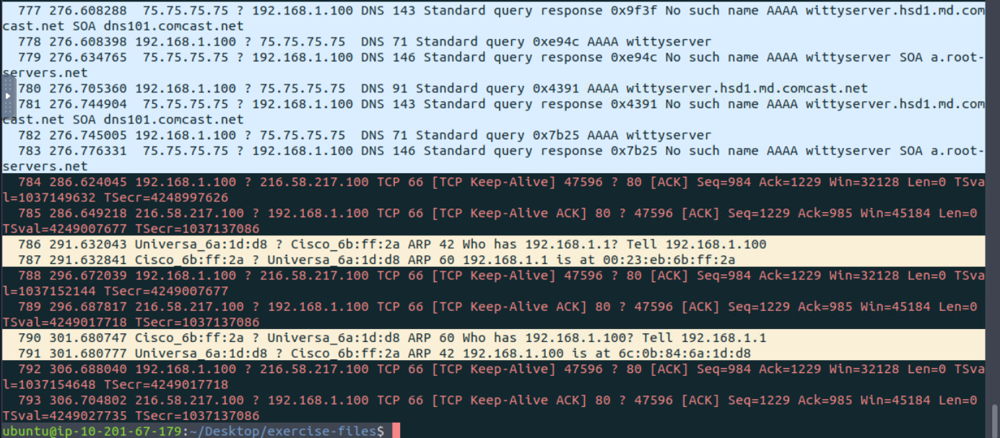

# TShark Command-Line Traffic Analysis and Automation

# Objectives

- Investigated a real phishing alert inside TryHackMe’s isolated VM using only TShark and VirusTotal to turn a single pcap into full threat intel.
- Extracted suspicious DNS queries, spotted PayPal impersonation, resolved malicious IPs, and pulled stolen credentials from HTTP traffic.
- Defanged every indicator and built a timeline from first VT submission back in 2017—all in a safe sandbox with zero real-world risk.
- VM: https://tryhackme.com/room/tsharkchallengesone

# Tools Used

- **TShark** (-r for reading pcap, -Y display filters, -z io,phs hierarchy, -V verbose details, frame contains/login.php)
- **VirusTotal** (URL scan, Details → History, Relations tab for IP confirmation)
- **CyberChef** (Defang URL/IP recipes)

# Investigation

# Task 1: Introduction

This room is about investigating traffic data as part of the SOC team using **TShark**.

- Start the VM with the green **Start Machine** button.
- The machine opens in split view, so no SSH/RDP needed.
- Important: **Exercise files are real**. Do **not** interact with them outside the VM, as they can pose security risks.

---

# Task 2: Case: Teamwork!

### Scenario

An alert was triggered:

> “The threat research team discovered a suspicious domain that could be a potential threat to the organisation.”
> 

We must investigate `teamwork.pcap` (located in `~/Desktop/exercise-files`) and create detection artefacts using **TShark** + **VirusTotal**.

---

## Q1. According to VirusTotal, what is the full URL of the malicious/suspicious domain address (defanged)?

**Step 1: Read the PCAP file**

I first looked at the raw capture with:

```bash
tshark -r teamwork.pcap --color
```



- Total packets: **793**
- While scrolling, I noticed interesting domains as part of a DNS queries
    
    
    

---

**Step 2: Check protocol hierarchy**

```bash
tshark -r teamwork.pcap -z io,phs -q
```


- Found **33 DNS frames**.
- DNS is always worth a deeper look.

---

**Step 3: Ran a display filter to filter on all DNS A queries:**

```bash
tshark -r teamwork.pcap -Y 'dns.qry.type == 1' --color | nl
```


- Output: **15 DNS A queries**.
- One stood out:
    
    ```
    www.paypal.com4uswebappsresetaccountrecovery.timeseaways.com
    ```
    
- Clearly malicious → looks like a **phishing domain**.

---

**Step 4: Defang the URL**

I used CyberChef → `Defang URL` recipe.

✅ **Answer:**


`www[.]paypal[.]com4uswebappsresetaccountrecovery[.]timeseaways[.]com`

---

## Q2. When was the URL of the malicious/suspicious domain first submitted to VirusTotal?

**Step 1:** Search the URL in VirusTotal.

Link: https://www.virustotal.com/gui/url/16db0aadc2423a67cd3a01af39655146b0f15d20dc2fd0e14b325026d8d1717e

**Step 2:** Go to **Details → History**.


- First submission date = **2017-04-17 22:52:53 UTC**

---

## Q3. Which known service was the domain trying to impersonate?

- From the URL itself:
    
    ```
    www.paypal.com4uswebappsresetaccountrecovery.timeseaways.com
    ```
    
- The first part = **PayPal** → clear impersonation.

---

## Q4. What is the IP address of the malicious domain? (defanged format)

**Step 1: Review DNS responses**

We already had this from DNS query filtering:

```bash
tshark -r teamwork.pcap -Y 'dns.qry.type == 1' --color | nl
```

Output:


Gonna focus on a specific packet, for example:

```
6 443 108.673854 75.75.75.75 → 192.168.1.100 DNS 136 Standard query response 0x60ea A www.paypal.com4uswebappsresetaccountrecovery.timeseaways.com A 184.154.127.226
```

The packet capture summary describes a DNS query and response:

- **Packet Number**: 443
- **Time**: 108.673854 seconds
- **Source**: 75.75.75.75 (DNS server)
- **Destination**: 192.168.1.100 (requesting machine)
- **Protocol**: DNS
- **Length**: 136 bytes
- **Info**: DNS query response for an A record
- **Query**: A record for `www.paypal.com4uswebappsresetaccountrecovery.timeseaways.com`
- **Response**: IP address 184.154.127.226 (the A record answer)

**Key Answer**

- The malicious domain resolved to: **184.154.127.226**

---

**Step 2: Cross-check with VirusTotal**

On the VT page of the query link, under **Relations**, the IP **184.154.127.226** also appeared.


De-fanged IP**:**`184[.]154[.]127[.]226`

---

## Q5. What is the email address that was used? (defanged format)

**Step 1: Search for HTTP requests with `.com`**

```bash
tshark -r teamwork.pcap -Y "http contains .com"
```


- Found suspicious traffic → `login.php`
- I will have to investigate this.
- We can look for the packet and show all data by using the following command with the use of the -V flag:

---

**Step 2: Inspect packet in detail**

```bash
tshark -r teamwork.pcap -Y "frame contains login.php" -V
```


- `-V` to show the packet data.

---

**Step 3: OR, to focus on Gmail traffic only** 

```bash
tshark -r teamwork.pcap -Y "http contains gmail.com" -V
```


- Found the **stolen email** inside the packet data.
- It seems the person entered their initials on this false domain, and this way their credentials got snatched!

# Lessons Learned

- One weird DNS query in 793 packets can reveal an entire phishing kit—TShark makes it instant.
- Always check protocol hierarchy first; 33 DNS frames screamed “look here.”
- V flag on suspicious frames shows stolen creds in plain text—no GUI needed.
- Defang everything before pasting; muscle memory saved me twice.
- VT History tab turns old domains into instant context—2017 submission means long-lived threat.
- Safe VM + TShark = I hunted real malware without ever worrying about getting owned.

# Socials

**Repository:** https://github.com/RahulCyberX/Network-Security-and-Traffic-Analysis

**Medium Article:** https://medium.com/@rahulcyberx/tshark-challenge-i-teamwork-tryhackme-walkthrough-2025-cc360bac6c65?source=your_stories_outbox---writer_outbox_published-----------------------------------------

**TryHackMe Profile:** https://tryhackme.com/p/0xRahuL

**Github Profile:** https://github.com/RahulCyberX