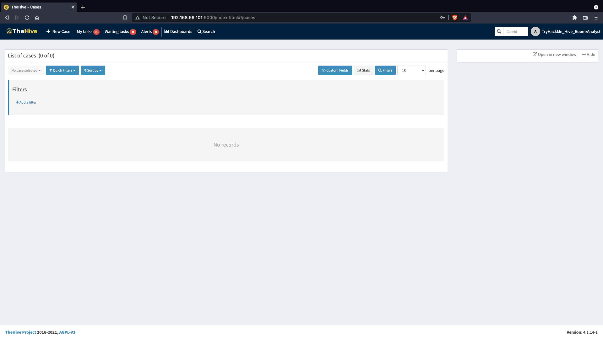

# TheHive: FTP Exfiltration Case Investigation

## Objectives

- Analyze **FTP-based exfiltration traffic** captured in a PCAP file.
- Create and document a case in **TheHive**, tagging it with relevant **TTPs and observables**.
- Correctly classify data sources and link them to MITRE ATT&CK standards.
- Retrieve and report the **flag** hosted on the investigation VM.

## Tools & Frameworks Used

- VM: [https://tryhackme.com/room/thehiveproject](https://tryhackme.com/room/thehiveproject)
- **Wireshark** → Packet-level inspection (FTP control/data channels).
- **TheHive** → Case management and threat intelligence platform.
- **MITRE ATT&CK** → TTP mapping (T1048.003 — *Exfiltration Over Unencrypted/Obfuscated Non-C2 Protocol*).
- **Traffic Light Protocol (TLP)** / **Permissible Actions Protocol (PAP)** → Case information sharing controls.

---

# Investigation

### **SCENARIO**

You have captured network traffic on your network after suspicion of data exfiltration being done on the network. This traffic corresponds to FTP connections that were established. Your task is to analyse the traffic and create a case on TheHive to facilitate the progress of an investigation. If you are unfamiliar with using Wireshark, please check out [this room](https://tryhackme.com/room/wireshark) first and come back to complete this task.

*Source of PCAP file: IntroSecCon CTF 2020*

Once an analyst has logged in to the dashboard, they will be greeted with the screen below. At the top, various menu options are listed that allow the user to create new cases and see their tasks and alerts. A list of active cases will be populated on the centre console when analysts create them.

Image: TheHive Main Landing Page

On clicking the `New Case` tab, a pop-up window opens, providing the analyst with fields to input their case details and tasks. The following options must be indicated on the case to set different categories and filter options:

- ***Severity*:** This showcases the level of impact the incident being investigated has on the environment from low to critical levels.
- ***TLP*:** The Traffic Light Protocol is a set of designations to ensure that sensitive information is shared with the appropriate audience. The range of colours represents a scale between full disclosure of information (*White*) and No disclosure/ Restricted (*Red*). You can find more information about the definitions on the [CISA](https://www.cisa.gov/tlp) website.
- ***PAP*:** The Permissible Actions Protocol is used to indicate what an analyst can do with the information, whether an attacker can detect the current analysis state or defensive actions in place. It uses a colour scheme similar to TLP and is part of the [MISP taxonomies](https://www.misp-project.org/taxonomies.html#_pap).

With this in mind, we open a new case and fill in the details of our investigation, as seen below. Additionally, we add a few tasks to the case that would guide the investigation of the event.

New Case Window

In the visual below, we add the corresponding tactic and technique associated with the case. The TTPs are imported from [MITRE ATT&CK](https://attack.mitre.org/tactics/enterprise/). This provides additional information that can be helpful to map out the threat. As this is an exfiltration investigation, that is the specific tactic chosen and followed by the specific T1048.003 technique for Exfiltration Over Unencrypted/Obfuscated Non-C2 Protocol.

TTPs Selection Window

Case observables will be added from the Observables tab and you would have to indicate the following details:

| **Field** | **Description** | **Examples** |
| --- | --- | --- |
| *Type *:* | The observable dataType | IP address, Hash, Domain |
| *Value *:* | Your observable value | 8.8.8.8, 127.0.0.1 |
| *One observable per line:* | Create one observable per line inserted in the value field. |  |
| *One single multiline observable:* | Create one observable, no matter the number of lines | Long URLs |
| *TLP *:* | Define here the way the information should be shared. |  |
| *Is IOC:* | Check if this observable is considered an Indicator of Compromise | Emotet IP |
| *Has been sighted:* | Has this observable been sighted on your information system? |  |
| *Ignore for similarity:* | Do not correlate this observable with other similar observables. |  |
| *Tags **:* | Insightful information Tags. | Malware IP; MITRE Tactics |
| *Description **:* | Description of the observable |  |

In our scenario, we are adding the IP address 192... as our observable as this IP is the source of the FTP requests. Depending on the situation of your analysis, this observable can be marked as an IOC or if it has been sighted before in a different investigation.

New Observables Window

# TheHive — TTP / PCAP investigation walkthrough

**Goal:** Import TTPs, classify the investigation’s data source using MITRE ATT&CK, upload the PCAP as an observable into TheHive, and retrieve the flag from the VM-hosted page.

---

## Step 1 — Understand where TheHive imports TTPs from

Before classifying or mapping anything to TTPs I wanted to know the authoritative source TheHive uses so my mappings would be consistent and auditable.

TTPs = Tactics, Techniques, and Procedures — the methods adversaries use. The global, canonical knowledge base for TTPs is the **MITRE ATT&CK** framework (real-world, community-driven).

**Answer (5.1):** MITRE ATT&CK

---

## Step 2 — Determine the correct MITRE “Data source” classification for this investigation

TheHive asks for the detection/data-source classification — I needed to pick the one that best fits a PCAP-driven investigation so future analysts know what signals to expect.

What I did:

1. Opened the MITRE ATT&CK site ( https://attack.mitre.org/ ) and navigated to the **Defenses → Data Sources** section.
    
    
    
2. Reviewed the listed data-source categories (Network Traffic, File, Command, Application Log, etc.).
3. Used `Ctrl+F` on the Data Sources page to search for **PCAP** to find the entry that references raw packet captures.
    
    
    
    The entry that covers raw network packet captures and examples like FTP/HTTP/DNS is **Network Traffic** (DS0029). Because my investigation revolves around FTP traffic captured in a PCAP, **Network Traffic** is the correct classification.
    
    **Answer (5.2):** Network Traffic
    

---

## Step 3 — Upload the PCAP as an observable into TheHive and gather the flag

The exercise required documenting the PCAP inside TheHive (as an observable) so the file and related artifacts are tracked, and the VM exposes a flag file reachable from the uploaded evidence path.

What I did:

1. First of all I made sure that I download the provided PCAP file in the room:
    
    
    
2. After that I opened the link [http://<PROVIDED-MACHINE-IP>/index.html](http://10.201.104.66/index.html) to connect to the TheHive’s portal and logged in using the provided credentials.
    
    
    
3. In TheHive I clicked on **New Case** and filled just the required fields to create a new case. 
    
    
    
    
    
4. Navigated to the **Observables** area for the Case.
5. Clicked **Add Observable** and selected the appropriate type for a packet capture (which is **file**).
    
    
    
    
    
6. Uploaded the PCAP file. While uploading I added sensible metadata:
    
    
    
    - Tags: `ftp`, `exfiltration`, `pcap`
    - Short description: `PCAP containing FTP exfiltration capture as part of the exercise`
7. Saved the observable. The PCAP now appears in the Case Observables list (documented and timestamped).
8. The question mentioned that the flag can be obtained at `https://MACHINE_IP//files/flag.html`. Now that observable have been added, I should be able to view the flag. 
9. I opened that URL in my browser but at first it said that the site cant be reached. I realized that because the VM was serving it over HTTP in my environment, I changed the URL scheme to HTTP and accessed it in a browser:
    
    
    
    But it still didn’t get accepted as the correct answer, apparently there’s a typo mistake. 
    
    The flag should end with **OBSERVABLES**, and not “OBSERVABLERS” which I got from their link. 
    
    **Answer:** THM{FILES_ARE_OBSERVABLES}
    

---

# Lessons Learned

- **TheHive** integrates seamlessly with **MITRE ATT&CK** for threat classification and traceability.
- **PCAP files** are treated as **observables** (data sources) within TheHive’s investigation model.
- Proper **TLP/PAP designation** ensures controlled information sharing across SOC environments.
- Mapping network exfiltration to **T1048.003** standardizes detection and reporting workflows.
- The workflow highlights how case documentation in TheHive can serve as both **evidence management** and **intelligence correlation** tools in post-incident investigations.

# Socials

**Repository:** https://github.com/RahulCyberX/Digital-Forensics-Incident-Response

**Medium Article:** https://medium.com/@rahulcyberx/thehive-project-complete-tryhackme-walkthrough-ca816e766e6f?source=your_stories_outbox---writer_outbox_published-----------------------------------------

**TryHackMe Profile:** https://tryhackme.com/p/0xRahuL

**Github Profile:** https://github.com/RahulCyberX