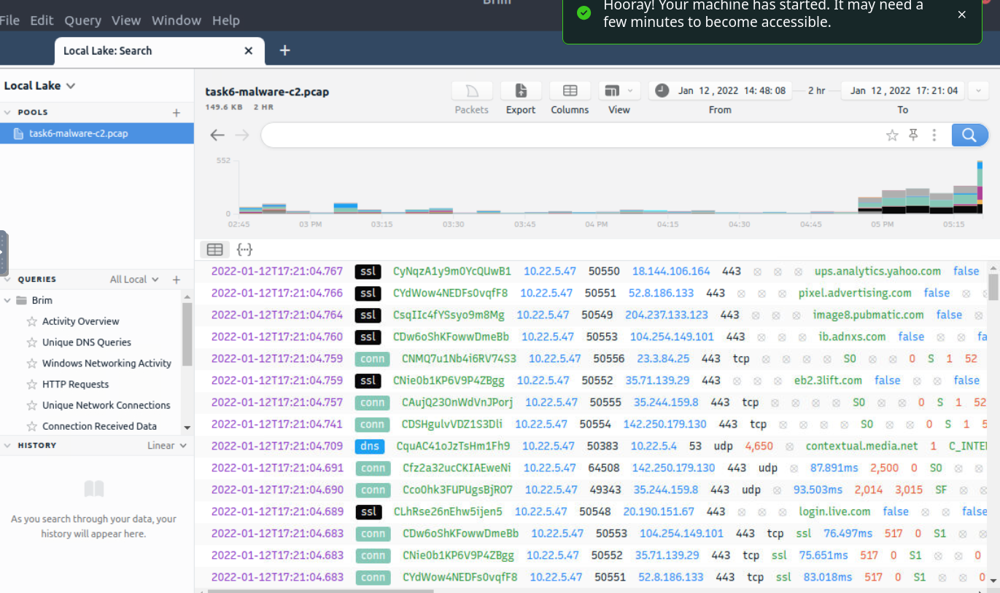

# Brim Threat Hunting with PCAPs

## **Objectives**

* Analyze post-exploitation traffic using Brim and Zeek to detect CobaltStrike and crypto-mining behavior.
* Correlate Zeek and Suricata alerts to identify C2 servers, malware channels, and MITRE ATT&CK mappings.
* Verify malicious activity through VirusTotal and correlate findings with network patterns.

## **Tools Used**
* Virtual Machine: https://tryhackme.com/room/zeekbroexercises
* **Brim Security** – Zeek + Suricata-based PCAP analysis
* **ZQL Queries** – for filtering, counting, and correlation
* **VirusTotal** – IOC and C2 verification
* **CyberChef** – for defanging URLs and IPs


# Investigation

## Task: Malware C2 Detection

### Scenario

An employee clicked a malicious link, downloaded a file, and we noticed strange traffic. I’ll investigate the given **task6-malware-c2.pcap** file in Brim.

---

### Q1: What is the name of the file downloaded from the CobaltStrike C2 connection?

**Steps I took:**

1. Loaded **task6-malware-c2.pcap** in Brim.
    
    
    
2. Ran an overview query to see all activity types:
    
    ```
    count() by _path | sort -r
    ```
    
    
    
3. Checked frequently communicated hosts:

```
cut id.orig_h, id.resp_p, id.resp_h | sort | uniq -c | sort -r count
```


- Found heavy communication:
    - Source: `10.22.5.47`
    - Destination: `104.168.44.45`
1. Checked most common ports:

```
_path=="conn" | cut id.resp_p, service | sort | uniq -c | sort -r count
```


- Seems normal at first. but saw lots of DNS traffic → which is suspicious.
1. Looked at DNS queries:

```
_path=="dns" | count() by query | sort -r
```


- Found weird domains like `hashingold.top` → confirmed malicious via VirusTotal.
    
    
    
1. Moved to HTTP logs for downloads:

```
_path=="http" | cut id.orig_h, id.resp_h, id.resp_p, method, host, uri | uniq -c | sort value.uri
```


- Found a suspicious executable: **4564.exe**.

---

### Q2: What is the number of CobaltStrike connections using port 443?

**Steps I took:**

1. Since the download IP (`104.168.44.45`) was linked to CobaltStrike, I filtered connections on port 443:

```
_path=="conn" and id.resp_h==104.168.44.45 and id.resp_p==443 | count()
```


1. Brim result showed **328 connections**.

---

### Q3: What is the name of the secondary C2 channel?

**Steps I took:**

1. Let’s have another look at the VirusTotal page on the suspicous IP: 


Under Relations, I can see  *2022-01-12-IOCs-for-IcedID-with-Cobalt-Strike-and-DarkVNC.txt* being mentioned*.* 

1. Checked Suricata alerts:

```
event_type=="alert" | cut alert.signature | sort -r | uniq -c | sort -r count
```

1. IcedID can be seen mentioned in the second to last row.
    
    
    
    This seems to be the secondary C2 channel.
    
2. Cross-verified on VirusTotal (`104.168.44.45`) → related to **IcedID malware**.

---

## Task: Crypto Mining

### Scenario

Crypto mining often involves compromised internal machines abusing resources. I’ll investigate the given **task7-crypto-mine.pcapng** file.

---

### Q1: How many connections used port 19999?

**Steps I took:**

1. Loaded **task7-crypto-mine.pcapng** in Brim.
2. Checked activity overview:

```
count() by _path | sort -r
```


1. Analyzed connections and ports:

```
_path=="conn" | cut id.resp_p, service | sort | uniq -c | sort -r count
```


- Found **22 connections** on port `19999`.

---

### Q2: What is the name of the service used by port 6666?

**Steps I took:**

- From the previous port analysis, saw that port **6666** was associated with:

```
irc
```

---

### Q3: What is the amount of transferred total bytes to `101.201.172.235:8888`?

**Steps I took:**

1. Queried for total bytes calculation:

```
_path=="conn" | put total_bytes := orig_bytes + resp_bytes | sort -r total_bytes | cut uid, id, orig_bytes, resp_bytes, total_bytes
```


1. Located the specific IP: `101.201.172.235:8888`.
2. Found **3729 bytes transferred**.

---

### Q4: What is the detected MITRE tactic id?

**Steps I took:**

1. Checked Suricata alerts with MITRE mapping:

```
event_type=="alert" | cut alert.category, alert.metadata.mitre_technique_name, alert.metadata.mitre_technique_id, alert.metadata.mitre_tactic_name, alert.metadata.mitre_tactic_id | sort | uniq -c
```


1. Found tactic = **Impact**.
2. MITRE ATT&CK tactic ID: **TA0040**.

## **Findings**

* CobaltStrike beaconing over HTTPS (443) from host `10.22.5.47` to C2 server `104.168.44.45`.
* Secondary C2 channel confirmed as **IcedID** via Suricata and VirusTotal indicators.
* Crypto-mining traffic detected using ports **19999** (Stratum) and **6666** (IRC).
* **3729 bytes** transferred to mining pool `101.201.172.235:8888`.
* Suricata mapped the event to **MITRE ATT&CK TA0040 – Impact**.
* Confirmed external resource abuse and post-compromise persistence.

## **Lessons Learned**

* Brim’s ZQL queries accelerate deep network analysis far beyond Wireshark.
* Pivoting on busiest IP-port pairs quickly exposes malicious patterns.
* VirusTotal’s “Relations” view links related CobaltStrike and IcedID infrastructure easily.
* Suricata’s MITRE mapping saves time on manual tactic identification.
* Ports like 19999 (Stratum) and 6666 (IRC) are reliable crypto-mining indicators.

## Socials

**Repository:** https://github.com/RahulCyberX/Network-Security-and-Traffic-Analysis

**Medium Article:** https://medium.com/@rahulcyberx/brim-tryhackme-writeups-2025-24aab154857e?source=your_stories_outbox---writer_outbox_published-----------------------------------------

**TryHackMe Profile:** https://tryhackme.com/p/0xRahuL

**Github Profile:** https://github.com/RahulCyberX
