# Using Splunk for Multi-Phase Incident Response

## Objectives

- Led a complete incident response inside TryHackMe’s Splunk lab against a **realistic website defacement** of Wayne Enterprises’ imreallynotbatman.com.
- Mapped every attacker move across **all 7 Cyber Kill Chain phases** using only Splunk botsv1 index (Suricata, Sysmon, IIS, FortiGate) + OSINT pivoting.
- Went from zero to full attribution:
→ Recon (Acunetix + Shellshock)
→ Exploitation (142-password Joomla brute-force)
→ Installation (3791.exe → MD5 AAE3F5A29935E6ABCC2C2754D12A9AF0)
→ C2 (prankglassinebracket.jumpingcrab.com)
→ Actions on Obj (poisonivy-is-coming-for-you-batman.jpeg)
→ Weaponization (Poison Ivy infrastructure + [lillian.rose@po1s0n1vy.com](mailto:lillian.rose@po1s0n1vy.com))
→ Delivery (MirandaTateScreensaver.scr.exe)
- Proved Splunk + Threat Intel turns a defaced homepage into a full APT dossier in a single report—all in a safe, isolated lab.

## Tools Used

- VM: [https://tryhackme.com/room/splunk201](https://tryhackme.com/room/splunk201)
- **Splunk** (index=botsv1, sourcetype=stream:http, sourcetype=suricata, XmlWinEventLog:EventCode=1, rex, stats, table)
- **OSINT Platforms** (Robtex, VirusTotal, ThreatMiner, Hybrid-Analysis, AlienVault OTX, DomainTools)
- **Regex** (rex field=form_data "passwd=(?<creds>\w+)")
- **Sysmon + FortiGate + Suricata** (process creation, file hashes, IDS alerts, firewall URLs)

# Task 1: Introduction — Incident Handling

### Concept:

In cybersecurity, an **incident** is any event that negatively impacts system or organizational security. Examples include:

- System crashes
- Execution of unwanted or malicious programs
- Unauthorized access to sensitive information
- Website defacement
- Violation of device usage policies (like unauthorized USB access)

### Objective of this exercise:

I’m learning how to:

- Use **OSINT tools** to gather intelligence during investigations.
- Map attacker activity to the **Cyber Kill Chain** framework.
- Perform **log analysis using Splunk** effectively.
- Understand **host-centric** (system-level) and **network-centric** (traffic-level) log sources.

---

# Task 2: Incident Handling Life Cycle


Incident Handling consists of **4 main phases** that guide analysts in managing and learning from incidents.

1. **Preparation**
    - Organization readiness: policies, EDR/SIEM/IDS setup, and trained security staff.
2. **Detection & Analysis**
    - Detect incidents via alerts from tools like Splunk or EDR.
    - Investigate alerts and hunt unknown threats.
3. **Containment, Eradication, and Recovery**
    - Stop the spread of infection, isolate hosts, remove traces, and restore systems.
4. **Post-Incident Activity (Lessons Learned)**
    - Identify weaknesses, improve detection rules, and train staff to prevent recurrence.

---

# Task 3: Incident Handling Scenario

### Scenario Overview:

I’m investigating a **website defacement attack** against **Wayne Enterprises**’ domain:

> http://www.imreallynotbatman.com
> 

The attacker replaced the homepage with “YOUR SITE HAS BEEN DEFACED.”


Wayne Enterprises uses **Splunk** as their SIEM, which means I have full access to their logs for investigation.

### Objective:

- Trace the **attacker’s activities** across all 7 phases of the **Cyber Kill Chain**:
    1. Reconnaissance
    2. Weaponization
    3. Delivery
    4. Exploitation
    5. Installation
    6. Command & Control
    7. Actions on Objectives

### My Environment:

- **Splunk index:** `botsv1`
- Logs collected from:
    - Webserver
    - Firewall
    - Suricata IDS
    - Sysmon

Before starting, I deployed the lab VM and waited for it to initialize (≈3–5 minutes).

---

# Task 4: Reconnaissance Phase

### Concept:

**Reconnaissance** is when attackers gather information about their target — like software used, employees, or system details.

### Step 1: Find reconnaissance logs

I searched for the website name across Splunk’s dataset.

```
index=botsv1 imreallynotbatman.com
```

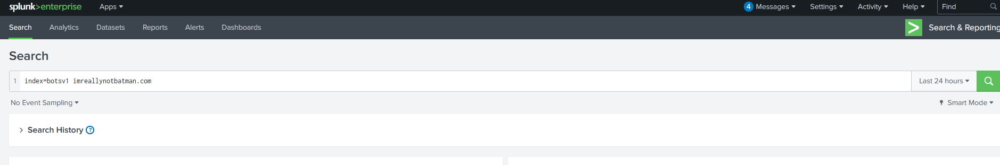

**Result:** Logs found in these sources:


- `Suricata`
- `stream:http`
- `fortigate_utm`
- `iis`

### Step 2: Focus on HTTP traffic

To inspect web traffic targeting our site:

```
index=botsv1 imreallynotbatman.com sourcetype=stream:http
```

**Observation:**


Two source IPs appeared — `40.80.148.42` and `23.22.63.114`.

`40.80.148.42` generated significantly more activity → likely the attacker.

### Step 3: Validate reconnaissance via IDS alerts

To check if Suricata detected anything:

```
index=botsv1 imreallynotbatman.com src=40.80.148.42 sourcetype=suricata
```

Then I explored the **alert.signature** field, which contained the CVE identifier.


✅ **Answer 4.1:** `CVE-2014–6271` (Shellshock vulnerability)

### Step 4: Identify CMS used

I found this by looking at the URI field, URI patterns (like `/joomla/`), I determined the CMS:


✅ **Answer 4.2:** `joomla`

### Step 5: Identify web scanner

From `http_user_agent` and `http.http_method`, I saw **Acunetix**, a known web vulnerability scanner.


✅ **Answer 4.3:** `Acunetix`

### Step 6: Find server IP

Directly visible in destination logs.


✅ **Answer 4.4:** `192.168.250.70`

---

# Task 5: Exploitation Phase

### Concept:

After reconnaissance, the attacker attempts **exploitation** — using vulnerabilities or brute force to gain system access.

To begin my investigation, let’s note the information I have so far:

- I found two IP addresses from the reconnaissance phase with sending requests to our server.
- One of the IPs `40.80.148.42` was seen attempting to scan the server with IP **192.168.250.70**.
- The attacker was using the web scanner Acunetix for the scanning attempt.

---

### Step 1: Review request counts

I checked how many requests each source IP made to the web server.

```
index=botsv1 imreallynotbatman.com sourcetype=stream*
| stats count(src_ip) as Requests by src_ip
| sort - Requests
```


---

### Step 2: Narrow results to traffic targeting the web server

```
index=botsv1 sourcetype=stream:http dest_ip="192.168.250.70"
```

Result showed multiple IPs sending **POST** requests — mostly from `23.22.63.114`.


The result in the **src_ip** field shows three IP addresses (1 local IP and two remote IPs) that originated the HTTP traffic towards our webserver.

Another interesting field, **http_method** will gives information about the HTTP Methods observed during these HTTP communications.

I observed most of the requests coming to our server through the POST request, as shown below.


---

### Step 3: Analyzing POST Request Traffic

To analyze the type of traffic coming through POST requests, I filtered the logs using the following search query:

```
index=botsv1 sourcetype=stream:http dest_ip="192.168.250.70" http_method=POST

```

After pressing Enter, I reviewed the results — the **src_ip** field displayed two IP addresses sending all the POST requests to our server.


---

### Interesting Fields

In the left panel, I found several useful fields that provided valuable information:

- **src_ip**
- **form_data**
- **http_user_agent**
- **uri**

---

### Identifying Joomla CMS

I noticed the term **“Joomla”** appearing multiple times in fields like **uri**, **uri_path**, and **http_referrer**.

This indicated that our web server was running **Joomla CMS (Content Management System)** in the backend.

A quick internet search revealed that the default Joomla admin login page is located at:

```
/joomla/administrator/index.php

```

This URI is significant because it points to the **login page of the Joomla web portal**, making it a potential target for **brute-force attacks**. Therefore, I decided to examine all incoming traffic to this admin panel more closely.

### Step 4: Focus on Joomla admin login page

```
index=botsv1 imreallynotbatman.com sourcetype=stream:http dest_ip="192.168.250.70" uri="/joomla/administrator/index.php"
```

This URI is the admin login page.

To investigate, I focused on the `form_data` field since it contains information submitted through the login form on the admin panel page.

**Search Query:**


```jsx
index=botsv1 sourcetype=stream:http dest_ip="192.168.250.70" http_method=POST uri="/joomla/administrator/index.php" | table _time uri src_ip dest_ip form_data

```

**Query Explanation:**

I added the following part: 

```jsx
| table _time uri src_ip dest_ip form_data
```

This was to create a clean table view displaying key fields — timestamp, URI, source IP, destination IP, and the form data (login credentials).

### Step 5: Extract username & password attempts

```
index=botsv1 sourcetype=stream:http dest_ip="192.168.250.70" http_method=POST uri="/joomla/administrator/index.php"
| table _time uri src_ip dest_ip form_data
```


After reviewing the results, I noticed:

- The `username` field consistently contained **“admin”** in all login attempts.
- The `passwd` field contained **multiple different password values**, indicating several guesses.
- All these login attempts originated from a **single source IP: `23.22.63.114`**.

This clearly shows that the attacker was trying numerous password combinations against the “admin” username — a common sign of brute-force activity.

---

### Step 5: Use Regex to extract passwords

To extract password values from inside the `form_data` field, I used Splunk’s `rex` command. This allows me to pull specific patterns using regular expressions.

**Regex Used:**

```jsx
rex field=form_data "passwd=(?<creds>\w+)"
```

Here’s what happens:

- The command tells Splunk to look in the `form_data` field.
- It searches for the pattern `passwd=` followed by any word characters (`\w+`).
- The extracted values are stored under a new field named `creds`.

**Final Query:**

```jsx
index=botsv1 sourcetype=stream:http 
dest_ip="192.168.250.70" http_method=POST form_data=**username**passwd* | 
rex field=form_data "passwd=(?<creds>\w+)" | table src_ip creds
```


This successfully extracted the list of passwords used during the brute-force attempts.

### Step 6: Add `http_user_agent` to see attack tool

After extracting passwords, I inspected the logs further and found **two distinct `http_user_agent` values**:

1. One showing a **Python script**, confirming the attack was automated.
2. Another showing a **Mozilla browser**, indicating one manual login attempt.

To view both along with source IPs and credentials, I expanded the query.

**Updated Query:**

```
index=botsv1 sourcetype=stream:http dest_ip="192.168.250.70" http_method=POST form_data=*username*passwd*
| rex field=form_data "passwd=(?<creds>\w+)"
| table _time src_ip uri http_user_agent creds
```


**Observation:**

- Multiple brute-force attempts from **23.22.63.114**
- One login success from **40.80.148.42** using Mozilla browser
    
    → attacker switched after discovering valid credentials.
    

---

# Task 6: Installation Phase

---

Once I confirm that an attacker has exploited a system, the next step is to check whether they **installed any backdoor or persistence mechanism** to maintain control. This marks the beginning of the **Installation Phase** in the attack lifecycle.

In the **previous Exploitation phase**, I discovered that the web server **iamreallynotbatman.com** was compromised through a **brute-force attack**.

- The attacker automated login attempts using a **Python script** to guess the correct password.
- The attack originated from a specific **attacker IP address** used to log in and exploit the system.

Now, my goal in this phase is to **identify any malicious payloads or applications** uploaded to the compromised server from any of those attacker IPs.

---

## Step 1: Begin Investigation — Search for Suspicious Files

**Objective:** Identify any executable or suspicious files (like `.exe`) uploaded to our web server `192.168.250.70`.

Attackers usually upload **executables (.exe)**, **scripts (.php)**, or **shells** after gaining access. Searching for these extensions helps find possible payloads.

### How I did it:

I ran the following Splunk search query to look for `.exe` file uploads in HTTP traffic directed to our server.

```
index=botsv1 sourcetype=stream:http dest_ip="192.168.250.70" *.exe
```

This query filters all HTTP traffic logs containing `.exe` files going to our target IP.

At this point, the goal is **just to get leads** — even if it doesn’t immediately find the payload, it gives a direction to expand further.

---

## Step 2: Identify Interesting Fields and File Names

When reviewing the search results, I focused on fields that might contain **filenames or payload indicators**.

Even though there wasn’t a standard `file_name` field, I noticed an interesting one: **`part_filename{}`**.


This field contained two files:


- `3791.exe` — an executable (likely a payload)
- `agent.php` — a PHP script (possibly a web shell)

These files looked suspicious and worth investigating further.

---

## Step 3: Check the Source (Attacker) IP Address

**Objective:** Confirm if any of the files came from the **attacker’s IP** identified earlier during the exploitation phase.

### How I did it:

I clicked on the filename (`3791.exe`) to automatically add it to my query

```
index=botsv1 sourcetype=stream:http dest_ip="192.168.250.70" "part_filename{}"="3791.exe"
```

Then searched for the **client IP (`c_ip`)** field that shows where the upload originated.


This step helps me verify whether the same IP used for the brute-force attack also **uploaded a malicious file** afterward.

---

## Step 4: Check If the File Was Executed

Finding an uploaded file isn’t enough — I need to confirm whether it was actually **executed on the server**.

If the file ran successfully, it confirms that the attacker achieved **persistence or remote control**.

### How I did it:

To check for execution traces, I searched all host-centric log sources for any mention of the file name `3791.exe`.

```
index=botsv1 "3791.exe"
```


The results showed traces of the file in the following sources:

- `Sysmon`
- `WinEventLog`
- `fortigate_utm`

---

## Step 5: Confirm Execution Using Sysmon

**Objective:** Find explicit evidence of the file being executed.

`Sysmon` is perfect for this because it records detailed process-creation events.

### How I did it:

I filtered Sysmon logs where **EventCode=1**, which indicates **process creation**.

```
index=botsv1 "3791.exe" sourcetype="XmlWinEventLog" EventCode=1
```

### Explanation:

- `index=botsv1` → searches the BOTSv1 dataset
- `3791.exe` → the file of interest
- `sourcetype="XmlWinEventLog"` → focuses on Windows event logs
- `EventCode=1` → process creation event (proof of execution)


Looking at the output, I can clearly say that this file was executed on the compromised server. 

---

---

After confirming that the file **3791.exe** was executed on the compromised server, the next step is to perform deeper analysis — retrieving its **hash value**, identifying **which user executed it**, and verifying the file’s **malicious reputation** through **VirusTotal**.

These steps help confirm whether the file is indeed a known malware and who initiated its execution.

## 6.1 Finding the MD5 Hash of 3791.exe

**Objective:** Retrieve the **MD5 hash** of the process `3791.exe` from Sysmon logs.

Sysmon not only records **process creation events** but also captures **file hashes**, which help in verifying the integrity or malicious nature of a file.

### How I did it:

I ran the following query in Splunk:

```
index=botsv1 "3791.exe" sourcetype="XmlWinEventLog" EventCode=1
```

This query searches for Sysmon event logs (EventCode=1 = process creation) containing any mention of the executable `3791.exe`.

Then, I selected the **“CommandLine”** field and clicked on the entry related to the executable.


There was only **one matching result**, from which I extracted the **MD5 hash** of the file.


### Result:

`AAE3F5A29935E6ABCC2C2754D12A9AF0`

This unique hash can be used to identify the exact sample of the malicious file across threat databases.

---

## 6.2 Determining Which User Executed the Program

**Objective:** Identify which **user account** executed `3791.exe` on the server.

Knowing the user helps determine if the process was run manually, through a scheduled task, or by a system/web service.

### How I did it:

From the same Sysmon log results screen, I selected the **“User”** field to see which account executed the program.


### Result:

`NT AUTHORITY\IUSR`

This indicates that the process was executed by the **IUSR account**, which is a **built-in Windows user** typically used by **IIS web servers** for handling anonymous web requests — confirming that the attacker likely executed this payload via the web server itself.

---

## 6.3 Verifying the File on VirusTotal

**Objective:** Identify whether the file hash corresponds to any known malware sample.

### 💻 How I did it:

I visited [**VirusTotal**](https://www.virustotal.com/) and entered the MD5 hash obtained in Step 6.1 (`AAE3F5A29935E6ABCC2C2754D12A9AF0`) in the search bar.

VirusTotal scanned the hash across multiple antivirus databases and displayed the **associated file name**.

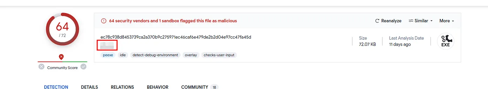

### Result:

Associated File Name: `ab.exe`

# Task 7: **Action on Objective**

**Goal:** Identify what defaced the website `imreallynotbatman.com` and confirm any detection rules triggered by attacker activity.

---

## Step 1 — Inspect Suricata logs for traffic to the webserver

**Why:** I want to see what network traffic involves the webserver (192.168.250.70) and identify suspicious outbound connections that might host the defacement asset.

**Query I ran:**

```
index=botsv1 dest=192.168.250.70 sourcetype=suricata
```


**Observation:** No external IPs in the results (server as destination). I changed direction to find outbound connections.

**Query I ran:**

```
index=botsv1 src=192.168.250.70 sourcetype=suricata
```

**Why the change:** Servers typically are destinations; seeing the server as source indicates it initiated outbound traffic (suspicious in this context).


**Result:** Three external IPs were listed as destinations receiving traffic from the server; a large amount of traffic to those IPs warranted pivoting into each destination.

---

## Step 2 — Pivot into the suspicious destination IP (attacker host)

**Query I ran (example for one dest IP):**

```
index=botsv1 src=192.168.250.70 sourcetype=suricata dest_ip=23.22.63.114
```

**What I looked for:** URL field values and filenames returned by the server’s outbound requests.


**Finding:** The URL field showed two PHP files and one JPEG; the JPEG looked interesting and possibly the defacement image.

---

## Step 3 — Locate the JPEG and its source host

**Query I ran:**

```
index=botsv1 url="/poisonivy-is-coming-for-you-batman.jpeg" dest_ip="192.168.250.70" | table _time src dest_ip http.hostname url
```

**Why this query:** To get the timestamped events, source IP, destination IP, HTTP host (hostname), and the URL for the resource that the webserver requested.


**Result:** The table showed the JPEG `poisonivy-is-coming-for-you-batman.jpeg` was downloaded from the attacker host `prankglassinebracket.jumpingcrab.com` and that this file was the asset used to deface the site.

**Answer — 7.1:** `poisonivy-is-coming-for-you-batman.jpeg`

---

## Step 4 — Check Fortigate logs for SQL attempt detection from attacker IP

**Why:** The exploit chain included reconnaissance and scanning; I needed to confirm whether network security devices detected SQL exploitation attempts from the attacker IP.

**Query I ran:**

```
index=botsv1 sourcetype="fortigate_utm" src=40.80.148.42
```

**What I checked:** The `attack` field values to find which Fortigate rule fired.


**Result:** Fortigate detected an SQL attempt and the rule name that triggered is `HTTP.URI.SQL.Injection`.

**Answer — 7.2:** `HTTP.URI.SQL.Injection`

---

# Task 8: Command and Control Phase

I investigated the C2 activity used to deface the webserver. I started by searching the FortiGate firewall logs for the defacement asset:

**Query I ran:**

```
index=botsv1 sourcetype=fortigate_utm "poisonivy-is-coming-for-you-batman.jpeg"
```

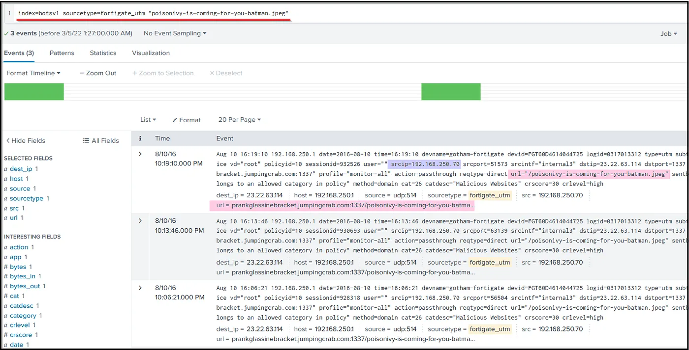

Looking into the Fortinet firewall logs, I see the src IP, destination IP, and URL. Then I looked at the fields on the left panel and the field `url` contains the FQDN (Fully Qualified Domain Name) used by the Attacker.


To verify, I also checked the HTTP stream logs for the same artifact:

- Verification query:
    
    ```
    index=botsv1 sourcetype=stream:http dest_ip=23.22.63.114 "poisonivy-is-coming-for-you-batman.jpeg" src_ip=192.168.250.70
    ```
    


I noted the attacker-controlled domain appearing in both firewall and HTTP logs, and I could also confirm DNS activity against that domain in `stream:dns` if needed.

**Finding (8.1):** `prankglassinebracket.jumpingcrab.com`

# Task 9: Weaponization Phase

I investigated the **Weaponization** phase to gather OSINT on the attacker infrastructure tied to `prankglassinebracket.jumpingcrab.com` and identify related IPs/domains and an associated contact email.

Steps I took:

1. I used **Robtex** to lookup the domain `prankglassinebracket.jumpingcrab.com` to retrieve IPs and related subdomains.
    
    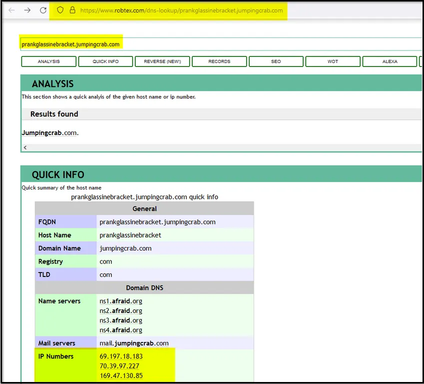
    
    Some domains/subdomains associated with this domain:
    
    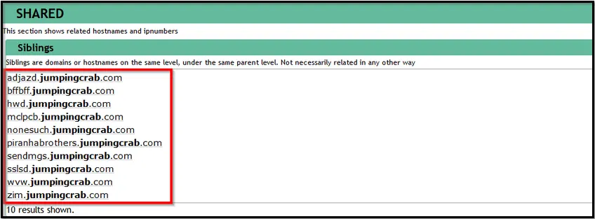
    
2. I queried Robtex for the IP **23.22.63.114** to enumerate domains and related records tied to that IP.
    
    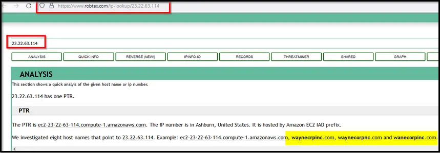
    
    What did I find? this IP is associated with some domains that look pretty similar to **the WAYNE Enterprise** site.
    
    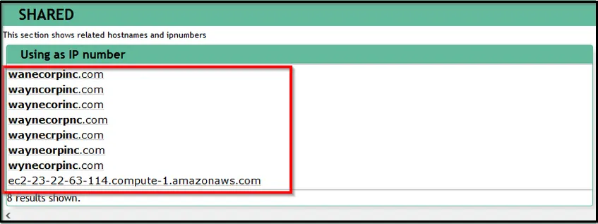
    
3. I used **VirusTotal** to inspect relations for the IP and the domains returned by Robtex.
    - In VirusTotal’s RELATIONS view I observed domains associated with the IP that looked similar to the target company and identified `www.po1s0n1vy.com` among related domains.
        
        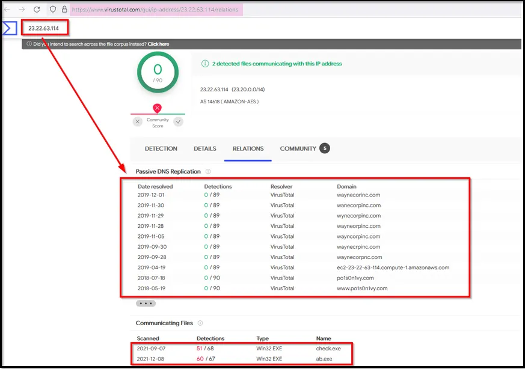
        
    - In the domain list, I saw the domain that is associated with the attacker `www.po1s0n1vy.com` . Let me search for this domain on the virustotal.
        
        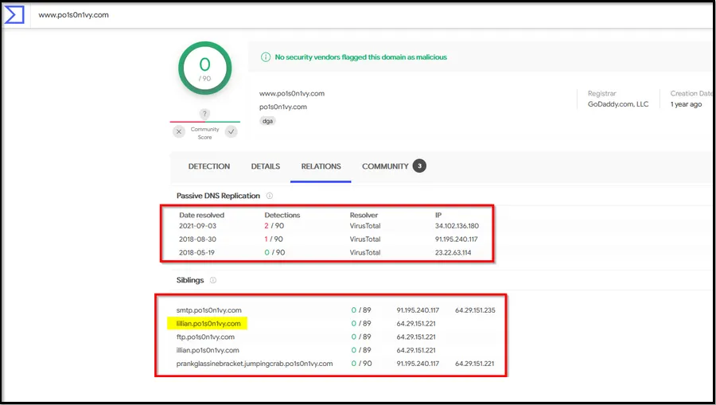
        
4. I checked WHOIS (via DomainTools or similar) for domain registration details to hunt for an associated contact email.
    
    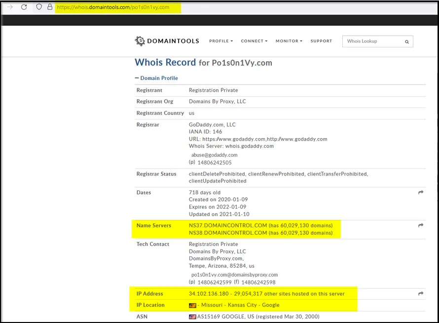
    

Findings / Answers

- **9.1 — IP tied to pre-staged domains:** `23.22.63.114`
- **9.2 — Likely associated email for P01s0n1vy:** `lillian.rose@po1s0n1vy.com` after I used the AlienVault from here https://otx.alienvault.com/indicator/domain/po1s0n1vy.com lookup to get this info.
    
    The site now shows wrong email address:
    
    
    

---

# Task 10: Delivery Phase

**Goal:** Use the adversary indicators (IPs, domains, emails) to find malware linked to the Poison Ivy infrastructure and confirm its metadata from OSINT / threat-hunting platforms.

---

## Step 1 — Identify candidate artifacts on ThreatMiner

I want to search ThreatMiner for artifacts (files/hashes) associated with the attacker IP `23.22.63.114` to find potential malware samples tied to the infrastructure.

**What I did:** I searched ThreatMiner for the IP `23.22.63.114`.

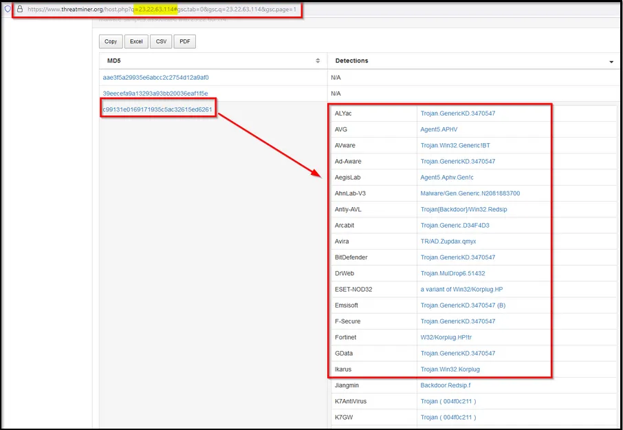

**Observation:** ThreatMiner returned three files associated with that IP. One particular file with MD5 hash `c99131e0169171935c5ac32615ed6261` looked malicious and relevant.

Then I clicked on this MD5 hash value to see the metadata and other important information about this particular file.

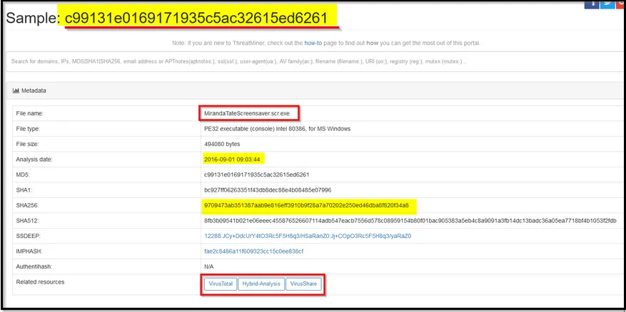

**Result:** Found MD5 `c99131e0169171935c5ac32615ed6261` as a suspicious/malicious artifact.

---

## Step 2 — Verify metadata on VirusTotal

I want to corroborate the file’s metadata, detection names, and community context using VirusTotal.

**What I did:** I opened VirusTotal and searched for the file hash (the MD5 identified on ThreatMiner).

(Example used: the hash from ThreatMiner.)

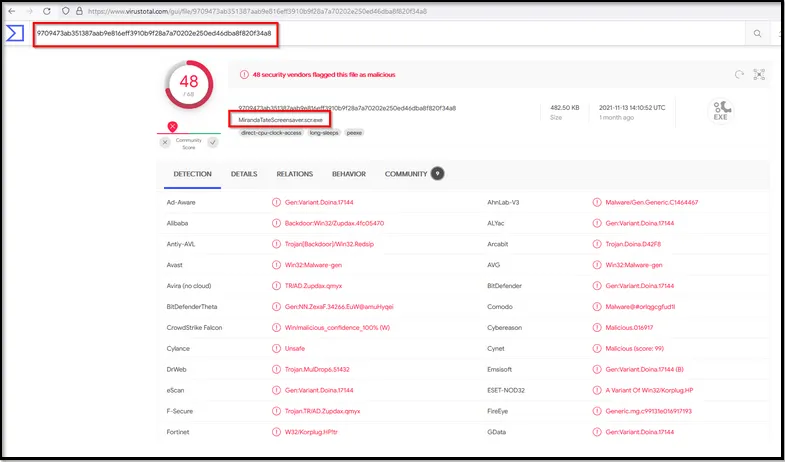

[https://www.notion.so](https://www.notion.so)

**Observation:** VirusTotal provided details about the sample (detections, community comments, and metadata).

**Result:** VirusTotal confirms metadata for the sample associated with the Poison Ivy infrastructure.

---

## Step 3 — Inspect behavior on Hybrid-Analysis

I want to view dynamic behavior — network communications, DNS requests, contacted hosts, MITRE mapping, strings, imports, and screenshots — to understand what the sample does post-execution.

**What I did:** I loaded the sample on Hybrid-Analysis using the file hash found earlier.

**Reference / URL I used:**

https://hybrid-analysis.com/sample/9709473ab351387aab9e816eff3910b9f28a7a70202e250ed46dba8f820f34a8?environmentId=100

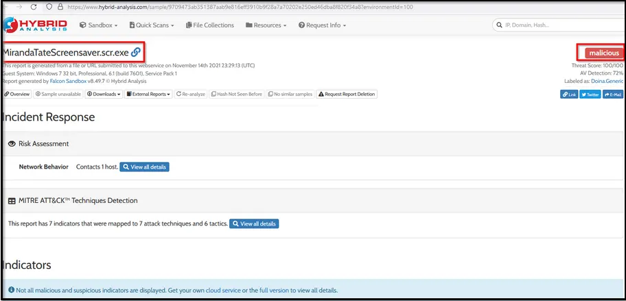

Scrolled down to get more information about this Malware.

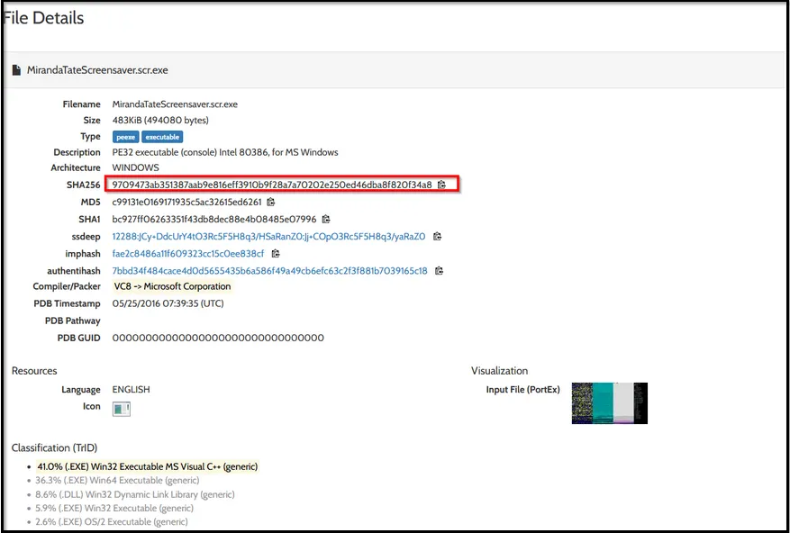

**Observation:** Hybrid-Analysis provided extensive behavior information: network contacts, DNS lookups, MITRE ATT&CK mapping, and other indicators that align the sample with malicious activity.

**Result:** Hybrid-Analysis corroborates the sample’s malicious behavior and links it to Poison Ivy infrastructure.

---

## Answers (from the investigation)

**10.1 — What is the HASH of the Malware associated with the APT group?**

**Answer:** `c99131e0169171935c5ac32615ed6261`

**10.2 — What is the name of the Malware associated with the Poison Ivy Infrastructure?**

**Answer:** `MirandaTateScreensaver.scr.exe`

---

# **Conclusion:**

In this fun exercise, as a SOC Analyst, I investigated a cyber-attack where the attacker had defaced a website '[imreallynotbatman.com](http://imreallynotbatman.com/)' of the Wayne Enterprise. Mapped the attacker's activities into the 7 phases of the Cyber Kill Chain. 

Here’s a recap of everything I have found so far:

1. **Reconnaissance Phase:** 
    
    First I looked at any reconnaissance activity from the attacker to 
    identify the IP address and other details about the adversary.
    
    **Findings:**
    
    - IP Address `40.80.148.42` was found to be scanning our webserver.
    - The attacker was using Acunetix as a web scanner.
2. **Exploitation Phase:** 
    
    **T**hen looked into the traces of exploitation attempts and found brute-force attacks against our server, which were successful.
    
    **Findings:**
    
    - Brute force attack originated from IP `23.22.63.114.`
    - The IP address used to gain access: `40.80.148.42`
    - 142 unique brute force attempts were made against the server, out of which one attempt was successful
3. **Installation Phase:**
    
    Next, I looked at the installation phase to see any executable from the attacker's IP Address uploaded to our server.
    
    **Findings:**
    
    - A malicious executable file `3791.exe` was observed to be uploaded by the attacker.
    - We looked at the sysmon logs and found the MD5 hash of the file.
4. **Action on Objective:**
    
    After compromising the web server, the attacker defaced the website.
    
    **Findings:**
    
    - I examined the logs and found the file name used to deface the webserver.
5. **Weaponization Phase:**
    
    I used various threat Intel platforms to find the attacker's  infrastructure based on the following information I saw in the above activities.
    
    - Domain: `prankglassinebracket.jumpingcrab.com`
    - IP Address:
        
        ```
        23.22.63.114
        ```
        
    
    **Findings:**
    
    - Multiple masquerading domains were found associated with the attacker's IPs.
    - An email of the user `Lillian.rose@po1s0n1vy.com` was also found associated with the attacker's IP address.
6. **Deliver Phase:**
    
    In this phase, I again leveraged online Threat Intel sites to find malware associated with the adversary's IP address, which appeared to be a secondary attack vector if the initial compromise failed.
    
    **Findings:**
    
    - A malware name `MirandaTateScreensaver.scr.exe` was found associated with the adversary.
    - MD5 of the malware was `c99131e0169171935c5ac32615ed6261`

---

# Socials

**Repository:** https://github.com/RahulCyberX/Security-Information-Event-Management

**Medium Article:** https://medium.com/@rahulcyberx/incident-handling-with-splunk-complete-tryhackme-walkthough-d6972cb95af6?source=your_stories_outbox---writer_outbox_published-----------------------------------------

**TryHackMe Profile:** https://tryhackme.com/p/0xRahuL

**Github Profile:** https://github.com/RahulCyberX