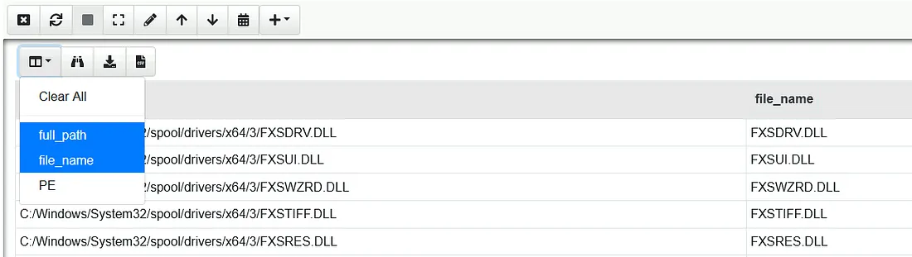

# Velociraptor Vulnerability Detection and Hunting Across Endpoints

## Objectives

- Start **Velociraptor (v0.6.2)** in Instant mode and build a **custom VQL artifact** to detect the PrintNightmare DLL.
- Query the **NTFS Master File Table (MFT)** for PE files under `System32\spool\drivers`.
- Identify the **malicious DLL** and extract its **PDB path** for attribution.

## Tools Used

- VM: [https://tryhackme.com/room/velociraptorhp](https://tryhackme.com/room/velociraptorhp)
- **Velociraptor Instant GUI** (artifact notebook)
- **VQL Functions:**
    - `parse_mft()` → enumerates filesystem records
    - `parse_pe()` → validates Portable Executable files and extracts metadata
- **Regex filter** (`=~`) for targeted folder search

---

# Investigation

**Hunt for a nightmare**

Terminate the previous virtual machine and spawn the virtual machine attached to this task.


**Objective**: Use Velociraptor to create an artifact to detect the [PrintNightmare](https://msrc.microsoft.com/update-guide/vulnerability/cve-2021-34527) vulnerability!

Luckily there is an artifact entry in the [Artifact Exchange](https://docs.velociraptor.app/exchange/). To avoid just copy/pasting the artifact, you will need to construct a very simple VQL query.

Below are steps to construct your VQL query to find the DLL:

- The **Select** clause, the column accessors should be **fullpath** (concatenate **C:/** to the **fullpath** column accessor) and **filename**.
- Make sure the column headers for each column accessor are renamed. **Fullpath** should be **Full_Path**, and for **filename** it should be **File_Name**.
- Use **parse_pe()** to ensure only **PE** files are returned. (Check the [VQL Reference](https://docs.velociraptor.app/vql_reference/))
- Make sure the column header for this plugin should be renamed to PE.
- The **From** clause should use **parse_mft()**.
- The **Where** clause should not return any directories, only return binaries (PE files) and search the directory where this malicious DLL will most likely be found.

The skeleton query below should help you answer the questions below.

**Skeleton Query:**

- SELECT "C:/" + FullPath AS *********,FileName AS *********,parse_pe(file="C:/" + FullPath) AS **
- FROM parse_mft(filename="C:/$***", accessor="****")
- WHERE *** IsDir
- AND FullPath =~ "Windows/System32/spool/drivers"
- AND **

**Note:** You will need to start Velociraptor in "*Instant Velociraptor*" mode. The instructions to do so can be found [here](https://docs.velociraptor.app/docs/deployment/#instant-velociraptor). The virtual machine attached to this task is running Velociraptor version **0.6.2**.

# Velociraptor — PrintNightmare detection walkthrough

**Goal:** Start Velociraptor, find a PrintNightmare detection artifact in the Artifact Exchange, run a VQL query against the MFT to find the malicious DLL, and extract its PDB path.

---

## Starting Velociraptor

I need to start Velociraptor in “Instant” mode. 


I opened a terminal, navigated to the Desktop which contains the Velociraptor executable


Then wrote this command to launch it in GUI

```
Velociraptor.exe gui
```

That opened the browser UI. I clicked **Advanced → Accept the Risk**, clicked OK a few times, and confirmed I saw the “Welcome to Velociraptor!” message.


---


## Step 1 — Locate the PrintNightmare artifact in the Artifact Exchange

I wanted an existing detection artifact for PrintNightmare so I could use known logic to hunt for the malicious files.

I went to the following **Artifact Exchange** page: https://docs.velociraptor.app/exchange/


And then searched for the `PrintNightmare`

Out of the 4 results, this is the only one which had “detection” in its name, which the question asked for.


**Answer:** `Windows.Detection.PrintNightmare`

---

## Step 2 — Build the VQL SELECT clause to inspect files

I needed a SELECT clause that would let me reconstruct a full path from MFT entries and parse PE metadata (so I could spot injected or malicious DLLs and view PDB info).

**The skeleton query is already provided:**


**Select clause I used after changing it accordingly:**

```
SELECT "C:/" + FullPath AS Full_Path,FileName AS File_Name,parse_pe(file="C:/" + FullPath) AS PE
```

**Answer:** `SELECT "C:/" + FullPath AS Full_Path,FileName AS File_Name,parse_pe(file="C:/" + FullPath) AS PE`

---

## Step 3 — Query the MFT for suspicious DLLs in the print spooler drivers

PrintNightmare abuses the print spooler drivers folder. I wanted to search the MFT for files under `Windows/System32/spool/drivers`, exclude directories, and only return entries that successfully parsed as PE files.

**Let’s look at the steps provided to construct VQL query to find a DLL (example):**


This gave me some idea about the clauses, to be able to logically think about how to fill in the blanks in the provided skeleton query to extract the suspicious DLL in the question.

**Let’s again look at the skeleton query which was provided:**


- I already have `SELECT “C:/” + FullPath AS Full_Path,FileName AS File_Name,parse_pe(file=”C:/” + FullPath) AS PE` from the previous question.
    
    
    

- `FROM parse_mft(filename=”C:/$MFT”, accessor=”ntfs”)` because in a previous tasks, there was a mention of `parse_mft` .  It said that filename should mention MFT and accessor should be ntfs,
    
    
    

- `WHERE NOT IsDir` Because we don’t need the results to return any directory, so the blank is filled with NOT.
    
    
    

- This one is fine as it is
    
    
    

- `AND PE` Blank is filled with PE because, PE is the file format for executables, object code, DLLs, FON Font files, and others used in 32-bit and 64-bit versions of Windows operating systems.
    
    
    

**Final/Full query constructed that I can use in the VQL Notebook.**

```
SELECT "C:/" + FullPath AS Full_Path,FileName AS File_Name,parse_pe(file="C:/" + FullPath) AS PE
FROM parse_mft(filename="C:/$MFT", accessor="ntfs")
WHERE NOT IsDir 
AND FullPath =~ "Windows/System32/spool/drivers" 
AND PE
```

I created a Notebook, pasted the VQL, set it to parse as VQL, and executed it.


**Observation:** 

The query returned 29 results, but to make it easier to read, I reduced the information shown:



And ofcourse, one DLL name stood out immediately:


**Answer (DLL placed by the attacker):** `nightmare.dll`

---

## Step 4 — Retrieve the PDB entry for the malicious DLL

The PE parsing output includes debug information like the PDB path; that can reveal build paths or developer info useful for attribution.

From the query results I clicked the `nightmare.dll` entry to view the parsed PE details.


**Answer (PDB entry):**

```
C:\Users\caleb\source\repos\nightmare\x64\Release\nightmare.pdb
```

---

# Lessons Learned

- `parse_pe()` effectively filters legitimate binaries from raw MFT listings, minimizing false positives.
- The **spool drivers directory** is a high-value persistence target due to Print Spooler service privileges.
- PDB paths often expose attacker usernames or internal dev environments — key for profiling threat actors.
- Velociraptor’s **VQL notebooks** are ideal for rapid triage scripting in enterprise forensic workflows.

# Socials

**Repository:** https://github.com/RahulCyberX/Digital-Forensics-Incident-Response

**Medium Article:** https://medium.com/@rahulcyberx/velociraptor-complete-tryhackme-walkthrough-6e921302eb4b?source=your_stories_outbox---writer_outbox_published-----------------------------------------

**TryHackMe Profile:** https://tryhackme.com/p/0xRahuL

**Github Profile:** https://github.com/RahulCyberX