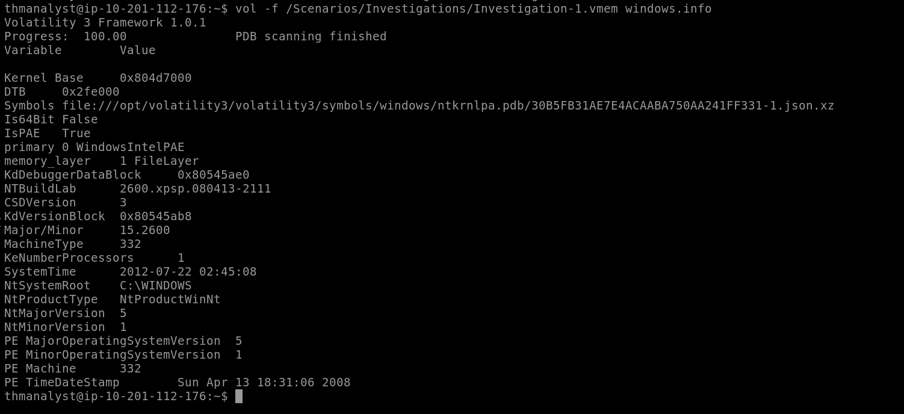

# Volatility Memory Forensics – Code Injection Detection

### Banking Trojan (Case 001) & WannaCry (Case 002)

### Objectives

- Identify OS/build and acquisition time from memory images, then enumerate processes to spot masquerading malware.
- Dump suspicious process memory to extract indicators (User-Agent, paths, mutexes, DLLs) and confirm malware families.
- Reconstruct parent–child launch chains and determine working directories for further artifact enumeration.

### Tools Used

- VM: [https://tryhackme.com/room/volatility](https://tryhackme.com/room/volatility)
- **Volatility 3 (Windows plugins):**
    - `windows.info` (host/build, acquisition time)
    - `windows.pstree` (parent/child process mapping)
    - `windows.memmap --pid ... --dump` (process memory dump)
    - `windows.handles` (mutexes/handles)
    - `windows.filescan` (enumerate files in memory across FS)
- **Triage utilities:** `strings`, `grep` (indicator extraction from dumps)

---

# Investigation

## Case 001

Your SOC has informed you that they have gathered a memory dump from a quarantined endpoint thought to have been compromised by a banking trojan masquerading as an Adobe document. 

Your job is to use your knowledge of threat intelligence and reverse engineering to perform 
memory forensics on the infected host.

You have been informed of a suspicious IP in connection to the file that could be helpful. `41.168.5.140`

The memory file is located in `/Scenarios/Investigations/Investigation-1.vmem`

---

## Preparation — open the memory image and get host info

**Why:** I want to identify the OS/build and acquisition time so I know the environment and timeline before hunting.

**Command I ran:**

It runs the Volatility framework's `windows.info` plugin to extract system information from the memory dump file `Investigation-1.vmem`.

It displays details about the Windows system, such as OS version, build, architecture, and memory layout.

```
vol -f /Scenarios/Investigations/Investigation-1.vmem windows.info
```



**Observation / Result:**

- Build version: `2600.xpsp.080413–2111`
    
    
    
- Memory acquisition time: `2012-07-22 02:45:08`
    
    
    

---

## Step 1 — List processes (parent/child view) to find suspicious process names

**Why:** I want to see processes and their parent relationships to spot non-standard processes running from userland (e.g., something masquerading as Adobe).

**Command I ran:**

Runs the Volatility framework's `windows.pstree` plugin to display the process tree from the memory dump file `Investigation-1.vmem`.

It shows the hierarchy of running processes, including their PIDs, parent-child relationships, and process names.

```
vol -f /Scenarios/Investigations/Investigation-1.vmem windows.pstree
```


**Observation:** I inspected the process tree and identified a non-standard/odd process `reader_sl.exe` running under explorer.exe.

**Findings:**

- Suspicious process: `reader_sl.exe`
- Parent process: `explorer.exe`
- PID (suspicious): `1640`
- Parent PID: `1484`

---

## Step 2 — Dump the suspicious process memory and search for network indicators (User-Agent, domains)

**Why:** The binary may hold network strings (user-agent, C2 URLs, bank domains). I’ll dump the process memory and run `strings` to extract readable indicators.

**Commands I ran:**

This command uses the Volatility framework to extract the memory contents of a specific process (PID 1640) from a memory dump file (Investigation-1.vmem) and saves it to a file (pid.1640.dmp) in the /tmp directory.

```
vol -f /Scenarios/Investigations/Investigation-1.vmem -o /tmp windows.memmap.Memmap --pid 1640 --dump
```

- **`vol`**: The command to invoke Volatility, a Python-based framework for analyzing memory dumps from various operating systems.
- **`f /Scenarios/Investigations/Investigation-1.vmem`**: Specifies the input memory dump file to analyze. Here, Investigation-1.vmem is the memory image file located in the /Scenarios/Investigations/ directory.
- **`o /tmp`**: Sets the output directory where Volatility will save the extracted files. In this case, files will be saved to the /tmp directory.
- **`windows.memmap.Memmap`**: Specifies the Volatility plugin to use.
    
    The `windows.memmap.Memmap` plugin maps the memory of a specific process and extracts its contents. It is used to dump the memory pages associated with a given process ID (PID).
    
- **`-pid 1640`**: Specifies the process ID (PID) of the process whose memory will be extracted. In this case, the command targets the process with PID 1640.
- **`-dump`**: Instructs Volatility to dump the memory contents of the specified process to a file. The output file will be named pid.1640.dmp and saved in the /tmp directory (based on the -o /tmp option).


After extraction is done, I search for User-Agent strings. 

```
strings /tmp/pid.1640.dmp | grep -i "user-agent" 
```

**Observation / Result:**


- Found the User-Agent string used by the adversary:
    
    `Mozilla/5.0 (Windows; U; MSIE 7.0; Windows NT 6.0; en-US)`
    

**Additional check:** I searched for bank names/strings and confirmed multiple hits for `chase`, indicating Chase Bank was referenced.


**Answer — 10.8:** `y`

---

# Case 002 — That Kind of Hurt my Feelings

You have been informed that your corporation has been hit with a chain of ransomware that has been hitting corporations internationally. Your team has already retrieved the decryption key and recovered from the attack. Still, your job is to perform post-incident analysis and identify what actors were at play and what occurred on your systems. You have been provided with a raw memory dump from your team to begin your analysis.

The memory file is located in `/Scenarios/Investigations/Investigation-2.raw`

---

## Preparation — open the memory image and list processes

**Why:** I need a process tree to find suspicious process names that resemble ransomware.

**Command I ran:**

```
vol -f /Scenarios/Investigations/Investigation-2.raw windows.pstree
```

**Observation / Result:**


- I found a suspicious process with a name indicating the decryptor: `@WanaDecryptor@` running at PID `740`.

**Answer — 10.9:** `@WanaDecryptor@`

---

## Step 1 — Dump the decryptor process memory to get full path and context

I want the binary path on disk to know where it ran from.

**Commands I ran:**

Same as the previous case. I am searching for keyword wana because its the suspicious process we found in previous step. 

```
vol -f /Scenarios/Investigations/Investigation-2.raw -o /tmp windows.memmap.Memmap --pid 740 --dump
strings /tmp/pid.740.dmp | grep -i wana
```

**Observation / Result:**


- Full path found in the dumped memory:

**Answer — 10.10:** `C:\Intel\ivecuqmanpnirkt615\@WanaDecryptor@.exe`

---

## Step 2 — Identify parent process and parent PID of the decryptor

**Why:** Finding the parent process helps me map how the ransomware was launched (scheduler, service, or user process).

**Command I ran (reused):**

```
vol -f /Scenarios/Investigations/Investigation-2.raw windows.pstree
```

**Observation / Result:**


- Parent process: `tasksche.exe`
- Parent PID: `1940`

**Answer — 10.11:** `tasksche.exe`

**Answer — 10.12:** `1940`

---

## Step 3 — Identify the ransomware family and corroborate with indicators (DLLs, mutexes)

**Why:** Behavior, filenames, mutexes and loaded libraries point to a malware family.

**Finding from process name and artifacts:**

- Malware family: **WannaCry**

**Answer — 10.13:** `WannaCry`

**Network/socket helper DLL used by the decryptor (socket creation):**


Source: https://www.netsecurity.com/wannacry-ransomware-explained/

**Answer — 10.14:** `ws2_32.dll`

**Known malware mutex found via handles plugin:**

Command used:

```
vol -f /Scenarios/Investigations/Investigation-2.raw windows.handles --pid 1940 | grep -i "1940”
```

I used the `windows.handles` plugin per the hint.


**Answer — 10.15:** `MsWinZonesCacheCounterMutexA`

---

## Step 4 — What plugin could be used to identify all files loaded from the malware working directory in Case 002?

I want to know which Volatility plugin to use next to enumerate files originating from the ransomware working directory.

Command I ran:

```
vol -h | grep “windows.”
```


**Answer — 10.16:** `windows.filescan`

---

# Lessons Learned

- Parent–child views (`windows.pstree`) quickly surface masquerades (e.g., `reader_sl.exe` under `explorer.exe`, `@WanaDecryptor@` spawned by `tasksche.exe`).
- Process dumps plus `strings` reliably expose network IOCs (e.g., UA: `Mozilla/5.0 ... MSIE 7.0 ...`, bank keywords) and disk paths for binaries.
- Ransomware traits confirm family attribution: WannaCry indicators include `@WanaDecryptor@`, socket use via `ws2_32.dll`, and mutex `MsWinZonesCacheCounterMutexA`.
- Use `windows.filescan` next to list files tied to a malware working directory for follow-on containment and intel collection.
- Correlating build/time from `windows.info` with process/handle artifacts produces a defensible incident narrative.

# Socials

**Repository:** https://github.com/RahulCyberX/Digital-Forensics-Incident-Response

**Medium Article:** https://medium.com/@rahulcyberx/volatility-complete-tryhackme-walkthrough-ac67b04e03c3?source=your_stories_outbox---writer_outbox_published-----------------------------------------

**TryHackMe Profile:** https://tryhackme.com/p/0xRahuL

**Github Profile:** https://github.com/RahulCyberX