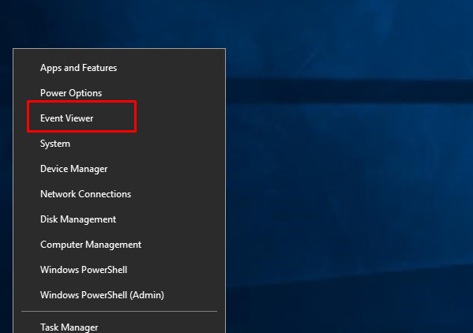
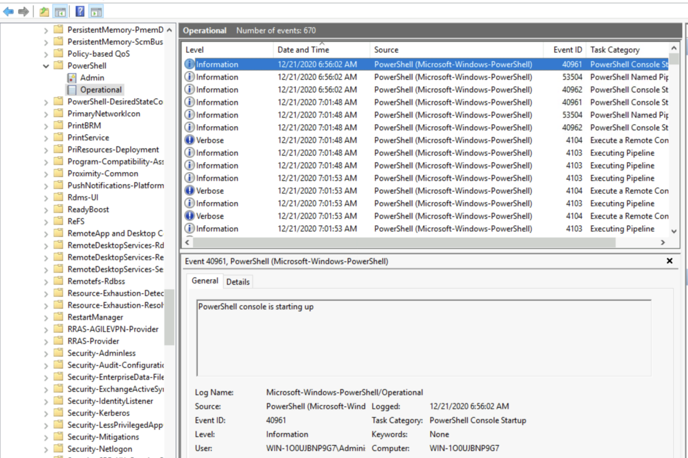
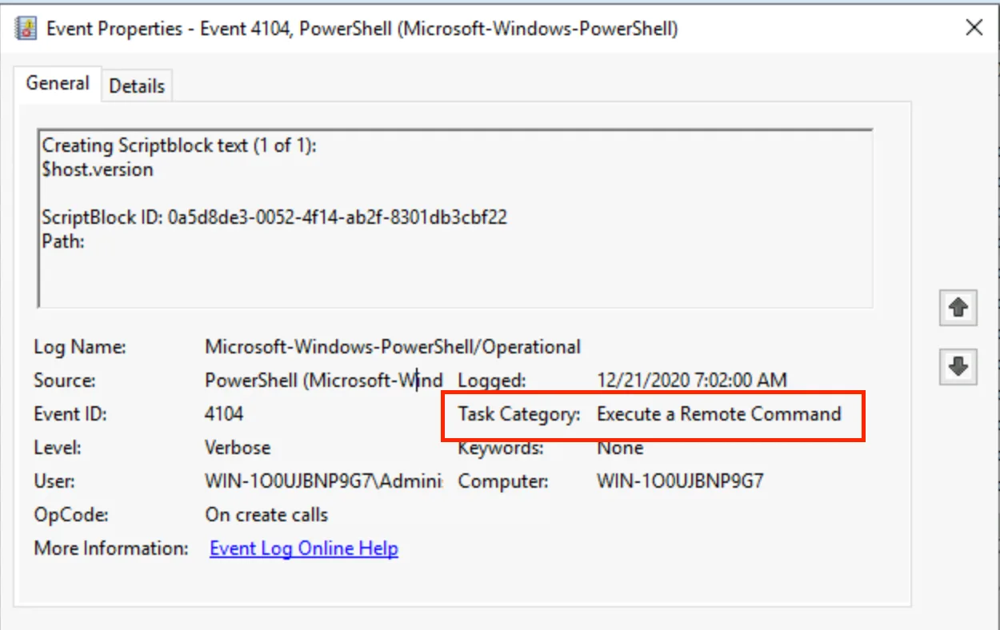
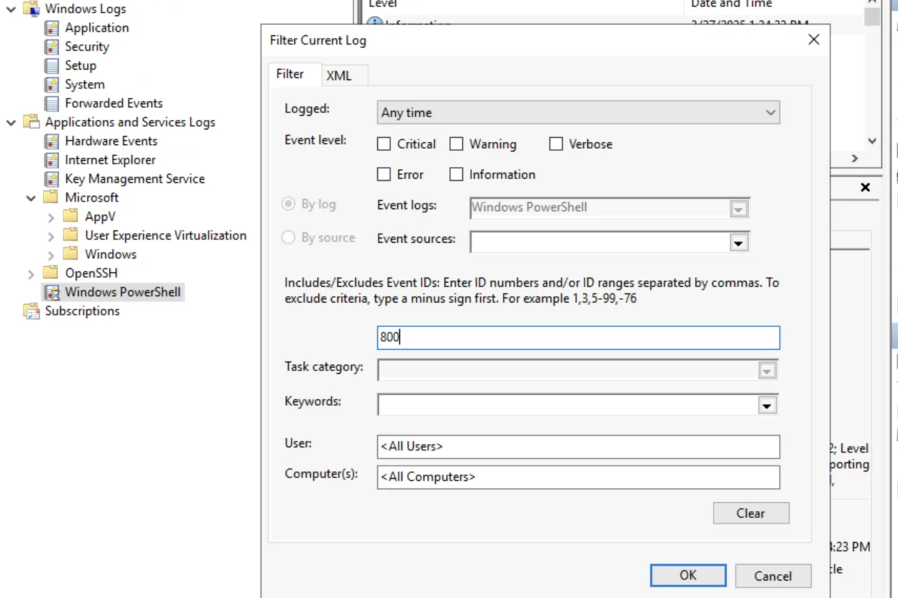
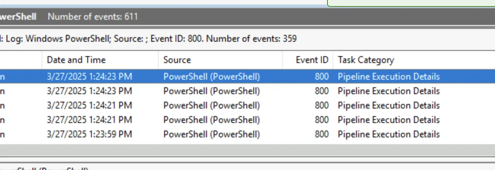
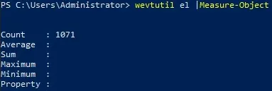
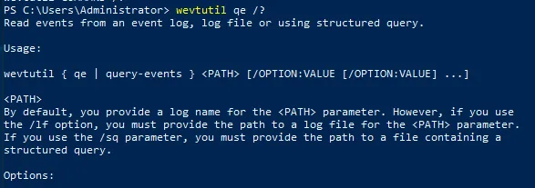
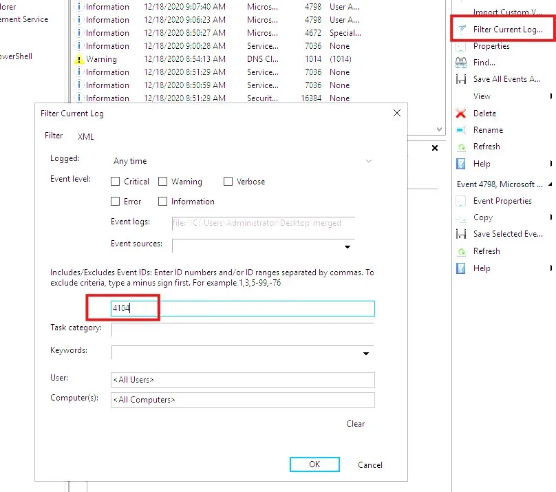
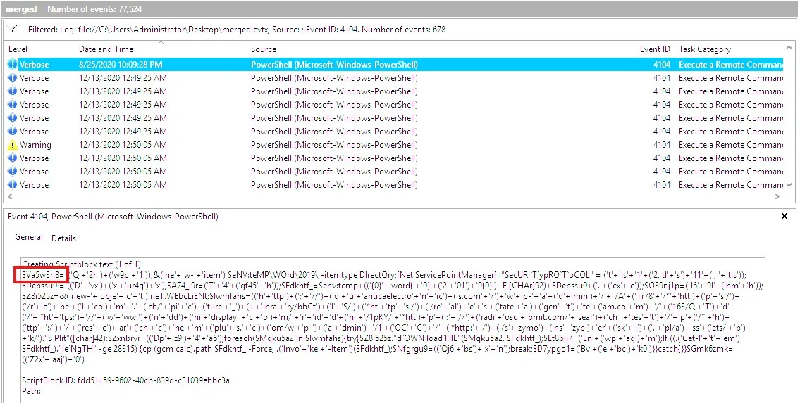
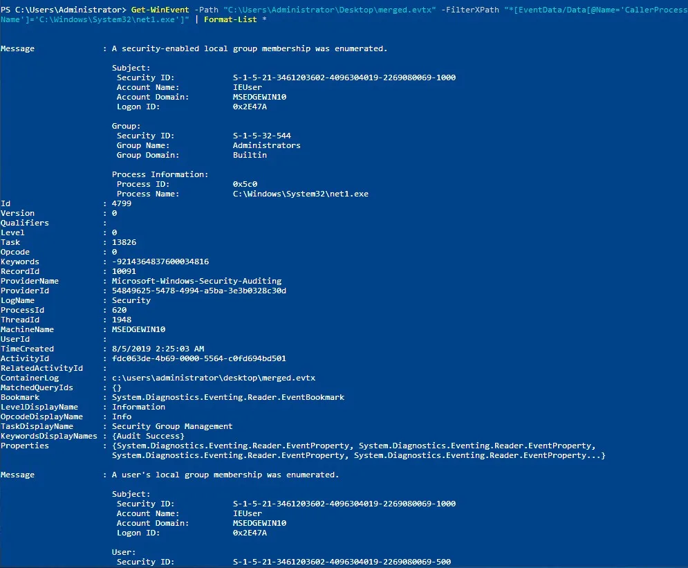

# Windows Event Log Analysis with PowerShell and wevtutil

# Objectives

- Mastered Windows Event Log analysis inside TryHackMe’s isolated Windows VM to go from zero to full incident response using only built-in tools.
- Navigated Event Viewer, scripted queries with wevtutil.exe and Get-WinEvent, built surgical XPath filters, and hunted real attacks inside a merged.evtx file.
- Detected PowerShell downgrade (ID 400), log clearing (ID 104), Emotet malware (ID 4104), and unauthorized local group enumeration (ID 4799)—all without installing anything extra.
- Proved I can now turn thousands of raw events into timelines, IOCs, and answers in minutes.
- Virtual Machine: https://tryhackme.com/room/windowseventlogs

# Tools Used

- **Event Viewer** (eventvwr.msc, filtering, XML details)
- **wevtutil.exe** (el, qe, /q XPath, /lf, /rd, /c)
- **PowerShell Get-WinEvent** (-ListLog, -ListProvider, -FilterHashtable, -FilterXPath, -Path for .evtx)
- **XPath queries** (EventID, Provider, TimeCreated, EventData/Data[@Name])
- **Where-Object + Format-List** (post-filter cleanup on saved logs)

# Investigation

## Task 1: What are Event Logs?

Event logs track system activities and help to diagnose issues. They’re essential for system administrators, IT technicians, and security professionals because they give insights into system behavior. This is especially useful for applications with minimal user interaction, like servers.

From a cybersecurity perspective (as a blue teamer), I can correlate logs across multiple sources using statistical analysis to detect threats. Security Information and Event Management (SIEM) tools such as **Splunk** and **Elastic** make this process easier by centralizing logs from many endpoints, allowing efficient detection and investigation.

Even though my main focus here is **Windows Event Logs**, other OS also have their own logging systems:

- Linux → **Syslog**
- macOS → built-in logging system

---

## Task 2: Event Viewer

### Understanding Windows Event Logs

Windows Event Logs are stored in a **binary format** (`.evt` or `.evtx`). This means I cannot just open them in a text editor. However, I can translate them into **XML** using the Windows API.

Logs are divided into categories:

- **System Logs** → OS-related events
- **Security Logs** → logon/logoff activity & security events
- **Application Logs** → installed applications
- **Directory Service Events** → Active Directory changes
- **File Replication Service Events** → Group Policy + logon script sharing
- **DNS Event Logs** → DNS activities
- **Custom Logs** → application-specific events

Each log can contain different **event types** (documented by Microsoft).

### Accessing Event Logs

I can access them using:

- **Event Viewer** (GUI tool)
- **wevtutil.exe** (Command-line)
- **Get-WinEvent** (PowerShell cmdlet)

### Event Viewer Overview

Event Viewer is an **MMC snap-in** that I can launch with `eventvwr.msc`. It has 3 panes:

- **Left Pane** → hierarchical tree of log providers
- **Middle Pane** → overview of events for selected provider
- **Right Pane (Actions Pane)** → options to filter, save, and manage logs

Features I used:

- **Log Properties** → shows log size, path, creation time, and rotation settings
- **Filtering** → I could filter by event ID (e.g., PowerShell Event ID `4103`)
- **Remote Access** → connect to logs from another computer

---

### Questions (Task 2)

**Q1: What is the Event ID for the earliest recorded event?**

Steps I followed:

1. Started Event Viewer → `Right click Windows icon > Event Viewer`.
    
    
    
2. Navigated: `Applications and Service Logs → Windows → PowerShell → Operational`.
    
    
    
3. Sorted by **Date and Time** in ascending order.
4. The earliest event ID was on top.

---

**Q2: Filter on Event ID 4104. What was the 2nd command executed in the PowerShell session?**

Steps I followed:

1. In the Actions Pane → **Filter Current Log**.
2. Entered **4104** in Event ID filter.
    
    
    
3. Sorted by **Date and Time** ascending.
4. Looked at the second row.
5. Under **General**, the command was visible.
    
    
    

---

**Q3: What is the Task Category for Event ID 4104?**

- Opened Event properties.
- Looked under Task Category.
    
    
    

---

**Q4: Analyze the Windows PowerShell log. What is the Task Category for Event ID 800?**

Steps I followed:

1. Navigated to: `Applications and Services Logs → Windows PowerShell`.
2. Filtered on **Event ID 800**.
    
    
    
3. Checked the 5th column.
    
    
    

## Task 3: wevtutil.exe

`wevtutil.exe` is a **Windows command-line utility** for managing and querying event logs. I prefer this tool for automation because I don’t have to manually click through Event Viewer.

### Key Features

- **List & Manage Logs**
    - `enum-logs` → list logs
    - `get-log` → view log config
    - `set-log` → modify log settings
- **Manage Publishers**
    - `enum-publishers` → list event publishers
    - `get-publisher` → view publisher info
- **Install/Uninstall Manifests**
    - `install-manifest`, `uninstall-manifest`
- **Query Logs**
    - `query-events (qe)` → read events
- **Log Operations**
    - `export-log`, `archive-log`, `clear-log`

Common options:

- `/r:COMPUTER_NAME` → remote execution
- `/u:USERNAME /p:PASSWORD` → authentication
- `/uni:true` → Unicode output

### Example Syntax

```powershell
wevtutil qe LOG_NAME /q:"QUERY" /f:FORMAT
```

---

### Questions (Task 3)

**Q1: How many log names are in the machine?**

Steps I followed:

```powershell
wevtutil el | Measure-Object
```

- `Measure-Object` is like wc in Linux for counting the objects.
    
    
    

---

**Q2: What event files would be read when using the query-events command?**



---

**Q3: What option would you use to provide a path to a log file?**


**Answer: /lf:true**

---

**Q4: What is the VALUE for /q?**


---

**Q5: Based on `wevtutil qe Application /c:3 /rd:true /f:text`**


- **Log name?** → `Application`
- **/rd option?** → event read direction
    
    
    
- **/c option?** → maximum number of events to read
    
    
    

---

## Task 4: Get-WinEvent

`Get-WinEvent` is a **PowerShell cmdlet** that retrieves events from logs. It’s newer and more powerful than `Get-EventLog`. It supports advanced filtering like **XPath**, **XML**, and **hash tables**.

### Usage Examples

- **List all logs**

```powershell
Get-WinEvent -ListLog *
```

- **List providers**

```powershell
Get-WinEvent -ListProvider *
```

- **Filter with Where-Object**

```powershell
Get-WinEvent -LogName Application | Where-Object { $_.ProviderName -Match 'WLMS' }
```

- **Efficient filtering with hash tables**

```powershell
Get-WinEvent -FilterHashtable @{ LogName='Application'; ProviderName='WLMS' }
```

- **Filter by Event ID & message**

```powershell
Get-WinEvent -FilterHashtable @{LogName='Microsoft-Windows-PowerShell/Operational'; ID=4104} |
Select-Object -Property Message | Select-String -Pattern 'SecureString'
```

---

### Questions (Task 4)

**Q1: Names of logs related to OpenSSH?**

```jsx
Get-WinEvent -ListLog *
```

It gives a long list, but at the near bottom I see two OpenSSH related logs.


---

**Q2: What is the name of the 3rd log provider (search PowerShell)?**

```jsx
Get-WinEvent -ListProvider **PowerShell**
```


**Answer: Microsoft-Windows-PowerShell-DesiredStateConfiguration-FileDownloadManager**

---

**Q3: How many event IDs for Microsoft-Windows-PowerShell provider?**

Steps I followed:

```powershell
(Get-WinEvent -ListProvider Microsoft-Windows-PowerShell).Events |
Format-Table Id, Description
```

A long list will be displayed shortly. Now I need to pipe to the Measure-Object cmdlet.

```jsx
(Get-WinEvent -ListProvider Microsoft-Windows-PowerShell).Events | Format-Table Id, Description | Measure-Object
```


---

**Q4: How do you specify number of events?**

**Answer: `-MaxEvents`**

---

**Q5: When filtering by Level, what is the value for Informational?**

Values for levels:

- Verbose = 5
- **Informational** = 4
- Warning = 3
- Error = 2
- Critical = 1
- LogAlways = 0

---

## Task 5: XPath Queries

When working with **Windows Event Logs**, I can use **XPath queries** to filter and retrieve specific events more efficiently. Both the **Event Viewer**, **wevtutil.exe**, and **Get-WinEvent** in PowerShell support XPath-based filtering.

---

### Understanding XPath Queries

- **Structure**
    - XPath queries usually start with  or `Event` and then navigate the XML structure of the event log.
- **Basic Query Example**
    
    ```xml
    *[System[(Level <= 3) and TimeCreated[timediff(@SystemTime) <= 86400000]]]
    ```
    
    🔹 This retrieves all events with severity `≤ 3` from the last 24 hours.
    

---

### Using `Get-WinEvent` in PowerShell

1. **Query by Event ID**
    
    ```powershell
    Get-WinEvent -LogName Application -FilterXPath '*/System/EventID=100'
    ```
    
2. **Query by Provider Name**
    
    ```powershell
    Get-WinEvent -LogName Application -FilterXPath '*/System/Provider[@Name="WLMS"]'
    ```
    
3. **Combine Queries (Event ID + Provider)**
    
    ```powershell
    Get-WinEvent -LogName Application -FilterXPath '*/System/EventID=101 and */System/Provider[@Name="WLMS"]'
    ```
    
4. **Query EventData (TargetUserName)**
    
    ```powershell
    Get-WinEvent -LogName Security -FilterXPath '*/EventData/Data[@Name="TargetUserName"]="System"' -MaxEvents 1
    ```
    

---

### Using `wevtutil.exe`

To query directly from the command line:

```bash
wevtutil.exe qe Application /q:*/System[EventID=100] /f:text /c:1
```

---

### Questions

### Q1. Using the knowledge gained on Get-WinEvent and XPath, what is the query to find **WLMS events** with a **System Time of 2020-12-15T01:09:08.940277500Z**?

- First, I know from theory that filtering by Provider WLMS looks like:
    
    ```powershell
    Get-WinEvent -LogName Application -FilterXPath '*/System/Provider[@Name="WLMS"]'
    ```
    
    
    
- Next, I need to filter on **System Time**, which is stored inside the `TimeCreated` XML element.
- Syntax:
    
    ```xml
    */System/TimeCreated[@SystemTime="..."]
    ```
    
- I combine both with `and`:

```powershell
Get-WinEvent -LogName Application -FilterXPath '*/System/Provider[@Name="WLMS"] and */System/TimeCreated[@SystemTime="2020-12-15T01:09:08.940277500Z"]'
```


✅ **Answer:**

`Get-WinEvent -LogName Application -FilterXPath ‘*/System/Provider[@Name=”WLMS”] and */System/TimeCreated[@SystemTime=”2020-12-15T01:09:08.940277500Z”]’`

---

### Q2. Using Get-WinEvent and XPath, what is the query to find a user named **Sam** with a **Logon Event ID of 4720**?

- Step 1: Find user “Sam” in `TargetUserName` under `<EventData>`:
    
    ```powershell
    Get-WinEvent -LogName Security -FilterXPath '*/EventData/Data[@Name="TargetUserName"]="Sam"'
    ```
    
    
    
- Step 2: Filter only `EventID=4720`:
    
    ```powershell
    Get-WinEvent -LogName Security -FilterXPath '*/System/EventID="4720"'
    
    ```
    
- Step 3: Combine both with `and`:

```powershell
Get-WinEvent -LogName Security -FilterXPath '*/EventData/Data[@Name="TargetUserName"]="Sam" and */System/EventID="4720"'
```


✅ **Answer:**

`Get-WinEvent -LogName Security -FilterXPath ‘*/EventData/Data[@Name=”TargetUserName”]=”Sam” and */System/EventID=”4720″’`

---

### Q3. Based on the previous query, how many results are returned?

- I run the above query.
- Output: **Two events found**.

---

### Q4. Based on the output from the previous query, what is Message?

- I check the event details in the output.
- The **Message** states:`A user account was created`

---

### Q5. Still working with Sam, what time was **Event ID 4724** recorded?

- I modify the query to check for EventID `4724`:

```powershell
Get-WinEvent -LogName Security -FilterXPath '*/EventData/Data[@Name="TargetUserName"]="Sam" and */System/EventID="4724"'
```


- Running it gives the event with timestamp.

---

### Q6. What is the Provider Name?

- From the event output, I check the first line which contains Provider info.
    
    
    

---

## Task 6: Event ID

When doing log monitoring and threat hunting, I need to know which **Event IDs** are important. No single list is complete, but there are several key resources:

- **Windows Logging Cheat Sheet** (Windows 7–2012) – Useful for common IDs like **7045** (new service installation).
- **NSA “Spotting the Adversary with Windows Event Log Monitoring”** – Covers events such as **2006/2033** (firewall rule deletions).
- **MITRE ATT&CK Framework** – Provides mappings (e.g., T1098 Account Manipulation).
- **Microsoft’s “Events to Monitor” & “Security Auditing Reference”** – Official documentation covering 700+ event IDs.

### Additional Monitoring Features

- **PowerShell Logging** – Needs enabling via Group Policy to detect PowerShell anomalies.
- **Audit Process Creation (4688)** – Tracks command-line process execution.

---

## Task 7: Putting Theory into Practice

Here, I worked with the provided **merged.evtx** log file to detect suspicious activity. Each scenario focused on different adversary behaviors.

---

## Scenario 1 – Detecting PowerShell Downgrade Attack

### Q1. What event ID is to detect a PowerShell downgrade attack?

- I researched downgrade attacks: they force PowerShell into an older version to bypass security.
- From [Lee Holmes’ blog](https://www.leeholmes.com/detecting-and-preventing-powershell-downgrade-attacks), I learned **Event ID 400** (Windows PowerShell log) is the indicator.

---

### Q2. What is the Date and Time this attack took place?

- I queried the saved log for Event ID 400:

```powershell
Get-WinEvent -Path "C:\Users\Administrator\Desktop\merged.evtx" | Where-Object { $_.Id -eq 400 }
```

- Note: `FilterHashtable` doesn’t work with saved `.evtx` files, so I used `Where-Object`.
    
    
    
- Output showed the event at **12/18/2020 7:50:33 AM**.
- I also confirmed with XPath:

```powershell
Get-WinEvent -Path "C:\Users\Administrator\Desktop\merged.evtx" -FilterXPath "*[System/EventID=400]"
```


✅ **Answer:** `12/18/2020 7:50:33 AM`

---

## Scenario 2 – Detecting Event Log Clearing

### Q3. A Log clear event was recorded. What is the ‘Event Record ID’?

- From **MITRE ATT&CK T1070.001**, I found clearing logs generates specific events:
    - Security log clear → **1100/1102**
    - System log clear → **104**
- I queried for Event ID 104:

```powershell
Get-WinEvent -Path "C:\Users\Administrator\Desktop\merged.evtx" -FilterXPath "*[System/EventID=104]" | Select-Object RecordId, TimeCreated, Message
```


- Result showed **RecordId = 27736**.

---

### Q4. What is the name of the computer?

- I modified the query to also show MachineName:

```powershell
Get-WinEvent -Path "C:\Users\Administrator\Desktop\merged.evtx" -FilterXPath "*[System/EventID=104]" | Select-Object RecordId, TimeCreated, Message, MachineName
```


- Output gave me the hostname: **PC01.example.corp**.

---

## Scenario 3 – Investigating Emotet Malware

### Q5. What is the name of the first variable within the PowerShell command?

- Emotet uses malicious PowerShell scripts, logged as **Event ID 4104**.
- I queried with:

```powershell
Get-WinEvent -Path "C:\Users\Administrator\Desktop\merged.evtx" -FilterXPath '*[System/EventID=4104]' | Select-Object RecordId, TimeCreated, Message
```

- This didn’t directly expose **ScriptBlockText**, so I switched to the Event Viewer GUI:
    - Opened `merged.evtx`.
    - Applied filter → `Event ID = 4104`.
        
        
        
    - Sorted by Date/Time and checked the **first event**.
- Inside the details, under ScriptBlockText, I found the variable.
    
    
    

✅ **Answer:** `$Va5w3n8`

---

### Q6. What is the Date and Time this attack took place?

- From the same event details in Event Viewer, I confirmed the timestamp.

✅ **Answer:** `8/25/2020 10:09:28 PM`

---

### Q7. What is the Execution Process ID?

- In the same event’s **Details tab**, the **Execution ProcessID** field was shown as **6620**.

✅ **Answer:** `6620`

---

## Scenario 4 – Intern Running Unauthorized Commands

### Q8. What is the Group Security ID of the group she enumerated?

- Suspicion: intern ran `net1.exe` to enumerate Administrators group.
- I queried logs filtering for **CallerProcessName = net1.exe**:

```powershell
Get-WinEvent -Path "C:\Users\Administrator\Desktop\merged.evtx" -FilterXPath "*[EventData/Data[@Name='CallerProcessName']='C:\Windows\System32\net1.exe']"
```

- Verified with:

```powershell
Get-WinEvent -Path "C:\Users\Administrator\Desktop\merged.evtx" -FilterXPath "*[EventData/Data[@Name='CallerProcessName']='C:\Windows\System32\net1.exe']" | Format-List *
```



- In the event details, under **Group Info**, I found the SID: **S-1-5-32-544**.

### Q9. What is the event ID?

- From the same event, the Event ID was listed as **4799**.

---

# Lessons Learned

- Event Viewer GUI is fine for one-offs, but Get-WinEvent + XPath is the real DFIR superpower.
- FilterHashtable dies on .evtx files—always fall back to Where-Object or XPath when offline.
- Event ID 4104 ScriptBlockText hides the juiciest PowerShell payloads—never stop at the summary.
- Log clearing always leaves a trace (1102/104)—attackers can’t fully hide.
- XPath *[@Name="TargetUserName"]="Sam" beats regex every time for precision.
- Safe VM + merged.evtx = I just investigated four real attacks without ever touching a production box.

# Socials

**Repository:** https://github.com/RahulCyberX/Endpoint-Security-Monitoring

**Medium Article:** https://medium.com/@rahulcyberx/windows-event-logs-endpoint-security-monitoring-thm-2025-4640daad26db?source=your_stories_outbox---writer_outbox_published-----------------------------------------

**TryHackMe Profile:** https://tryhackme.com/p/0xRahuL

**Github Profile:** https://github.com/RahulCyberX