# Windows Registry, NTFS Forensics – $MFT and $UsnJrnl Parsing

## Objectives

- Explore advanced Windows forensic artifacts beyond the registry to uncover evidence of execution, file/folder usage, and external device connections.
- Analyze and compare FAT, exFAT, and NTFS file systems, including their structures, limitations, and system files such as `$MFT`, `$Boot`, and `$UsnJrnl`.
- Perform hands-on analysis with Eric Zimmerman’s forensic tools to parse file system metadata, recover deleted files, and extract program execution traces.
- Investigate prefetch files, jump lists, and Windows 10 Timeline data to reconstruct user activity and file access patterns.
- Identify USB device connections and timestamps from low-level system logs to correlate user actions with external device activity.

## Tools Used

- VM: [https://tryhackme.com/room/windowsforensics2](https://tryhackme.com/room/windowsforensics2)
- **Eric Zimmerman’s Tools Suite:**
    - `MFTECmd.exe` – Parse NTFS Master File Table and $Boot data.
    - `PECmd.exe` – Extract execution history from Prefetch files.
    - `WxTCmd.exe` – Analyze Windows 10 Timeline database (`ActivitiesCache.db`).
    - `JLECmd.exe` – Parse Jump Lists for opened files and folders.
    - `LECmd.exe` – Extract information from shortcut (.lnk) files.
    - `EZviewer` – View CSV outputs.
- **Autopsy** – Recover deleted files and view browser history artifacts.
- **File System Artifacts:**
    - `$MFT`, `$Boot`, `$UsnJrnl`, Prefetch files (`.pf`), Jump Lists, `.lnk` shortcuts, and `setupapi.dev.log`.
- **Windows File Systems:** FAT12/16/32, exFAT, NTFS.

## Task 1: Introduction


In this room, I learned more advanced **Windows Forensics** concepts beyond the registry. Previously, I practiced extracting forensic artifacts from the Windows Registry — gathering system and user information, file/folder usage, executed programs, and connected external devices.

Here, I explored **other areas where forensic artifacts exist**, learned about **different Windows file systems**, and identified **locations and artifacts** related to:

- Evidence of execution
- File/folder usage or knowledge
- External device usage

I also covered **basics of deleted file recovery** and used **Eric Zimmerman’s tools** (Registry Explorer, ShellBags Explorer, and Autopsy) for analysis.

---

## Task 2: The FAT File Systems


### Understanding FAT

A storage device (HDD, USB, etc.) is just a collection of bits. To make sense of it, **file systems** organize these bits into meaningful structures.

The **File Allocation Table (FAT)** is one of these file systems, used since the 1970s by Microsoft. It creates a **table** that indexes where bits of each file are located.

**Main Data Structures in FAT:**

- **Clusters:** Basic storage units containing file data.
- **Directory:** Holds file identification info (name, starting cluster, length).
- **File Allocation Table:** A linked list tracking cluster usage and order.

In short, bits → clusters → directories → files.

---

### FAT12, FAT16, FAT32

Each FAT version uses a different number of bits for addressing clusters:

| Attribute | FAT12 | FAT16 | FAT32 |
| --- | --- | --- | --- |
| Addressable bits | 12 | 16 | 28 |
| Max clusters | 4,096 | 65,536 | 268,435,456 |
| Supported cluster sizes | 512B–8KB | 2KB–32KB | 4KB–32KB |
| Max volume size | 32MB | 2GB | 2TB |

> ⚙️ Note: Windows limits FAT32 formatting to 32GB, but larger volumes formatted on other OSs still work in Windows.
> 

FAT12 is rare today; FAT16 and FAT32 remain common in **USBs, SD cards, and digital cameras**, though limited by the **4GB max file size**.

---

### exFAT File System

To overcome FAT32’s 4GB file size limit, Microsoft created **exFAT** — lighter and more efficient for digital media devices.

- Default for SD cards >32GB
- Supports **4KB–32MB clusters**
- Max file/volume size: **128PB**
- Up to **2,796,202 files per directory**

---

**Answers:**

- **2.1** FAT32 addressable bits → `28`
- **2.2** FAT32 max file size → `4 GB`
- **2.3** File system used by cameras/SD cards → `exFAT`

---

## Task 3: The NTFS File System


The **FAT file system** is simple but limited in **security, reliability, and size**. Microsoft developed **NTFS (New Technology File System)** to improve on it — introduced in 1993 and mainstream since Windows XP.

### Key Features of NTFS

- **Journaling:**
    
    Logs metadata changes in `$LOGFILE` to recover from crashes — making NTFS a journaling file system.
    
- **Access Controls:**
    
    Adds file ownership and user-based permissions.
    
- **Volume Shadow Copy:**
    
    Tracks file changes and allows restoring previous versions (ransomware often deletes these to prevent recovery).
    
- **Alternate Data Streams (ADS):**
    
    Allows multiple data streams within one file — used by browsers for “Zone Identifiers,” and abused by malware to hide code.
    
- **Master File Table (MFT):**
    
    Database tracking all files in the volume, replacing FAT’s simpler table.
    

---

### Important NTFS System Files

| File | Description |
| --- | --- |
| `$MFT` | Stores locations of all objects (main directory of files). |
| `$LOGFILE` | Logs file system transactions for integrity. |
| `$UsnJrnl` | Change journal recording all file changes and reasons. |

---

### Using MFT Explorer (MFTECmd)

Eric Zimmerman’s **MFT Explorer** can parse NTFS files via CLI or GUI.

**Steps:**

1. Start the attached VM.
2. Log in:
    - **Username:** `thm-4n6`
    - **Password:** `123`
3. Open **Command Prompt as Administrator**.
4. Navigate to:
    
    ```
    C:\Users\THM-4n6\Desktop\Eztools
    ```
    
5. Run:
    
    ```
    MFTECmd.exe
    ```
    

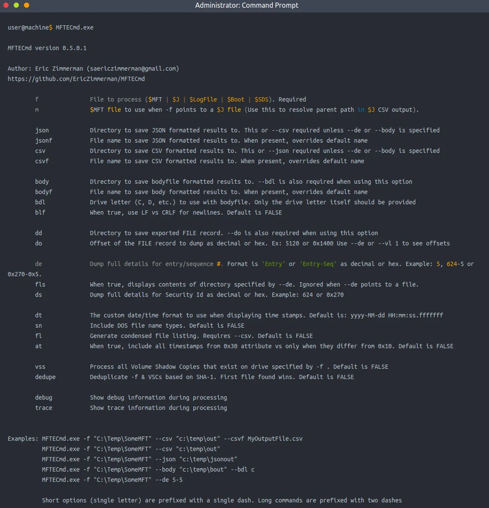

MFTECmd parses data from the different files created by the NTFS file system like $MFT, $Boot, etc. The above screenshot shows the available options for parsing MFT files. 

1. For parsing the $MFT file, I use the following command:
    
    ```
    MFTECmd.exe -f <path-to-$MFT-file> --csv <path-to-save-results-in-csv>
    ```
    
    Path to $MFT as provided in question: `C:\users\THM-4n6\Desktop\triage\C\$MFT`
    
    Path to save, I gave the current directory: `C:\Users\THM-4n6\Desktop\Eztools`
    
    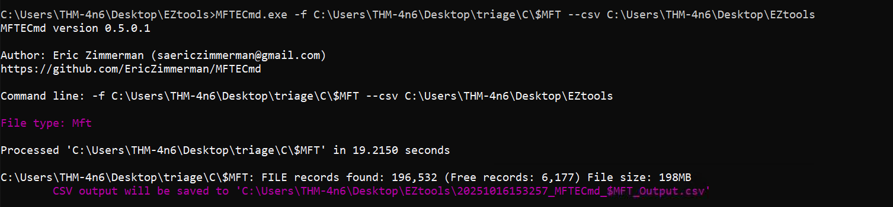
    
    Output is saved in the current folder:
    
    
    
2. Use **EZviewer** (in the same folder) to open and view CSV outputs.
    
    
    
    
    
    
    

---

### Task 3 Answers

**3.1** Size of `.\Windows\Security\logs\SceSetupLog.etl`:

This was on line 34, entry number 37:

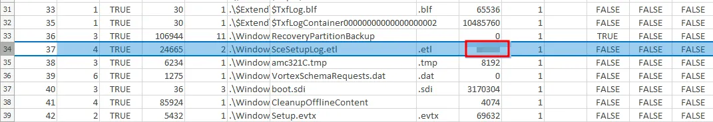

**Answer:** 49152

**3.2** Cluster size for the volume (from $Boot file):

Same process here, I am going to parse the $Boot file:

```
MFTECmd.exe -f C:\Users\THM-4n6\Desktop\triage\C\$Boot --csv C:\Users\THM-4n6\Desktop
```

Again, opened it with **EZviewer:**

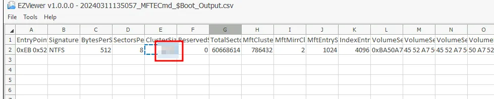

**Answer:** 4096

---

## Task 4: Recovering Deleted Files

### Understanding Deletion

When a file is deleted, its **location entries** in the file system are removed, but its **content remains** until overwritten. Recovery tools can restore these remnants before they’re replaced.

### Disk Image

A **disk image** is a bit-by-bit copy of a physical drive, including all metadata. This lets forensic analysts work on **exact copies** of original evidence, preserving the source.

---

### Recovering Files Using Autopsy

1. Launch **Autopsy** from the Desktop.
2. Click **New Case**, name it, and click **Next**.


1. Skip optional info → click **Finish**.
2. In “Add Data Source,” select **Disk Image or VM File**.
    
    
    
3. Browse to the disk image:
    
    ```
    C:\Users\<user>\Desktop\usb.001
    ```
    
    
    
4. Click **Deselect All** modules → **Next** (to speed up loading).
    
    
    
5. After loading, expand **Data Sources → usb.001** to view contents.

Deleted files will have an ❌ mark.


To recover a file:

- Right-click it → **Extract File(s)**
    
    
    
- Choose a save location — the file is now recovered.

---

### Task 4 Answers

**4.1** + **4.2** Deleted `.xlsx` file name + Deleted `.txt` file name:


**4.3** Contents of recovered `.txt` file:

```
THM-4n6–2–4
```


---

## **Task 5: Evidence of Execution**

Now that I’ve learned about the Windows file system, it’s time to explore **artifacts that record program execution** — evidence that shows *which* applications ran, *when*, and *how often*.

---

### **A. Windows Prefetch Files**

When an application runs, **Windows creates a prefetch file** to speed up future launches.

- Location:
    
    ```
    C:\Windows\Prefetch
    ```
    
    
    
- Extension: `.pf`
- Contains:
    - Last run time
    - Number of executions
    - Associated files and device handles

**Tool Used:** `PECmd.exe` (Prefetch Parser from Eric Zimmerman’s Tools)

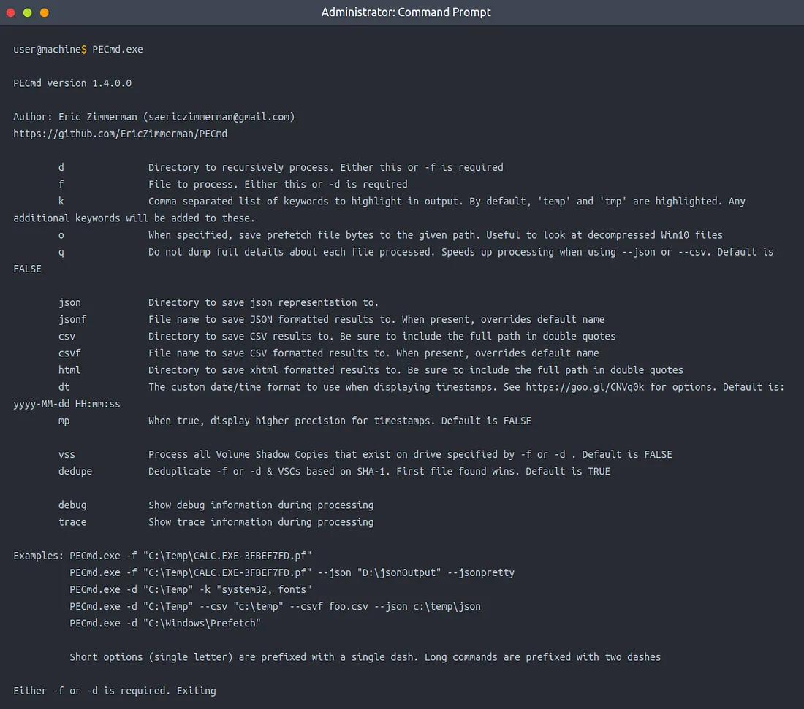

**Commands:**

```bash
# Parse a single prefetch file
PECmd.exe -f <path-to-prefetch-file> --csv <path-to-save-csv>

# Parse the entire prefetch directory
PECmd.exe -d <path-to-prefetch-directory> --csv <path-to-save-csv>
```

---

### **B. Windows 10 Timeline**

Windows 10 logs recent activity (apps and files used) in an SQLite database:

```
C:\Users\<username>\AppData\Local\ConnectedDevicesPlatform\{randomfolder}\ActivitiesCache.db
```


**Tool Used:** `WxTCmd.exe` (Windows 10 Timeline Parser)

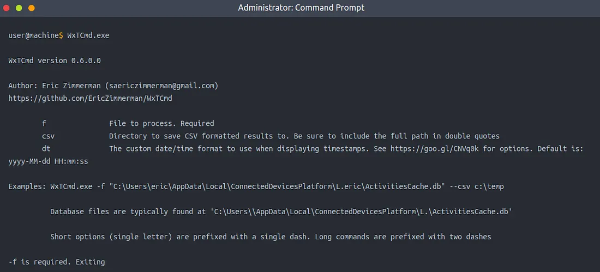

**Command:**

```bash
WxTCmd.exe -f <path-to-timeline-file> --csv <path-to-save-csv>
```

This database includes:

- Executed applications
- Focus time (duration of use)

---

### **C. Windows Jump Lists**

Jump Lists record **recently opened files** for each program pinned to the taskbar.

- Location:
    
    ```
    C:\Users\<username>\AppData\Roaming\Microsoft\Windows\Recent\AutomaticDestinations
    ```
    

**Tool Used:** `JLECmd.exe`

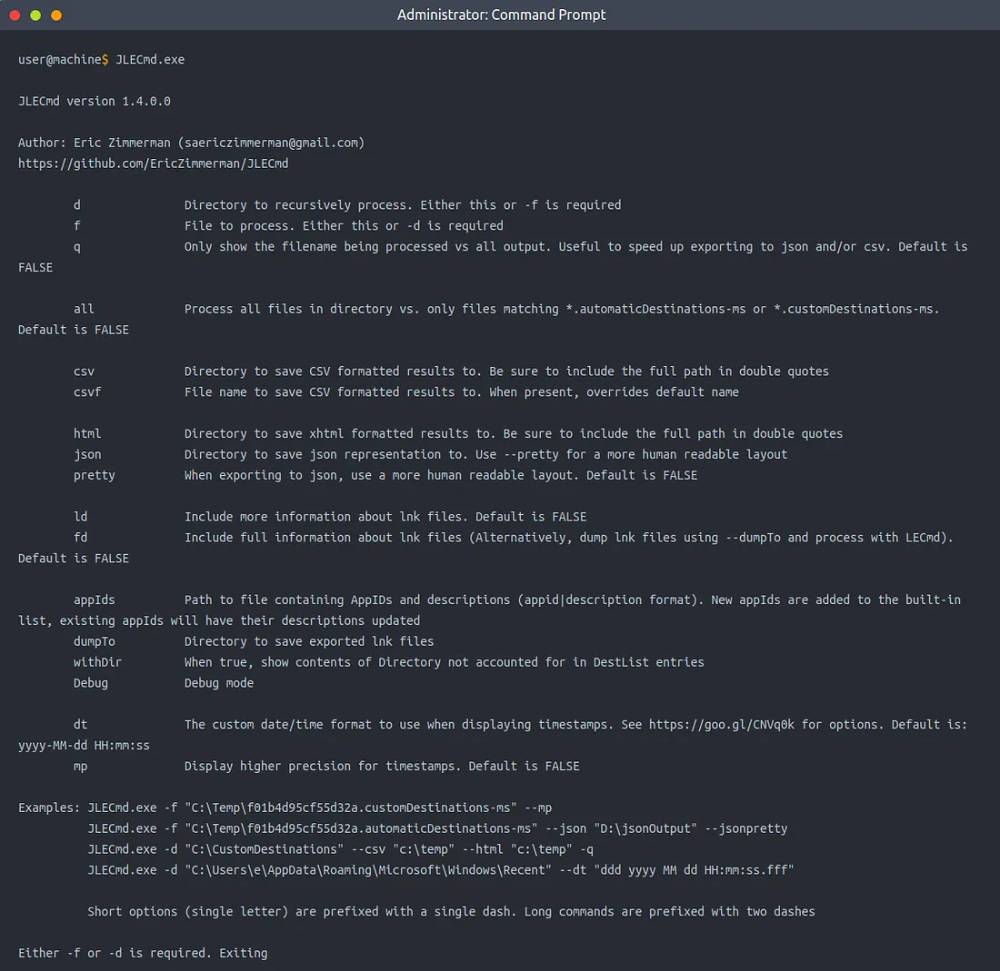

**Command:**

```bash
JLECmd.exe -f <path-to-jumplist-file> --csv <path-to-save-csv>
# or for an entire directory:
JLECmd.exe -d <path-to-jumplist-directory> --csv <path-to-save-csv>
```

---

### 🔍 **Hands-On Challenge Analysis**

We analyze the **triage** folder on the Desktop:

```
C:\Users\THM-4n6\Desktop\triage\C\
```

---

### **5.1 – How many times was gkape.exe executed?**


Need to investigate the prefetch files, I investigated the entire directory. 

Command used:

```bash
PECmd.exe -d "C:\Users\THM-4n6\Desktop\triage\C\Windows\prefetch" --csv C:\Users\THM-4n6\Desktop
```

In this simulated environment, `C:\Users\THM-4n6\Desktop\triage\C` represents `C:` drive

Therefore `C:\Users\THM-4n6\Desktop\triage\C\Windows\prefetch`= `C:\Windows\prefetch` in real life scenario.

Opened the CSV file with **EZviewer**

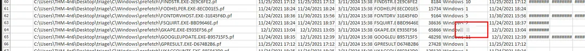

Result found in CSV (column J):

> ✅ Answer: 2
> 

---

### **5.2 – What is the last execution time of gkape.exe?**

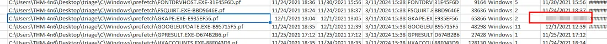

Found in the same CSV (column K):

> ✅ Answer: 12/01/2021 13:04
> 

---

### **5.3 – When Notepad.exe was opened on 11/30/2021 at 10:56, how long did it remain in focus?**

For this, need to investigate the Windows 10 timeline files.

Command used:

```bash
WxTCmd.exe -f C:\Users\THM-4n6\Desktop\triage\C\Users\THM-4n6\AppData\Local\ConnectedDevicesPlatform\L.THM-4n6\ActivitiesCache.db --csv C:\Users\THM-4n6\Desktop
```

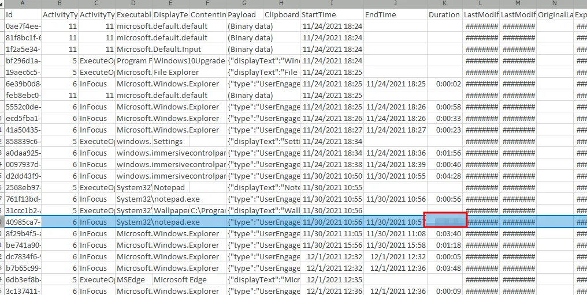

> ✅ Answer: 00:00:41
> 

---

### **5.4 – What program was used to open ChangeLog.txt?**

In location C:\Users\THM-4n6\Desktop\KAPE\KAPE\ChangeLog.txt

For this, I need to investigate the Jump Lists, I investigated the entire directory.

Command used:

```bash
JLECmd.exe -d C:\Users\THM-4n6\Desktop\triage\C\Users\THM-4n6\AppData\Roaming\Microsoft\Windows\Recent\AutomaticDestinations --csv C:\Users\THM-4n6\Desktop
```

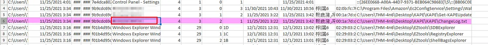

> ✅ Answer: Notepad.exe
> 

---

## **Task 6: File/Folder Knowledge**

### **A. Shortcut Files (.lnk)**

Windows automatically creates **shortcut (.lnk) files** whenever files are opened locally or remotely.

These contain:

- First opened time (creation date)
- Last opened time (modified date)
- File path

**Tool Used:** `LECmd.exe`

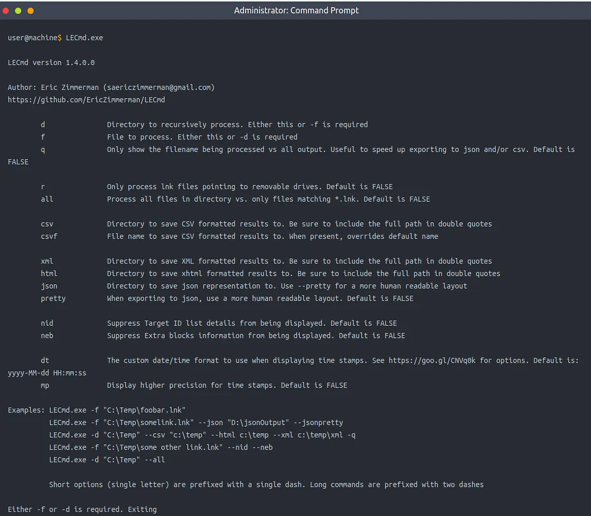

**Command:**

```bash
LECmd.exe -f <path-to-shortcut-file> --csv <path-to-save-csv>
```

Locations:

```
C:\Users\<username>\AppData\Roaming\Microsoft\Windows\Recent\
C:\Users\<username>\AppData\Roaming\Microsoft\Office\Recent\
```

---

### **B. IE/Edge History**

Even files opened *outside* the browser are logged here with prefix `file:///*`.

Location:

```
C:\Users\<username>\AppData\Local\Microsoft\Windows\WebCache\WebCacheV*.dat
```

**Tool Used:** Autopsy

1. Add `triage` folder as a **Logical Files** source.
    
    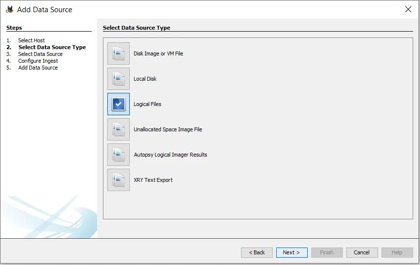
    
    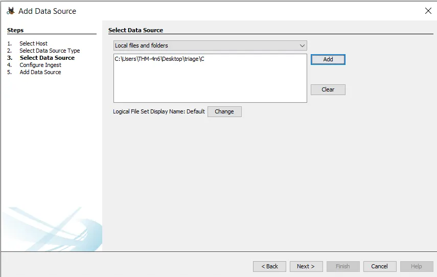
    
2. Select **Recent Activity** module.
    
    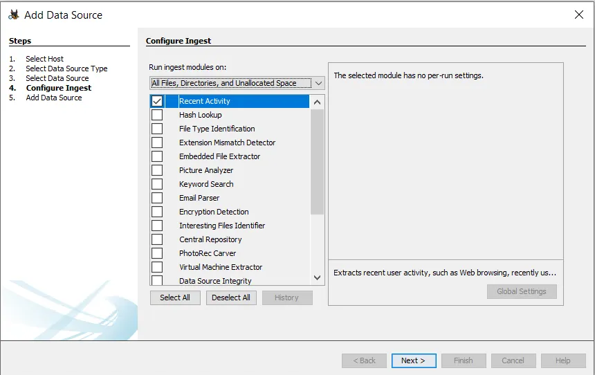
    
3. Check the “Web History” section under **Data Artifacts** for accessed files.
    
    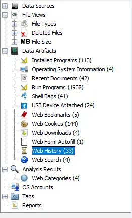
    

This is what it will look like in the right panel.

[https://www.notion.so](https://www.notion.so)

---

### **C. Jump Lists**

Same as in Task 5 — Jump Lists record both **executed programs** and **opened files**.

Location:

```
C:\Users\<username>\AppData\Roaming\Microsoft\Windows\Recent\AutomaticDestinations
```

Command reminder:

```bash
JLECmd.exe -d <path> --csv <output>
```

---

### **Hands-On Analysis**

Analyzed directory:

```
C:\Users\THM-4n6\Desktop\triage\C\
```

### **6.1 – When was folder regripper last opened?**

Get this info using jump lists, here’s the command:

```
JLECmd.exe -d C:\Users\THM-4n6\Desktop\triage\C\Users\THM-4n6\AppData\Roaming\Microsoft\Windows\Recent\AutomaticDestinations --csv C:\Users\THM-4n6\Desktop
```

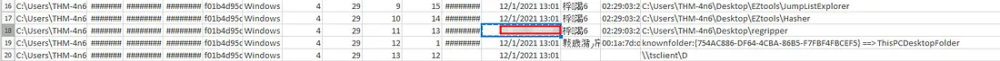

> ✅ Answer: 12/1/2021 13:01
> 

### **6.2 – When was it first opened?**

Same output as the previous questions, just one column over:

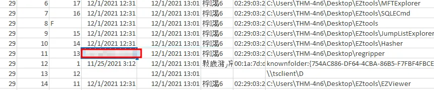

> ✅ Answer: 12/1/2021 12:31
> 

---

## **Task 7: External Devices / USB Forensics**

### **A. Setupapi.dev.log**

When a **USB or external device** is connected, Windows logs setup data in:

```
C:\Windows\inf\setupapi.dev.log
```

This file contains:

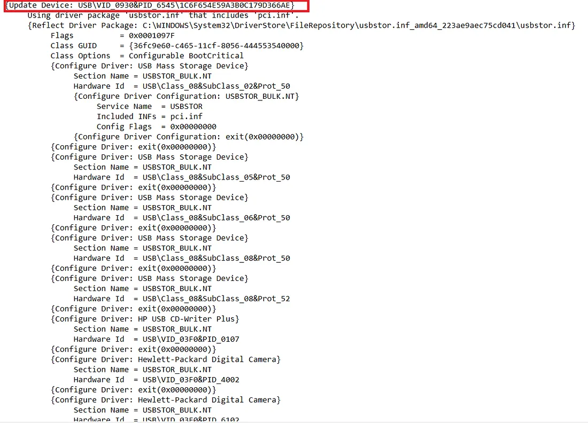

- Device ID
- Serial Number
- First and last connection timestamps

---

### **B. Shortcut Files for USBs**

Shortcut files may also reveal details like:

- Drive letter
- Volume name
- Serial number

Locations:

```
C:\Users\<username>\AppData\Roaming\Microsoft\Windows\Recent\
C:\Users\<username>\AppData\Roaming\Microsoft\Office\Recent\
```

Parsed using:

```bash
LECmd.exe -f <path> --csv <output>
```

---

### **7.1 – Which artifact shows first and last connection times of a removable drive?**

> ✅ Answer: setupapi.dev.log
> 

---

# Lessons Learned

- FAT variants differ by addressable bits and capacity; FAT32 supports 28-bit addressing but limits file size to 4 GB.
- NTFS enhances reliability through journaling and features such as Access Controls, Volume Shadow Copy, and Alternate Data Streams.
- `$MFT` and `$Boot` files are critical for reconstructing file system metadata and structure.
- Prefetch files in `C:\Windows\Prefetch` reveal execution count and last run times of executables.
- Windows 10 Timeline (`ActivitiesCache.db`) provides focus duration and app usage details.
- Jump Lists correlate executed applications with accessed files and their open timestamps.
- Shortcut (.lnk) files record file access and path data, offering timestamps for user interactions.
- `setupapi.dev.log` contains exact first and last connection times of external USB devices, crucial for tracing removable media activity.
- Combining Prefetch, Jump Lists, Timeline, and setup logs enables comprehensive reconstruction of user activity.
- Tools like Eric Zimmerman’s suite and Autopsy streamline multi-artifact correlation for complete forensic insight.

# Socials

**Repository:** https://github.com/RahulCyberX/Digital-Forensics-Incident-Response

**Medium Article:** https://medium.com/@rahulcyberx/windows-forensics-2-complete-tryhackme-walkthrough-f7ef1f12e869?source=your_stories_outbox---writer_outbox_published-----------------------------------------

**TryHackMe Profile:** https://tryhackme.com/p/0xRahuL

**Github Profile:** https://github.com/RahulCyberX