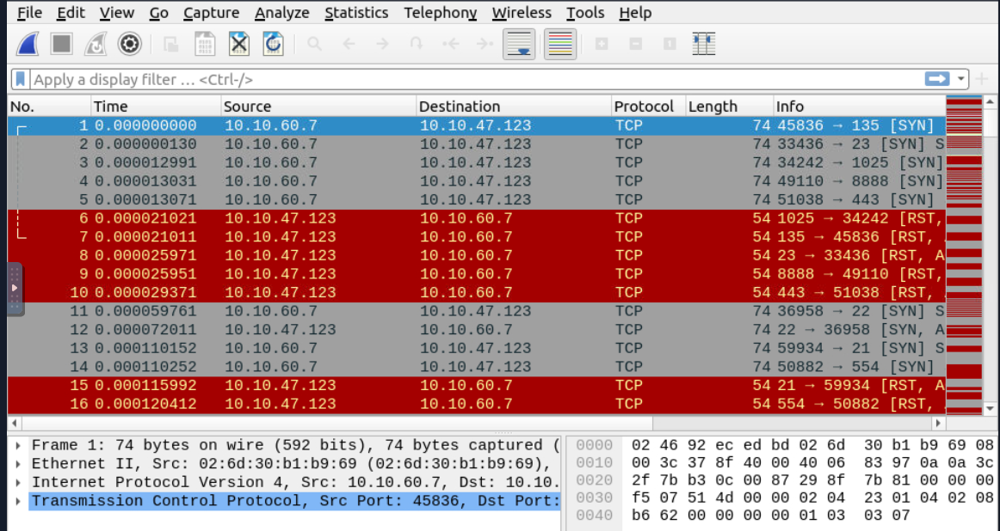

# Wireshark Network Traffic Analysis

## **Objectives**

* Analyze real-world network captures in Wireshark to detect malicious activity across all stages of an attack.
* Identify Nmap scans (TCP Connect, SYN, UDP), ARP poisoning MITM attacks, host/user enumeration via DHCP, NetBIOS, and Kerberos.
* Detect data exfiltration and C2 traffic using tunneling techniques such as DNS, ICMP, and FTP.
* Decrypt HTTPS traffic using provided session keys to reveal hidden payloads, credentials, and C2 callbacks.
* Investigate HTTP, FTP, and Log4j exploitation attempts to understand post-exploitation behaviors.
* Generate actionable **Firewall ACL rules** directly within Wireshark to mitigate and block future threats.

---

## **Tools Used**
* Virtual Machine: https://tryhackme.com/room/wiresharktrafficanalysis
* **Wireshark** — filters, conversations, Follow TCP Stream, Export Objects, TLS decryption, ACL generation.
* **CyberChef** — Base64 decoding, IP/domain defanging.
* **KeysLogFile.txt** — decrypting HTTPS sessions.
* **Wireshark Tools → Credentials & Firewall ACL Rules** — cleartext credential extraction and rule automation.

---

# Investigation

## Task 1: Introduction

In this room, I learned how to analyze network traffic with **Wireshark** to detect suspicious activities. This is the **third and final room** in the Wireshark series.

- The first two rooms focused on:
    - **Wireshark: The Basics** → learning to use the tool.
    - **Wireshark: Packet Operations** → packet-level searches.

Now, I am correlating packet-level information to see the **big picture**: detecting anomalies and malicious activity in real traffic.

---

## Task 2: Nmap Scans

Here, I practiced detecting **different types of Nmap scans** by analyzing a provided `.pcapng` file in Wireshark.

---

### Step 1: Open the PCAP File

- I opened the file:
    
    ```
    Desktop/exercise-pcaps/nmap/Exercise.pcapng
    ```
    
    
    
- This file contains simulated **Nmap scan traffic**. My goal was to identify scan types and their patterns.

---

### Step 2: Understanding Scan Types

I reviewed the theory on Nmap scan types:

1. **TCP Connect Scan (-sT)**
    - Completes the **3-way handshake**.
    - Used by **non-root users**.
    - Window size usually **> 1024**.
    - Wireshark filter:
        
        ```
        tcp.flags.syn==1 and tcp.flags.ack==0 and tcp.window_size > 1024
        ```
        
2. **SYN Scan (-sS)**
    - Does **not** complete handshake (half-open).
    - Requires **root privileges**.
    - Window size **≤ 1024**.
    - Filter:
        
        ```
        tcp.flags.syn==1 and tcp.flags.ack==0 and tcp.window_size <= 1024
        ```
        
3. **UDP Scan (-sU)**
    - No handshake.
    - Closed ports reply with **ICMP Type 3, Code 3 (port unreachable)**.
    - Filter:
        
        ```
        icmp.type==3 and icmp.code==3
        ```
        

---

### Question 1: Total number of TCP Connect scans

- I applied the **TCP Connect scan filter**:
    
    ```
    tcp.flags.syn==1 and tcp.flags.ack==0 and tcp.window_size > 1024
    ```
    
- This shows all SYN packets with no ACK and a large window size (>1024).
    
    
    
- These are typical of TCP Connect scans.

**Observation:**

- Wireshark showed **1000 packets** matching the filter.
    
    
    
- Note: not all of them must be Nmap scans; normal connections can also appear, but here it’s part of the exercise.

---

### Question 2: Scan type used on TCP port 80

- I refined the previous filter to check **only port 80**:
    
    ```
    tcp.flags.syn==1 and tcp.flags.ack==0 and tcp.window_size > 1024 and tcp.port == 80
    ```
    
    
    
- This left **1 packet** targeting port 80.

**Verification:**

- I right-clicked the packet → **Conversation Filter → TCP**.
    
    
    
- I checked if the **3-way handshake** completed.
- I saw SYN → SYN/ACK → ACK, meaning it was a **full connection**.
    
    
    
    **Answer: TCP Connect**
    

---

### Question 3: Number of UDP closed port messages

- I applied the filter for ICMP error messages:
    
    ```
    icmp.type==3 and icmp.code==3
    ```
    
- These messages mean a **UDP port is closed**.

**Observation:**

- Wireshark displayed **1083 packets**.


---

### Question 4: Open UDP port in range 55–70

- I applied a filter to check UDP ports **55–70**:
    
    ```
    udp.port in {55 .. 70}
    ```
    
- This showed UDP traffic on **ports 67, 68 and 69**.
    
    
    
- I also saw ICMP error packets for **ports 67 and 69** (meaning those are closed).
    
    
    

**Observation:**

- Port **68** was the only one without an ICMP error reply → it’s **open**.

---

## Task 3: ARP Poisoning & Man-in-the-Middle

In this task, I analyzed **ARP poisoning traffic** to understand how an attacker can position themselves as a man-in-the-middle (MITM).

---

### Step 1: Understanding ARP

- **ARP (Address Resolution Protocol)** maps **IP addresses → MAC addresses**.
- It’s **insecure** because:
    - No authentication.
    - Easily spoofed.
    - Not routable outside local network.

---

### Step 2: ARP Poisoning Attack

- An attacker sends **fake ARP replies** to poison a victim’s ARP cache.
- This tricks devices into sending traffic to the attacker’s MAC instead of the real destination.
- Once in the middle, the attacker can **intercept traffic** (including HTTP credentials).

---

### Step 3: Analyzing the PCAP

I opened:


I used Wireshark filters to detect suspicious ARP and HTTP traffic.

---

### Question 1: Number of ARP requests crafted by the attacker

**What I did & why:**

- First, I filtered for all **ARP requests**:
    
    ```
    arp.opcode == 1
    ```
    
- This shows request packets (who-has).
    
    
    
- I noticed most requests came from **192.168.1.25**, which looks like the attacker.
- To isolate them, I added an IP filter:
    
    ```
    arp.src.proto_ipv4 == 192.168.1.25 and arp.opcode == 1
    ```
    

**Observation:**

- This returned **284 packets**.
    
    
    

---

### Question 2: Number of HTTP packets received by the attacker

**Why MAC filtering matters:**

- In ARP poisoning, the attacker steals traffic by hijacking the **MAC address association**, not the IP.
- That’s why I filtered by **attacker’s MAC**: `00:0c:29:e2:18:b4`.
- Attacker’s MAC was actually on the previous screen, but hidden under the ARP sectio.
    
    
    

**Filter used:**

```
eth.addr == 00:0c:29:e2:18:b4 and http
```

**Observation:**

- Wireshark displayed **90 HTTP packets** received by the attacker.
    
    
    

---

### Question 3: Number of sniffed username & password entries

**What I did & why:**

- I focused on **form submissions** (likely credentials).
- Used filter:
    
    ```
    eth.addr == 00:0c:29:e2:18:b4 and http and urlencoded-form
    ```
    
- These packets showed login forms (e.g., `userinfo.php`).

**Observation:**


---

- Not all packets included username and passwords, only 6 did like this:
    
    
    

### Question 4: Password of “Client986”

**What I did:**

- I inspected the form data in the **urlencoded-form packets**.
- One entry showed credentials for **Client986**.
    
    
    

---

### Question 5: Comment provided by “Client354”

**What I did:**

- I checked packets referencing **comment.php**.
- Found a form with **Client354** submitting a comment.
    
    
    

---

## Task 4: Host & User Identification

Here, I analyzed DHCP, NetBIOS, and Kerberos traffic to **map hosts and users** in the network. This is important for attribution during an investigation.

### Step 1: DHCP Analysis

- **DHCP** assigns IP addresses automatically.
- Useful options:
    - Option 12 = Hostname.
    - Option 50 = Requested IP.
    - Option 61 = MAC address.
- Wireshark filters:
    
    ```
    dhcp.option.hostname contains "keyword"
    dhcp.option.requested_ip_address == <IP>
    ```
    

---

### Question 1: MAC address of host “Galaxy A30”

**What I did:**

- I filtered DHCP packets for hostnames containing `A30`:
    
    ```
    dhcp.option.hostname contains "A30"
    ```
    
    
    
- Found `Anthony-s-Galaxy-A30s`.
- Checked DHCP packet details for **Client MAC**.
    
    **Answer: 9a:81:41:cb:96:6c**
    

---

### Step 2: NetBIOS Analysis

- **NetBIOS (NBNS)** helps identify hostnames in Windows networks.
- Wireshark filter:
    
    ```
    nbns.name contains "keyword"
    ```
    

---

### Question 2: Number of NetBIOS registration requests from “LIVALJM”

**What I did:**

- Filtered by hostname:
    
    ```
    nbns.name contains "LIVALJM"
    ```
    
- Saw multiple NBNS packets (registrations, broadcasts, etc.).
    
    
    
- Right-clicked the **opcode flag** → filtered only for **registration requests**:
    
    This causes the following filter to apply:
    
    ```
    nbns.name contains "LIVALJM" and nbns.flags.opcode == 5
    ```
    

**Observation:**


- Counted **16 registration requests**.

---

### Step 3: DHCP Requested IP Analysis

### Question 3: Which host requested IP `172.16.13.85`?

**What I did:**

- Looked into DHCP **Option 50 (Requested IP)**.
- Applied filter:
    
    ```
    dhcp.option.requested_ip_address == 172.16.13.85
    ```
    
    
    
- Found the host requesting this IP: **Galaxy-A12**.

---

### Step 4: Kerberos Analysis

- **Kerberos** is Windows authentication.
- Useful fields:
    - `kerberos.CNameString` = Username.
    - `$` suffix = Hostname.
- Filters:
    
    ```
    kerberos.CNameString contains "keyword"
    kerberos
    ```
    

---

### Question 4: IP address of user “u5”

**What I did:**

- Used filter:
    
    ```
    kerberos.CNameString contains "u5"
    ```
    
    
    
- Found 9 packets.
- Focused on **AS-REQ** packets (Authentication Service Requests) → sent by the client.
- Checked **source IP**.

**Observation:**

- Source IP = `10.1.12.2`.
- Defanged it (replace `.` with `[.]`).
    
    **Answer: 10[.]1[.]12[.]2**
    

---

### Question 5: Hostname of available host in Kerberos packets

**What I did:**

- Applied filter:
    
    ```
    kerberos
    ```
    
    
    
- Added `CNameString` as a **column** for better visibility.
- Looked for entries ending in `$` → these represent **hostnames**, not users.
- Found only one: **xp1$**.

---

# Task 5: Tunneling Traffic — DNS and ICMP

## Concept Notes

### What is tunneling?

Tunneling means transferring data securely across networks by encapsulating it inside another protocol.

- **Legitimate use:** enterprises use tunneling for VPNs, anonymity, security.
- **Malicious use:** attackers abuse tunneling to bypass firewalls and exfiltrate data.

### ICMP Tunneling

- **Normal purpose:** ICMP is used for network diagnostics (e.g., ping).
- **Abuse:** attackers encapsulate data inside ICMP packets for C2 or data theft.
- **Indicators of compromise (IoCs):**
    - Anomalous ICMP traffic volume
    - Unusual packet sizes (>64 bytes)
    - Custom encapsulated data
- **Wireshark filters:**
    
    ```
    icmp
    data.len > 64 and icmp
    ```
    

### DNS Tunneling

- **Normal purpose:** DNS resolves domains to IP addresses.
- **Abuse:** attackers encode data/commands in subdomains for covert C2.
- **IoCs:**
    - Long/abnormal DNS queries
    - Encoded subdomains (ex: `abcd1234.maliciousdomain.com`)
    - High volume of requests to same domain
- **Wireshark filters:**
    
    ```
    dns
    dns contains "dnscat"
    dns.qry.name.len > 15 and !mdns
    ```
    

---

## ICMP Tunneling Analysis

I started with the provided file:

```
Desktop/exercise-pcaps/dns-icmp/icmp-tunnel.pcap
```

**Step 1: Apply ICMP filter with payload size check**

- Why: ICMP is normally used for network diagnostics, not for carrying large payloads. Oversized packets are suspicious.
- Command (Wireshark display filter):
    
    ```
    data.len > 64 and icmp
    ```
    
    
    

This filter showed anomalous ICMP packets that had payloads larger than the usual diagnostic traffic.

**Step 2: Inspect the payload (Hex view)**

- Why: Attackers often hide other protocols inside ICMP payloads.
- What I found: The payload contained SSH handshake details:
    
    
    
    - Key exchange methods (diffie-hellman-group-exchange-sha256, etc.)
    - Encryption algorithms (aes128-ctr, aes256-ctr, 3des-cbc, blowfish-cbc)

That clearly meant SSH traffic was encapsulated inside ICMP packets → **ICMP tunneling**.

**Answer:**

`SSH`

---

## DNS Tunneling Analysis

I moved on to the second file:


**Step 1: Try detecting dnscat tool**

- Command:
    
    ```
    dns contains "dnscat"
    ```
    
- Why: dnscat2 is a well-known DNS tunneling tool.
- Result: No useful hits, no clear domain.

**Step 2: Look for suspiciously long DNS queries**

- Command:
    
    ```
    dns.qry.name.len > 15 and !mdns
    ```
    
- Why: Long/encoded subdomains often mean tunneling.
    
    
    
- Result: Too many results (~30,000+). Needed to refine.

**Step 3: Increase query length threshold**

- Command:
    
    ```
    dns.qry.name.len > 55 and !mdns
    ```
    
- Why: This narrowed down to fewer packets, making anomalies stand out.
- What I found: Encoded subdomains pointing to a suspicious main domain.
    
    
    

**Suspicious domain:**

`dataexfil[.]com`

# Task 6: Tunneling Traffic — FTP

## Concept Notes

### Why FTP is insecure?

- No encryption → vulnerable to **MITM**.
- Credentials can be stolen easily.
- Attackers can upload malware, exfiltrate files.

### Wireshark Filters for FTP

**General filter:**

```
ftp
```

**x1x series (Information responses):**

- `211`: System status
- `212`: Directory status
- `213`: File status
- Filter:
    
    ```
    ftp.response.code == 211
    ```
    

**x2x series (Connection messages):**

- `220`: Service ready
- `227`: Entering passive mode
- `228`: Long passive mode
- Filter:
    
    ```
    ftp.response.code == 227
    ```
    

**x3x series (Authentication messages):**

- `230`: User login
- `231`: User logout
- `331`: Valid username, need password
- `530`: Invalid password
- Filter:
    
    ```
    ftp.response.code == 230
    ```
    

### Key FTP Commands

- `USER` → username
- `PASS` → password
- `CWD` → change directory
- `LIST` → list files

### Advanced Detection (Brute Force)

- Many failed logins → brute force / password spraying.
- Filters:
    
    ```
    ftp.response.code == 530
    (ftp.response.code == 530) and (ftp.response.arg contains "username")
    (ftp.request.command == "PASS") and (ftp.request.arg == "password")
    ```
    

---

## Practical Walkthrough

### Q1: How many incorrect login attempts?

**Step 1:** Applied filter for failed logins:

```
ftp.response.code == 530
```

**Step 2:** Counted results → **737 failed attempts**.


---

### Q2: What is the size of the file accessed by the “ftp” account?

**Step 1:** Used file status code filter:

```
ftp.response.code == 213
```

**Step 2:** Checked return values → **39424**.


### Q3: What is the filename of the uploaded document?

**Step 1:** At first, I tried manually looking through the FTP traffic.

Originally I tried filtering on FILE, but later I found out that we have to use *STOR*.

Anyway, nearly in the bottom of the FTP packets I found the following suspicious traffic:


**Step 2:** I realized that the correct command for uploads is `STOR`.

There is some file being downloaded and later another uploaded? Now to find the upload command by using the following filter:

```
ftp.request.command == "STOR"
```

**Step 3:** To investigate further, I checked the full TCP conversation:

- Right-clicked on the packet → **Conversation Filter → TCP**
    
    
    
- Alternatively, I could use a stricter filter:
    
    ```
    (ip.addr eq 192.168.1.182 and ip.addr eq 192.168.1.231) and (tcp.port eq 62014 and tcp.port eq 21)
    ```
    
    
    
- Or even better is to follow the stream directly: Right-click → **Follow → TCP Stream**
    
    
    

**Step 5:** From here, I observed that the adversary uploaded a file called `README` using the `STOR` command.


- However, before this, the same user downloaded a file called `resume.doc`.
- THM expects the answer `resume.doc` because it’s the actual document involved, likely renamed by the adversary when re-uploading.

---

### Q4: What command was used to change file permissions?

1. **Open the capture in Wireshark**
    - I launched Wireshark and opened the captured file that contains the FTP activity (the exercise `ftp.pcap` provided by the room).
2. **Locate the FTP control packets for the relevant conversation**
    - I used a display filter to reduce noise and show FTP-related packets:
        
        ```
        ftp
        ```
        
        
        
    - *Why:* This shows FTP control traffic where upload commands and file-permission commands appear.
3. **Find the upload (STOR) packet to identify the TCP conversation**
    - I searched for the STOR command to find the upload and the related conversation:
        
        ```
        ftp.request.command == "STOR"
        ```
        
    - I right-clicked one STOR packet and selected **Conversation Filter → TCP**.
        
        
        
    - *Why:* This isolates the whole TCP connection between the client and FTP server so I can inspect every command and response in that session (no guessing which stream contains the CHMOD).
4. **Follow the TCP stream (view the entire control session in ASCII)**
    - With a packet from the conversation selected, I right-clicked → **Follow → TCP Stream**.
        
        
        
    - In the Follow dialog I set **Show data as: ASCII** (default), clicked **Find** (or used Ctrl+F).
    - *Why:* Following the TCP stream shows the raw command/response text in order. It’s the easiest way to spot textual FTP commands such as `STOR`, `RETR`, `SITE CHMOD`, or `CHMOD`.
5. **Search the stream for CHMOD-related text**
    - In the stream window I searched for the string `CHMOD` (case-insensitive) or `chmod`.
    - *Why:* FTP servers often change permissions via the `SITE CHMOD` or `CHMOD` command; searching the stream locates the exact command line the adversary issued.
6. **Observe the exact command line**
    
    
    
    - I found the command line containing `CHMOD` and the permission bits `777`. Example observed text in the stream.
    - *Why this matters:* `777` is the octal permission value giving read, write, execute to owner, group, and others. Finding it in the control channel proves the adversary changed the file to be executable.

# Task 7: Cleartext Protocol Analysis — HTTP

## What I did

1. **Reviewed HTTP basics**
    - HTTP is cleartext, request–response, and client–server based.
    - Important because: adversaries can exploit it for phishing, data exfiltration, or C2 traffic.
2. **Key Wireshark filters I practiced**
    - Request methods:
        
        ```
        http.request.method == "GET"
        http.request.method == "POST"
        ```
        
    - Status codes:
        
        ```
        http.response.code == 200
        http.response.code == 403
        http.response.code == 503
        ```
        
    - Parameters for detection:
        
        ```
        http.user_agent contains "sqlmap"
        http.user_agent contains "Nmap"
        http.request.uri contains "admin"
        http.host contains "keyword"
        ```
        
3. **Why this matters**
    - Detecting anomalies in `User-Agent`, suspicious URIs, or unexpected server responses often reveals reconnaissance, web exploitation, or tools like sqlmap/Nmap.

---

## Question 1: Number of anomalous  "user-agent" types?

1. Opened `Desktop/exercise-pcaps/http/user-agent.cap` in Wireshark.
    
    
    
2. First I filtered by:

```
http.user_agent
```

This didn’t do much for me, it narrows the count down by 1… k. 

1. Next I expanded the HTTP tree of a packet, right click the “User-Agent” field and applied it as a column, then sorted by that column. This allowed me to easily count up the different types of user agents:


**Answer: 6.** 

## Question 2: Packet number with a subtle spelling difference in the user agent field?


Since I applied User-Agent as a column in the previous question, it’s easy to figure out. 

Mozilla is spelled wrong as “**Mozlila**”.

It’s packet number is `52`.

## Question 3: Locate the "Log4j" attack starting phase. What is the packet number?

1. Loaded up the `Desktop/exercise-pcaps/http/http.pcapng` file.
2. Use the filter:
    
    ```
    http.request.method=="POST" and ((ip contains "jndi") or (ip contains
    "Exploit")) and ((frame contains "jndi") or (frame contains "Exploit")) and
    ((http.user_agent contains "$") or (http.user_agent contains "=="))
    ```
    
    
    

Just got 1 result, with packet number **444**.

## Question 4: Locate the "Log4j" attack starting phase and decode the base64 command. What is the IP address contacted by the adversary? (Enter the address in defanged format and exclude "{}".)

1. On the same packet, expand HTTP and look for the Base64 code in the user-agent field.
2. It’s everything after the “Base64/” and before the closing curly bracket:


1. Copied it, and decoded it in CyberChef.
    
    
    
2. Once I got the IP address, changed recipe from “Decode Base64” to “Defang IP”:
    
    
    

**Answer:** 62[.]210[.]130[.]250 

# Task 8: Encrypted Protocol Analysis — Decrypting HTTPS

## Question 1: Client Hello message sent

What is the frame number of the "Client Hello" message sent to "[accounts.google.com](http://accounts.google.com/)"?

**Steps I followed**

1. Opened `Desktop/exercise-pcaps/https/Exercise.pcap` in Wireshark.
    
    
    
2. Applied filter:
    
    ```
    tls.handshake.type == 1
    ```
    
    This returned 20 packets.
    
    → This shows all `Client Hello` messages.
    
3. Expanded **TLS → Handshake Protocl → Extension: server_name** and right clicked on it to apply as Column, to find the answer more easily.
    
    
    
4. Found `accounts.google.com` in **frame 16,** with the SNI I was looking for.
    
    
    

---

## Question 2: Number of HTTP2 packets

Decrypt the traffic with the "KeysLogFile.txt" file. What is the number of HTTP2 packets?

**Steps I followed**

1. Went to **Edit → Preferences → Protocols → TLS**.
    
    
    
    
    
2. Set **Master-Secret log filename** to the provided `KeysLogFile.txt`.
    
    
    
    - Why: Without this, HTTPS remains encrypted. With it, Wireshark can decrypt sessions.
3. Applied filter:
    
    ```
    http2
    ```
    
4. Counted results → **115 packets**.
    
    
    

---

## Question 3: Authority header of Frame 322

**Steps I followed**

1. Jumped directly to **frame 322**.
2. Expanded **Hypertext Transfer Protocol 2** in packet details.
3. Located **Header: :authority** field.
4. Value was `safebrowsing.googleapis.com`
    
    
    

Defanged for submission:

**Answer:** `safebrowsing[.]googleapis[.]com`

---

## Question 4: Flag inside decrypted traffic

**Steps I followed**

1. Manually browsed decrypted packets (115).
2. Found **frame 1576**, which contained a `GET /flag.txt`.
    
    
    
3. Exported object:
    - `File → Export Objects → HTTP`
        
        
        
    - Saved the first file (flag.txt).
4. Opened it → revealed the flag.
    
    
    

**Answer:** `FLAG{THM-PACKETMASTER}`

---

# Task 9: Bonus — Hunt Cleartext Credentials

- The **“Tools → Credentials”** menu (available in Wireshark v3.1+) displays detected credentials.
- The credential window provides details such as:
    - **Packet number**
    - **Protocol**
    - **Username**
    - **Additional packet references**
- Clicking on entries in this window allows quick navigation to relevant packets.

## Question 1: Credentials using HTTP Basic Auth

**Steps I followed**

1. Opened `Desktop/exercise-pcaps/bonus/Bonus-exercise.pcap`.
    
    
    
2. Went to **Tools → Credentials**.
    
    
    
3. Checked the listed protocols.
4. The last entry showed **HTTP Basic Auth** at **packet 237**.
    
    
    

---

## Question 2: Packet number where empty password was submitted

**Steps I followed**

1. Still in **Tools → Credentials**, I clicked through each listed packet.
2. Looked at the decoded password field.
    
    
    
3. Found packet **170** had **empty password**.

---

# Task 10: Bonus — Actionable Results

After detecting anomalies and taking investigative notes, the next step is to **take action**. As a security analyst, its needed to **identify threats and implement firewall rules** to mitigate risks.

Wireshark provides a feature to **generate firewall rules** directly from packet analysis:

- **Menu:** *Tools → Firewall ACL Rules*
- **Rules include:** IP, port, and MAC address-based filtering
- **Intended for:** Implementation on an **external firewall interface**

## Question 1: Denying source IPv4 (packet 99)

**Steps I followed**

1. Selected **packet 99**.
2. Went to **Tools → Firewall ACL Rules**.
    
    
    
3. Selected **IPFirewall (ipfw)** as rule type.
    
    
    
4. Located rule for denying source IPv4 address.

**Generated Rule:**


```
add deny ip from 10.121.70.151 to any in
```

## Question 2: Allowing destination MAC (packet 231)

**Steps I followed**

1. Selected **packet 231**.
2. Opened **Tools → Firewall ACL Rules** again.
    
    
    
3. Chose **IPFirewall** as rule type.
4. Selected **Inbound only**.
    
    
    
5. Found the generated rule for allowing destination MAC.
    
    
    

**Generated Rule:**

```
add allow MAC 00:d0:59:aa:af:80 any in
```

---


## **Findings**

* Multiple **Nmap scan types** (TCP Connect, SYN, and UDP) detected; port 68 confirmed open via UDP analysis.
* **ARP poisoning** successfully performed by attacker `192.168.1.25`, intercepting 90 HTTP packets and 6 credential submissions.
* **DNS and ICMP tunneling** confirmed — ICMP carried SSH traffic; DNS queries directed to `dataexfil[.]com`.
* **FTP abuse** identified with brute-force attempts, file upload via `STOR README`, and permission change using `CHMOD 777`.
* **HTTP analysis** revealed Log4j exploit (Base64 payload → C2 IP `62[.]210[.]130[.]250`) and malicious user-agents.
* **HTTPS decryption** uncovered traffic to `safebrowsing[.]googleapis[.]com` and hidden flag `FLAG{THM-PACKETMASTER}`.
* **Cleartext credentials** extracted via Wireshark’s Credential tool, showing weak and empty password submissions.

---

## **Lessons Learned**

* Custom Wireshark filters and columns are faster than manual inspection.
* ICMP or DNS packet anomalies almost always indicate tunneling.
* TLS decryption with session keys exposes threats hidden in HTTPS.
* Follow TCP Stream instantly reveals uploads, exploits, and credential leaks.
* Wireshark’s ACL generator converts analysis directly into defensive firewall rules.
* The Credentials window saves hours of hunting — every cleartext protocol is an open door.


# Socials

**Repository:** https://github.com/RahulCyberX/Network-Security-and-Traffic-Analysis

**Medium Article:** https://medium.com/@rahulcyberx/wireshark-traffic-analysis-tryhackme-walkthrough-2025-c7c1069732c9?source=your_stories_outbox---writer_outbox_published-----------------------------------------

**TryHackMe Profile:** https://tryhackme.com/p/0xRahuL

**Github Profile:** https://github.com/RahulCyberX
