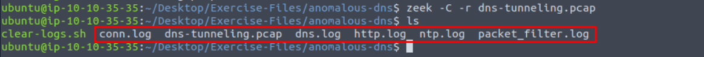

# Zeek Network Traffic Analysis Exercise

Virtual Machine Provided in: [https://tryhackme.com/room/zeekbroexercises](https://tryhackme.com/room/zeekbroexercises)

### Objectives

- Investigated three separate real-world attack scenarios using Zeek inside TryHackMe’s fully isolated VM to confirm triggered alerts were true positives.
- Analyzed DNS tunneling traffic to uncover IPv6 abuse and hidden command channels.
- Confirmed a phishing campaign delivering macro-enabled documents and a secondary malicious executable.
- Validated Log4J exploitation attempts including scanning tool, payload delivery, and base64-encoded shell commands.
- Extracted, defanged, and enriched indicators across dns.log, http.log, files.log, and signatures.log without ever leaving the sandbox.

## Tools Used

- **Zeek** (zeek -C -r, custom scripts: hash-demo.zeek, detection-log4j.zeek)
- **zeek-cut** (parsing every log like a surgeon)
- **CyberChef** (defanging domains/IPs + base64 decoding)
- **VirusTotal** (file relations & behavior tabs for MD5 pivoting)
- **bash utilities** (cat, grep, sort, uniq, wc -l, rev, cut, base64 --decode)
- **pluma** (quick log viewing when zeek-cut wasn’t enough)

# Investigation

# Task 1: Anomalous DNS

An alert was triggered: **“Anomalous DNS Activity”**.

My job is to analyze the PCAP and confirm if the alert is a **true positive**.

---

### Q1: Number of DNS records linked to the IPv6 address

1. I navigated to the correct folder:
    
    ```
    cd /Desktop/Exercise-Files/anomalous-dns
    ```
    
2. Ran Zeek on the PCAP:
    
    ```bash
    zeek -C -r dns-tunneling.pcap
    ```
    
    
    
    → This created logs (`dns.log`, `conn.log`, etc.).
    
3. Checked for AAAA queries (IPv6):
    
    ```bash
    cat dns.log | zeek-cut qtype qtype_name | grep "AAAA" | wc -l
    ```
    
    
    
    → Output = **320**.
    

### Q2: Longest connection duration

1. Looked into `conn.log`:
    
    ```bash
    cat conn.log | zeek-cut duration | sort
    ```
    
    
    
2. The longest connection was at the bottom → **9.420791**.

### Q3: Unique DNS queries

1. Extracted all queries:
    
    ```bash
    cat dns.log | zeek-cut query
    ```
    
    
    
    → Saw tons of entries ending with `.cisco-update.com` (likely tunneling).
    
2. The hint mentions that we can use the following CLI magic to filter out the first two parts of the domain (done by first reversing, and then removing the first 2 parts):
    
    ```bash
    cat dns.log | zeek-cut query | rev | cut -d '.' -f 1-2 | rev | sort | uniq
    ```
    
    
    
3. Unique queries found = **6**.

### Q4: Source host IP

1. Extracted source IPs from `dns.log`:
    
    ```bash
    cat dns.log | zeek-cut id.orig_h | sort | uniq -c
    ```
    
    
    
2. Most traffic originated from → **10.20.57.3**.

# Task 3: Phishing

An alert was triggered: **“Phishing Attempt”**.

My task: analyze the PCAP to confirm.

### Q1: Suspicious source address (defanged)

1. Entered the correct directory:
    
    ```
    cd /home/ubuntu/Desktop/Exercise-Files/phishing
    ```
    
2. Ran Zeek:
    
    ```bash
    zeek -C -r phishing.pcap
    ```
    
    
    
    → Logs were generated.
    
3. Checked `conn.log`: all traffic originated from **10.6.27.102**.
    
    
    
4. Defanged it with CyberChef.
    
    
    

### Q2: Malicious domain (defanged)

1. Checked `http.log`:
    
    ```bash
    cat http.log | zeek-cut host
    ```
    
2. Found the malicious domain: **smart-fax.com**.
    
    
    
3. Defanged = **smart-fax[.]com**

### Q3: File type of malicious document

1. In `http.log`, noticed the file `Invoice&MSO-Request.doc`.
    
    
    
2. Cross-checked in `files.log`
    
    
    
3. Generated hashes for clarity:
    
    ```bash
    zeek -C -r phishing.pcap hash-demo.zeek
    cat files.log
    ```
    
    
    
    For much better readability I do this
    
    ```jsx
    cat files.log | zeek-cut fuid md5 mime_type
    ```
    
    
    
    → Found MD5: `b5243ec1df7d1d5304189e7db2744128`.
    
4. Looked it up on VirusTotal → https://www.virustotal.com/gui/file/f808229aa516ba134889f81cd699b8d246d46d796b55e13bee87435889a054fb/relations
5. File type associated with it = **VBA** (Visual Basic macros).
    
    
    

### Q4: Extracted malicious .exe filename

1. In `files.log`, found MD5: `cc28e40b46237ab6d5282199ef78c464` with previous command.
2. Checked VirusTotal.
    
    
    
    Filename was → **PleaseWaitWindow.exe**.
    

### Q5: Contacted domain of malicious .exe (defanged)

1. On VirusTotal’s Relations/Behavior tab, saw contacted domain: **dunlop.hopto.org**.
    
    
    
2. Defanged = **hopto[.]org**

### Q6: Request name of downloaded .exe

1. Checked `http.log` again.
2. In the `uri` column (third row), the request name was → **knr.exe**.

# Task 4: Log4J

An alert was triggered: **“Log4J Exploitation Attempt”**.

I investigated the provided PCAP.

### Q1: Number of signature hits

1. Entered the directory:
    
    ```
    cd /home/ubuntu/Desktop/Exercise-Files/log4j
    ```
    
2. Ran detection script:
    
    ```bash
    zeek -C -r log4shell.pcapng detection-log4j.zeek
    ```
    
    
    
3. Checked `signatures.log`:
    
    ```bash
    cat signatures.log | zeek-cut uid | wc -l
    ```
    
    
    
    → **3 hits**.
    

### Q2: Scanning tool used

1. Looked into `http.log`:
    
    ```bash
    cat http.log | zeek-cut user_agent
    
    ```
    
    
    
2. Every line showed **Nmap**.

### Q3: Exploit file extension

1. Searched for exploit files in `http.log`:
    
    (Opened the file in pluma)
    
    
    
    For a better look run:
    
    ```bash
    cat http.log | zeek-cut host uri | grep .class
    ```
    
    
    
2. Found exploit files with → **.class** extension (Confirmed).

### Q4: Name of created file (decoded base64)

1. Opened `log4j.log`:
    
    ```bash
    cat log4j.log | head
    ```
    
2. Found base64 payloads.
    
    
    
    The first one includes the base64 command: `*dG91Y2ggL3RtcC9wd25lZAo=`* and the other `*2hpY2ggbmMgPiAvdG1wL3B3bmVkCg==`.*
    
    Decode base64 by running:
    
    ```bash
    echo dG91Y2ggL3RtcC9wd25lZAo= | base64 --decode
    echo d2hpY2ggbmMgPiAvdG1wL3B3bmVkCg== | base64 --decode
    
    ```
    
    
    
    → First decoded command created file **pwned**.
    

## Findings

- **Anomalous DNS**: 320 AAAA queries from 10.20.57.3, longest conn 9.42s, only 6 unique subdomains under cisco-update[.]com → confirmed DNS tunneling.
- **Phishing**: Source 10.6.27.102 → smart-fax[.]com delivered Invoice&MSO-Request.doc (VBA macros, MD5 b5243ec1…), dropped PleaseWaitWindow.exe which phoned home to dunlop[.]hopto[.]org via knr.exe.
- **Log4J**: Nmap scanning triggered 3 signature hits, fetched .class exploit payloads, executed base64 commands that created /tmp/pwned → active RCE confirmed.

## Lessons Learned

- Zeek logs are gold—dns.log + conn.log alone exposed an entire tunneling campaign.
- Always run zeek-cut first; raw cat is chaos, parsed fields are clarity.
- Defang + VT pivot on every single hash—turns one file into a full kill-chain.
- Base64 in logs almost always means “run this now”—decode instantly.
- One custom Zeek script (detection-log4j.zeek) caught what normal signatures missed.
- Safe VM + pre-loaded pcaps = zero fear, maximum learning—I broke nothing real but learned everything.

## Socials

**Repository:** https://github.com/RahulCyberX/Network-Security-and-Traffic-Analysis

**Medium Article:** https://medium.com/@rahulcyberx/zeek-exercise-tryhackme-writeups-2025-dccfd7ed0520?source=your_stories_outbox---writer_outbox_published-----------------------------------------

**TryHackMe Profile:** https://tryhackme.com/p/0xRahuL

**Github Profile:** https://github.com/RahulCyberX